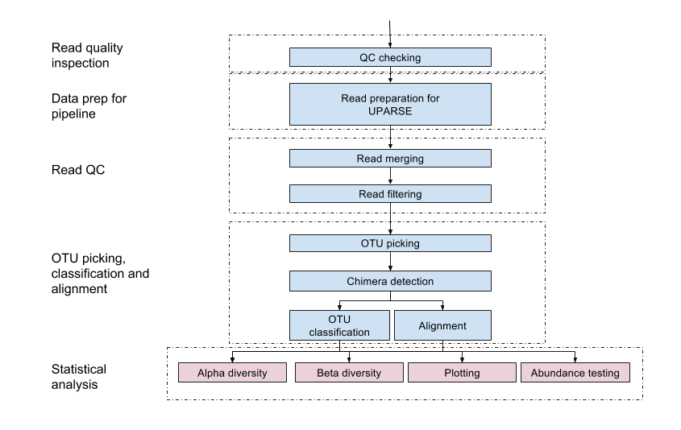

# 16S analysis tutorial - part of Analysing the Microbiome Workshop 2017

## The dataset

The dataset we will be working are the practice dataset from the [H3ABioNet 16S rDNA diversity analysis SOP](http://www.h3abionet.org/tools-and-resources/sops/16s-rrna-diversity-analysis). The source data can be accessed [here](http://h3data.cbio.uct.ac.za/assessments/16SrRNADiversityAnalysis/practice) but for our purposes it is already on the cluster and stored here:`/local/mb/dog_stool_samples`

The table below contains the metadata associated with the dog stool samples. There are three dogs which are treated with increased percentage of a compound in their diet: 5 different treatments (0-4, representing an increased percentage of a compound in their diet).

Sample | Dog | Treatment | Read counts r1 | Read counts r2
------ | --- | --------- | -------------- | -------------- 
Dog1 | B | 2 | 118343 | 118343
Dog2 | G | 3 | 108679 | 108679
Dog3 | K | 3 | 101482 | 101482
Dog8 | B | 4 | 108731 | 108731
Dog9 | G | 0 | 109500 | 109500
Dog10 | K | 4 | 79342 | 79342
Dog15 | B | 1 | 131483 | 131483
Dog16 | G | 4 | 114424 | 114424
Dog17 | K | 0 | 99610 | 99610
Dog22 | B | 3 | 145029 | 145029
Dog23 | G | 1 | 193158 | 193158
Dog24 | K | 2 | 162487 | 162487
Dog29 | B | 0 | 122776 | 122776
Dog30 | G | 2 | 137315 | 137315
Dog31 | K | 1 | 150613 | 150613

## Outcomes
* Edit files and command line options, work with bash variables, use bash snippets (pipes, awk, loops).
* Run a 16S analysis pipeline from raw reads up to OTU classification and alignment.

## Do some local setup

### Setup some PATHS
```bash
export PATH=$PATH:/global/mb/amw/soft/fasta-splitter-0.2.4
export PATH=/global/mb/amw/soft/ImageMagick-7.0.5-3/install/bin:$PATH
export PATH=$PATH:/global/mb/amw/soft/amw-src
export PATH=$PATH:/global/mb/amw/soft/amw-src/fastqc_combine
```

### Setup some directory and database variables
Be sure you have created ad temporary directory for yourself
```bash
mkdir /tmp/gerrit (here you need to set the name to your username)
```
Now set some variables.
```bash
raw_reads_dir=/local/mb/dog_stool_samples
process_dir=/tmp/gerrit (here you need to change it to the temporary directory you have created)
uparse_dir=$process_dir/uparse
taxonomy_dir=$process_dir/tax
alignment_dir=$process_dir/align
greengenes_db=/global/mb/amw/dbs/gg_13_8_otus
gold_db=/global/mb/amw/dbs/gold.fa
sid_fastq_pair_list=/global/mb/amw/sid.fastq_pair.list
```
## Tutorial pipeline


## When you get lost or something is unclear
1. All the outputs have been generated here `/global/mb/amw/run`
1. Please find someone next to you that looks like they know what they are doing. 
1. Let me know.
## 1. Lets do some QC on the raw data

To be able to run all tools in the tutorial be sure these modules are loaded
```bash
module load bioinf
module load microbiome
```
### 1.1 Run FastQC
```bash
fastqc_dir=$process_dir/fastqc
mkdir $fastqc_dir
fastqc --extract -f fastq -o $fastqc_dir -t 6 $raw_reads_dir/*
```
### 1.2 Combine FastQC reports
```bash
fastqc_combine.pl -v --out $fastqc_dir --skip --files "$fastqc_dir/*_fastqc"
```
Now lets view the reports.

## 2. Run the UPARSE pipeline
### 2.1 First rename the read headers so that they are compatible with the UPARSE pipline
```bash
renamed_dir=$uparse_dir"/renamed"
mkdir -p $renamed_dir
while read sid_fastq_pair; do sid=`echo $sid_fastq_pair | awk -F ' ' '{print $1}'`; fastq_r1=`echo $sid_fastq_pair | awk -F ' ' '{print $2}'`; fastq_r2=`echo $sid_fastq_pair | awk -F ' ' '{print $3}'`; fastq_r1_renamed=$renamed_dir"/"$(basename $fastq_r1); fastq_r2_renamed=$renamed_dir"/"$(basename $fastq_r2); rename_fastq_headers.sh $sid $fastq_r1 $fastq_r2 $fastq_r1_renamed $fastq_r2_renamed;done < $sid_fastq_pair_list
```
This will take about 10 minutes to run. Lets have a look at the headers once done.

### 2.2 Merge the paired reads
```bash
fastq_maxdiffs=3
merged_dir=$uparse_dir"/merged"
mkdir $merged_dir

while read sid_fastq_pair; do sid=`echo $sid_fastq_pair | awk -F ' ' '{print $1}'`; fastq_r1=`echo $sid_fastq_pair | awk -F ' ' '{print $2}'`; fastq_r2=`echo $sid_fastq_pair | awk -F ' ' '{print $3}'`; fastq_r1_renamed=$renamed_dir"/"$(basename $fastq_r1); fastq_r2_renamed=$renamed_dir"/"$(basename $fastq_r2); usearch -fastq_mergepairs $fastq_r1_renamed -reverse $fastq_r2_renamed -fastq_maxdiffs $fastq_maxdiffs -fastqout $merged_dir"/"$sid".merged.fastq";done < $sid_fastq_pair_list
```
This will take about 1 minute to run. Lets have a look at the fastq files of the merge reads.

### 2.3 Filter
```bash
fastq_maxee=0.1
filtered_dir=$uparse_dir"/filtered"
mkdir $filtered_dir

while read sid_fastq_pair; do sid=`echo $sid_fastq_pair | awk -F ' ' '{print $1}'`;  usearch -fastq_filter $merged_dir"/"$sid".merged.fastq" -fastq_maxee $fastq_maxee -fastqout $filtered_dir"/"$sid".merged.filtered.fastq"  ;done < $sid_fastq_pair_list
```
This will take about 1 minute to run. Lets do a read count on the filtered fastqs.

### 2.4 Run FastQC on the filtered reads
```bash
filtered_fastqc_dir=$uparse_dir"/filtered.fastqc"
mkdir $filtered_fastqc_dir
fastqc --extract -f fastq -o $uparse_dir"/filtered.fastqc" -t 6 $filtered_dir/*.fastq
```
This will take about 2 minutes to run.

### 2.5 Combine FastQC reports
```bash
fastqc_combine.pl -v --out $filtered_fastqc_dir --skip --files "$filtered_fastqc_dir/*_fastqc"
```
Lets have a look at the FastQC summaries and see if we notice any changes from the FastQC reports on the raw reads.

### 2.6 Convert Fastq to Fasta
```bash
filtered_fasta_dir=$uparse_dir"/filtered.fasta"
mkdir $filtered_fasta_dir
for i in `ls -1 $filtered_dir/*.fastq`; do filename=$(basename "$i"); base="${filename%.*}"; seqtk seq -A $i > $filtered_fasta_dir/$base.fa; done
```
Lets have a look at the fasta format.

### 2.7 Do dereplication

```bash
cat $filtered_fasta_dir/*.fa > $uparse_dir/filtered_all.fa
```
```bash
cat $uparse_dir/filtered_all.fa | grep -v "^>" | grep -v [^ACGTacgt] | sort -d | uniq -c | while read abundance sequence ; do hash=$(printf "${sequence}" | sha1sum); hash=${hash:0:40};printf ">%s;size=%d;\n%s\n" "${hash}" "${abundance}" "${sequence}"; done > $uparse_dir/filtered_all.uniques.fa 2> $uparse_dir/filtered_all.uniques.fa.e
```
This will take about 15 minutes. Lets have a look at the headers.

### 2.8 OTU picking
Sort by size
```bash
min_size=2
usearch -sortbysize $uparse_dir/filtered_all.uniques.fa -fastaout $uparse_dir/filtered_all.uniques.sorted.fa -minsize $min_size
```
Do OTU picking
```bash
otu_radius_pct=3
usearch -cluster_otus $uparse_dir/filtered_all.uniques.sorted.fa -otu_radius_pct $otu_radius_pct -otus $uparse_dir/otus_raw.fa
```
This will take about 30 seconds. Once done lets count how many OTUs were generated.

### 2.9 Chimera removal
```bash
usearch -uchime2_ref $uparse_dir/otus_raw.fa -db $gold_db -mode high_confidence -strand plus -notmatched $uparse_dir/otus_chimOUT.fa
```
This will take about 10 seconds. Once done lets check how many OTUs were detected as being chimeric.

### 2.10 De-dereplication

Rename OTU headers
```bash
fasta_number.py $uparse_dir/otus_chimOUT.fa OTU_ > $uparse_dir/otus_repsetOUT.fa
```
Split fasta files to reduce memory on `usearch_global` run
```bash
mkdir $uparse_dir/split_files
fasta-splitter.pl --n-parts 100 --out-dir $uparse_dir/split_files/ $uparse_dir/filtered_all.fa
```
Do de-dereplication
```bash
for i in $(ls $uparse_dir/split_files/*.fa); do usearch -usearch_global $i -db $uparse_dir/otus_repsetOUT.fa -id 0.97 -strand plus -uc $i.map.uc; done
```
Combine mappings
```bash
cat $uparse_dir/split_files/*.map.uc > $uparse_dir/otus_mappedOUT.uc
```
This will take about 1 minute to complete. Lets have a look at the final mapping file.

### 2.11 Create QIIME compatible OTU table
```bash
uc2otutab.py $uparse_dir/otus_mappedOUT.uc > $uparse_dir/otus_table.tab.txt
```
This will take about 20 seconds to complete. Have a look that the OTU table generated.

### 2.12 Assign taxonomy
```bash
mkdir $taxonomy_dir
assign_taxonomy.py -i $uparse_dir/otus_repsetOUT.fa -o $taxonomy_dir -r $greengenes_db/rep_set/97_otus.fasta -t $greengenes_db/taxonomy/97_otu_taxonomy.txt -m uclust
```
This will take about a minutee to complete. Let look at the GreenGenes files and also the final output.

For downstream analysis we need a .biom file. Lets create that from the OTU table.
```bash
biom convert -i $uparse_dir/otus_table.tab.txt --table-type="OTU table" --to-json -o $process_dir/otus_table.biom
```
Now lets add the taxonomy annotation to the .biom file.
```bash
biom add-metadata -i $process_dir/otus_table.biom -o $process_dir/otus_table.tax.biom --observation-metadata-fp $taxonomy_dir/otus_repsetOUT_tax_assignments.txt --observation-header OTUID,taxonomy,confidence --sc-separated taxonomy --float-fields confidence --output-as-json
```
Lets have a look if the annotation has been added.

### 2.13 Create phylogenetic tree
Allign sequences against a template database
```bash
mkdir $alignment_dir
align_seqs.py -m pynast -i $uparse_dir/otus_repsetOUT.fa -o $alignment_dir -t $greengenes_db/rep_set_aligned/97_otus.fasta
```
This will take about 5 minutes to complete. Have a look at the output.

Now filter the alignment to remove gaps.
```bash
filter_alignment.py -i $alignment_dir/otus_repsetOUT_aligned.fasta -o $alignment_dir/filtered
```
Create a phylogenetic tree
```
make_phylogeny.py -i $alignment_dir/filtered/otus_repsetOUT_aligned_pfiltered.fasta -o $process_dir/otus_repsetOUT_aligned_pfiltered.tre
```
### 2.14 Create some summaries
```bash
biom summarize-table -i $process_dir/otus_table.tax.biom -o $process_dir/otus_table.tax.biom.summary.quantative
```
```bash
biom summarize-table --qualitative -i $process_dir/otus_table.tax.biom -o $process_dir/otus_table.tax.biom.summary.qualitative
```

## Software needed to run this tutorial
* FastQC (https://www.bioinformatics.babraham.ac.uk/projects/fastqc/)
* ImageMagick (https://www.imagemagick.org/script/download.php)
* Fastx-toolkit (http://hannonlab.cshl.edu/fastx_toolkit/)
* Fasta-splitter (http://kirill-kryukov.com/study/tools/fasta-splitter/files/fasta-splitter-0.2.4.zip)
* USEARCH (http://www.drive5.com/usearch/download.html)
* UPARSE helper scripts (http://drive5.com/python/python_scripts.tar.gz)
* QIIME base installation with RDP classifier (http://qiime.org/install/alternative.html)
* R modules
  * phyloseq
  * ggplot2
  * gridExtra
  * dunn.test
  * NMF
  * vegan
  * corrplot
  * psych
  * matrixStats
  * fifer
  * metagenomeSeq
  * randomForest
  * dplyr
  * ROCR
