DOG MICROBIOME BASIC ANALYSES
=============================

Background
----------

There are three dogs which are treated with increased percentage of a compound in their diet: 5 different treatments (0-4, representing an increased percentage of a compound in their diet) Analyses included here:

-   Import .biom and .tre files generated in QIIME as well as metadata file: merge these objects in a phyloseq object
-   Basic data filter: assess number of reads/sample, plot rarefaction curves, and exclude low abundance OTUs and samples that do not meet minimum number of reads cutoff.
-   Basic exploratory plots including bar plots, alpha- and beta-diversity, heatmaps.
-   Differential abundance testing by a) Dog and b) Treatment

This tutorial should be run on your local machine (preferably in RStudio).
--------------------------------------------------------------------------

Import data and create phyloseq object
--------------------------------------

**Import BIOM file (generated in QIIME) into a phyloseq object**

``` r
library(phyloseq)
library(ggplot2)
library(gridExtra)
library(dunn.test)
library(vegan)
library(randomForest)
library(dplyr)
```

**Import custom functions used in script** **NB replace the directory listed below to your own, keeping only the .R file name**

``` r
source("/Users/katielennard/Documents/workspace/R_projects/R_projects/Microbiome_project/microbiome_custom_functions.R")
```

**Set the working directory and import data**

``` r
setwd("/Users/katielennard/Documents/Academic/Postdoc/Projects/cbio_16S_pipeline_certification/Sept18_testing")
inDir <- getwd()#specify input directory
outDir <- paste0(inDir,"/results") #specify output directory, create 'results' folder if necessary
phy <- import_biom(BIOMfilename = paste0(inDir,"/otus_table.tax.biom"), 
        verbose = TRUE)#
ntaxa(phy) #(number of OTUs)
```

    ## [1] 179

``` r
sample_names(phy) <- sub("\\/1","",sample_names(phy))#remove "/1" from filenames
#add phylogenetic tree (.tre file generated in QIIME)
tree <- read_tree_greengenes(paste0(inDir,"/otus_repsetOUT_aligned_pfiltered.tre"))
#merge phy and tree
phy <- merge_phyloseq(phy,tree)
```

**Data cleanup**

``` r
colnames(tax_table(phy))
```

    ## [1] "Rank1" "Rank2" "Rank3" "Rank4" "Rank5" "Rank6" "Rank7"

``` r
colnames(tax_table(phy)) <-  c("Kingdom", "Phylum" , "Class" , "Order" , "Family" , "Genus", "Species")#e.g. replace "Rank1" with "Kingdom"
#clean taxonomic annotations, at the moment they are for example 'k__Bacteria'; 'p_Firmicutes' - remove k__ and p__ ...
tax_table(phy)[,"Kingdom"] <- sub("k__","",tax_table(phy)[,"Kingdom"])
tax_table(phy)[,"Phylum"] <- sub("p__","",tax_table(phy)[,"Phylum"])
tax_table(phy)[,"Class"] <- sub("c__","",tax_table(phy)[,"Class"])
tax_table(phy)[,"Order"] <- sub("o__","",tax_table(phy)[,"Order"])
tax_table(phy)[,"Family"] <- sub("f__","",tax_table(phy)[,"Family"])
tax_table(phy)[,"Genus"] <- sub("g__","",tax_table(phy)[,"Genus"])
tax_table(phy)[,"Species"] <- sub("s__","",tax_table(phy)[,"Species"])
t= which(is.na(tax_table(phy)[,"Phylum"])) 
tax_table(phy) = tax_table(phy)[-t,] #remove rows that don't at least have Phylum-level annotation
```

**Import metadata and merge with phyloseq object**

``` r
meta <-  read.table(paste0(inDir,"/practice.dataset1.metadata.tsv"), sep = "\t", header =TRUE, row.names=1)
head(meta)
```

    ##       Dog Treatment
    ## Dog1    B         2
    ## Dog2    G         3
    ## Dog3    K         3
    ## Dog8    B         4
    ## Dog9    G         0
    ## Dog10   K         4

``` r
rownames(meta)
```

    ##  [1] "Dog1"  "Dog2"  "Dog3"  "Dog8"  "Dog9"  "Dog10" "Dog15" "Dog16"
    ##  [9] "Dog17" "Dog22" "Dog23" "Dog24" "Dog29" "Dog30" "Dog31"

``` r
head(sample_names(phy))
```

    ## [1] "Dog10" "Dog15" "Dog16" "Dog17" "Dog1"  "Dog22"

``` r
length(sample_names(phy))#15
```

    ## [1] 15

``` r
length(rownames(meta))#15 (check if same number of samples in .biom file and metadatafile)
```

    ## [1] 15

``` r
length(intersect(rownames(meta),sample_names(phy)))#15 (check that the sample names match in all cases)
```

    ## [1] 15

``` r
sample_data(phy) <- meta#assign the metadata to the phyloseq object 'phy' (phyloseq will put these in the right order)
nsamples(phy)
```

    ## [1] 15

``` r
str(sample_data(phy))#need to change treatment column to factor variable
```

    ## 'data.frame':    15 obs. of  2 variables:
    ## Formal class 'sample_data' [package "phyloseq"] with 4 slots
    ##   ..@ .Data    :List of 2
    ##   .. ..$ : Factor w/ 3 levels "B","G","K": 3 1 2 3 1 1 2 3 1 2 ...
    ##   .. ..$ : int  4 1 4 0 2 3 1 2 0 3 ...
    ##   ..@ names    : chr  "Dog" "Treatment"
    ##   ..@ row.names: chr  "Dog10" "Dog15" "Dog16" "Dog17" ...
    ##   ..@ .S3Class : chr "data.frame"

``` r
sample_data(phy)[,"Treatment"] <- as.factor(unlist(sample_data(phy)[,"Treatment"]))
```

**Save phyloseq object as an .RData file**

``` r
#save(phy, file = paste0(outDir,"/CBIO_16s_cert.RData")) #Save annotated object as a .RData object for quick reload if required at a later stage
#load(paste0(outDir,"/CBIO_16s_cert.RData")) #this is how you would reload the .RData object 'phy'
```

Explore number of reads per sample, make rarefaction curves and filter data as necessary
----------------------------------------------------------------------------------------

**Explore number of reads per sample**

``` r
reads <- sample_sums(phy)
length(which(reads<5000))
```

    ## [1] 0

``` r
raremax <- min(reads)
raremax
```

    ## [1] 63980

``` r
r=rarecurve(t(otu_table(phy)), step = 100, sample = raremax,xlab = "number of reads/sample", ylab = "number of OTUs",
        label = FALSE, xlim = c(0,100000))
```

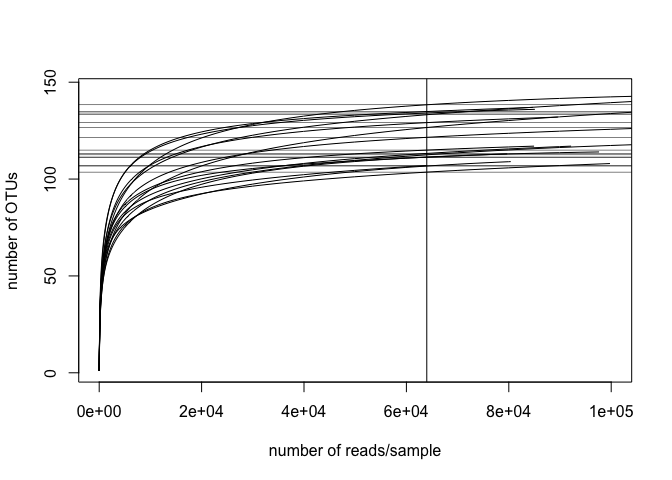

``` r
#pdf(paste0(outDir,"/rarefaction_curve.pdf"))
#r
#dev.off()
```

All samples have sufficient sequencing depth for inclusion in downstream analyses. The vertical line in the above plot indicates the sample with the lowest number of reads. Now we will scale data to account for differences in the number of reads/sample and filter rare OTUs that are not of biological interest for the purpose of this analysis (e.g. occurs only in one sample).

**Standardize abundances to median sequence depth**

``` r
total = median(sample_sums(phy))
standf = function(x, t=total) round(t * (x / sum(x)))
M.std = transform_sample_counts(phy, standf)
```

**Apply mild OTU filter**

Select OTUs where the rowsum for that OTU has at least 20% of samples with a count of 10 each OR where that OTU &gt; 0.001% of the total median count (for cases where the minority of samples may have high counts of a rare OTU)

``` r
M.f = filter_taxa(M.std,function(x) sum(x > 10) > (0.2*length(x)) | sum(x) > 0.001*total, TRUE)
ntaxa(M.f)
```

    ## [1] 118

**Basic exploratory plots: alpha- and beta-diversity, barplots, heatmap**
-------------------------------------------------------------------------

**Alpha diversity by dog**

``` r
p <- plot_richness(M.std,x = "Dog",color = "Treatment",measures=c("Shannon"), 
        title = paste0("Standardized to total reads, N=",nsamples(M.std)))+theme(axis.text=element_text(size=16, face="bold"),
                axis.title=element_text(size=16,face="bold"))+geom_point(size=5)
p
```

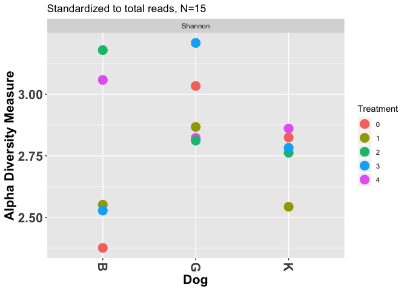

``` r
pdf(paste0(outDir,"/alpha_diversity_by_dog_treatment.pdf"))
p
dev.off()
```

    ## quartz_off_screen 
    ##                 2

Is there a significant difference in alpha diversity between dogs irrespective of treatment?

``` r
est <- estimate_richness(M.f, split = TRUE, measures = c("Shannon"))
temp <- cbind(est,sample_data(M.f)[,"Dog"])
head(temp)
```

    ##        Shannon Dog
    ## Dog10 2.856347   K
    ## Dog15 2.546603   B
    ## Dog16 2.815690   G
    ## Dog17 2.819441   K
    ## Dog1  3.176577   B
    ## Dog22 2.520863   B

``` r
t <- kruskal.test(temp[,1]~temp[,2])
t
```

    ## 
    ##  Kruskal-Wallis rank sum test
    ## 
    ## data:  temp[, 1] by temp[, 2]
    ## Kruskal-Wallis chi-squared = 2.54, df = 2, p-value = 0.2808

``` r
dunn.test(temp[,1],temp[,2])#post-hoc testing to see which dogs are different
```

    ##   Kruskal-Wallis rank sum test
    ## 
    ## data: x and group
    ## Kruskal-Wallis chi-squared = 2.54, df = 2, p-value = 0.28
    ## 
    ## 
    ##                            Comparison of x by group                            
    ##                                 (No adjustment)                                
    ## Col Mean-|
    ## Row Mean |          B          G
    ## ---------+----------------------
    ##        G |  -1.343502
    ##          |     0.0896
    ##          |
    ##        K |   0.070710   1.414213
    ##          |     0.4718     0.0786
    ## 
    ## alpha = 0.05
    ## Reject Ho if p <= alpha/2

Dog G has higher alpha diversity than dogs K and B irrespective of treatment, but this difference is not significant

**Alpha diversity by treatment**

``` r
p <- plot_richness(M.std,x = "Treatment",color = "Dog",measures=c("Shannon"), 
                title = paste0("Standardized to total reads, N=",nsamples(M.std)))+theme(axis.text=element_text(size=16, face="bold"),
                axis.title=element_text(size=16,face="bold"))+geom_point(size=5)
p
```

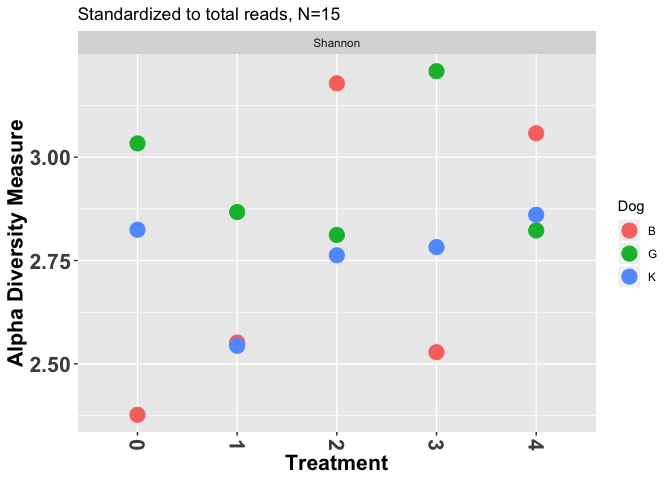

``` r
pdf(paste0(outDir,"/alpha_diversity_by_treatment_dog.pdf"))
p
dev.off()
```

    ## quartz_off_screen 
    ##                 2

Are there significant differences in alpha diversity by treatment?

``` r
temp <- cbind(est,sample_data(M.f)[,"Treatment"])
head(temp)
```

    ##        Shannon Treatment
    ## Dog10 2.856347         4
    ## Dog15 2.546603         1
    ## Dog16 2.815690         4
    ## Dog17 2.819441         0
    ## Dog1  3.176577         2
    ## Dog22 2.520863         3

``` r
t <- kruskal.test(temp[,1]~temp[,2])
t
```

    ## 
    ##  Kruskal-Wallis rank sum test
    ## 
    ## data:  temp[, 1] by temp[, 2]
    ## Kruskal-Wallis chi-squared = 1.5667, df = 4, p-value = 0.8148

``` r
dunn.test(temp[,1],temp[,2])
```

    ##   Kruskal-Wallis rank sum test
    ## 
    ## data: x and group
    ## Kruskal-Wallis chi-squared = 1.5667, df = 4, p-value = 0.81
    ## 
    ## 
    ##                            Comparison of x by group                            
    ##                                 (No adjustment)                                
    ## Col Mean-|
    ## Row Mean |          0          1          2          3
    ## ---------+--------------------------------------------
    ##        1 |   0.365148
    ##          |     0.3575
    ##          |
    ##        2 |  -0.365148  -0.730296
    ##          |     0.3575     0.2326
    ##          |
    ##        3 |  -0.091287  -0.456435   0.273861
    ##          |     0.4636     0.3240     0.3921
    ##          |
    ##        4 |  -0.821583  -1.186732  -0.456435  -0.730296
    ##          |     0.2057     0.1177     0.3240     0.2326
    ## 
    ## alpha = 0.05
    ## Reject Ho if p <= alpha/2

**Beta diversity using NMDS with Bray-Curtis as distance metric**

``` r
set.seed(2)
GP.ord.BC <- ordinate(M.f, "NMDS", "bray", k=2, trymax=100)
```

    ## Square root transformation
    ## Wisconsin double standardization
    ## Run 0 stress 0.06040173 
    ## Run 1 stress 0.06040258 
    ## ... Procrustes: rmse 0.0003004049  max resid 0.0008313191 
    ## ... Similar to previous best
    ## Run 2 stress 0.06356151 
    ## Run 3 stress 0.1136107 
    ## Run 4 stress 0.06356151 
    ## Run 5 stress 0.06231089 
    ## Run 6 stress 0.06230232 
    ## Run 7 stress 0.2501484 
    ## Run 8 stress 0.217248 
    ## Run 9 stress 0.0623059 
    ## Run 10 stress 0.06356105 
    ## Run 11 stress 0.1273283 
    ## Run 12 stress 0.06040211 
    ## ... Procrustes: rmse 0.000582035  max resid 0.001592689 
    ## ... Similar to previous best
    ## Run 13 stress 0.06356106 
    ## Run 14 stress 0.06040202 
    ## ... Procrustes: rmse 0.0001333995  max resid 0.0003625743 
    ## ... Similar to previous best
    ## Run 15 stress 0.06040196 
    ## ... Procrustes: rmse 0.0005234778  max resid 0.00137342 
    ## ... Similar to previous best
    ## Run 16 stress 0.06040231 
    ## ... Procrustes: rmse 0.0001881131  max resid 0.0004977383 
    ## ... Similar to previous best
    ## Run 17 stress 0.06040158 
    ## ... New best solution
    ## ... Procrustes: rmse 0.0001140488  max resid 0.000306805 
    ## ... Similar to previous best
    ## Run 18 stress 0.06230256 
    ## Run 19 stress 0.06356248 
    ## Run 20 stress 0.2513296 
    ## *** Solution reached

``` r
GP.ord.BC
```

    ## 
    ## Call:
    ## metaMDS(comm = veganifyOTU(physeq), distance = distance, k = 2,      trymax = 100) 
    ## 
    ## global Multidimensional Scaling using monoMDS
    ## 
    ## Data:     wisconsin(sqrt(veganifyOTU(physeq))) 
    ## Distance: bray 
    ## 
    ## Dimensions: 2 
    ## Stress:     0.06040158 
    ## Stress type 1, weak ties
    ## Two convergent solutions found after 20 tries
    ## Scaling: centring, PC rotation, halfchange scaling 
    ## Species: expanded scores based on 'wisconsin(sqrt(veganifyOTU(physeq)))'

``` r
color = c("Treatment")
shape = c("Dog")
title=c("NMDS of 16S microbiome,Bray-Curtis distance,k=2")
MDS = plot_ordination(M.f, GP.ord.BC, color = color,shape=shape, 
        title = title)
MDS.1  = MDS +theme(axis.text=element_text(size=16, face="bold"),
                axis.title=element_text(size=18,face="bold"), legend.title=element_text(size=14))+
        theme_bw()+labs(color=color, shape=shape)+geom_point(size=5)
MDS.1
```

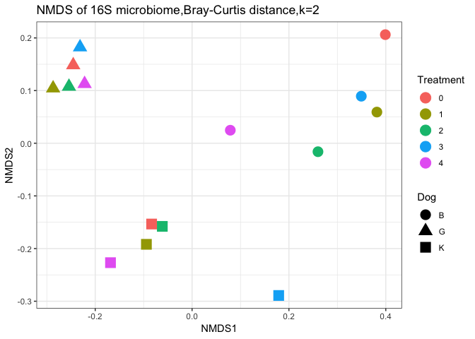

``` r
pdf(paste0(outDir,"/NMDS_Dogs_treatment_Bray_Curtis.pdf"),8,5)
MDS.1
dev.off()
```

    ## quartz_off_screen 
    ##                 2

**Beta diversity using NMDS with Unifrac as distance metric**

``` r
GP.ord.U <- ordinate(M.f, "NMDS", "unifrac")
```

    ## Run 0 stress 0.09300184 
    ## Run 1 stress 0.09778116 
    ## Run 2 stress 0.09625782 
    ## Run 3 stress 0.160975 
    ## Run 4 stress 0.09300083 
    ## ... New best solution
    ## ... Procrustes: rmse 0.0002655568  max resid 0.0007029569 
    ## ... Similar to previous best
    ## Run 5 stress 0.1819817 
    ## Run 6 stress 0.1864513 
    ## Run 7 stress 0.09300161 
    ## ... Procrustes: rmse 0.0009950452  max resid 0.002587716 
    ## ... Similar to previous best
    ## Run 8 stress 0.09300202 
    ## ... Procrustes: rmse 0.0003349244  max resid 0.0008930086 
    ## ... Similar to previous best
    ## Run 9 stress 0.1602666 
    ## Run 10 stress 0.09300176 
    ## ... Procrustes: rmse 0.0003499637  max resid 0.0009215517 
    ## ... Similar to previous best
    ## Run 11 stress 0.09778358 
    ## Run 12 stress 0.1856031 
    ## Run 13 stress 0.0977817 
    ## Run 14 stress 0.09300061 
    ## ... New best solution
    ## ... Procrustes: rmse 0.0001736403  max resid 0.0004436285 
    ## ... Similar to previous best
    ## Run 15 stress 0.09300127 
    ## ... Procrustes: rmse 0.0003632056  max resid 0.0009391364 
    ## ... Similar to previous best
    ## Run 16 stress 0.09476749 
    ## Run 17 stress 0.09778286 
    ## Run 18 stress 0.162358 
    ## Run 19 stress 0.09778255 
    ## Run 20 stress 0.09300072 
    ## ... Procrustes: rmse 0.0002505295  max resid 0.0006468185 
    ## ... Similar to previous best
    ## *** Solution reached

``` r
GP.ord.U
```

    ## 
    ## Call:
    ## metaMDS(comm = ps.dist) 
    ## 
    ## global Multidimensional Scaling using monoMDS
    ## 
    ## Data:     ps.dist 
    ## Distance: user supplied 
    ## 
    ## Dimensions: 2 
    ## Stress:     0.09300061 
    ## Stress type 1, weak ties
    ## Two convergent solutions found after 20 tries
    ## Scaling: centring, PC rotation 
    ## Species: scores missing

``` r
color = c("Treatment")
shape = c("Dog")

title=c("NMDS of 16S microbiome, Unifrac distance, k=2")

MDS = plot_ordination(M.f, GP.ord.U, color = color, shape=shape, 
        title = title)
MDS.1  = MDS +theme(axis.text=element_text(size=16, face="bold"),
                axis.title=element_text(size=18,face="bold"), legend.title=element_text(size=14))+
        theme_bw()+labs(color=color)+geom_point(size=5)
MDS.1
```

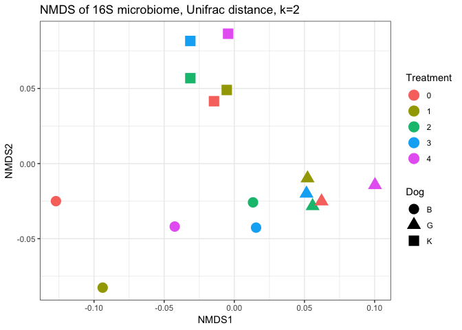

``` r
pdf(paste0(outDir,"/NMDS_Dogs_treatment_Unifrac.pdf"),8,5)
MDS.1
dev.off()
```

    ## quartz_off_screen 
    ##                 2

**Create a heatmap of taxa merged at the lowest available taxonomic level**

``` r
M.phy <- tax_glom.kv(M.f)#this function is available in the 'microbiome_custom_functions.R' script loaded at the beginning of this script
```

    ## [1] "Removing phylogenetic tree"

    ## Warning in `[<-`(`*tmp*`, i, value = phy.k.merged): implicit list embedding
    ## of S4 objects is deprecated

    ## Warning in `[<-`(`*tmp*`, i, value = phy.k.merged): implicit list embedding
    ## of S4 objects is deprecated

    ## Warning in `[<-`(`*tmp*`, i, value = phy.k.merged): implicit list embedding
    ## of S4 objects is deprecated

    ## Warning in `[<-`(`*tmp*`, i, value = phy.k.merged): implicit list embedding
    ## of S4 objects is deprecated

    ## [1] "There are now 54 merged taxa"

``` r
ntaxa(M.phy)
```

    ## [1] 54

``` r
filename <- c("cbio_cert_heatmap_merged_taxa")
main <- paste("Merged taxa, Bray-Curtis distance")
f = paste0(outDir,"/",filename,".pdf")
#color specification for column annotations above heatmap:
D.cols = c("B"="#CC79A7","G"="#56B4E9","K"="#F0E442")
colours = list(Dog=D.cols)

#create distance matrix and calculate tree:
set.seed(2)
#diss <- distance(M.phy,method = "bray", type = "samples")#replace this code due to bug in package vegan:
otu_table <- t(data.frame(otu_table(M.phy)))#Transpose OTU table
diss<- vegdist(otu_table, method = "bray")#Then use vegdist from vegan to generate a bray distance object:
clust.res<-hclust(diss)
sample.order = clust.res$order
#heatmap is output to file (the heatmap.k function can be found in the 'microbiome_custom_functions.R' script)
hm = heatmap.k(physeq= M.phy,
        annot.cols = c(1,2),
        main = main,filename = f,colours=colours,Colv = sample.order,labrow = TRUE) 
```

    ## [1] "including all samples"
    ## [1] "including all otus"

    ## Warning in `[<-.factor`(`*tmp*`, thisvar, value = ""): invalid factor
    ## level, NA generated

    ## Warning in `[<-.factor`(`*tmp*`, thisvar, value = ""): invalid factor
    ## level, NA generated

    ## Warning in `[<-.factor`(`*tmp*`, thisvar, value = ""): invalid factor
    ## level, NA generated

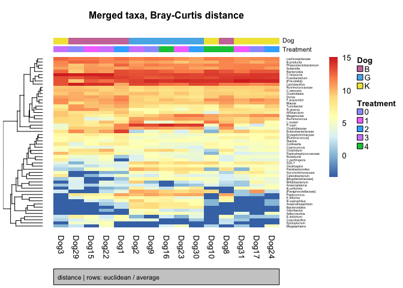

``` r
print(hm)
```

    ## $Rowv
    ## 'dendrogram' with 2 branches and 54 members total, at height 30.01391 
    ## 
    ## $rowInd
    ##  [1] 33 17 36 52 27 21 41 29 48 53 19  4 47 39 24  8 37  5 20 15  3 46 13
    ## [24] 10 18 40 26 25 14  7  6  9 49 51 16 32 38 44 35 12 45 11 42 50  2 34
    ## [47] 23 30 54 22 28 31 43  1
    ## 
    ## $colInd
    ##  [1] 13  9  2  6  5 10 15  3  7 11  1 14 12  4  8
    ## 
    ## $col
    ##     #4575B4     #4979B6     #4E7DB8     #5282BB     #5786BD     #5C8BBF 
    ## -3.34029373 -3.15627003 -2.97224633 -2.78822263 -2.60419892 -2.42017522 
    ##     #608FC2     #6594C4     #6998C6     #6E9DC9     #73A1CB     #77A6CE 
    ## -2.23615152 -2.05212782 -1.86810411 -1.68408041 -1.50005671 -1.31603301 
    ##     #7CAAD0     #80AFD2     #85B3D5     #8AB8D7     #8EBCD9     #93C0DB 
    ## -1.13200931 -0.94798560 -0.76396190 -0.57993820 -0.39591450 -0.21189079 
    ##     #98C3DD     #9CC6DF     #A1CAE1     #A6CDE2     #ABD0E4     #B0D3E6 
    ## -0.02786709  0.15615661  0.34018031  0.52420402  0.70822772  0.89225142 
    ##     #B4D6E8     #B9D9E9     #BEDCEB     #C3E0ED     #C8E3EF     #CCE6F0 
    ##  1.07627512  1.26029883  1.44432253  1.62834623  1.81236993  1.99639363 
    ##     #D1E9F2     #D6ECF4     #DBEFF6     #E0F3F7     #E1F3F4     #E3F4F1 
    ##  2.18041734  2.36444104  2.54846474  2.73248844  2.91651215  3.10053585 
    ##     #E5F5ED     #E7F5EA     #E9F6E6     #EBF7E3     #EDF8DF     #EFF8DC 
    ##  3.28455955  3.46858325  3.65260696  3.83663066  4.02065436  4.20467806 
    ##     #F0F9D8     #F2FAD5     #F4FBD2     #F6FBCE     #F8FCCB     #FAFDC7 
    ##  4.38870177  4.57272547  4.75674917  4.94077287  5.12479657  5.30882028 
    ##     #FCFDC4     #FEFEC0     #FEFEBD     #FEFCBA     #FEFAB7     #FEF8B5 
    ##  5.49284398  5.67686768  5.86089138  6.04491509  6.22893879  6.41296249 
    ##     #FEF6B2     #FEF4AF     #FEF2AC     #FEF0A9     #FEEFA6     #FEEDA3 
    ##  6.59698619  6.78100990  6.96503360  7.14905730  7.33308100  7.51710471 
    ##     #FEEBA1     #FEE99E     #FEE79B     #FEE598     #FEE395     #FEE192 
    ##  7.70112841  7.88515211  8.06917581  8.25319951  8.43722322  8.62124692 
    ##     #FEDF8F     #FDDA8C     #FDD589     #FDD085     #FDCB82     #FDC67F 
    ##  8.80527062  8.98929432  9.17331803  9.35734173  9.54136543  9.72538913 
    ##     #FDC17B     #FDBC78     #FDB775     #FCB271     #FCAD6E     #FCA86B 
    ##  9.90941284 10.09343654 10.27746024 10.46148394 10.64550765 10.82953135 
    ##     #FCA367     #FC9E64     #FC9961     #FC945D     #FC8F5A     #FA8A57 
    ## 11.01355505 11.19757875 11.38160246 11.56562616 11.74964986 11.93367356 
    ##     #F88454     #F67E51     #F4794E     #F1734B     #EF6D48     #ED6845 
    ## 12.11769726 12.30172097 12.48574467 12.66976837 12.85379207 13.03781578 
    ##     #EB6242     #E85D3F     #E6573C     #E45139     #E24C36     #DF4633 
    ## 13.22183948 13.40586318 13.58988688 13.77391059 13.95793429 14.14195799 
    ##     #DD4030     #DB3B2D     #D9352A     #D73027        <NA> 
    ## 14.32598169 14.51000540 14.69402910 14.87805280 15.06207650

**Barplots by dog**
-------------------

``` r
level = "Genus"
count = 500
perc = 0.25
#barplot will be written to file (the bar.plots function can be found in the 'microbiome_custom_functions.R' script)
barplot = bar.plots(physeq = M.std,cat = "Dog",level = level, count = count, perc = perc, outDir=outDir, 
        filen = 'Barplots_by_Dog')
print(barplot)
```

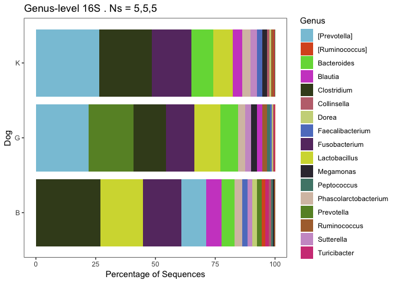

Detect taxa/OTUs that differ significantly by Dog
-------------------------------------------------

convert phyloseq object to metagenomeSeq obj. NB use raw data not standardized:

``` r
Mraw.f = filter_taxa(phy,function(x) sum(x > 10) > (0.02*length(x)) | sum(x) > 0.001*total, TRUE)
ntaxa(Mraw.f)
```

    ## [1] 135

``` r
MGS=make_metagenomeSeq(Mraw.f)
MGS
```

    ## MRexperiment (storageMode: environment)
    ## assayData: 135 features, 15 samples 
    ##   element names: counts 
    ## protocolData: none
    ## phenoData
    ##   sampleNames: Dog10 Dog15 ... Dog9 (15 total)
    ##   varLabels: Dog Treatment
    ##   varMetadata: labelDescription
    ## featureData
    ##   featureNames: OTU_30 OTU_41 ... OTU_66 (135 total)
    ##   fvarLabels: OTUname
    ##   fvarMetadata: labelDescription
    ## experimentData: use 'experimentData(object)'
    ## Annotation:

**Use Random forests analysis to detect taxa that are good predictors of Dog**

Example used: Dog G vs. Dog B (all treatment points)

``` r
sub.index <- sample_names(M.f)[sample_data(M.f)[,"Dog"] != "K"]
phy.temp <- prune_samples(sub.index, M.f)
nsamples(phy.temp)
```

    ## [1] 10

``` r
RF.k(data = phy.temp, var = "Dog", ntree=10000, cv.fold=10, outDir = outDir, Nfeatures.validation = 3, positive.class = "G")
```

    ## [1] "0 samples did not have response variable data, removing these..."
    ## [1] "Data set size:  10 samples with 5 and 5 samples per class"
    ## [1] "Cross-validated error rates associated with stepwise reduction of features:"
    ## 118  59  30  15   7   4   1 
    ## 0.0 0.0 0.0 0.0 0.1 0.1 0.0

    ## Warning: package 'bindrcpp' was built under R version 3.4.4

    ## [1] "*****************************"
    ## [1] "THE TOP 50  MOST IMPORTANT FEATURES WERE:"
    ##         predictors         B         G MeanDecreaseAccuracy
    ## OTU_29      OTU_29  9.982118 10.019579            10.314567
    ## OTU_46      OTU_46  8.716766  8.840591             9.141250
    ## OTU_26      OTU_26  9.326111  9.277752             9.719041
    ## OTU_58      OTU_58 10.326735 10.134275            10.581640
    ## OTU_42      OTU_42  8.885008  8.892256             9.205660
    ## OTU_81      OTU_81  9.939107 10.027720            10.445769
    ## OTU_11      OTU_11  8.800026  8.755758             9.143433
    ## OTU_121    OTU_121 10.062947 10.112799            10.509986
    ## OTU_8        OTU_8  9.583317  9.723707            10.103180
    ## OTU_73      OTU_73  7.865285  8.001277             8.225482
    ## OTU_57      OTU_57  9.135969  9.386384             9.719046
    ## OTU_61      OTU_61  9.211665  9.157126             9.498293
    ## OTU_104    OTU_104  9.179619  9.125010             9.519075
    ## OTU_19      OTU_19  9.941785  9.913953            10.269876
    ## OTU_40      OTU_40  8.895160  8.778338             9.183508
    ## OTU_41      OTU_41  9.522564  9.563801             9.892082
    ## OTU_68      OTU_68  9.170264  9.096300             9.432391
    ## OTU_54      OTU_54  9.486950  9.442412             9.792319
    ## OTU_97      OTU_97  8.727030  8.650612             9.014730
    ## OTU_100    OTU_100  9.355132  9.438498             9.721926
    ## OTU_35      OTU_35  9.105093  9.043688             9.448770
    ## OTU_72      OTU_72  9.946476  9.956814            10.368192
    ## OTU_74      OTU_74  9.853691  9.777868            10.100175
    ## OTU_52      OTU_52  8.575634  8.447871             8.792583
    ## OTU_59      OTU_59  8.373755  8.379425             8.681795
    ## OTU_78      OTU_78  8.086999  7.989502             8.295051
    ## OTU_36      OTU_36  9.510100  9.370806             9.773370
    ## OTU_43      OTU_43  9.752457  9.704707            10.040498
    ## OTU_55      OTU_55  9.471715  9.474554             9.759720
    ## OTU_27      OTU_27  9.094558  9.082554             9.450805
    ## OTU_140    OTU_140  8.400220  8.453849             8.840003
    ## OTU_51      OTU_51  8.534771  8.349766             8.777220
    ## OTU_24      OTU_24  8.345158  8.350517             8.670935
    ## OTU_12      OTU_12  7.723447  7.822361             8.141846
    ## OTU_87      OTU_87  9.387978  9.388931             9.784171
    ## OTU_53      OTU_53  8.735469  8.748158             9.054208
    ## OTU_107    OTU_107  8.348176  8.259881             8.605995
    ## OTU_31      OTU_31  8.001943  7.971300             8.253840
    ## OTU_10      OTU_10  9.408206  9.462880             9.689443
    ## OTU_150    OTU_150  8.380686  8.364664             8.717719
    ## OTU_82      OTU_82  8.971915  8.985306             9.297778
    ## OTU_18      OTU_18  7.793164  7.835439             8.232316
    ## OTU_96      OTU_96  7.462137  7.544023             7.743697
    ## OTU_76      OTU_76  8.238156  8.228672             8.566108
    ## OTU_47      OTU_47  4.885643  4.805693             5.213937
    ## OTU_2        OTU_2  3.683750  3.537746             3.656512
    ## OTU_22      OTU_22  5.083925  5.114466             5.456837
    ## OTU_101    OTU_101  3.937422  4.266987             4.285038
    ## OTU_69      OTU_69  4.378102  4.264280             4.491933
    ## OTU_179    OTU_179  3.844713  4.436207             4.507162
    ##         MeanDecreaseGini                   tax
    ## OTU_29        0.08984667          Turicibacter
    ## OTU_46        0.08860000       Lachnospiraceae
    ## OTU_26        0.08836667                 S24-7
    ## OTU_58        0.08722000    Anaerobiospirillum
    ## OTU_42        0.08722000          [Prevotella]
    ## OTU_81        0.08708000         Clostridiales
    ## OTU_11        0.08706000    Enterobacteriaceae
    ## OTU_121       0.08572000               P.copri
    ## OTU_8         0.08556000             P.copri.1
    ## OTU_73        0.08512000   Erysipelotrichaceae
    ## OTU_57        0.08476000   Succinivibrionaceae
    ## OTU_61        0.08374000 Peptostreptococcaceae
    ## OTU_104       0.08354000           Odoribacter
    ## OTU_19        0.08352000              R.gnavus
    ## OTU_40        0.08306000                 Dorea
    ## OTU_41        0.08258000     Lachnospiraceae.1
    ## OTU_68        0.08242000  Anaerobiospirillum.1
    ## OTU_54        0.08178000           Bacteroides
    ## OTU_97        0.08160000          Oscillospira
    ## OTU_100       0.07992000 Erysipelotrichaceae.1
    ## OTU_35        0.07988000           Allobaculum
    ## OTU_72        0.07940000         Adlercreutzia
    ## OTU_74        0.07936000    [Mogibacteriaceae]
    ## OTU_52        0.07866000       Parabacteroides
    ## OTU_59        0.07858000        [Ruminococcus]
    ## OTU_78        0.07818000         Bacteroides.1
    ## OTU_36        0.07787000  [Paraprevotellaceae]
    ## OTU_43        0.07656000               Dorea.1
    ## OTU_55        0.07656000         Bacteroidales
    ## OTU_27        0.07647500          Ruminococcus
    ## OTU_140       0.07642000         Fusobacterium
    ## OTU_51        0.07620000       Clostridiales.1
    ## OTU_24        0.07580000     Lachnospiraceae.2
    ## OTU_12        0.07494000         F.prausnitzii
    ## OTU_87        0.07322000 Erysipelotrichaceae.2
    ## OTU_53        0.07236000        Clostridiaceae
    ## OTU_107       0.07166000        [Prevotella].1
    ## OTU_31        0.07158000       Ruminococcaceae
    ## OTU_10        0.07090000            B.producta
    ## OTU_150       0.07066000     Lachnospiraceae.3
    ## OTU_82        0.07062000     Lachnospiraceae.4
    ## OTU_18        0.06850000     Lachnospiraceae.5
    ## OTU_96        0.06746000        Oscillospira.1
    ## OTU_76        0.06708000        Oscillospira.2
    ## OTU_47        0.04872500       Clostridiales.2
    ## OTU_2         0.04566000       Fusobacterium.1
    ## OTU_22        0.04524000           C.stercoris
    ## OTU_101       0.04044000       Fusobacterium.2
    ## OTU_69        0.03936000           B.uniformis
    ## OTU_179       0.03524000               Dorea.2
    ## [1] "*****************************"

    ## [1] "Training AUC=1"
    ## [1] "Training PPV=1"
    ## [1] "Training NPV=1"

    ## [1] "*****************************"
    ## [1] "Training set classification summary if using the top 3 features only"
    ## [1] "Feature(s) selected: OTU_29" "Feature(s) selected: OTU_46"
    ## [3] "Feature(s) selected: OTU_26"
    ##                B         G MeanDecreaseAccuracy MeanDecreaseGini
    ## OTU_29 0.1396417 0.1384000           0.12509952          1.55990
    ## OTU_46 0.1040750 0.1047250           0.09411048          1.48826
    ## OTU_26 0.1112917 0.1096333           0.09902762          1.46890
    ## 
    ## Call:
    ##  randomForest(formula = response ~ ., data = rf.data[, c(goodPredictors,      "response")], importance = T, proximity = T, ntree = ntree,      na.action = na.omit) 
    ##                Type of random forest: classification
    ##                      Number of trees: 10000
    ## No. of variables tried at each split: 1
    ## 
    ##         OOB estimate of  error rate: 0%
    ## Confusion matrix:
    ##   B G class.error
    ## B 5 0           0
    ## G 0 5           0
    ## [1] "Training AUC if only using top 3 features1"
    ## [1] "Training PPV if using the top 3 features1"
    ## [1] "Training NPV if using the top 3 features1"

The class error rates are 0% (even one OTU enough to discriminate between Dog G and B?)

What if we used merged OTUs?

``` r
merged.phy <- tax_glom.kv(phy.temp)
```

    ## [1] "Removing phylogenetic tree"

    ## Warning in `[<-`(`*tmp*`, i, value = phy.k.merged): implicit list embedding
    ## of S4 objects is deprecated

    ## Warning in `[<-`(`*tmp*`, i, value = phy.k.merged): implicit list embedding
    ## of S4 objects is deprecated

    ## Warning in `[<-`(`*tmp*`, i, value = phy.k.merged): implicit list embedding
    ## of S4 objects is deprecated

    ## Warning in `[<-`(`*tmp*`, i, value = phy.k.merged): implicit list embedding
    ## of S4 objects is deprecated

    ## [1] "There are now 54 merged taxa"

``` r
RF.k(data = merged.phy, var = "Dog", ntree=10000, cv.fold=10, outDir = outDir, Nfeatures.validation = 3, descriptor = "merged_OTUs",positive.class = "G") #for details on RF.k() see microbiome_custom_functions.R file
```

    ## [1] "0 samples did not have response variable data, removing these..."
    ## [1] "Data set size:  10 samples with 5 and 5 samples per class"
    ## [1] "Cross-validated error rates associated with stepwise reduction of features:"
    ## 54 27 14  7  3  1 
    ##  0  0  0  0  0  0

    ## Warning in `[<-.factor`(`*tmp*`, thisvar, value = ""): invalid factor
    ## level, NA generated

    ## Warning in `[<-.factor`(`*tmp*`, thisvar, value = ""): invalid factor
    ## level, NA generated

    ## Warning in `[<-.factor`(`*tmp*`, thisvar, value = ""): invalid factor
    ## level, NA generated

    ## [1] "*****************************"
    ## [1] "THE TOP 50  MOST IMPORTANT FEATURES WERE:"
    ##         predictors          B          G MeanDecreaseAccuracy
    ## OTU_72      OTU_72 14.3398147 14.3800347           14.9497764
    ## OTU_59      OTU_59 13.3072526 13.3213098           13.9302654
    ## OTU_74      OTU_74 14.0035793 13.9925708           14.4798383
    ## OTU_55      OTU_55 14.1146327 14.1984808           14.7299427
    ## OTU_26      OTU_26 12.7053282 12.6280301           13.0743467
    ## OTU_98      OTU_98 13.8408627 13.7291645           14.3497694
    ## OTU_57      OTU_57 12.8103793 12.6786298           13.2673230
    ## OTU_68      OTU_68 12.0076103 12.0855262           12.5132910
    ## OTU_10      OTU_10 14.0278733 14.0417481           14.5047182
    ## OTU_29      OTU_29 13.4295519 13.4878600           13.8969748
    ## OTU_35      OTU_35 12.9473857 13.0181611           13.5310676
    ## OTU_12      OTU_12 11.3674377 11.5433270           12.0037839
    ## OTU_27      OTU_27 14.2043315 14.1399338           14.7211024
    ## OTU_104    OTU_104 13.6813468 13.5286270           14.0202977
    ## OTU_19      OTU_19 13.3873824 13.4504609           13.8372671
    ## OTU_8        OTU_8 13.0054325 12.9389938           13.5673472
    ## OTU_61      OTU_61 13.3482308 13.1277680           13.6204922
    ## OTU_76      OTU_76 13.7913781 13.7097139           14.2984445
    ## OTU_36      OTU_36 13.6915371 13.7197946           14.2280572
    ## OTU_11      OTU_11 11.5156523 11.4495661           11.9520271
    ## OTU_38      OTU_38  5.7729100  5.8717999            6.0440141
    ## OTU_69      OTU_69  6.9117062  6.5982908            7.2514978
    ## OTU_22      OTU_22  7.2329546  7.3368710            7.7243914
    ## OTU_39      OTU_39  7.1510827  7.2812655            7.8184651
    ## OTU_44      OTU_44  5.0961581  5.6274368            5.8103368
    ## OTU_77      OTU_77  6.2884601  6.3017714            6.6381587
    ## OTU_50      OTU_50  3.6761556  5.0795212            4.7706706
    ## OTU_73      OTU_73  6.5714947  6.4688182            6.8586600
    ## OTU_1        OTU_1  5.5689114  5.5632138            5.7660607
    ## OTU_5        OTU_5  4.7238445  5.6997080            5.7185734
    ## OTU_111    OTU_111  4.9194803  4.6507838            4.9456534
    ## OTU_2        OTU_2  1.9685991  2.8231210            2.4573778
    ## OTU_25      OTU_25  5.5075009  5.2989263            5.5881021
    ## OTU_94      OTU_94  2.2716858  2.1048833            2.2227452
    ## OTU_17      OTU_17 -1.6037737 -2.2086082           -1.9705907
    ## OTU_67      OTU_67 -1.2404428 -0.7196950           -0.8282545
    ## OTU_90      OTU_90 -1.3334519 -0.5726207           -1.0627145
    ## OTU_102    OTU_102  1.3721178  0.2390464            1.0132859
    ## OTU_3        OTU_3  0.3333352  0.9330484            0.6075930
    ## OTU_4        OTU_4 -1.8745497 -1.1829742           -1.6700195
    ## OTU_7        OTU_7  0.4436113  1.7558878            1.3563901
    ## OTU_46      OTU_46 -1.8163500 -2.5579275           -2.3476048
    ## OTU_16      OTU_16  1.6332109  1.7998308            1.6065970
    ## OTU_23      OTU_23  1.0000500  1.0000500            1.0000500
    ## OTU_15      OTU_15 -1.5277035 -1.8659478           -1.7753143
    ## OTU_48      OTU_48 -1.9643399 -2.1979318           -2.2228846
    ## OTU_14      OTU_14 -1.7058539 -0.4264053           -1.1993369
    ## OTU_65      OTU_65 -2.9232460 -2.9067152           -2.9641894
    ## OTU_79      OTU_79 -3.1096171 -3.1096171           -3.2978886
    ## OTU_51      OTU_51 -1.3868839 -1.3417616           -1.4143550
    ##         MeanDecreaseGini                   tax
    ## OTU_72       0.179093333         Adlercreutzia
    ## OTU_59       0.177837857        [Ruminococcus]
    ## OTU_74       0.176060000    [Mogibacteriaceae]
    ## OTU_55       0.175730000         Bacteroidales
    ## OTU_26       0.173330000                 S24-7
    ## OTU_98       0.170225714                 Dorea
    ## OTU_57       0.169493333   Succinivibrionaceae
    ## OTU_68       0.168700000    Anaerobiospirillum
    ## OTU_10       0.168595000            B.producta
    ## OTU_29       0.168200000          Turicibacter
    ## OTU_35       0.165049206           Allobaculum
    ## OTU_12       0.164860000         F.prausnitzii
    ## OTU_27       0.164206667          Ruminococcus
    ## OTU_104      0.163200000           Odoribacter
    ## OTU_19       0.159518095              R.gnavus
    ## OTU_8        0.159416667               P.copri
    ## OTU_61       0.158690000 Peptostreptococcaceae
    ## OTU_76       0.157710000          Oscillospira
    ## OTU_36       0.155321667  [Paraprevotellaceae]
    ## OTU_11       0.154075714    Enterobacteriaceae
    ## OTU_38       0.093222857       Ruminococcaceae
    ## OTU_69       0.089358016           B.uniformis
    ## OTU_22       0.087605000           C.stercoris
    ## OTU_39       0.083636667       Parabacteroides
    ## OTU_44       0.070220000         B.coprophilus
    ## OTU_77       0.067703333            E.dolichum
    ## OTU_50       0.067046190           Collinsella
    ## OTU_73       0.063510794   Erysipelotrichaceae
    ## OTU_1        0.061892381           C.hiranonis
    ## OTU_5        0.054186667          [Prevotella]
    ## OTU_111      0.053825000          Epulopiscium
    ## OTU_2        0.053691667         Fusobacterium
    ## OTU_25       0.051715000               Blautia
    ## OTU_94       0.031301429         Coprobacillus
    ## OTU_17       0.031070000             Megamonas
    ## OTU_67       0.021700000       Catenibacterium
    ## OTU_90       0.021280000         C.perfringens
    ## OTU_102      0.021180000          Anaeroplasma
    ## OTU_3        0.020869524         Lactobacillus
    ## OTU_4        0.015511429 Phascolarctobacterium
    ## OTU_7        0.014934286           Bacteroides
    ## OTU_46       0.014176667       Lachnospiraceae
    ## OTU_16       0.013993333        Clostridiaceae
    ## OTU_23       0.011722222           Peptococcus
    ## OTU_15       0.011220000             L.reuteri
    ## OTU_48       0.009220000               Slackia
    ## OTU_14       0.006850476            Sutterella
    ## OTU_65       0.006600000       Bifidobacterium
    ## OTU_79       0.006480000             Roseburia
    ## OTU_51       0.005946667         Clostridiales
    ## [1] "*****************************"

    ## [1] "Training AUC=1"
    ## [1] "Training PPV=1"
    ## [1] "Training NPV=1"

    ## [1] "*****************************"
    ## [1] "Training set classification summary if using the top 3 features only"
    ## [1] "Feature(s) selected: OTU_72" "Feature(s) selected: OTU_59"
    ## [3] "Feature(s) selected: OTU_74"
    ##                B         G MeanDecreaseAccuracy MeanDecreaseGini
    ## OTU_72 0.1309833 0.1360833            0.1195467          1.50660
    ## OTU_59 0.1165500 0.1157833            0.1037386          1.50628
    ## OTU_74 0.1385500 0.1388250            0.1244524          1.48690
    ## 
    ## Call:
    ##  randomForest(formula = response ~ ., data = rf.data[, c(goodPredictors,      "response")], importance = T, proximity = T, ntree = ntree,      na.action = na.omit) 
    ##                Type of random forest: classification
    ##                      Number of trees: 10000
    ## No. of variables tried at each split: 1
    ## 
    ##         OOB estimate of  error rate: 0%
    ## Confusion matrix:
    ##   B G class.error
    ## B 5 0           0
    ## G 0 5           0
    ## [1] "Training AUC if only using top 3 features1"
    ## [1] "Training PPV if using the top 3 features1"
    ## [1] "Training NPV if using the top 3 features1"

``` r
#Note that Nfeatures.validation: 'x' number of top taxa to test (e.g. how good are the top 3 most important taxa at classifying)
```

**Differential abundance testing using MetagenomeSeq package**

Lets again compare dog G vs. dog B (merged taxa), this time using differential abundance testing

``` r
colours = list(Dog=D.cols)
a = super.fitZig.kv(physeq = merged.phy,factor = "Dog",outDir = outDir,FileName =c("1_25FC_0.2_Dog_GvsB_taxa_merged"),
        heatmap.descriptor=c("tax_annot"), main=c("Dog G vs. B, taxa merged"), subt=c("subt = FDR < 0.05,|coeff| >= 1.25, >20%+ in either group"), 
        ordered=TRUE, p=0.05, FC = 1.25, perc=0.2, extra.cols = c("Treatment"))
```

    ## [1] "0 of 10 samples were removed due to missing data"
    ## [1] "Dog will be modeled as a binary categorical predictor variable"

    ## it= 0, nll=18.71, log10(eps+1)=Inf, stillActive=54
    ## it= 1, nll=19.76, log10(eps+1)=0.02, stillActive=1
    ## it= 2, nll=19.74, log10(eps+1)=0.01, stillActive=0
    ## There were  23 OTUs significantly different between B vs. G that met 
    ##  threshold criteria of p 0.05 absolute FC 1.25 and percentage presence in at least one group of 20 % 
    ## [1] "writing results and model to file"

    ## Warning in write.table(finalMod, file, append = TRUE, sep = ",", col.names
    ## = NA): appending column names to file

    ## [1] "/Users/katielennard/Documents/Academic/Postdoc/Projects/cbio_16S_pipeline_certification/Sept18_testing/results/1_25FC_0.2_Dog_GvsB_taxa_merged_tax_annot.pdf"

    ## Warning in `[<-.factor`(`*tmp*`, thisvar, value = ""): invalid factor
    ## level, NA generated

    ## Warning in `[<-.factor`(`*tmp*`, thisvar, value = ""): invalid factor
    ## level, NA generated

    ## Warning in `[<-.factor`(`*tmp*`, thisvar, value = ""): invalid factor
    ## level, NA generated

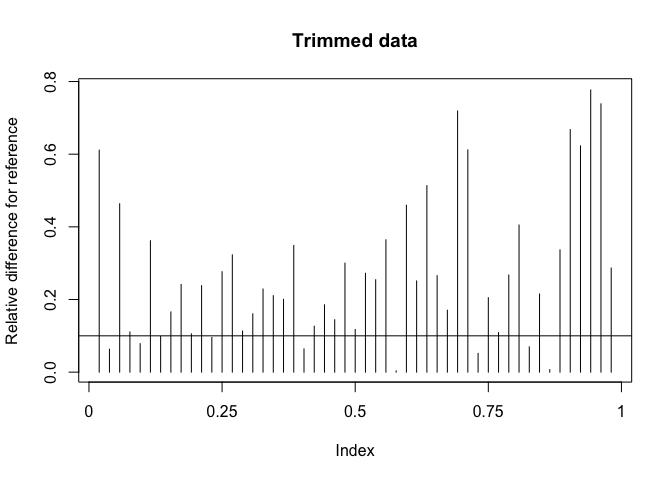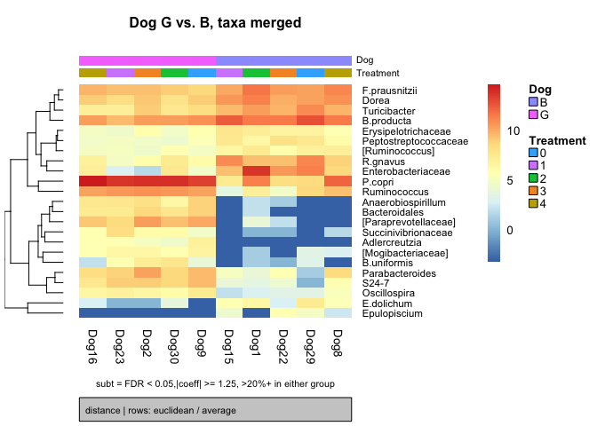

    ## [1] "making heatmap of results"

``` r
print(a)
```

    ##         percent_positive_group0 percent_positive_group1
    ## OTU_11                      100                     100
    ## OTU_111                      80                       0
    ## OTU_19                      100                     100
    ## OTU_77                      100                      80
    ## OTU_29                      100                     100
    ## OTU_61                      100                     100
    ## OTU_98                      100                     100
    ## OTU_59                      100                     100
    ## OTU_10                      100                     100
    ## OTU_12                      100                     100
    ## OTU_73                      100                     100
    ## OTU_76                      100                     100
    ## OTU_27                      100                     100
    ## OTU_74                       60                     100
    ## OTU_69                       60                     100
    ## OTU_39                      100                     100
    ## OTU_8                       100                     100
    ## OTU_26                      100                     100
    ## OTU_57                       60                     100
    ## OTU_72                        0                     100
    ## OTU_68                       40                     100
    ## OTU_55                       20                     100
    ## OTU_36                       40                     100
    ##         +samples in group 0 +samples in group 1 mean_positive_group0
    ## OTU_11                    5                   5                 3645
    ## OTU_111                   4                   0                   27
    ## OTU_19                    5                   5                 1142
    ## OTU_77                    5                   4                   66
    ## OTU_29                    5                   5                 1147
    ## OTU_61                    5                   5                  160
    ## OTU_98                    5                   5                 1570
    ## OTU_59                    5                   5                  105
    ## OTU_10                    5                   5                 4032
    ## OTU_12                    5                   5                 1821
    ## OTU_73                    5                   5                  119
    ## OTU_76                    5                   5                   14
    ## OTU_27                    5                   5                  234
    ## OTU_74                    3                   5                    7
    ## OTU_69                    3                   5                    4
    ## OTU_39                    5                   5                   85
    ## OTU_8                     5                   5                 1524
    ## OTU_26                    5                   5                   20
    ## OTU_57                    3                   5                    2
    ## OTU_72                    0                   5                  NaN
    ## OTU_68                    2                   5                    3
    ## OTU_55                    1                   5                    4
    ## OTU_36                    2                   5                   10
    ##         mean_positive_group1 oddsRatio      lower     upper     fisherP
    ## OTU_11                    70         0 0.00000000       Inf 1.000000000
    ## OTU_111                  NaN       Inf 1.02482226       Inf 0.047619048
    ## OTU_19                    85         0 0.00000000       Inf 1.000000000
    ## OTU_77                     6       Inf 0.02564066       Inf 1.000000000
    ## OTU_29                   241         0 0.00000000       Inf 1.000000000
    ## OTU_61                    27         0 0.00000000       Inf 1.000000000
    ## OTU_98                   409         0 0.00000000       Inf 1.000000000
    ## OTU_59                    32         0 0.00000000       Inf 1.000000000
    ## OTU_10                  1277         0 0.00000000       Inf 1.000000000
    ## OTU_12                   588         0 0.00000000       Inf 1.000000000
    ## OTU_73                    38         0 0.00000000       Inf 1.000000000
    ## OTU_76                   105         0 0.00000000       Inf 1.000000000
    ## OTU_27                  1452         0 0.00000000       Inf 1.000000000
    ## OTU_74                    73         0 0.00000000 5.1183766 0.444444444
    ## OTU_69                    88         0 0.00000000 5.1183766 0.444444444
    ## OTU_39                   598         0 0.00000000       Inf 1.000000000
    ## OTU_8                  15540         0 0.00000000       Inf 1.000000000
    ## OTU_26                   456         0 0.00000000       Inf 1.000000000
    ## OTU_57                   104         0 0.00000000 5.1183766 0.444444444
    ## OTU_72                    52         0 0.00000000 0.4353226 0.007936508
    ## OTU_68                   231         0 0.00000000 2.0268713 0.166666667
    ## OTU_55                   264         0 0.00000000 0.9757790 0.047619048
    ## OTU_36                   782         0 0.00000000 2.0268713 0.166666667
    ##         fisherAdjP     coeff      pvalues   adjPvalues  Kingdom
    ## OTU_11   1.0000000 -5.335889 1.325453e-03 0.0051124626 Bacteria
    ## OTU_111  0.6428571 -3.947856 1.781252e-03 0.0064125087 Bacteria
    ## OTU_19   1.0000000 -3.633831 2.074405e-04 0.0014002236 Bacteria
    ## OTU_77   1.0000000 -3.604725 2.464338e-03 0.0078278960 Bacteria
    ## OTU_29   1.0000000 -2.564529 3.630519e-04 0.0018722086 Bacteria
    ## OTU_61   1.0000000 -2.187588 1.066343e-03 0.0044294229 Bacteria
    ## OTU_98   1.0000000 -2.138648 3.813758e-04 0.0018722086 Bacteria
    ## OTU_59   1.0000000 -1.734565 1.940378e-03 0.0065487758 Bacteria
    ## OTU_10   1.0000000 -1.730040 2.844862e-03 0.0082821869 Bacteria
    ## OTU_12   1.0000000 -1.604175 6.040526e-03 0.0155327819 Bacteria
    ## OTU_73   1.0000000 -1.574631 1.357384e-02 0.0333176120 Bacteria
    ## OTU_76   1.0000000  2.823345 2.459973e-04 0.0014759840 Bacteria
    ## OTU_27   1.0000000  3.079731 2.914103e-03 0.0082821869 Bacteria
    ## OTU_74   1.0000000  3.552444 5.956227e-05 0.0009960843 Bacteria
    ## OTU_69   1.0000000  3.600682 1.570427e-02 0.0368708992 Bacteria
    ## OTU_39   1.0000000  3.854857 4.222922e-03 0.0114018895 Bacteria
    ## OTU_8    1.0000000  3.955315 7.010410e-04 0.0031546846 Bacteria
    ## OTU_26   1.0000000  4.881783 1.207874e-04 0.0010870869 Bacteria
    ## OTU_57   1.0000000  5.122343 5.531714e-05 0.0009960843 Bacteria
    ## OTU_72   0.4285714  5.365032 1.625431e-04 0.0012539037 Bacteria
    ## OTU_68   1.0000000  5.689601 9.130020e-05 0.0009960843 Bacteria
    ## OTU_55   0.6428571  6.175256 5.222962e-05 0.0009960843 Bacteria
    ## OTU_36   1.0000000  6.467192 9.223002e-05 0.0009960843 Bacteria
    ##                 Phylum               Class              Order
    ## OTU_11  Proteobacteria Gammaproteobacteria  Enterobacteriales
    ## OTU_111     Firmicutes          Clostridia      Clostridiales
    ## OTU_19      Firmicutes          Clostridia      Clostridiales
    ## OTU_77      Firmicutes     Erysipelotrichi Erysipelotrichales
    ## OTU_29      Firmicutes             Bacilli   Turicibacterales
    ## OTU_61      Firmicutes          Clostridia      Clostridiales
    ## OTU_98      Firmicutes          Clostridia      Clostridiales
    ## OTU_59      Firmicutes          Clostridia      Clostridiales
    ## OTU_10      Firmicutes          Clostridia      Clostridiales
    ## OTU_12      Firmicutes          Clostridia      Clostridiales
    ## OTU_73      Firmicutes     Erysipelotrichi Erysipelotrichales
    ## OTU_76      Firmicutes          Clostridia      Clostridiales
    ## OTU_27      Firmicutes          Clostridia      Clostridiales
    ## OTU_74      Firmicutes          Clostridia      Clostridiales
    ## OTU_69   Bacteroidetes         Bacteroidia      Bacteroidales
    ## OTU_39   Bacteroidetes         Bacteroidia      Bacteroidales
    ## OTU_8    Bacteroidetes         Bacteroidia      Bacteroidales
    ## OTU_26   Bacteroidetes         Bacteroidia      Bacteroidales
    ## OTU_57  Proteobacteria Gammaproteobacteria      Aeromonadales
    ## OTU_72  Actinobacteria      Coriobacteriia   Coriobacteriales
    ## OTU_68  Proteobacteria Gammaproteobacteria      Aeromonadales
    ## OTU_55   Bacteroidetes         Bacteroidia      Bacteroidales
    ## OTU_36   Bacteroidetes         Bacteroidia      Bacteroidales
    ##                        Family              Genus     Species
    ## OTU_11     Enterobacteriaceae               <NA>        <NA>
    ## OTU_111       Lachnospiraceae       Epulopiscium        <NA>
    ## OTU_19        Lachnospiraceae     [Ruminococcus]      gnavus
    ## OTU_77    Erysipelotrichaceae      [Eubacterium]    dolichum
    ## OTU_29      Turicibacteraceae       Turicibacter        <NA>
    ## OTU_61  Peptostreptococcaceae               <NA>        <NA>
    ## OTU_98        Lachnospiraceae              Dorea        <NA>
    ## OTU_59        Lachnospiraceae     [Ruminococcus]        <NA>
    ## OTU_10        Lachnospiraceae            Blautia    producta
    ## OTU_12        Ruminococcaceae   Faecalibacterium prausnitzii
    ## OTU_73    Erysipelotrichaceae               <NA>        <NA>
    ## OTU_76        Ruminococcaceae       Oscillospira        <NA>
    ## OTU_27        Ruminococcaceae       Ruminococcus        <NA>
    ## OTU_74     [Mogibacteriaceae]               <NA>        <NA>
    ## OTU_69         Bacteroidaceae        Bacteroides   uniformis
    ## OTU_39     Porphyromonadaceae    Parabacteroides        <NA>
    ## OTU_8          Prevotellaceae         Prevotella       copri
    ## OTU_26                  S24-7               <NA>        <NA>
    ## OTU_57    Succinivibrionaceae               <NA>        <NA>
    ## OTU_72      Coriobacteriaceae      Adlercreutzia        <NA>
    ## OTU_68    Succinivibrionaceae Anaerobiospirillum        <NA>
    ## OTU_55                   <NA>               <NA>        <NA>
    ## OTU_36   [Paraprevotellaceae]               <NA>        <NA>

Now again compare dog G vs. dog B with differential abundance testing (individual OTUs as opposed to merged this time)

``` r
b = super.fitZig.kv(physeq = phy.temp,factor = "Dog",outDir = outDir,FileName =c("1_25FC_0.2_Dog_GvsB_OTUs"),
        heatmap.descriptor=c("tax_annot"), main=c("Dog G vs. B, OTUs"), subt=c("subt = FDR < 0.05,|coeff| >= 1.25, >20%+ in either group"), 
        ordered=TRUE, p=0.05, FC = 1.25, perc=0.2, extra.cols = c("Treatment"))
```

    ## [1] "0 of 10 samples were removed due to missing data"
    ## [1] "Dog will be modeled as a binary categorical predictor variable"

    ## it= 0, nll=18.64, log10(eps+1)=Inf, stillActive=118
    ## it= 1, nll=19.75, log10(eps+1)=0.04, stillActive=5
    ## it= 2, nll=19.77, log10(eps+1)=0.01, stillActive=0
    ## There were  44 OTUs significantly different between B vs. G that met 
    ##  threshold criteria of p 0.05 absolute FC 1.25 and percentage presence in at least one group of 20 % 
    ## [1] "writing results and model to file"

    ## Warning in write.table(finalMod, file, append = TRUE, sep = ",", col.names
    ## = NA): appending column names to file

    ## [1] "/Users/katielennard/Documents/Academic/Postdoc/Projects/cbio_16S_pipeline_certification/Sept18_testing/results/1_25FC_0.2_Dog_GvsB_OTUs_tax_annot.pdf"

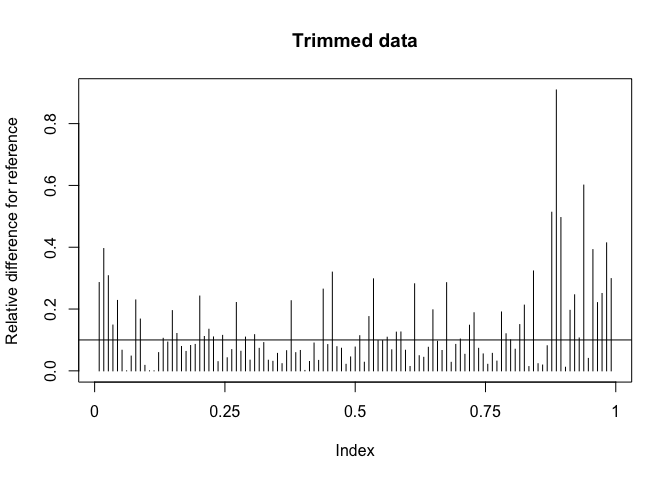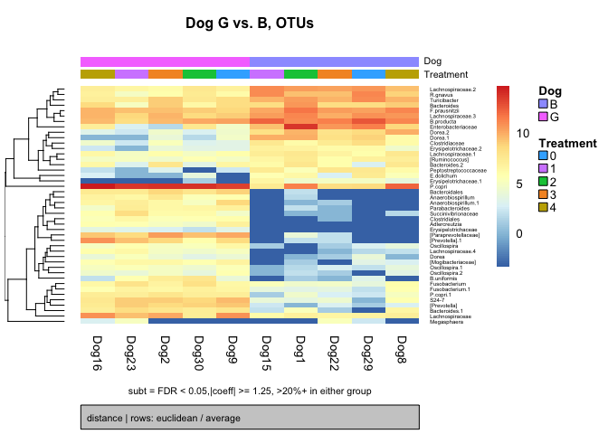

    ## [1] "making heatmap of results"

``` r
b
```

    ##         percent_positive_group0 percent_positive_group1
    ## OTU_43                      100                     100
    ## OTU_40                      100                     100
    ## OTU_11                      100                     100
    ## OTU_61                      100                      80
    ## OTU_87                      100                      20
    ## OTU_77                      100                      80
    ## OTU_19                      100                     100
    ## OTU_53                      100                     100
    ## OTU_73                      100                     100
    ## OTU_18                      100                     100
    ## OTU_33                      100                     100
    ## OTU_21                      100                     100
    ## OTU_29                      100                     100
    ## OTU_49                      100                     100
    ## OTU_10                      100                     100
    ## OTU_46                      100                     100
    ## OTU_12                      100                     100
    ## OTU_59                      100                     100
    ## OTU_96                       80                     100
    ## OTU_101                     100                     100
    ## OTU_24                      100                     100
    ## OTU_97                      100                     100
    ## OTU_140                     100                     100
    ## OTU_76                       80                     100
    ## OTU_54                       80                     100
    ## OTU_100                       0                     100
    ## OTU_179                      80                     100
    ## OTU_121                     100                     100
    ## OTU_8                       100                     100
    ## OTU_74                       60                     100
    ## OTU_82                       60                     100
    ## OTU_26                      100                     100
    ## OTU_99                       40                      40
    ## OTU_58                       20                     100
    ## OTU_68                       40                     100
    ## OTU_72                        0                     100
    ## OTU_52                       40                     100
    ## OTU_69                       60                     100
    ## OTU_57                       60                     100
    ## OTU_81                       20                     100
    ## OTU_55                       20                     100
    ## OTU_36                       40                     100
    ## OTU_107                     100                     100
    ## OTU_42                       40                     100
    ##         +samples in group 0 +samples in group 1 mean_positive_group0
    ## OTU_43                    5                   5                  520
    ## OTU_40                    5                   5                  531
    ## OTU_11                    5                   5                 3645
    ## OTU_61                    5                   4                  136
    ## OTU_87                    5                   1                   36
    ## OTU_77                    5                   4                   66
    ## OTU_19                    5                   5                 1142
    ## OTU_53                    5                   5                  152
    ## OTU_73                    5                   5                   74
    ## OTU_18                    5                   5                 1320
    ## OTU_33                    5                   5                  103
    ## OTU_21                    5                   5                  582
    ## OTU_29                    5                   5                 1147
    ## OTU_49                    5                   5                  130
    ## OTU_10                    5                   5                 3376
    ## OTU_46                    5                   5                 1520
    ## OTU_12                    5                   5                 1821
    ## OTU_59                    5                   5                  105
    ## OTU_96                    4                   5                    4
    ## OTU_101                   5                   5                   19
    ## OTU_24                    5                   5                   99
    ## OTU_97                    5                   5                    6
    ## OTU_140                   5                   5                   32
    ## OTU_76                    4                   5                    6
    ## OTU_54                    4                   5                   32
    ## OTU_100                   0                   5                  NaN
    ## OTU_179                   4                   5                    5
    ## OTU_121                   5                   5                   14
    ## OTU_8                     5                   5                 1510
    ## OTU_74                    3                   5                    7
    ## OTU_82                    3                   5                    3
    ## OTU_26                    5                   5                   20
    ## OTU_99                    2                   2                   22
    ## OTU_58                    1                   5                    3
    ## OTU_68                    2                   5                    2
    ## OTU_72                    0                   5                  NaN
    ## OTU_52                    2                   5                    2
    ## OTU_69                    3                   5                    4
    ## OTU_57                    3                   5                    2
    ## OTU_81                    1                   5                    1
    ## OTU_55                    1                   5                    4
    ## OTU_36                    2                   5                   10
    ## OTU_107                   5                   5                    4
    ## OTU_42                    2                   5                    4
    ##         mean_positive_group1 oddsRatio      lower      upper     fisherP
    ## OTU_43                    13         0 0.00000000        Inf 1.000000000
    ## OTU_40                     9         0 0.00000000        Inf 1.000000000
    ## OTU_11                    70         0 0.00000000        Inf 1.000000000
    ## OTU_61                     4       Inf 0.02564066        Inf 1.000000000
    ## OTU_87                     2       Inf 1.02482226        Inf 0.047619048
    ## OTU_77                     6       Inf 0.02564066        Inf 1.000000000
    ## OTU_19                    85         0 0.00000000        Inf 1.000000000
    ## OTU_53                    17         0 0.00000000        Inf 1.000000000
    ## OTU_73                     8         0 0.00000000        Inf 1.000000000
    ## OTU_18                   115         0 0.00000000        Inf 1.000000000
    ## OTU_33                    77         0 0.00000000        Inf 1.000000000
    ## OTU_21                   245         0 0.00000000        Inf 1.000000000
    ## OTU_29                   241         0 0.00000000        Inf 1.000000000
    ## OTU_49                    50         0 0.00000000        Inf 1.000000000
    ## OTU_10                   804         0 0.00000000        Inf 1.000000000
    ## OTU_46                   554         0 0.00000000        Inf 1.000000000
    ## OTU_12                   588         0 0.00000000        Inf 1.000000000
    ## OTU_59                    32         0 0.00000000        Inf 1.000000000
    ## OTU_96                    26         0 0.00000000 39.0005500 1.000000000
    ## OTU_101                   86         0 0.00000000        Inf 1.000000000
    ## OTU_24                  1032         0 0.00000000        Inf 1.000000000
    ## OTU_97                    32         0 0.00000000        Inf 1.000000000
    ## OTU_140                  147         0 0.00000000        Inf 1.000000000
    ## OTU_76                    48         0 0.00000000 39.0005500 1.000000000
    ## OTU_54                   194         0 0.00000000 39.0005500 1.000000000
    ## OTU_100                    8         0 0.00000000  0.4353226 0.007936508
    ## OTU_179                   20         0 0.00000000 39.0005500 1.000000000
    ## OTU_121                  151         0 0.00000000        Inf 1.000000000
    ## OTU_8                  15389         0 0.00000000        Inf 1.000000000
    ## OTU_74                    73         0 0.00000000  5.1183766 0.444444444
    ## OTU_82                    45         0 0.00000000  5.1183766 0.444444444
    ## OTU_26                   456         0 0.00000000        Inf 1.000000000
    ## OTU_99                    19         1 0.04224561 23.6710987 1.000000000
    ## OTU_58                    93         0 0.00000000  0.9757790 0.047619048
    ## OTU_68                   138         0 0.00000000  2.0268713 0.166666667
    ## OTU_72                    52         0 0.00000000  0.4353226 0.007936508
    ## OTU_52                    88         0 0.00000000  2.0268713 0.166666667
    ## OTU_69                    88         0 0.00000000  5.1183766 0.444444444
    ## OTU_57                   104         0 0.00000000  5.1183766 0.444444444
    ## OTU_81                    52         0 0.00000000  0.9757790 0.047619048
    ## OTU_55                   264         0 0.00000000  0.9757790 0.047619048
    ## OTU_36                   782         0 0.00000000  2.0268713 0.166666667
    ## OTU_107                  390         0 0.00000000        Inf 1.000000000
    ## OTU_42                   617         0 0.00000000  2.0268713 0.166666667
    ##         fisherAdjP     coeff      pvalues   adjPvalues  Kingdom
    ## OTU_43    1.000000 -6.265855 7.413434e-08 8.747852e-06 Bacteria
    ## OTU_40    1.000000 -6.259449 2.542682e-04 3.750455e-03 Bacteria
    ## OTU_11    1.000000 -4.645946 8.376471e-03 2.828424e-02 Bacteria
    ## OTU_61    1.000000 -4.091752 6.625680e-04 5.456540e-03 Bacteria
    ## OTU_87    0.702381 -3.624768 9.238824e-04 6.056562e-03 Bacteria
    ## OTU_77    1.000000 -3.129785 1.564975e-02 4.294583e-02 Bacteria
    ## OTU_19    1.000000 -3.047370 1.390707e-03 7.814448e-03 Bacteria
    ## OTU_53    1.000000 -3.009255 2.639526e-03 1.354192e-02 Bacteria
    ## OTU_73    1.000000 -2.998537 4.111413e-03 1.796840e-02 Bacteria
    ## OTU_18    1.000000 -2.977496 9.056608e-05 2.206351e-03 Bacteria
    ## OTU_33    1.000000 -2.641937 1.521242e-02 4.273967e-02 Bacteria
    ## OTU_21    1.000000 -2.573473 9.873761e-03 3.236400e-02 Bacteria
    ## OTU_29    1.000000 -2.528852 1.878617e-03 1.007622e-02 Bacteria
    ## OTU_49    1.000000 -2.032101 1.273431e-03 7.513242e-03 Bacteria
    ## OTU_10    1.000000 -1.930743 1.158191e-02 3.553896e-02 Bacteria
    ## OTU_46    1.000000 -1.873228 2.945048e-03 1.447982e-02 Bacteria
    ## OTU_12    1.000000 -1.800168 6.033461e-03 2.373161e-02 Bacteria
    ## OTU_59    1.000000 -1.732011 4.747239e-03 2.000622e-02 Bacteria
    ## OTU_96    1.000000  1.590223 8.389393e-03 2.828424e-02 Bacteria
    ## OTU_101   1.000000  1.867465 1.858690e-02 4.984668e-02 Bacteria
    ## OTU_24    1.000000  2.050962 1.285693e-02 3.792793e-02 Bacteria
    ## OTU_97    1.000000  2.107831 6.597046e-03 2.432661e-02 Bacteria
    ## OTU_140   1.000000  2.134120 1.103471e-02 3.519177e-02 Bacteria
    ## OTU_76    1.000000  2.384661 3.815526e-03 1.731662e-02 Bacteria
    ## OTU_54    1.000000  2.443614 1.442611e-02 4.151905e-02 Bacteria
    ## OTU_100   0.468254  2.826305 7.366894e-03 2.634223e-02 Bacteria
    ## OTU_179   1.000000  2.897080 3.534633e-03 1.668347e-02 Bacteria
    ## OTU_121   1.000000  2.969672 1.110775e-03 6.898497e-03 Bacteria
    ## OTU_8     1.000000  3.195535 5.352886e-03 2.178071e-02 Bacteria
    ## OTU_74    1.000000  3.460188 4.214346e-04 5.456540e-03 Bacteria
    ## OTU_82    1.000000  3.500014 5.081205e-04 5.456540e-03 Bacteria
    ## OTU_26    1.000000  3.899264 7.219929e-04 5.456540e-03 Bacteria
    ## OTU_99    1.000000  4.433913 1.174593e-02 3.553896e-02 Bacteria
    ## OTU_58    0.702381  4.537822 6.642934e-04 5.456540e-03 Bacteria
    ## OTU_68    1.000000  4.771587 7.398699e-04 5.456540e-03 Bacteria
    ## OTU_72    0.468254  4.883621 6.158144e-04 5.456540e-03 Bacteria
    ## OTU_52    1.000000  4.887767 5.101806e-04 5.456540e-03 Bacteria
    ## OTU_69    1.000000  5.014325 6.540256e-03 2.432661e-02 Bacteria
    ## OTU_57    1.000000  5.166507 9.442129e-05 2.206351e-03 Bacteria
    ## OTU_81    0.702381  5.454597 7.151773e-05 2.206351e-03 Bacteria
    ## OTU_55    0.702381  5.610587 1.121873e-04 2.206351e-03 Bacteria
    ## OTU_36    1.000000  5.656352 2.404504e-04 3.750455e-03 Bacteria
    ## OTU_107   1.000000  6.147442 2.060969e-06 1.215971e-04 Bacteria
    ## OTU_42    1.000000  6.241067 7.873639e-04 5.465232e-03 Bacteria
    ##                 Phylum               Class              Order
    ## OTU_43      Firmicutes          Clostridia      Clostridiales
    ## OTU_40      Firmicutes          Clostridia      Clostridiales
    ## OTU_11  Proteobacteria Gammaproteobacteria  Enterobacteriales
    ## OTU_61      Firmicutes          Clostridia      Clostridiales
    ## OTU_87      Firmicutes     Erysipelotrichi Erysipelotrichales
    ## OTU_77      Firmicutes     Erysipelotrichi Erysipelotrichales
    ## OTU_19      Firmicutes          Clostridia      Clostridiales
    ## OTU_53      Firmicutes          Clostridia      Clostridiales
    ## OTU_73      Firmicutes     Erysipelotrichi Erysipelotrichales
    ## OTU_18      Firmicutes          Clostridia      Clostridiales
    ## OTU_33   Bacteroidetes         Bacteroidia      Bacteroidales
    ## OTU_21   Bacteroidetes         Bacteroidia      Bacteroidales
    ## OTU_29      Firmicutes             Bacilli   Turicibacterales
    ## OTU_49      Firmicutes          Clostridia      Clostridiales
    ## OTU_10      Firmicutes          Clostridia      Clostridiales
    ## OTU_46      Firmicutes          Clostridia      Clostridiales
    ## OTU_12      Firmicutes          Clostridia      Clostridiales
    ## OTU_59      Firmicutes          Clostridia      Clostridiales
    ## OTU_96      Firmicutes          Clostridia      Clostridiales
    ## OTU_101   Fusobacteria       Fusobacteriia    Fusobacteriales
    ## OTU_24      Firmicutes          Clostridia      Clostridiales
    ## OTU_97      Firmicutes          Clostridia      Clostridiales
    ## OTU_140   Fusobacteria       Fusobacteriia    Fusobacteriales
    ## OTU_76      Firmicutes          Clostridia      Clostridiales
    ## OTU_54   Bacteroidetes         Bacteroidia      Bacteroidales
    ## OTU_100     Firmicutes     Erysipelotrichi Erysipelotrichales
    ## OTU_179     Firmicutes          Clostridia      Clostridiales
    ## OTU_121  Bacteroidetes         Bacteroidia      Bacteroidales
    ## OTU_8    Bacteroidetes         Bacteroidia      Bacteroidales
    ## OTU_74      Firmicutes          Clostridia      Clostridiales
    ## OTU_82      Firmicutes          Clostridia      Clostridiales
    ## OTU_26   Bacteroidetes         Bacteroidia      Bacteroidales
    ## OTU_99      Firmicutes          Clostridia      Clostridiales
    ## OTU_58  Proteobacteria Gammaproteobacteria      Aeromonadales
    ## OTU_68  Proteobacteria Gammaproteobacteria      Aeromonadales
    ## OTU_72  Actinobacteria      Coriobacteriia   Coriobacteriales
    ## OTU_52   Bacteroidetes         Bacteroidia      Bacteroidales
    ## OTU_69   Bacteroidetes         Bacteroidia      Bacteroidales
    ## OTU_57  Proteobacteria Gammaproteobacteria      Aeromonadales
    ## OTU_81      Firmicutes          Clostridia      Clostridiales
    ## OTU_55   Bacteroidetes         Bacteroidia      Bacteroidales
    ## OTU_36   Bacteroidetes         Bacteroidia      Bacteroidales
    ## OTU_107  Bacteroidetes         Bacteroidia      Bacteroidales
    ## OTU_42   Bacteroidetes         Bacteroidia      Bacteroidales
    ##                        Family              Genus     Species
    ## OTU_43        Lachnospiraceae              Dorea            
    ## OTU_40        Lachnospiraceae              Dorea            
    ## OTU_11     Enterobacteriaceae                               
    ## OTU_61  Peptostreptococcaceae                               
    ## OTU_87    Erysipelotrichaceae                               
    ## OTU_77    Erysipelotrichaceae      [Eubacterium]    dolichum
    ## OTU_19        Lachnospiraceae     [Ruminococcus]      gnavus
    ## OTU_53         Clostridiaceae                               
    ## OTU_73    Erysipelotrichaceae                               
    ## OTU_18        Lachnospiraceae                               
    ## OTU_33         Bacteroidaceae        Bacteroides            
    ## OTU_21         Bacteroidaceae        Bacteroides            
    ## OTU_29      Turicibacteraceae       Turicibacter            
    ## OTU_49        Lachnospiraceae                               
    ## OTU_10        Lachnospiraceae            Blautia    producta
    ## OTU_46        Lachnospiraceae               <NA>        <NA>
    ## OTU_12        Ruminococcaceae   Faecalibacterium prausnitzii
    ## OTU_59        Lachnospiraceae     [Ruminococcus]            
    ## OTU_96        Ruminococcaceae       Oscillospira            
    ## OTU_101      Fusobacteriaceae      Fusobacterium            
    ## OTU_24        Lachnospiraceae                               
    ## OTU_97        Ruminococcaceae       Oscillospira            
    ## OTU_140      Fusobacteriaceae      Fusobacterium            
    ## OTU_76        Ruminococcaceae       Oscillospira            
    ## OTU_54         Bacteroidaceae        Bacteroides            
    ## OTU_100   Erysipelotrichaceae                               
    ## OTU_179       Lachnospiraceae              Dorea            
    ## OTU_121        Prevotellaceae         Prevotella       copri
    ## OTU_8          Prevotellaceae         Prevotella       copri
    ## OTU_74     [Mogibacteriaceae]                               
    ## OTU_82        Lachnospiraceae                               
    ## OTU_26                  S24-7                               
    ## OTU_99        Veillonellaceae        Megasphaera            
    ## OTU_58    Succinivibrionaceae Anaerobiospirillum            
    ## OTU_68    Succinivibrionaceae Anaerobiospirillum            
    ## OTU_72      Coriobacteriaceae      Adlercreutzia            
    ## OTU_52     Porphyromonadaceae    Parabacteroides            
    ## OTU_69         Bacteroidaceae        Bacteroides   uniformis
    ## OTU_57    Succinivibrionaceae                               
    ## OTU_81                                                      
    ## OTU_55                                                      
    ## OTU_36   [Paraprevotellaceae]               <NA>        <NA>
    ## OTU_107  [Paraprevotellaceae]       [Prevotella]            
    ## OTU_42   [Paraprevotellaceae]       [Prevotella]

``` r
sessionInfo()
```

    ## R version 3.4.3 (2017-11-30)
    ## Platform: x86_64-apple-darwin15.6.0 (64-bit)
    ## Running under: macOS Sierra 10.12.6
    ## 
    ## Matrix products: default
    ## BLAS: /Library/Frameworks/R.framework/Versions/3.4/Resources/lib/libRblas.0.dylib
    ## LAPACK: /Library/Frameworks/R.framework/Versions/3.4/Resources/lib/libRlapack.dylib
    ## 
    ## locale:
    ## [1] en_US.UTF-8/en_US.UTF-8/en_US.UTF-8/C/en_US.UTF-8/en_US.UTF-8
    ## 
    ## attached base packages:
    ## [1] parallel  stats     graphics  grDevices utils     datasets  methods  
    ## [8] base     
    ## 
    ## other attached packages:
    ##  [1] bindrcpp_0.2.2       ROCR_1.0-7           gplots_3.0.1        
    ##  [4] metagenomeSeq_1.18.0 RColorBrewer_1.1-2   glmnet_2.0-16       
    ##  [7] foreach_1.4.4        Matrix_1.2-14        limma_3.32.10       
    ## [10] fifer_1.1            MASS_7.3-50          matrixStats_0.53.1  
    ## [13] psych_1.8.4          corrplot_0.84        NMF_0.23.6          
    ## [16] Biobase_2.36.2       BiocGenerics_0.22.1  cluster_2.0.7-1     
    ## [19] rngtools_1.3.1       pkgmaker_0.27.2      registry_0.5        
    ## [22] dplyr_0.7.6          randomForest_4.6-14  vegan_2.5-2         
    ## [25] lattice_0.20-35      permute_0.9-4        dunn.test_1.3.5     
    ## [28] gridExtra_2.3        ggplot2_3.0.0        phyloseq_1.20.0     
    ## 
    ## loaded via a namespace (and not attached):
    ##   [1] TH.data_1.0-9         colorspace_1.3-2      class_7.3-14         
    ##   [4] modeltools_0.2-21     mclust_5.4.1          rprojroot_1.3-2      
    ##   [7] htmlTable_1.12        XVector_0.16.0        base64enc_0.1-3      
    ##  [10] rstudioapi_0.7        flexmix_2.3-14        mvtnorm_1.0-8        
    ##  [13] coin_1.2-2            codetools_0.2-15      splines_3.4.3        
    ##  [16] mnormt_1.5-5          doParallel_1.0.11     robustbase_0.93-1    
    ##  [19] knitr_1.20            ade4_1.7-11           spam_2.2-0           
    ##  [22] Formula_1.2-3         jsonlite_1.5          gridBase_0.4-7       
    ##  [25] kernlab_0.9-26        compiler_3.4.3        randomForestSRC_2.6.1
    ##  [28] backports_1.1.2       assertthat_0.2.0      lazyeval_0.2.1       
    ##  [31] strucchange_1.5-1     acepack_1.4.1         htmltools_0.3.6      
    ##  [34] tools_3.4.3           igraph_1.2.1          dotCall64_0.9-5.2    
    ##  [37] gtable_0.2.0          glue_1.2.0            reshape2_1.4.3       
    ##  [40] maps_3.3.0            Rcpp_0.12.17          trimcluster_0.1-2    
    ##  [43] Biostrings_2.44.2     multtest_2.32.0       gdata_2.18.0         
    ##  [46] ape_5.1               nlme_3.1-137          iterators_1.0.9      
    ##  [49] fpc_2.1-11            stringr_1.3.1         gtools_3.8.1         
    ##  [52] dendextend_1.8.0      DEoptimR_1.0-8        zoo_1.8-2            
    ##  [55] zlibbioc_1.22.0       scales_0.5.0          sandwich_2.4-0       
    ##  [58] biomformat_1.4.0      rhdf5_2.20.0          fields_9.6           
    ##  [61] yaml_2.1.19           rpart_4.1-13          latticeExtra_0.6-28  
    ##  [64] stringi_1.2.3         S4Vectors_0.14.7      plotrix_3.7-2        
    ##  [67] checkmate_1.8.5       caTools_1.17.1        bibtex_0.4.2         
    ##  [70] bitops_1.0-6          rlang_0.2.1           pkgconfig_2.0.1      
    ##  [73] prabclus_2.2-6        evaluate_0.10.1       purrr_0.2.5          
    ##  [76] bindr_0.1.1           labeling_0.3          htmlwidgets_1.2      
    ##  [79] tidyselect_0.2.4      plyr_1.8.4            magrittr_1.5         
    ##  [82] R6_2.2.2              IRanges_2.10.5        Hmisc_4.1-1          
    ##  [85] multcomp_1.4-8        pillar_1.2.3          whisker_0.3-2        
    ##  [88] foreign_0.8-70        withr_2.1.2           mgcv_1.8-24          
    ##  [91] survival_2.42-4       nnet_7.3-12           tibble_1.4.2         
    ##  [94] KernSmooth_2.23-15    party_1.3-0           rmarkdown_1.10       
    ##  [97] viridis_0.5.1         grid_3.4.3            data.table_1.11.4    
    ## [100] digest_0.6.15         diptest_0.75-7        xtable_1.8-2         
    ## [103] stats4_3.4.3          munsell_0.5.0         viridisLite_0.3.0
