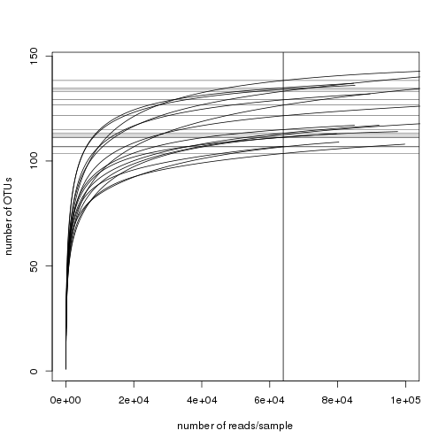
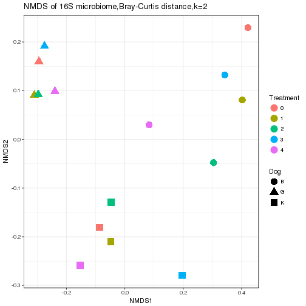
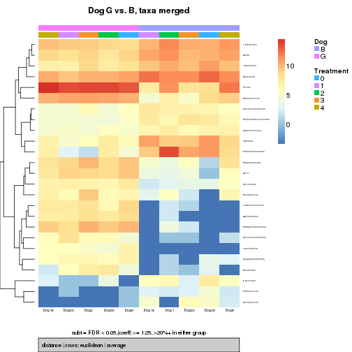
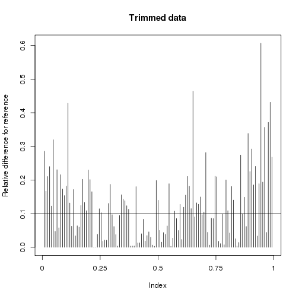

DOG MICROBIOME BASIC ANALYSES
================================
Background
----------

There are three dogs which are treated with increased percentage of a
compound in their diet: 5 different treatments (0-4, representing an
increased percentage of a compound in their diet) Analyses included
here:

-   Import .biom and .tre files generated in QIIME as well as metadata
    file: merge these objects in a phyloseq object
-   Basic data filter: assess number of reads/sample, plot rarefaction
    curves, and exclude low abundance OTUs and samples that do not meet
    minimum number of reads cutoff.
-   Basic exploratory plots including bar plots, alpha- and
    beta-diversity, heatmaps.
-   Differential abundance testing by a) Dog and b) Treatment

## This tutorial should be run in an interactive session. Please do not runnning anything on the headnode.

### To get to a compute node do
```bash
qsub -I -q UCTlong -l walltime=08:00:00
```
Once you are on a compute node you will see that the prompt changes from ```@srvslshpc001``` to ```@srvslshpc60X``` e.g.

```bash
gerrit@srvslshpc001:~> qsub -I -q UCTlong -l walltime=08:00:00
qsub: waiting for job 1598565.srvslshpc001 to start
qsub: job 1598565.srvslshpc001 ready

gerrit@srvslshpc601:~> hostname
srvslshpc601

````

Make an output directory for R downstream analyses
---------------------------------------------------
**NB - replace hpc30 with your user account**
```bash
mkdir /researchdata/fhgfs/hpc30/R_downstream
```

Load the R environment required
-------------------------------
```bash
module load software/R-3.3.0
```
Startup R 
----------------------

enter 'R' into terminal


Import data and create phyloseq object
-------------------------------------------

**Import BIOM file (generated in QIIME) into a phyloseq object**


```r
library(phyloseq)
library(ggplot2)
library(gridExtra)
library(dunn.test)
library(vegan)
library(randomForest)
library(dplyr)
```
**Import custom functions used in script**


```r
source("/scratch/DB/bio/training/16SrRNA/16SrRNA-hex-tutorial/src/microbiome_custom_functions.R")
```

```
## Warning in grepl("\n", lines, fixed = TRUE): input string 545 is invalid in
## this locale
```

```
## Warning: failed to assign RegisteredNativeSymbol for toeplitz to toeplitz
## since toeplitz is already defined in the 'spam' namespace
```
**Set the working directory and import data**
**NB replace the directory listed below to /researchdata/fhgfs/hpc30, substituting 'hpc30' with the name that has been given to you in the class**


```r
#setwd("/scratch/DB/bio/training/16SrRNA/16SrRNA-hex-tutorial/")
#inDir <- getwd()#specify input directory
inDir <- c("/scratch/DB/bio/training/16SrRNA/16SrRNA-hex-tutorial/results/")
outDir <- paste0(inDir,"/R_downstream") #specify output directory
phy <- import_biom(BIOMfilename = paste0(inDir,"/otus_table.tax.biom"), 
		verbose = TRUE)#
ntaxa(phy) #(number of OTUs)
```

```
## [1] 179
```

```r
sample_names(phy) <- sub("\\/1","",sample_names(phy))#remove "/1" from filenames
#add phylogenetic tree (.tre file generated in QIIME)
tree <- read_tree_greengenes(paste0(inDir,"/otus_repsetOUT_aligned_pfiltered.tre"))
#merge phy and tree
phy <- merge_phyloseq(phy,tree)
```
**Data cleanup**


```r
colnames(tax_table(phy))
```

```
## [1] "Rank1" "Rank2" "Rank3" "Rank4" "Rank5" "Rank6" "Rank7"
```

```r
colnames(tax_table(phy)) <-  c("Kingdom", "Phylum" , "Class" , "Order" , "Family" , "Genus", "Species")#e.g. replace "Rank1" with "Kingdom"
#clean taxonomic annotations, at the moment they are for example 'k__Bacteria'; 'p_Firmicutes' - remove k__ and p__ ...
tax_table(phy)[,"Kingdom"] <- sub("k__","",tax_table(phy)[,"Kingdom"])
tax_table(phy)[,"Phylum"] <- sub("p__","",tax_table(phy)[,"Phylum"])
tax_table(phy)[,"Class"] <- sub("c__","",tax_table(phy)[,"Class"])
tax_table(phy)[,"Order"] <- sub("o__","",tax_table(phy)[,"Order"])
tax_table(phy)[,"Family"] <- sub("f__","",tax_table(phy)[,"Family"])
tax_table(phy)[,"Genus"] <- sub("g__","",tax_table(phy)[,"Genus"])
tax_table(phy)[,"Species"] <- sub("s__","",tax_table(phy)[,"Species"])
t= which(is.na(tax_table(phy)[,"Phylum"])) 
tax_table(phy) = tax_table(phy)[-t,] #remove rows that don't at least have Phylum-level annotation
```
**Import metadata and merge with phyloseq object**


```r
meta <-  read.table(paste0(inDir,"/practice.dataset1.metadata.tsv"), sep = "\t", header =TRUE, row.names=1)
head(meta)
```

```
##       Dog Treatment
## Dog1    B         2
## Dog2    G         3
## Dog3    K         3
## Dog8    B         4
## Dog9    G         0
## Dog10   K         4
```

```r
rownames(meta)
```

```
##  [1] "Dog1"  "Dog2"  "Dog3"  "Dog8"  "Dog9"  "Dog10" "Dog15" "Dog16"
##  [9] "Dog17" "Dog22" "Dog23" "Dog24" "Dog29" "Dog30" "Dog31"
```

```r
head(sample_names(phy))
```

```
## [1] "Dog10" "Dog15" "Dog16" "Dog17" "Dog1"  "Dog22"
```

```r
length(sample_names(phy))#15
```

```
## [1] 15
```

```r
length(rownames(meta))#15 (check if same number of samples in .biom file and metadatafile)
```

```
## [1] 15
```

```r
length(intersect(rownames(meta),sample_names(phy)))#15 (check that the sample names match in all cases)
```

```
## [1] 15
```

```r
sample_data(phy) <- meta#assign the metadata to the phyloseq object 'phy' (phyloseq will put these in the right order)
nsamples(phy)
```

```
## [1] 15
```

```r
str(sample_data(phy))#need to change treatment column to factor variable
```

```
## 'data.frame':	15 obs. of  2 variables:
## Formal class 'sample_data' [package "phyloseq"] with 4 slots
##   ..@ .Data    :List of 2
##   .. ..$ : Factor w/ 3 levels "B","G","K": 3 1 2 3 1 1 2 3 1 2 ...
##   .. ..$ : int  4 1 4 0 2 3 1 2 0 3 ...
##   ..@ names    : chr  "Dog" "Treatment"
##   ..@ row.names: chr  "Dog10" "Dog15" "Dog16" "Dog17" ...
##   ..@ .S3Class : chr "data.frame"
```

```r
sample_data(phy)[,"Treatment"] <- as.factor(unlist(sample_data(phy)[,"Treatment"]))
```
**Save phyloseq object as an .RData file**


```r
save(phy, file = paste0(outDir,"/CBIO_16s_cert.RData")) #Save annotated object as a .RData object for quick reload if required at a later stage
#load(paste0(outDir,"/CBIO_16s_cert.RData")) #this is how you would reload the .RData object 'phy'
```
Explore number of reads per sample, make rarefaction curves and filter data as necessary
-------------------------------------------
**Explore number of reads per sample**

```r
reads <- sample_sums(phy)
length(which(reads<5000))
```

```
## [1] 0
```

```r
raremax <- min(reads)
raremax
```

```
## [1] 63980
```

```r
r=rarecurve(t(otu_table(phy)), step = 100, sample = raremax,xlab = "number of reads/sample", ylab = "number of OTUs",
		label = FALSE, xlim = c(0,100000))
```



```r
pdf(paste0(outDir,"/rarefaction_curve.pdf"))
r
```

```
## [[1]]
##        N1      N101      N201      N301      N401      N501      N601 
##   1.00000  24.57771  33.30832  39.02649  43.27856  46.66141  49.47114 
##      N701      N801      N901     N1001     N1101     N1201     N1301 
##  51.87535  53.97718  55.84421  57.52292  59.04671  60.44042  61.72311 
##     N1401     N1501     N1601     N1701     N1801     N1901     N2001 
##  62.90976  64.01241  65.04091  66.00345  66.90691  67.75717  68.55924 
##     N2101     N2201     N2301     N2401     N2501     N2601     N2701 
##  69.31750  70.03575  70.71732  71.36518  71.98194  72.56995  73.13131 
##     N2801     N2901     N3001     N3101     N3201     N3301     N3401 
##  73.66790  74.18143  74.67345  75.14538  75.59849  76.03397  76.45288 
##     N3501     N3601     N3701     N3801     N3901     N4001     N4101 
##  76.85623  77.24492  77.61980  77.98165  78.33120  78.66910  78.99599 
##     N4201     N4301     N4401     N4501     N4601     N4701     N4801 
##  79.31244  79.61901  79.91618  80.20443  80.48420  80.75591  81.01995 
##     N4901     N5001     N5101     N5201     N5301     N5401     N5501 
##  81.27666  81.52641  81.76949  82.00623  82.23689  82.46176  82.68107 
##     N5601     N5701     N5801     N5901     N6001     N6101     N6201 
##  82.89507  83.10399  83.30803  83.50739  83.70227  83.89284  84.07928 
##     N6301     N6401     N6501     N6601     N6701     N6801     N6901 
##  84.26174  84.44038  84.61535  84.78678  84.95481  85.11955  85.28113 
##     N7001     N7101     N7201     N7301     N7401     N7501     N7601 
##  85.43966  85.59524  85.74799  85.89799  86.04534  86.19013  86.33244 
##     N7701     N7801     N7901     N8001     N8101     N8201     N8301 
##  86.47236  86.60996  86.74531  86.87849  87.00956  87.13859  87.26564 
##     N8401     N8501     N8601     N8701     N8801     N8901     N9001 
##  87.39077  87.51404  87.63549  87.75519  87.87318  87.98952  88.10423 
##     N9101     N9201     N9301     N9401     N9501     N9601     N9701 
##  88.21738  88.32901  88.43915  88.54784  88.65513  88.76104  88.86562 
##     N9801     N9901    N10001    N10101    N10201    N10301    N10401 
##  88.96890  89.07091  89.17168  89.27124  89.36962  89.46686  89.56297 
##    N10501    N10601    N10701    N10801    N10901    N11001    N11101 
##  89.65798  89.75192  89.84481  89.93669  90.02756  90.11745  90.20639 
##    N11201    N11301    N11401    N11501    N11601    N11701    N11801 
##  90.29439  90.38147  90.46766  90.55297  90.63742  90.72103  90.80381 
##    N11901    N12001    N12101    N12201    N12301    N12401    N12501 
##  90.88579  90.96698  91.04738  91.12703  91.20593  91.28410  91.36155 
##    N12601    N12701    N12801    N12901    N13001    N13101    N13201 
##  91.43830  91.51435  91.58973  91.66444  91.73849  91.81190  91.88468 
##    N13301    N13401    N13501    N13601    N13701    N13801    N13901 
##  91.95684  92.02840  92.09935  92.16971  92.23950  92.30872  92.37738 
##    N14001    N14101    N14201    N14301    N14401    N14501    N14601 
##  92.44548  92.51305  92.58009  92.64660  92.71260  92.77809  92.84308 
##    N14701    N14801    N14901    N15001    N15101    N15201    N15301 
##  92.90758  92.97160  93.03514  93.09821  93.16082  93.22298  93.28469 
##    N15401    N15501    N15601    N15701    N15801    N15901    N16001 
##  93.34596  93.40679  93.46719  93.52718  93.58674  93.64590  93.70465 
##    N16101    N16201    N16301    N16401    N16501    N16601    N16701 
##  93.76301  93.82097  93.87855  93.93574  93.99256  94.04900  94.10508 
##    N16801    N16901    N17001    N17101    N17201    N17301    N17401 
##  94.16080  94.21616  94.27117  94.32583  94.38015  94.43414  94.48779 
##    N17501    N17601    N17701    N17801    N17901    N18001    N18101 
##  94.54111  94.59410  94.64678  94.69913  94.75118  94.80292  94.85435 
##    N18201    N18301    N18401    N18501    N18601    N18701    N18801 
##  94.90548  94.95631  95.00686  95.05711  95.10707  95.15675  95.20616 
##    N18901    N19001    N19101    N19201    N19301    N19401    N19501 
##  95.25528  95.30414  95.35273  95.40104  95.44910  95.49690  95.54444 
##    N19601    N19701    N19801    N19901    N20001    N20101    N20201 
##  95.59172  95.63876  95.68555  95.73209  95.77839  95.82445  95.87028 
##    N20301    N20401    N20501    N20601    N20701    N20801    N20901 
##  95.91587  95.96123  96.00636  96.05126  96.09595  96.14041  96.18465 
##    N21001    N21101    N21201    N21301    N21401    N21501    N21601 
##  96.22867  96.27249  96.31609  96.35948  96.40266  96.44564  96.48842 
##    N21701    N21801    N21901    N22001    N22101    N22201    N22301 
##  96.53100  96.57338  96.61556  96.65755  96.69935  96.74095  96.78237 
##    N22401    N22501    N22601    N22701    N22801    N22901    N23001 
##  96.82361  96.86466  96.90553  96.94622  96.98673  97.02706  97.06722 
##    N23101    N23201    N23301    N23401    N23501    N23601    N23701 
##  97.10721  97.14702  97.18667  97.22614  97.26546  97.30461  97.34359 
##    N23801    N23901    N24001    N24101    N24201    N24301    N24401 
##  97.38242  97.42108  97.45959  97.49794  97.53614  97.57418  97.61207 
##    N24501    N24601    N24701    N24801    N24901    N25001    N25101 
##  97.64981  97.68740  97.72485  97.76215  97.79930  97.83631  97.87318 
##    N25201    N25301    N25401    N25501    N25601    N25701    N25801 
##  97.90991  97.94650  97.98295  98.01927  98.05545  98.09150  98.12741 
##    N25901    N26001    N26101    N26201    N26301    N26401    N26501 
##  98.16319  98.19884  98.23436  98.26976  98.30503  98.34017  98.37518 
##    N26601    N26701    N26801    N26901    N27001    N27101    N27201 
##  98.41008  98.44485  98.47950  98.51403  98.54844  98.58273  98.61691 
##    N27301    N27401    N27501    N27601    N27701    N27801    N27901 
##  98.65097  98.68491  98.71874  98.75246  98.78606  98.81956  98.85294 
##    N28001    N28101    N28201    N28301    N28401    N28501    N28601 
##  98.88621  98.91938  98.95244  98.98539  99.01824  99.05098  99.08362 
##    N28701    N28801    N28901    N29001    N29101    N29201    N29301 
##  99.11615  99.14859  99.18092  99.21315  99.24528  99.27731  99.30925 
##    N29401    N29501    N29601    N29701    N29801    N29901    N30001 
##  99.34108  99.37283  99.40447  99.43602  99.46747  99.49884  99.53011 
##    N30101    N30201    N30301    N30401    N30501    N30601    N30701 
##  99.56128  99.59237  99.62336  99.65427  99.68508  99.71581  99.74645 
##    N30801    N30901    N31001    N31101    N31201    N31301    N31401 
##  99.77700  99.80746  99.83784  99.86814  99.89835  99.92847  99.95851 
##    N31501    N31601    N31701    N31801    N31901    N32001    N32101 
##  99.98847 100.01835 100.04814 100.07785 100.10748 100.13704 100.16651 
##    N32201    N32301    N32401    N32501    N32601    N32701    N32801 
## 100.19590 100.22522 100.25446 100.28362 100.31270 100.34171 100.37064 
##    N32901    N33001    N33101    N33201    N33301    N33401    N33501 
## 100.39950 100.42828 100.45699 100.48562 100.51418 100.54267 100.57109 
##    N33601    N33701    N33801    N33901    N34001    N34101    N34201 
## 100.59943 100.62771 100.65591 100.68404 100.71210 100.74010 100.76802 
##    N34301    N34401    N34501    N34601    N34701    N34801    N34901 
## 100.79587 100.82366 100.85138 100.87903 100.90662 100.93413 100.96159 
##    N35001    N35101    N35201    N35301    N35401    N35501    N35601 
## 100.98897 101.01629 101.04355 101.07074 101.09787 101.12493 101.15193 
##    N35701    N35801    N35901    N36001    N36101    N36201    N36301 
## 101.17887 101.20574 101.23255 101.25930 101.28599 101.31262 101.33918 
##    N36401    N36501    N36601    N36701    N36801    N36901    N37001 
## 101.36569 101.39213 101.41852 101.44484 101.47111 101.49732 101.52346 
##    N37101    N37201    N37301    N37401    N37501    N37601    N37701 
## 101.54955 101.57559 101.60156 101.62748 101.65333 101.67914 101.70488 
##    N37801    N37901    N38001    N38101    N38201    N38301    N38401 
## 101.73057 101.75621 101.78178 101.80730 101.83277 101.85818 101.88354 
##    N38501    N38601    N38701    N38801    N38901    N39001    N39101 
## 101.90884 101.93409 101.95929 101.98443 102.00952 102.03455 102.05953 
##    N39201    N39301    N39401    N39501    N39601    N39701    N39801 
## 102.08446 102.10934 102.13416 102.15894 102.18366 102.20833 102.23295 
##    N39901    N40001    N40101    N40201    N40301    N40401    N40501 
## 102.25751 102.28203 102.30650 102.33091 102.35528 102.37959 102.40386 
##    N40601    N40701    N40801    N40901    N41001    N41101    N41201 
## 102.42808 102.45224 102.47636 102.50043 102.52445 102.54842 102.57235 
##    N41301    N41401    N41501    N41601    N41701    N41801    N41901 
## 102.59622 102.62005 102.64383 102.66756 102.69125 102.71488 102.73847 
##    N42001    N42101    N42201    N42301    N42401    N42501    N42601 
## 102.76202 102.78552 102.80897 102.83237 102.85573 102.87904 102.90231 
##    N42701    N42801    N42901    N43001    N43101    N43201    N43301 
## 102.92553 102.94871 102.97184 102.99492 103.01796 103.04096 103.06391 
##    N43401    N43501    N43601    N43701    N43801    N43901    N44001 
## 103.08681 103.10968 103.13249 103.15527 103.17800 103.20068 103.22332 
##    N44101    N44201    N44301    N44401    N44501    N44601    N44701 
## 103.24592 103.26848 103.29099 103.31346 103.33588 103.35827 103.38061 
##    N44801    N44901    N45001    N45101    N45201    N45301    N45401 
## 103.40291 103.42516 103.44738 103.46955 103.49168 103.51376 103.53581 
##    N45501    N45601    N45701    N45801    N45901    N46001    N46101 
## 103.55781 103.57977 103.60169 103.62357 103.64541 103.66721 103.68897 
##    N46201    N46301    N46401    N46501    N46601    N46701    N46801 
## 103.71068 103.73236 103.75399 103.77558 103.79714 103.81865 103.84012 
##    N46901    N47001    N47101    N47201    N47301    N47401    N47501 
## 103.86155 103.88295 103.90430 103.92561 103.94689 103.96812 103.98932 
##    N47601    N47701    N47801    N47901    N48001    N48101    N48201 
## 104.01047 104.03159 104.05266 104.07370 104.09470 104.11566 104.13658 
##    N48301    N48401    N48501    N48601    N48701    N48801    N48901 
## 104.15746 104.17831 104.19911 104.21988 104.24061 104.26130 104.28195 
##    N49001    N49101    N49201    N49301    N49401    N49501    N49601 
## 104.30257 104.32314 104.34368 104.36418 104.38465 104.40507 104.42546 
##    N49701    N49801    N49901    N50001    N50101    N50201    N50301 
## 104.44581 104.46612 104.48640 104.50664 104.52684 104.54700 104.56713 
##    N50401    N50501    N50601    N50701    N50801    N50901    N51001 
## 104.58722 104.60728 104.62729 104.64727 104.66722 104.68713 104.70700 
##    N51101    N51201    N51301    N51401    N51501    N51601    N51701 
## 104.72683 104.74663 104.76639 104.78612 104.80581 104.82546 104.84508 
##    N51801    N51901    N52001    N52101    N52201    N52301    N52401 
## 104.86467 104.88421 104.90372 104.92320 104.94264 104.96204 104.98141 
##    N52501    N52601    N52701    N52801    N52901    N53001    N53101 
## 105.00075 105.02004 105.03931 105.05853 105.07773 105.09689 105.11601 
##    N53201    N53301    N53401    N53501    N53601    N53701    N53801 
## 105.13510 105.15415 105.17317 105.19215 105.21110 105.23002 105.24890 
##    N53901    N54001    N54101    N54201    N54301    N54401    N54501 
## 105.26774 105.28655 105.30533 105.32407 105.34278 105.36145 105.38009 
##    N54601    N54701    N54801    N54901    N55001    N55101    N55201 
## 105.39870 105.41727 105.43581 105.45431 105.47278 105.49122 105.50962 
##    N55301    N55401    N55501    N55601    N55701    N55801    N55901 
## 105.52799 105.54633 105.56463 105.58290 105.60114 105.61934 105.63751 
##    N56001    N56101    N56201    N56301    N56401    N56501    N56601 
## 105.65564 105.67374 105.69181 105.70985 105.72785 105.74582 105.76376 
##    N56701    N56801    N56901    N57001    N57101    N57201    N57301 
## 105.78166 105.79953 105.81737 105.83518 105.85295 105.87069 105.88840 
##    N57401    N57501    N57601    N57701    N57801    N57901    N58001 
## 105.90608 105.92372 105.94133 105.95891 105.97646 105.99397 106.01145 
##    N58101    N58201    N58301    N58401    N58501    N58601    N58701 
## 106.02890 106.04632 106.06370 106.08106 106.09838 106.11567 106.13293 
##    N58801    N58901    N59001    N59101    N59201    N59301    N59401 
## 106.15015 106.16735 106.18451 106.20164 106.21874 106.23581 106.25284 
##    N59501    N59601    N59701    N59801    N59901    N60001    N60101 
## 106.26985 106.28682 106.30376 106.32068 106.33755 106.35440 106.37122 
##    N60201    N60301    N60401    N60501    N60601    N60701    N60801 
## 106.38801 106.40476 106.42149 106.43818 106.45484 106.47147 106.48807 
##    N60901    N61001    N61101    N61201    N61301    N61401    N61501 
## 106.50464 106.52118 106.53769 106.55417 106.57061 106.58703 106.60341 
##    N61601    N61701    N61801    N61901    N62001    N62101    N62201 
## 106.61977 106.63609 106.65239 106.66865 106.68489 106.70109 106.71727 
##    N62301    N62401    N62501    N62601    N62701    N62801    N62901 
## 106.73341 106.74952 106.76561 106.78166 106.79768 106.81368 106.82964 
##    N63001    N63101    N63201    N63301    N63401    N63501    N63601 
## 106.84557 106.86148 106.87735 106.89320 106.90901 106.92480 106.94055 
##    N63701    N63801    N63901    N63980 
## 106.95628 106.97198 106.98764 107.00000 
## attr(,"Subsample")
##                                                                         
##     1   101   201   301   401   501   601   701   801   901  1001  1101 
##                                                                         
##  1201  1301  1401  1501  1601  1701  1801  1901  2001  2101  2201  2301 
##                                                                         
##  2401  2501  2601  2701  2801  2901  3001  3101  3201  3301  3401  3501 
##                                                                         
##  3601  3701  3801  3901  4001  4101  4201  4301  4401  4501  4601  4701 
##                                                                         
##  4801  4901  5001  5101  5201  5301  5401  5501  5601  5701  5801  5901 
##                                                                         
##  6001  6101  6201  6301  6401  6501  6601  6701  6801  6901  7001  7101 
##                                                                         
##  7201  7301  7401  7501  7601  7701  7801  7901  8001  8101  8201  8301 
##                                                                         
##  8401  8501  8601  8701  8801  8901  9001  9101  9201  9301  9401  9501 
##                                                                         
##  9601  9701  9801  9901 10001 10101 10201 10301 10401 10501 10601 10701 
##                                                                         
## 10801 10901 11001 11101 11201 11301 11401 11501 11601 11701 11801 11901 
##                                                                         
## 12001 12101 12201 12301 12401 12501 12601 12701 12801 12901 13001 13101 
##                                                                         
## 13201 13301 13401 13501 13601 13701 13801 13901 14001 14101 14201 14301 
##                                                                         
## 14401 14501 14601 14701 14801 14901 15001 15101 15201 15301 15401 15501 
##                                                                         
## 15601 15701 15801 15901 16001 16101 16201 16301 16401 16501 16601 16701 
##                                                                         
## 16801 16901 17001 17101 17201 17301 17401 17501 17601 17701 17801 17901 
##                                                                         
## 18001 18101 18201 18301 18401 18501 18601 18701 18801 18901 19001 19101 
##                                                                         
## 19201 19301 19401 19501 19601 19701 19801 19901 20001 20101 20201 20301 
##                                                                         
## 20401 20501 20601 20701 20801 20901 21001 21101 21201 21301 21401 21501 
##                                                                         
## 21601 21701 21801 21901 22001 22101 22201 22301 22401 22501 22601 22701 
##                                                                         
## 22801 22901 23001 23101 23201 23301 23401 23501 23601 23701 23801 23901 
##                                                                         
## 24001 24101 24201 24301 24401 24501 24601 24701 24801 24901 25001 25101 
##                                                                         
## 25201 25301 25401 25501 25601 25701 25801 25901 26001 26101 26201 26301 
##                                                                         
## 26401 26501 26601 26701 26801 26901 27001 27101 27201 27301 27401 27501 
##                                                                         
## 27601 27701 27801 27901 28001 28101 28201 28301 28401 28501 28601 28701 
##                                                                         
## 28801 28901 29001 29101 29201 29301 29401 29501 29601 29701 29801 29901 
##                                                                         
## 30001 30101 30201 30301 30401 30501 30601 30701 30801 30901 31001 31101 
##                                                                         
## 31201 31301 31401 31501 31601 31701 31801 31901 32001 32101 32201 32301 
##                                                                         
## 32401 32501 32601 32701 32801 32901 33001 33101 33201 33301 33401 33501 
##                                                                         
## 33601 33701 33801 33901 34001 34101 34201 34301 34401 34501 34601 34701 
##                                                                         
## 34801 34901 35001 35101 35201 35301 35401 35501 35601 35701 35801 35901 
##                                                                         
## 36001 36101 36201 36301 36401 36501 36601 36701 36801 36901 37001 37101 
##                                                                         
## 37201 37301 37401 37501 37601 37701 37801 37901 38001 38101 38201 38301 
##                                                                         
## 38401 38501 38601 38701 38801 38901 39001 39101 39201 39301 39401 39501 
##                                                                         
## 39601 39701 39801 39901 40001 40101 40201 40301 40401 40501 40601 40701 
##                                                                         
## 40801 40901 41001 41101 41201 41301 41401 41501 41601 41701 41801 41901 
##                                                                         
## 42001 42101 42201 42301 42401 42501 42601 42701 42801 42901 43001 43101 
##                                                                         
## 43201 43301 43401 43501 43601 43701 43801 43901 44001 44101 44201 44301 
##                                                                         
## 44401 44501 44601 44701 44801 44901 45001 45101 45201 45301 45401 45501 
##                                                                         
## 45601 45701 45801 45901 46001 46101 46201 46301 46401 46501 46601 46701 
##                                                                         
## 46801 46901 47001 47101 47201 47301 47401 47501 47601 47701 47801 47901 
##                                                                         
## 48001 48101 48201 48301 48401 48501 48601 48701 48801 48901 49001 49101 
##                                                                         
## 49201 49301 49401 49501 49601 49701 49801 49901 50001 50101 50201 50301 
##                                                                         
## 50401 50501 50601 50701 50801 50901 51001 51101 51201 51301 51401 51501 
##                                                                         
## 51601 51701 51801 51901 52001 52101 52201 52301 52401 52501 52601 52701 
##                                                                         
## 52801 52901 53001 53101 53201 53301 53401 53501 53601 53701 53801 53901 
##                                                                         
## 54001 54101 54201 54301 54401 54501 54601 54701 54801 54901 55001 55101 
##                                                                         
## 55201 55301 55401 55501 55601 55701 55801 55901 56001 56101 56201 56301 
##                                                                         
## 56401 56501 56601 56701 56801 56901 57001 57101 57201 57301 57401 57501 
##                                                                         
## 57601 57701 57801 57901 58001 58101 58201 58301 58401 58501 58601 58701 
##                                                                         
## 58801 58901 59001 59101 59201 59301 59401 59501 59601 59701 59801 59901 
##                                                                         
## 60001 60101 60201 60301 60401 60501 60601 60701 60801 60901 61001 61101 
##                                                                         
## 61201 61301 61401 61501 61601 61701 61801 61901 62001 62101 62201 62301 
##                                                                         
## 62401 62501 62601 62701 62801 62901 63001 63101 63201 63301 63401 63501 
##                         Dog10 
## 63601 63701 63801 63901 63980 
## 
## [[2]]
##        N1      N101      N201      N301      N401      N501      N601 
##   1.00000  21.69048  29.59138  34.77169  38.67604  41.82360  44.46303 
##      N701      N801      N901     N1001     N1101     N1201     N1301 
##  46.73532  48.72899  50.50356  52.10112  53.55262  54.88150  56.10600 
##     N1401     N1501     N1601     N1701     N1801     N1901     N2001 
##  57.24058  58.29692  59.28456  60.21143  61.08417  61.90837  62.68882 
##     N2101     N2201     N2301     N2401     N2501     N2601     N2701 
##  63.42965  64.13440  64.80619  65.44772  66.06141  66.64936  67.21347 
##     N2801     N2901     N3001     N3101     N3201     N3301     N3401 
##  67.75542  68.27673  68.77876  69.26275  69.72982  70.18098  70.61718 
##     N3501     N3601     N3701     N3801     N3901     N4001     N4101 
##  71.03925  71.44799  71.84412  72.22831  72.60116  72.96325  73.31510 
##     N4201     N4301     N4401     N4501     N4601     N4701     N4801 
##  73.65722  73.99007  74.31406  74.62960  74.93708  75.23683  75.52920 
##     N4901     N5001     N5101     N5201     N5301     N5401     N5501 
##  75.81449  76.09299  76.36499  76.63074  76.89049  77.14447  77.39290 
##     N5601     N5701     N5801     N5901     N6001     N6101     N6201 
##  77.63600  77.87395  78.10695  78.33517  78.55879  78.77796  78.99283 
##     N6301     N6401     N6501     N6601     N6701     N6801     N6901 
##  79.20356  79.41028  79.61312  79.81222  80.00768  80.19963  80.38818 
##     N7001     N7101     N7201     N7301     N7401     N7501     N7601 
##  80.57342  80.75547  80.93441  81.11034  81.28335  81.45353  81.62094 
##     N7701     N7801     N7901     N8001     N8101     N8201     N8301 
##  81.78568  81.94782  82.10742  82.26456  82.41930  82.57171  82.72185 
##     N8401     N8501     N8601     N8701     N8801     N8901     N9001 
##  82.86978  83.01554  83.15921  83.30083  83.44046  83.57813  83.71391 
##     N9101     N9201     N9301     N9401     N9501     N9601     N9701 
##  83.84782  83.97993  84.11027  84.23888  84.36581  84.49108  84.61474 
##     N9801     N9901    N10001    N10101    N10201    N10301    N10401 
##  84.73683  84.85738  84.97642  85.09398  85.21010  85.32481  85.43814 
##    N10501    N10601    N10701    N10801    N10901    N11001    N11101 
##  85.55011  85.66076  85.77011  85.87818  85.98501  86.09062  86.19504 
##    N11201    N11301    N11401    N11501    N11601    N11701    N11801 
##  86.29828  86.40036  86.50132  86.60118  86.69994  86.79764  86.89430 
##    N11901    N12001    N12101    N12201    N12301    N12401    N12501 
##  86.98993  87.08455  87.17818  87.27085  87.36255  87.45333  87.54318 
##    N12601    N12701    N12801    N12901    N13001    N13101    N13201 
##  87.63213  87.72019  87.80738  87.89372  87.97921  88.06387  88.14772 
##    N13301    N13401    N13501    N13601    N13701    N13801    N13901 
##  88.23076  88.31303  88.39451  88.47524  88.55522  88.63446  88.71297 
##    N14001    N14101    N14201    N14301    N14401    N14501    N14601 
##  88.79078  88.86788  88.94429  89.02002  89.09509  89.16950  89.24325 
##    N14701    N14801    N14901    N15001    N15101    N15201    N15301 
##  89.31638  89.38887  89.46074  89.53201  89.60267  89.67275  89.74224 
##    N15401    N15501    N15601    N15701    N15801    N15901    N16001 
##  89.81117  89.87952  89.94732  90.01458  90.08129  90.14747  90.21312 
##    N16101    N16201    N16301    N16401    N16501    N16601    N16701 
##  90.27826  90.34289  90.40702  90.47066  90.53380  90.59647  90.65866 
##    N16801    N16901    N17001    N17101    N17201    N17301    N17401 
##  90.72038  90.78164  90.84245  90.90281  90.96273  91.02221  91.08126 
##    N17501    N17601    N17701    N17801    N17901    N18001    N18101 
##  91.13989  91.19810  91.25589  91.31328  91.37027  91.42686  91.48306 
##    N18201    N18301    N18401    N18501    N18601    N18701    N18801 
##  91.53887  91.59430  91.64936  91.70404  91.75836  91.81232  91.86592 
##    N18901    N19001    N19101    N19201    N19301    N19401    N19501 
##  91.91917  91.97207  92.02462  92.07684  92.12873  92.18028  92.23151 
##    N19601    N19701    N19801    N19901    N20001    N20101    N20201 
##  92.28241  92.33300  92.38327  92.43323  92.48289  92.53224  92.58129 
##    N20301    N20401    N20501    N20601    N20701    N20801    N20901 
##  92.63005  92.67852  92.72670  92.77459  92.82221  92.86954  92.91660 
##    N21001    N21101    N21201    N21301    N21401    N21501    N21601 
##  92.96339  93.00991  93.05617  93.10216  93.14790  93.19338  93.23860 
##    N21701    N21801    N21901    N22001    N22101    N22201    N22301 
##  93.28358  93.32831  93.37280  93.41704  93.46105  93.50482  93.54836 
##    N22401    N22501    N22601    N22701    N22801    N22901    N23001 
##  93.59166  93.63474  93.67760  93.72023  93.76264  93.80483  93.84681 
##    N23101    N23201    N23301    N23401    N23501    N23601    N23701 
##  93.88857  93.93013  93.97147  94.01261  94.05355  94.09428  94.13481 
##    N23801    N23901    N24001    N24101    N24201    N24301    N24401 
##  94.17515  94.21529  94.25524  94.29500  94.33456  94.37395  94.41314 
##    N24501    N24601    N24701    N24801    N24901    N25001    N25101 
##  94.45215  94.49099  94.52964  94.56811  94.60641  94.64454  94.68249 
##    N25201    N25301    N25401    N25501    N25601    N25701    N25801 
##  94.72027  94.75789  94.79533  94.83262  94.86974  94.90669  94.94349 
##    N25901    N26001    N26101    N26201    N26301    N26401    N26501 
##  94.98013  95.01661  95.05293  95.08910  95.12512  95.16099  95.19671 
##    N26601    N26701    N26801    N26901    N27001    N27101    N27201 
##  95.23228  95.26770  95.30298  95.33811  95.37311  95.40796  95.44267 
##    N27301    N27401    N27501    N27601    N27701    N27801    N27901 
##  95.47724  95.51167  95.54597  95.58014  95.61417  95.64807  95.68184 
##    N28001    N28101    N28201    N28301    N28401    N28501    N28601 
##  95.71547  95.74898  95.78237  95.81562  95.84875  95.88176  95.91464 
##    N28701    N28801    N28901    N29001    N29101    N29201    N29301 
##  95.94741  95.98005  96.01257  96.04497  96.07726  96.10943  96.14148 
##    N29401    N29501    N29601    N29701    N29801    N29901    N30001 
##  96.17342  96.20525  96.23696  96.26856  96.30005  96.33143  96.36271 
##    N30101    N30201    N30301    N30401    N30501    N30601    N30701 
##  96.39387  96.42493  96.45588  96.48673  96.51747  96.54811  96.57865 
##    N30801    N30901    N31001    N31101    N31201    N31301    N31401 
##  96.60908  96.63941  96.66965  96.69978  96.72982  96.75975  96.78960 
##    N31501    N31601    N31701    N31801    N31901    N32001    N32101 
##  96.81934  96.84899  96.87854  96.90801  96.93737  96.96665  96.99583 
##    N32201    N32301    N32401    N32501    N32601    N32701    N32801 
##  97.02492  97.05392  97.08284  97.11166  97.14039  97.16904  97.19760 
##    N32901    N33001    N33101    N33201    N33301    N33401    N33501 
##  97.22608  97.25446  97.28277  97.31098  97.33912  97.36717  97.39514 
##    N33601    N33701    N33801    N33901    N34001    N34101    N34201 
##  97.42303  97.45083  97.47856  97.50620  97.53376  97.56125  97.58866 
##    N34301    N34401    N34501    N34601    N34701    N34801    N34901 
##  97.61598  97.64323  97.67041  97.69751  97.72453  97.75147  97.77835 
##    N35001    N35101    N35201    N35301    N35401    N35501    N35601 
##  97.80514  97.83187  97.85852  97.88509  97.91160  97.93803  97.96439 
##    N35701    N35801    N35901    N36001    N36101    N36201    N36301 
##  97.99068  98.01690  98.04305  98.06913  98.09514  98.12108  98.14695 
##    N36401    N36501    N36601    N36701    N36801    N36901    N37001 
##  98.17276  98.19850  98.22417  98.24978  98.27531  98.30079  98.32619 
##    N37101    N37201    N37301    N37401    N37501    N37601    N37701 
##  98.35154  98.37682  98.40203  98.42718  98.45227  98.47729  98.50225 
##    N37801    N37901    N38001    N38101    N38201    N38301    N38401 
##  98.52715  98.55199  98.57676  98.60148  98.62613  98.65073  98.67526 
##    N38501    N38601    N38701    N38801    N38901    N39001    N39101 
##  98.69973  98.72415  98.74850  98.77280  98.79704  98.82122  98.84534 
##    N39201    N39301    N39401    N39501    N39601    N39701    N39801 
##  98.86941  98.89342  98.91737  98.94126  98.96510  98.98889  99.01261 
##    N39901    N40001    N40101    N40201    N40301    N40401    N40501 
##  99.03629  99.05990  99.08347  99.10698  99.13043  99.15383  99.17718 
##    N40601    N40701    N40801    N40901    N41001    N41101    N41201 
##  99.20047  99.22372  99.24690  99.27004  99.29313  99.31616  99.33914 
##    N41301    N41401    N41501    N41601    N41701    N41801    N41901 
##  99.36207  99.38495  99.40778  99.43056  99.45329  99.47596  99.49859 
##    N42001    N42101    N42201    N42301    N42401    N42501    N42601 
##  99.52117  99.54370  99.56618  99.58861  99.61100  99.63333  99.65562 
##    N42701    N42801    N42901    N43001    N43101    N43201    N43301 
##  99.67786  99.70005  99.72220  99.74429  99.76634  99.78835  99.81031 
##    N43401    N43501    N43601    N43701    N43801    N43901    N44001 
##  99.83222  99.85408  99.87590  99.89768  99.91941  99.94109  99.96273 
##    N44101    N44201    N44301    N44401    N44501    N44601    N44701 
##  99.98432 100.00587 100.02738 100.04884 100.07026 100.09163 100.11296 
##    N44801    N44901    N45001    N45101    N45201    N45301    N45401 
## 100.13425 100.15549 100.17669 100.19785 100.21896 100.24004 100.26107 
##    N45501    N45601    N45701    N45801    N45901    N46001    N46101 
## 100.28206 100.30300 100.32391 100.34477 100.36560 100.38638 100.40712 
##    N46201    N46301    N46401    N46501    N46601    N46701    N46801 
## 100.42782 100.44848 100.46910 100.48968 100.51022 100.53072 100.55117 
##    N46901    N47001    N47101    N47201    N47301    N47401    N47501 
## 100.57159 100.59197 100.61232 100.63262 100.65288 100.67311 100.69329 
##    N47601    N47701    N47801    N47901    N48001    N48101    N48201 
## 100.71344 100.73355 100.75362 100.77365 100.79365 100.81360 100.83352 
##    N48301    N48401    N48501    N48601    N48701    N48801    N48901 
## 100.85341 100.87325 100.89306 100.91283 100.93257 100.95226 100.97193 
##    N49001    N49101    N49201    N49301    N49401    N49501    N49601 
## 100.99155 101.01114 101.03069 101.05021 101.06969 101.08914 101.10855 
##    N49701    N49801    N49901    N50001    N50101    N50201    N50301 
## 101.12792 101.14726 101.16656 101.18583 101.20507 101.22427 101.24343 
##    N50401    N50501    N50601    N50701    N50801    N50901    N51001 
## 101.26256 101.28166 101.30072 101.31975 101.33874 101.35770 101.37663 
##    N51101    N51201    N51301    N51401    N51501    N51601    N51701 
## 101.39552 101.41438 101.43321 101.45200 101.47076 101.48949 101.50818 
##    N51801    N51901    N52001    N52101    N52201    N52301    N52401 
## 101.52684 101.54547 101.56407 101.58263 101.60116 101.61966 101.63813 
##    N52501    N52601    N52701    N52801    N52901    N53001    N53101 
## 101.65656 101.67496 101.69334 101.71168 101.72998 101.74826 101.76651 
##    N53201    N53301    N53401    N53501    N53601    N53701    N53801 
## 101.78472 101.80290 101.82106 101.83918 101.85727 101.87533 101.89336 
##    N53901    N54001    N54101    N54201    N54301    N54401    N54501 
## 101.91136 101.92933 101.94727 101.96518 101.98305 102.00090 102.01872 
##    N54601    N54701    N54801    N54901    N55001    N55101    N55201 
## 102.03651 102.05427 102.07200 102.08970 102.10737 102.12501 102.14263 
##    N55301    N55401    N55501    N55601    N55701    N55801    N55901 
## 102.16021 102.17777 102.19529 102.21279 102.23026 102.24770 102.26511 
##    N56001    N56101    N56201    N56301    N56401    N56501    N56601 
## 102.28249 102.29985 102.31717 102.33447 102.35174 102.36898 102.38620 
##    N56701    N56801    N56901    N57001    N57101    N57201    N57301 
## 102.40339 102.42055 102.43768 102.45478 102.47186 102.48891 102.50593 
##    N57401    N57501    N57601    N57701    N57801    N57901    N58001 
## 102.52292 102.53989 102.55683 102.57375 102.59063 102.60750 102.62433 
##    N58101    N58201    N58301    N58401    N58501    N58601    N58701 
## 102.64114 102.65792 102.67467 102.69140 102.70810 102.72478 102.74143 
##    N58801    N58901    N59001    N59101    N59201    N59301    N59401 
## 102.75805 102.77465 102.79122 102.80777 102.82429 102.84078 102.85725 
##    N59501    N59601    N59701    N59801    N59901    N60001    N60101 
## 102.87370 102.89011 102.90651 102.92288 102.93922 102.95554 102.97183 
##    N60201    N60301    N60401    N60501    N60601    N60701    N60801 
## 102.98810 103.00434 103.02056 103.03675 103.05292 103.06906 103.08518 
##    N60901    N61001    N61101    N61201    N61301    N61401    N61501 
## 103.10128 103.11735 103.13340 103.14942 103.16542 103.18139 103.19734 
##    N61601    N61701    N61801    N61901    N62001    N62101    N62201 
## 103.21327 103.22917 103.24505 103.26091 103.27674 103.29255 103.30833 
##    N62301    N62401    N62501    N62601    N62701    N62801    N62901 
## 103.32409 103.33983 103.35554 103.37123 103.38690 103.40255 103.41817 
##    N63001    N63101    N63201    N63301    N63401    N63501    N63601 
## 103.43377 103.44934 103.46490 103.48043 103.49593 103.51142 103.52688 
##    N63701    N63801    N63901    N64001    N64101    N64201    N64301 
## 103.54232 103.55774 103.57313 103.58850 103.60385 103.61918 103.63449 
##    N64401    N64501    N64601    N64701    N64801    N64901    N65001 
## 103.64977 103.66503 103.68027 103.69549 103.71069 103.72586 103.74101 
##    N65101    N65201    N65301    N65401    N65501    N65601    N65701 
## 103.75614 103.77125 103.78634 103.80141 103.81645 103.83148 103.84648 
##    N65801    N65901    N66001    N66101    N66201    N66301    N66401 
## 103.86146 103.87642 103.89136 103.90627 103.92117 103.93604 103.95090 
##    N66501    N66601    N66701    N66801    N66901    N67001    N67101 
## 103.96573 103.98055 103.99534 104.01011 104.02486 104.03959 104.05430 
##    N67201    N67301    N67401    N67501    N67601    N67701    N67801 
## 104.06899 104.08366 104.09830 104.11293 104.12754 104.14213 104.15669 
##    N67901    N68001    N68101    N68201    N68301    N68401    N68501 
## 104.17124 104.18577 104.20028 104.21476 104.22923 104.24368 104.25810 
##    N68601    N68701    N68801    N68901    N69001    N69101    N69201 
## 104.27251 104.28690 104.30127 104.31562 104.32995 104.34426 104.35855 
##    N69301    N69401    N69501    N69601    N69701    N69801    N69901 
## 104.37282 104.38707 104.40130 104.41552 104.42971 104.44389 104.45804 
##    N70001    N70101    N70201    N70301    N70401    N70501    N70601 
## 104.47218 104.48630 104.50040 104.51448 104.52854 104.54258 104.55660 
##    N70701    N70801    N70901    N71001    N71101    N71201    N71301 
## 104.57061 104.58459 104.59856 104.61251 104.62644 104.64035 104.65425 
##    N71401    N71501    N71601    N71701    N71801    N71901    N72001 
## 104.66812 104.68198 104.69582 104.70964 104.72344 104.73723 104.75099 
##    N72101    N72201    N72301    N72401    N72501    N72601    N72701 
## 104.76474 104.77847 104.79218 104.80588 104.81955 104.83321 104.84685 
##    N72801    N72901    N73001    N73101    N73201    N73301    N73401 
## 104.86047 104.87408 104.88767 104.90124 104.91479 104.92832 104.94184 
##    N73501    N73601    N73701    N73801    N73901    N74001    N74101 
## 104.95534 104.96882 104.98229 104.99574 105.00917 105.02258 105.03598 
##    N74201    N74301    N74401    N74501    N74601    N74701    N74801 
## 105.04936 105.06272 105.07606 105.08939 105.10270 105.11599 105.12927 
##    N74901    N75001    N75101    N75201    N75301    N75401    N75501 
## 105.14253 105.15578 105.16900 105.18221 105.19540 105.20858 105.22174 
##    N75601    N75701    N75801    N75901    N76001    N76101    N76201 
## 105.23488 105.24801 105.26112 105.27421 105.28729 105.30035 105.31340 
##    N76301    N76401    N76501    N76601    N76701    N76801    N76901 
## 105.32643 105.33944 105.35243 105.36541 105.37838 105.39132 105.40425 
##    N77001    N77101    N77201    N77301    N77401    N77501    N77601 
## 105.41717 105.43007 105.44295 105.45582 105.46867 105.48151 105.49432 
##    N77701    N77801    N77901    N78001    N78101    N78201    N78301 
## 105.50713 105.51992 105.53269 105.54545 105.55819 105.57091 105.58362 
##    N78401    N78501    N78601    N78701    N78801    N78901    N79001 
## 105.59632 105.60900 105.62166 105.63431 105.64694 105.65956 105.67216 
##    N79101    N79201    N79301    N79401    N79501    N79601    N79701 
## 105.68475 105.69732 105.70987 105.72241 105.73494 105.74745 105.75995 
##    N79801    N79901    N80001    N80101    N80201    N80301    N80401 
## 105.77243 105.78489 105.79734 105.80978 105.82220 105.83461 105.84700 
##    N80501    N80601    N80701    N80801    N80901    N81001    N81101 
## 105.85937 105.87173 105.88408 105.89641 105.90873 105.92103 105.93332 
##    N81201    N81301    N81401    N81501    N81601    N81701    N81801 
## 105.94559 105.95785 105.97010 105.98233 105.99454 106.00674 106.01893 
##    N81901    N82001    N82101    N82201    N82301    N82401    N82501 
## 106.03110 106.04326 106.05541 106.06753 106.07965 106.09175 106.10384 
##    N82601    N82701    N82801    N82901    N83001    N83101    N83201 
## 106.11591 106.12797 106.14001 106.15204 106.16406 106.17606 106.18805 
##    N83301    N83401    N83501    N83601    N83701    N83801    N83901 
## 106.20003 106.21199 106.22393 106.23587 106.24779 106.25969 106.27158 
##    N84001    N84101    N84201    N84301    N84401    N84501    N84601 
## 106.28346 106.29533 106.30718 106.31901 106.33084 106.34265 106.35444 
##    N84701    N84801    N84901    N85001    N85101    N85201    N85301 
## 106.36623 106.37800 106.38975 106.40149 106.41322 106.42494 106.43664 
##    N85401    N85501    N85601    N85701    N85801    N85901    N86001 
## 106.44833 106.46001 106.47167 106.48332 106.49495 106.50658 106.51819 
##    N86101    N86201    N86301    N86401    N86501    N86601    N86701 
## 106.52978 106.54137 106.55294 106.56449 106.57604 106.58757 106.59909 
##    N86801    N86901    N87001    N87101    N87201    N87301    N87401 
## 106.61059 106.62209 106.63357 106.64503 106.65649 106.66793 106.67936 
##    N87501    N87601    N87701    N87801    N87901    N88001    N88101 
## 106.69077 106.70218 106.71357 106.72494 106.73631 106.74766 106.75900 
##    N88201    N88301    N88401    N88501    N88601    N88701    N88801 
## 106.77033 106.78164 106.79295 106.80424 106.81551 106.82678 106.83803 
##    N88901    N89001    N89101    N89201    N89301    N89401    N89501 
## 106.84927 106.86050 106.87171 106.88292 106.89411 106.90529 106.91645 
##    N89601    N89701    N89801    N89901    N90001    N90101    N90201 
## 106.92761 106.93875 106.94988 106.96099 106.97210 106.98319 106.99428 
##    N90301    N90401    N90501    N90601    N90701    N90801    N90901 
## 107.00534 107.01640 107.02745 107.03848 107.04950 107.06051 107.07151 
##    N91001    N91101    N91201    N91301    N91401    N91501    N91601 
## 107.08249 107.09347 107.10443 107.11538 107.12632 107.13725 107.14816 
##    N91701    N91801    N91901    N92001    N92101    N92201    N92301 
## 107.15906 107.16996 107.18083 107.19170 107.20256 107.21340 107.22424 
##    N92401    N92501    N92601    N92701    N92801    N92901    N93001 
## 107.23506 107.24587 107.25667 107.26746 107.27823 107.28900 107.29975 
##    N93101    N93201    N93301    N93401    N93501    N93601    N93701 
## 107.31049 107.32122 107.33194 107.34265 107.35334 107.36403 107.37470 
##    N93801    N93901    N94001    N94101    N94201    N94301    N94401 
## 107.38537 107.39602 107.40666 107.41729 107.42790 107.43851 107.44910 
##    N94501    N94601    N94701    N94801    N94901    N95001    N95101 
## 107.45969 107.47026 107.48082 107.49138 107.50192 107.51245 107.52296 
##    N95201    N95301    N95401    N95501    N95601    N95701    N95801 
## 107.53347 107.54397 107.55445 107.56493 107.57539 107.58584 107.59629 
##    N95901    N96001    N96101    N96201    N96301    N96401    N96501 
## 107.60672 107.61714 107.62755 107.63795 107.64833 107.65871 107.66908 
##    N96601    N96701    N96801    N96901    N97001    N97101    N97201 
## 107.67943 107.68978 107.70011 107.71044 107.72075 107.73105 107.74135 
##    N97301    N97401    N97501    N97601    N97701    N97801    N97901 
## 107.75163 107.76190 107.77216 107.78241 107.79265 107.80288 107.81310 
##    N98001    N98101    N98201    N98301    N98401    N98501    N98601 
## 107.82331 107.83351 107.84370 107.85387 107.86404 107.87420 107.88435 
##    N98701    N98801    N98901    N99001    N99101    N99201    N99301 
## 107.89448 107.90461 107.91472 107.92483 107.93493 107.94501 107.95509 
##    N99401    N99501    N99601    N99701    N99748 
## 107.96515 107.97521 107.98525 107.99529 108.00000 
## attr(,"Subsample")
##                                                                         
##     1   101   201   301   401   501   601   701   801   901  1001  1101 
##                                                                         
##  1201  1301  1401  1501  1601  1701  1801  1901  2001  2101  2201  2301 
##                                                                         
##  2401  2501  2601  2701  2801  2901  3001  3101  3201  3301  3401  3501 
##                                                                         
##  3601  3701  3801  3901  4001  4101  4201  4301  4401  4501  4601  4701 
##                                                                         
##  4801  4901  5001  5101  5201  5301  5401  5501  5601  5701  5801  5901 
##                                                                         
##  6001  6101  6201  6301  6401  6501  6601  6701  6801  6901  7001  7101 
##                                                                         
##  7201  7301  7401  7501  7601  7701  7801  7901  8001  8101  8201  8301 
##                                                                         
##  8401  8501  8601  8701  8801  8901  9001  9101  9201  9301  9401  9501 
##                                                                         
##  9601  9701  9801  9901 10001 10101 10201 10301 10401 10501 10601 10701 
##                                                                         
## 10801 10901 11001 11101 11201 11301 11401 11501 11601 11701 11801 11901 
##                                                                         
## 12001 12101 12201 12301 12401 12501 12601 12701 12801 12901 13001 13101 
##                                                                         
## 13201 13301 13401 13501 13601 13701 13801 13901 14001 14101 14201 14301 
##                                                                         
## 14401 14501 14601 14701 14801 14901 15001 15101 15201 15301 15401 15501 
##                                                                         
## 15601 15701 15801 15901 16001 16101 16201 16301 16401 16501 16601 16701 
##                                                                         
## 16801 16901 17001 17101 17201 17301 17401 17501 17601 17701 17801 17901 
##                                                                         
## 18001 18101 18201 18301 18401 18501 18601 18701 18801 18901 19001 19101 
##                                                                         
## 19201 19301 19401 19501 19601 19701 19801 19901 20001 20101 20201 20301 
##                                                                         
## 20401 20501 20601 20701 20801 20901 21001 21101 21201 21301 21401 21501 
##                                                                         
## 21601 21701 21801 21901 22001 22101 22201 22301 22401 22501 22601 22701 
##                                                                         
## 22801 22901 23001 23101 23201 23301 23401 23501 23601 23701 23801 23901 
##                                                                         
## 24001 24101 24201 24301 24401 24501 24601 24701 24801 24901 25001 25101 
##                                                                         
## 25201 25301 25401 25501 25601 25701 25801 25901 26001 26101 26201 26301 
##                                                                         
## 26401 26501 26601 26701 26801 26901 27001 27101 27201 27301 27401 27501 
##                                                                         
## 27601 27701 27801 27901 28001 28101 28201 28301 28401 28501 28601 28701 
##                                                                         
## 28801 28901 29001 29101 29201 29301 29401 29501 29601 29701 29801 29901 
##                                                                         
## 30001 30101 30201 30301 30401 30501 30601 30701 30801 30901 31001 31101 
##                                                                         
## 31201 31301 31401 31501 31601 31701 31801 31901 32001 32101 32201 32301 
##                                                                         
## 32401 32501 32601 32701 32801 32901 33001 33101 33201 33301 33401 33501 
##                                                                         
## 33601 33701 33801 33901 34001 34101 34201 34301 34401 34501 34601 34701 
##                                                                         
## 34801 34901 35001 35101 35201 35301 35401 35501 35601 35701 35801 35901 
##                                                                         
## 36001 36101 36201 36301 36401 36501 36601 36701 36801 36901 37001 37101 
##                                                                         
## 37201 37301 37401 37501 37601 37701 37801 37901 38001 38101 38201 38301 
##                                                                         
## 38401 38501 38601 38701 38801 38901 39001 39101 39201 39301 39401 39501 
##                                                                         
## 39601 39701 39801 39901 40001 40101 40201 40301 40401 40501 40601 40701 
##                                                                         
## 40801 40901 41001 41101 41201 41301 41401 41501 41601 41701 41801 41901 
##                                                                         
## 42001 42101 42201 42301 42401 42501 42601 42701 42801 42901 43001 43101 
##                                                                         
## 43201 43301 43401 43501 43601 43701 43801 43901 44001 44101 44201 44301 
##                                                                         
## 44401 44501 44601 44701 44801 44901 45001 45101 45201 45301 45401 45501 
##                                                                         
## 45601 45701 45801 45901 46001 46101 46201 46301 46401 46501 46601 46701 
##                                                                         
## 46801 46901 47001 47101 47201 47301 47401 47501 47601 47701 47801 47901 
##                                                                         
## 48001 48101 48201 48301 48401 48501 48601 48701 48801 48901 49001 49101 
##                                                                         
## 49201 49301 49401 49501 49601 49701 49801 49901 50001 50101 50201 50301 
##                                                                         
## 50401 50501 50601 50701 50801 50901 51001 51101 51201 51301 51401 51501 
##                                                                         
## 51601 51701 51801 51901 52001 52101 52201 52301 52401 52501 52601 52701 
##                                                                         
## 52801 52901 53001 53101 53201 53301 53401 53501 53601 53701 53801 53901 
##                                                                         
## 54001 54101 54201 54301 54401 54501 54601 54701 54801 54901 55001 55101 
##                                                                         
## 55201 55301 55401 55501 55601 55701 55801 55901 56001 56101 56201 56301 
##                                                                         
## 56401 56501 56601 56701 56801 56901 57001 57101 57201 57301 57401 57501 
##                                                                         
## 57601 57701 57801 57901 58001 58101 58201 58301 58401 58501 58601 58701 
##                                                                         
## 58801 58901 59001 59101 59201 59301 59401 59501 59601 59701 59801 59901 
##                                                                         
## 60001 60101 60201 60301 60401 60501 60601 60701 60801 60901 61001 61101 
##                                                                         
## 61201 61301 61401 61501 61601 61701 61801 61901 62001 62101 62201 62301 
##                                                                         
## 62401 62501 62601 62701 62801 62901 63001 63101 63201 63301 63401 63501 
##                                                                         
## 63601 63701 63801 63901 64001 64101 64201 64301 64401 64501 64601 64701 
##                                                                         
## 64801 64901 65001 65101 65201 65301 65401 65501 65601 65701 65801 65901 
##                                                                         
## 66001 66101 66201 66301 66401 66501 66601 66701 66801 66901 67001 67101 
##                                                                         
## 67201 67301 67401 67501 67601 67701 67801 67901 68001 68101 68201 68301 
##                                                                         
## 68401 68501 68601 68701 68801 68901 69001 69101 69201 69301 69401 69501 
##                                                                         
## 69601 69701 69801 69901 70001 70101 70201 70301 70401 70501 70601 70701 
##                                                                         
## 70801 70901 71001 71101 71201 71301 71401 71501 71601 71701 71801 71901 
##                                                                         
## 72001 72101 72201 72301 72401 72501 72601 72701 72801 72901 73001 73101 
##                                                                         
## 73201 73301 73401 73501 73601 73701 73801 73901 74001 74101 74201 74301 
##                                                                         
## 74401 74501 74601 74701 74801 74901 75001 75101 75201 75301 75401 75501 
##                                                                         
## 75601 75701 75801 75901 76001 76101 76201 76301 76401 76501 76601 76701 
##                                                                         
## 76801 76901 77001 77101 77201 77301 77401 77501 77601 77701 77801 77901 
##                                                                         
## 78001 78101 78201 78301 78401 78501 78601 78701 78801 78901 79001 79101 
##                                                                         
## 79201 79301 79401 79501 79601 79701 79801 79901 80001 80101 80201 80301 
##                                                                         
## 80401 80501 80601 80701 80801 80901 81001 81101 81201 81301 81401 81501 
##                                                                         
## 81601 81701 81801 81901 82001 82101 82201 82301 82401 82501 82601 82701 
##                                                                         
## 82801 82901 83001 83101 83201 83301 83401 83501 83601 83701 83801 83901 
##                                                                         
## 84001 84101 84201 84301 84401 84501 84601 84701 84801 84901 85001 85101 
##                                                                         
## 85201 85301 85401 85501 85601 85701 85801 85901 86001 86101 86201 86301 
##                                                                         
## 86401 86501 86601 86701 86801 86901 87001 87101 87201 87301 87401 87501 
##                                                                         
## 87601 87701 87801 87901 88001 88101 88201 88301 88401 88501 88601 88701 
##                                                                         
## 88801 88901 89001 89101 89201 89301 89401 89501 89601 89701 89801 89901 
##                                                                         
## 90001 90101 90201 90301 90401 90501 90601 90701 90801 90901 91001 91101 
##                                                                         
## 91201 91301 91401 91501 91601 91701 91801 91901 92001 92101 92201 92301 
##                                                                         
## 92401 92501 92601 92701 92801 92901 93001 93101 93201 93301 93401 93501 
##                                                                         
## 93601 93701 93801 93901 94001 94101 94201 94301 94401 94501 94601 94701 
##                                                                         
## 94801 94901 95001 95101 95201 95301 95401 95501 95601 95701 95801 95901 
##                                                                         
## 96001 96101 96201 96301 96401 96501 96601 96701 96801 96901 97001 97101 
##                                                                         
## 97201 97301 97401 97501 97601 97701 97801 97901 98001 98101 98201 98301 
##                                                                         
## 98401 98501 98601 98701 98801 98901 99001 99101 99201 99301 99401 99501 
##             Dog15 
## 99601 99701 99748 
## 
## [[3]]
##        N1      N101      N201      N301      N401      N501      N601 
##   1.00000  25.41441  34.84041  41.12513  45.96582  49.95681  53.37005 
##      N701      N801      N901     N1001     N1101     N1201     N1301 
##  56.35525  59.00608  61.38655  63.54311  65.51095  67.31758  68.98498 
##     N1401     N1501     N1601     N1701     N1801     N1901     N2001 
##  70.53104  71.97052  73.31574  74.57709  75.76339  76.88219  77.94001 
##     N2101     N2201     N2301     N2401     N2501     N2601     N2701 
##  78.94250  79.89460  80.80062  81.66437  82.48923  83.27819  84.03393 
##     N2801     N2901     N3001     N3101     N3201     N3301     N3401 
##  84.75884  85.45508  86.12458  86.76911  87.39026  87.98947  88.56807 
##     N3501     N3601     N3701     N3801     N3901     N4001     N4101 
##  89.12727  89.66818  90.19182  90.69912  91.19096  91.66813  92.13138 
##     N4201     N4301     N4401     N4501     N4601     N4701     N4801 
##  92.58139  93.01881  93.44424  93.85823  94.26130  94.65394  95.03661 
##     N4901     N5001     N5101     N5201     N5301     N5401     N5501 
##  95.40974  95.77372  96.12894  96.47576  96.81451  97.14551  97.46906 
##     N5601     N5701     N5801     N5901     N6001     N6101     N6201 
##  97.78544  98.09493  98.39778  98.69423  98.98452  99.26885  99.54744 
##     N6301     N6401     N6501     N6601     N6701     N6801     N6901 
##  99.82049 100.08819 100.35070 100.60822 100.86089 101.10888 101.35233 
##     N7001     N7101     N7201     N7301     N7401     N7501     N7601 
## 101.59139 101.82619 102.05686 102.28354 102.50633 102.72536 102.94073 
##     N7701     N7801     N7901     N8001     N8101     N8201     N8301 
## 103.15255 103.36092 103.56595 103.76771 103.96631 104.16182 104.35434 
##     N8401     N8501     N8601     N8701     N8801     N8901     N9001 
## 104.54395 104.73071 104.91471 105.09601 105.27469 105.45081 105.62444 
##     N9101     N9201     N9301     N9401     N9501     N9601     N9701 
## 105.79564 105.96446 106.13097 106.29523 106.45728 106.61717 106.77497 
##     N9801     N9901    N10001    N10101    N10201    N10301    N10401 
## 106.93071 107.08445 107.23623 107.38609 107.53408 107.68024 107.82460 
##    N10501    N10601    N10701    N10801    N10901    N11001    N11101 
## 107.96722 108.10812 108.24734 108.38492 108.52089 108.65528 108.78813 
##    N11201    N11301    N11401    N11501    N11601    N11701    N11801 
## 108.91947 109.04933 109.17774 109.30473 109.43032 109.55454 109.67743 
##    N11901    N12001    N12101    N12201    N12301    N12401    N12501 
## 109.79900 109.91928 110.03829 110.15606 110.27261 110.38797 110.50215 
##    N12601    N12701    N12801    N12901    N13001    N13101    N13201 
## 110.61517 110.72707 110.83785 110.94754 111.05615 111.16371 111.27023 
##    N13301    N13401    N13501    N13601    N13701    N13801    N13901 
## 111.37573 111.48023 111.58375 111.68630 111.78789 111.88855 111.98828 
##    N14001    N14101    N14201    N14301    N14401    N14501    N14601 
## 112.08711 112.18505 112.28211 112.37830 112.47365 112.56816 112.66184 
##    N14701    N14801    N14901    N15001    N15101    N15201    N15301 
## 112.75471 112.84679 112.93808 113.02859 113.11834 113.20734 113.29560 
##    N15401    N15501    N15601    N15701    N15801    N15901    N16001 
## 113.38312 113.46993 113.55604 113.64144 113.72615 113.81019 113.89356 
##    N16101    N16201    N16301    N16401    N16501    N16601    N16701 
## 113.97626 114.05832 114.13974 114.22052 114.30068 114.38023 114.45916 
##    N16801    N16901    N17001    N17101    N17201    N17301    N17401 
## 114.53750 114.61525 114.69242 114.76901 114.84503 114.92049 114.99540 
##    N17501    N17601    N17701    N17801    N17901    N18001    N18101 
## 115.06976 115.14359 115.21688 115.28965 115.36190 115.43364 115.50487 
##    N18201    N18301    N18401    N18501    N18601    N18701    N18801 
## 115.57560 115.64584 115.71559 115.78486 115.85366 115.92198 115.98985 
##    N18901    N19001    N19101    N19201    N19301    N19401    N19501 
## 116.05725 116.12420 116.19070 116.25676 116.32239 116.38758 116.45234 
##    N19601    N19701    N19801    N19901    N20001    N20101    N20201 
## 116.51668 116.58061 116.64412 116.70722 116.76992 116.83223 116.89413 
##    N20301    N20401    N20501    N20601    N20701    N20801    N20901 
## 116.95565 117.01678 117.07753 117.13791 117.19791 117.25754 117.31680 
##    N21001    N21101    N21201    N21301    N21401    N21501    N21601 
## 117.37571 117.43426 117.49245 117.55030 117.60779 117.66495 117.72177 
##    N21701    N21801    N21901    N22001    N22101    N22201    N22301 
## 117.77825 117.83440 117.89022 117.94572 118.00089 118.05575 118.11029 
##    N22401    N22501    N22601    N22701    N22801    N22901    N23001 
## 118.16452 118.21844 118.27206 118.32537 118.37838 118.43110 118.48352 
##    N23101    N23201    N23301    N23401    N23501    N23601    N23701 
## 118.53565 118.58749 118.63905 118.69033 118.74132 118.79204 118.84248 
##    N23801    N23901    N24001    N24101    N24201    N24301    N24401 
## 118.89265 118.94256 118.99219 119.04156 119.09067 119.13952 119.18811 
##    N24501    N24601    N24701    N24801    N24901    N25001    N25101 
## 119.23645 119.28454 119.33237 119.37996 119.42730 119.47440 119.52126 
##    N25201    N25301    N25401    N25501    N25601    N25701    N25801 
## 119.56788 119.61426 119.66041 119.70633 119.75201 119.79747 119.84270 
##    N25901    N26001    N26101    N26201    N26301    N26401    N26501 
## 119.88770 119.93249 119.97705 120.02139 120.06552 120.10943 120.15313 
##    N26601    N26701    N26801    N26901    N27001    N27101    N27201 
## 120.19662 120.23990 120.28297 120.32583 120.36850 120.41095 120.45321 
##    N27301    N27401    N27501    N27601    N27701    N27801    N27901 
## 120.49527 120.53713 120.57879 120.62027 120.66154 120.70263 120.74353 
##    N28001    N28101    N28201    N28301    N28401    N28501    N28601 
## 120.78424 120.82476 120.86510 120.90525 120.94522 120.98502 121.02463 
##    N28701    N28801    N28901    N29001    N29101    N29201    N29301 
## 121.06406 121.10332 121.14241 121.18132 121.22005 121.25862 121.29702 
##    N29401    N29501    N29601    N29701    N29801    N29901    N30001 
## 121.33525 121.37331 121.41121 121.44894 121.48651 121.52391 121.56116 
##    N30101    N30201    N30301    N30401    N30501    N30601    N30701 
## 121.59825 121.63517 121.67195 121.70856 121.74502 121.78133 121.81748 
##    N30801    N30901    N31001    N31101    N31201    N31301    N31401 
## 121.85349 121.88934 121.92505 121.96060 121.99601 122.03127 122.06639 
##    N31501    N31601    N31701    N31801    N31901    N32001    N32101 
## 122.10137 122.13620 122.17089 122.20544 122.23985 122.27412 122.30825 
##    N32201    N32301    N32401    N32501    N32601    N32701    N32801 
## 122.34225 122.37611 122.40983 122.44343 122.47689 122.51021 122.54341 
##    N32901    N33001    N33101    N33201    N33301    N33401    N33501 
## 122.57647 122.60941 122.64222 122.67490 122.70745 122.73988 122.77218 
##    N33601    N33701    N33801    N33901    N34001    N34101    N34201 
## 122.80436 122.83642 122.86835 122.90016 122.93185 122.96342 122.99487 
##    N34301    N34401    N34501    N34601    N34701    N34801    N34901 
## 123.02621 123.05742 123.08852 123.11950 123.15037 123.18112 123.21176 
##    N35001    N35101    N35201    N35301    N35401    N35501    N35601 
## 123.24228 123.27270 123.30300 123.33319 123.36327 123.39324 123.42310 
##    N35701    N35801    N35901    N36001    N36101    N36201    N36301 
## 123.45286 123.48250 123.51204 123.54148 123.57081 123.60003 123.62915 
##    N36401    N36501    N36601    N36701    N36801    N36901    N37001 
## 123.65816 123.68708 123.71589 123.74460 123.77321 123.80172 123.83013 
##    N37101    N37201    N37301    N37401    N37501    N37601    N37701 
## 123.85844 123.88665 123.91476 123.94278 123.97070 123.99852 124.02625 
##    N37801    N37901    N38001    N38101    N38201    N38301    N38401 
## 124.05388 124.08142 124.10887 124.13622 124.16348 124.19065 124.21773 
##    N38501    N38601    N38701    N38801    N38901    N39001    N39101 
## 124.24471 124.27161 124.29841 124.32513 124.35175 124.37829 124.40474 
##    N39201    N39301    N39401    N39501    N39601    N39701    N39801 
## 124.43110 124.45738 124.48357 124.50968 124.53569 124.56163 124.58748 
##    N39901    N40001    N40101    N40201    N40301    N40401    N40501 
## 124.61324 124.63893 124.66453 124.69004 124.71548 124.74083 124.76610 
##    N40601    N40701    N40801    N40901    N41001    N41101    N41201 
## 124.79130 124.81641 124.84144 124.86639 124.89127 124.91606 124.94078 
##    N41301    N41401    N41501    N41601    N41701    N41801    N41901 
## 124.96542 124.98999 125.01447 125.03888 125.06322 125.08748 125.11166 
##    N42001    N42101    N42201    N42301    N42401    N42501    N42601 
## 125.13577 125.15981 125.18377 125.20766 125.23147 125.25521 125.27889 
##    N42701    N42801    N42901    N43001    N43101    N43201    N43301 
## 125.30248 125.32601 125.34947 125.37285 125.39617 125.41941 125.44259 
##    N43401    N43501    N43601    N43701    N43801    N43901    N44001 
## 125.46570 125.48874 125.51170 125.53461 125.55744 125.58021 125.60291 
##    N44101    N44201    N44301    N44401    N44501    N44601    N44701 
## 125.62554 125.64810 125.67060 125.69304 125.71541 125.73771 125.75995 
##    N44801    N44901    N45001    N45101    N45201    N45301    N45401 
## 125.78213 125.80424 125.82629 125.84827 125.87019 125.89205 125.91385 
##    N45501    N45601    N45701    N45801    N45901    N46001    N46101 
## 125.93558 125.95725 125.97886 126.00041 126.02190 126.04333 126.06470 
##    N46201    N46301    N46401    N46501    N46601    N46701    N46801 
## 126.08601 126.10726 126.12845 126.14958 126.17065 126.19166 126.21261 
##    N46901    N47001    N47101    N47201    N47301    N47401    N47501 
## 126.23351 126.25435 126.27513 126.29586 126.31653 126.33714 126.35769 
##    N47601    N47701    N47801    N47901    N48001    N48101    N48201 
## 126.37819 126.39864 126.41903 126.43936 126.45964 126.47986 126.50003 
##    N48301    N48401    N48501    N48601    N48701    N48801    N48901 
## 126.52015 126.54021 126.56022 126.58017 126.60007 126.61992 126.63972 
##    N49001    N49101    N49201    N49301    N49401    N49501    N49601 
## 126.65946 126.67915 126.69879 126.71838 126.73792 126.75741 126.77684 
##    N49701    N49801    N49901    N50001    N50101    N50201    N50301 
## 126.79622 126.81556 126.83484 126.85408 126.87326 126.89240 126.91148 
##    N50401    N50501    N50601    N50701    N50801    N50901    N51001 
## 126.93052 126.94951 126.96844 126.98734 127.00618 127.02497 127.04372 
##    N51101    N51201    N51301    N51401    N51501    N51601    N51701 
## 127.06242 127.08107 127.09968 127.11824 127.13675 127.15521 127.17363 
##    N51801    N51901    N52001    N52101    N52201    N52301    N52401 
## 127.19201 127.21033 127.22862 127.24685 127.26504 127.28319 127.30129 
##    N52501    N52601    N52701    N52801    N52901    N53001    N53101 
## 127.31935 127.33736 127.35533 127.37325 127.39113 127.40897 127.42676 
##    N53201    N53301    N53401    N53501    N53601    N53701    N53801 
## 127.44451 127.46222 127.47989 127.49751 127.51509 127.53262 127.55012 
##    N53901    N54001    N54101    N54201    N54301    N54401    N54501 
## 127.56757 127.58498 127.60235 127.61968 127.63697 127.65421 127.67142 
##    N54601    N54701    N54801    N54901    N55001    N55101    N55201 
## 127.68858 127.70571 127.72279 127.73983 127.75684 127.77380 127.79073 
##    N55301    N55401    N55501    N55601    N55701    N55801    N55901 
## 127.80761 127.82445 127.84126 127.85803 127.87476 127.89144 127.90810 
##    N56001    N56101    N56201    N56301    N56401    N56501    N56601 
## 127.92471 127.94128 127.95782 127.97432 127.99078 128.00720 128.02359 
##    N56701    N56801    N56901    N57001    N57101    N57201    N57301 
## 128.03993 128.05625 128.07252 128.08876 128.10496 128.12112 128.13725 
##    N57401    N57501    N57601    N57701    N57801    N57901    N58001 
## 128.15334 128.16940 128.18542 128.20140 128.21735 128.23326 128.24914 
##    N58101    N58201    N58301    N58401    N58501    N58601    N58701 
## 128.26498 128.28079 128.29656 128.31230 128.32801 128.34367 128.35931 
##    N58801    N58901    N59001    N59101    N59201    N59301    N59401 
## 128.37491 128.39047 128.40601 128.42150 128.43697 128.45240 128.46780 
##    N59501    N59601    N59701    N59801    N59901    N60001    N60101 
## 128.48316 128.49849 128.51379 128.52906 128.54429 128.55949 128.57466 
##    N60201    N60301    N60401    N60501    N60601    N60701    N60801 
## 128.58979 128.60489 128.61996 128.63500 128.65001 128.66498 128.67993 
##    N60901    N61001    N61101    N61201    N61301    N61401    N61501 
## 128.69484 128.70972 128.72457 128.73939 128.75417 128.76893 128.78365 
##    N61601    N61701    N61801    N61901    N62001    N62101    N62201 
## 128.79835 128.81301 128.82765 128.84225 128.85682 128.87136 128.88588 
##    N62301    N62401    N62501    N62601    N62701    N62801    N62901 
## 128.90036 128.91481 128.92923 128.94363 128.95799 128.97233 128.98663 
##    N63001    N63101    N63201    N63301    N63401    N63501    N63601 
## 129.00091 129.01516 129.02937 129.04356 129.05773 129.07186 129.08596 
##    N63701    N63801    N63901    N64001    N64101    N64201    N64301 
## 129.10004 129.11408 129.12810 129.14209 129.15606 129.16999 129.18390 
##    N64401    N64501    N64601    N64701    N64801    N64901    N65001 
## 129.19778 129.21163 129.22545 129.23925 129.25302 129.26676 129.28048 
##    N65101    N65201    N65301    N65401    N65501    N65601    N65701 
## 129.29417 129.30783 129.32146 129.33507 129.34865 129.36221 129.37573 
##    N65801    N65901    N66001    N66101    N66201    N66301    N66401 
## 129.38924 129.40271 129.41616 129.42958 129.44298 129.45635 129.46970 
##    N66501    N66601    N66701    N66801    N66901    N67001    N67101 
## 129.48302 129.49631 129.50958 129.52283 129.53604 129.54924 129.56240 
##    N67201    N67301    N67401    N67501    N67601    N67701    N67801 
## 129.57555 129.58866 129.60175 129.61482 129.62786 129.64088 129.65388 
##    N67901    N68001    N68101    N68201    N68301    N68401    N68501 
## 129.66684 129.67979 129.69271 129.70560 129.71847 129.73132 129.74414 
##    N68601    N68701    N68801    N68901    N69001    N69101    N69201 
## 129.75694 129.76972 129.78247 129.79520 129.80790 129.82058 129.83324 
##    N69301    N69401    N69501    N69601    N69701    N69801    N69901 
## 129.84587 129.85848 129.87107 129.88363 129.89617 129.90869 129.92118 
##    N70001    N70101    N70201    N70301    N70401    N70501    N70601 
## 129.93365 129.94610 129.95853 129.97093 129.98331 129.99567 130.00800 
##    N70701    N70801    N70901    N71001    N71101    N71201    N71301 
## 130.02031 130.03260 130.04487 130.05712 130.06934 130.08154 130.09372 
##    N71401    N71501    N71601    N71701    N71801    N71901    N72001 
## 130.10588 130.11801 130.13013 130.14222 130.15429 130.16634 130.17837 
##    N72101    N72201    N72301    N72401    N72501    N72601    N72701 
## 130.19037 130.20235 130.21432 130.22626 130.23818 130.25008 130.26195 
##    N72801    N72901    N73001    N73101    N73201    N73301    N73401 
## 130.27381 130.28565 130.29746 130.30925 130.32103 130.33278 130.34451 
##    N73501    N73601    N73701    N73801    N73901    N74001    N74101 
## 130.35622 130.36791 130.37958 130.39123 130.40286 130.41446 130.42605 
##    N74201    N74301    N74401    N74501    N74601    N74701    N74801 
## 130.43762 130.44917 130.46069 130.47220 130.48369 130.49515 130.50660 
##    N74901    N75001    N75101    N75201    N75301    N75401    N75501 
## 130.51803 130.52943 130.54082 130.55219 130.56354 130.57487 130.58618 
##    N75601    N75701    N75801    N75901    N76001    N76101    N76201 
## 130.59746 130.60873 130.61999 130.63122 130.64243 130.65362 130.66479 
##    N76301    N76401    N76501    N76601    N76701    N76801    N76901 
## 130.67595 130.68708 130.69820 130.70930 130.72037 130.73143 130.74247 
##    N77001    N77101    N77201    N77301    N77401    N77501    N77601 
## 130.75349 130.76450 130.77548 130.78645 130.79739 130.80832 130.81923 
##    N77701    N77801    N77901    N78001    N78101    N78201    N78301 
## 130.83012 130.84099 130.85185 130.86268 130.87350 130.88430 130.89508 
##    N78401    N78501    N78601    N78701    N78801    N78901    N79001 
## 130.90584 130.91659 130.92731 130.93802 130.94871 130.95938 130.97004 
##    N79101    N79201    N79301    N79401    N79501    N79601    N79701 
## 130.98067 130.99129 131.00189 131.01248 131.02304 131.03359 131.04412 
##    N79801    N79901    N80001    N80101    N80201    N80301    N80401 
## 131.05463 131.06512 131.07560 131.08606 131.09650 131.10693 131.11733 
##    N80501    N80601    N80701    N80801    N80901    N81001    N81101 
## 131.12772 131.13810 131.14845 131.15879 131.16911 131.17941 131.18970 
##    N81201    N81301    N81401    N81501    N81601    N81701    N81801 
## 131.19997 131.21022 131.22045 131.23067 131.24087 131.25106 131.26123 
##    N81901    N82001    N82101    N82201    N82301    N82401    N82501 
## 131.27138 131.28151 131.29163 131.30173 131.31181 131.32187 131.33192 
##    N82601    N82701    N82801    N82901    N83001    N83101    N83201 
## 131.34196 131.35197 131.36197 131.37196 131.38192 131.39187 131.40181 
##    N83301    N83401    N83501    N83601    N83701    N83801    N83901 
## 131.41173 131.42163 131.43151 131.44138 131.45123 131.46107 131.47089 
##    N84001    N84101    N84201    N84301    N84401    N84501    N84601 
## 131.48069 131.49048 131.50025 131.51000 131.51974 131.52946 131.53917 
##    N84701    N84801    N84901    N85001    N85101    N85201    N85301 
## 131.54886 131.55854 131.56819 131.57784 131.58746 131.59707 131.60667 
##    N85401    N85501    N85601    N85701    N85801    N85901    N86001 
## 131.61625 131.62581 131.63536 131.64489 131.65441 131.66391 131.67339 
##    N86101    N86201    N86301    N86401    N86501    N86601    N86701 
## 131.68286 131.69231 131.70175 131.71117 131.72058 131.72997 131.73934 
##    N86801    N86901    N87001    N87101    N87201    N87301    N87401 
## 131.74870 131.75805 131.76737 131.77669 131.78599 131.79527 131.80453 
##    N87501    N87601    N87701    N87801    N87901    N88001    N88101 
## 131.81379 131.82302 131.83224 131.84145 131.85064 131.85981 131.86897 
##    N88201    N88301    N88401    N88501    N88601    N88701    N88801 
## 131.87812 131.88725 131.89636 131.90546 131.91454 131.92361 131.93267 
##    N88901    N89001    N89101    N89201    N89301    N89401    N89501 
## 131.94171 131.95073 131.95974 131.96873 131.97771 131.98667 131.99562 
##    N89550 
## 132.00000 
## attr(,"Subsample")
##                                                                         
##     1   101   201   301   401   501   601   701   801   901  1001  1101 
##                                                                         
##  1201  1301  1401  1501  1601  1701  1801  1901  2001  2101  2201  2301 
##                                                                         
##  2401  2501  2601  2701  2801  2901  3001  3101  3201  3301  3401  3501 
##                                                                         
##  3601  3701  3801  3901  4001  4101  4201  4301  4401  4501  4601  4701 
##                                                                         
##  4801  4901  5001  5101  5201  5301  5401  5501  5601  5701  5801  5901 
##                                                                         
##  6001  6101  6201  6301  6401  6501  6601  6701  6801  6901  7001  7101 
##                                                                         
##  7201  7301  7401  7501  7601  7701  7801  7901  8001  8101  8201  8301 
##                                                                         
##  8401  8501  8601  8701  8801  8901  9001  9101  9201  9301  9401  9501 
##                                                                         
##  9601  9701  9801  9901 10001 10101 10201 10301 10401 10501 10601 10701 
##                                                                         
## 10801 10901 11001 11101 11201 11301 11401 11501 11601 11701 11801 11901 
##                                                                         
## 12001 12101 12201 12301 12401 12501 12601 12701 12801 12901 13001 13101 
##                                                                         
## 13201 13301 13401 13501 13601 13701 13801 13901 14001 14101 14201 14301 
##                                                                         
## 14401 14501 14601 14701 14801 14901 15001 15101 15201 15301 15401 15501 
##                                                                         
## 15601 15701 15801 15901 16001 16101 16201 16301 16401 16501 16601 16701 
##                                                                         
## 16801 16901 17001 17101 17201 17301 17401 17501 17601 17701 17801 17901 
##                                                                         
## 18001 18101 18201 18301 18401 18501 18601 18701 18801 18901 19001 19101 
##                                                                         
## 19201 19301 19401 19501 19601 19701 19801 19901 20001 20101 20201 20301 
##                                                                         
## 20401 20501 20601 20701 20801 20901 21001 21101 21201 21301 21401 21501 
##                                                                         
## 21601 21701 21801 21901 22001 22101 22201 22301 22401 22501 22601 22701 
##                                                                         
## 22801 22901 23001 23101 23201 23301 23401 23501 23601 23701 23801 23901 
##                                                                         
## 24001 24101 24201 24301 24401 24501 24601 24701 24801 24901 25001 25101 
##                                                                         
## 25201 25301 25401 25501 25601 25701 25801 25901 26001 26101 26201 26301 
##                                                                         
## 26401 26501 26601 26701 26801 26901 27001 27101 27201 27301 27401 27501 
##                                                                         
## 27601 27701 27801 27901 28001 28101 28201 28301 28401 28501 28601 28701 
##                                                                         
## 28801 28901 29001 29101 29201 29301 29401 29501 29601 29701 29801 29901 
##                                                                         
## 30001 30101 30201 30301 30401 30501 30601 30701 30801 30901 31001 31101 
##                                                                         
## 31201 31301 31401 31501 31601 31701 31801 31901 32001 32101 32201 32301 
##                                                                         
## 32401 32501 32601 32701 32801 32901 33001 33101 33201 33301 33401 33501 
##                                                                         
## 33601 33701 33801 33901 34001 34101 34201 34301 34401 34501 34601 34701 
##                                                                         
## 34801 34901 35001 35101 35201 35301 35401 35501 35601 35701 35801 35901 
##                                                                         
## 36001 36101 36201 36301 36401 36501 36601 36701 36801 36901 37001 37101 
##                                                                         
## 37201 37301 37401 37501 37601 37701 37801 37901 38001 38101 38201 38301 
##                                                                         
## 38401 38501 38601 38701 38801 38901 39001 39101 39201 39301 39401 39501 
##                                                                         
## 39601 39701 39801 39901 40001 40101 40201 40301 40401 40501 40601 40701 
##                                                                         
## 40801 40901 41001 41101 41201 41301 41401 41501 41601 41701 41801 41901 
##                                                                         
## 42001 42101 42201 42301 42401 42501 42601 42701 42801 42901 43001 43101 
##                                                                         
## 43201 43301 43401 43501 43601 43701 43801 43901 44001 44101 44201 44301 
##                                                                         
## 44401 44501 44601 44701 44801 44901 45001 45101 45201 45301 45401 45501 
##                                                                         
## 45601 45701 45801 45901 46001 46101 46201 46301 46401 46501 46601 46701 
##                                                                         
## 46801 46901 47001 47101 47201 47301 47401 47501 47601 47701 47801 47901 
##                                                                         
## 48001 48101 48201 48301 48401 48501 48601 48701 48801 48901 49001 49101 
##                                                                         
## 49201 49301 49401 49501 49601 49701 49801 49901 50001 50101 50201 50301 
##                                                                         
## 50401 50501 50601 50701 50801 50901 51001 51101 51201 51301 51401 51501 
##                                                                         
## 51601 51701 51801 51901 52001 52101 52201 52301 52401 52501 52601 52701 
##                                                                         
## 52801 52901 53001 53101 53201 53301 53401 53501 53601 53701 53801 53901 
##                                                                         
## 54001 54101 54201 54301 54401 54501 54601 54701 54801 54901 55001 55101 
##                                                                         
## 55201 55301 55401 55501 55601 55701 55801 55901 56001 56101 56201 56301 
##                                                                         
## 56401 56501 56601 56701 56801 56901 57001 57101 57201 57301 57401 57501 
##                                                                         
## 57601 57701 57801 57901 58001 58101 58201 58301 58401 58501 58601 58701 
##                                                                         
## 58801 58901 59001 59101 59201 59301 59401 59501 59601 59701 59801 59901 
##                                                                         
## 60001 60101 60201 60301 60401 60501 60601 60701 60801 60901 61001 61101 
##                                                                         
## 61201 61301 61401 61501 61601 61701 61801 61901 62001 62101 62201 62301 
##                                                                         
## 62401 62501 62601 62701 62801 62901 63001 63101 63201 63301 63401 63501 
##                                                                         
## 63601 63701 63801 63901 64001 64101 64201 64301 64401 64501 64601 64701 
##                                                                         
## 64801 64901 65001 65101 65201 65301 65401 65501 65601 65701 65801 65901 
##                                                                         
## 66001 66101 66201 66301 66401 66501 66601 66701 66801 66901 67001 67101 
##                                                                         
## 67201 67301 67401 67501 67601 67701 67801 67901 68001 68101 68201 68301 
##                                                                         
## 68401 68501 68601 68701 68801 68901 69001 69101 69201 69301 69401 69501 
##                                                                         
## 69601 69701 69801 69901 70001 70101 70201 70301 70401 70501 70601 70701 
##                                                                         
## 70801 70901 71001 71101 71201 71301 71401 71501 71601 71701 71801 71901 
##                                                                         
## 72001 72101 72201 72301 72401 72501 72601 72701 72801 72901 73001 73101 
##                                                                         
## 73201 73301 73401 73501 73601 73701 73801 73901 74001 74101 74201 74301 
##                                                                         
## 74401 74501 74601 74701 74801 74901 75001 75101 75201 75301 75401 75501 
##                                                                         
## 75601 75701 75801 75901 76001 76101 76201 76301 76401 76501 76601 76701 
##                                                                         
## 76801 76901 77001 77101 77201 77301 77401 77501 77601 77701 77801 77901 
##                                                                         
## 78001 78101 78201 78301 78401 78501 78601 78701 78801 78901 79001 79101 
##                                                                         
## 79201 79301 79401 79501 79601 79701 79801 79901 80001 80101 80201 80301 
##                                                                         
## 80401 80501 80601 80701 80801 80901 81001 81101 81201 81301 81401 81501 
##                                                                         
## 81601 81701 81801 81901 82001 82101 82201 82301 82401 82501 82601 82701 
##                                                                         
## 82801 82901 83001 83101 83201 83301 83401 83501 83601 83701 83801 83901 
##                                                                         
## 84001 84101 84201 84301 84401 84501 84601 84701 84801 84901 85001 85101 
##                                                                         
## 85201 85301 85401 85501 85601 85701 85801 85901 86001 86101 86201 86301 
##                                                                         
## 86401 86501 86601 86701 86801 86901 87001 87101 87201 87301 87401 87501 
##                                                                         
## 87601 87701 87801 87901 88001 88101 88201 88301 88401 88501 88601 88701 
##                                                 Dog16 
## 88801 88901 89001 89101 89201 89301 89401 89501 89550 
## 
## [[4]]
##        N1      N101      N201      N301      N401      N501      N601 
##   1.00000  25.06221  33.99122  40.12129  44.81055  48.58045  51.71299 
##      N701      N801      N901     N1001     N1101     N1201     N1301 
##  54.37960  56.69175  58.72569  60.53588  62.16251  63.63618  64.98067 
##     N1401     N1501     N1601     N1701     N1801     N1901     N2001 
##  66.21485  67.35396  68.41043  69.39452  70.31481  71.17852  71.99176 
##     N2101     N2201     N2301     N2401     N2501     N2601     N2701 
##  72.75976  73.48699  74.17735  74.83420  75.46048  76.05877  76.63135 
##     N2801     N2901     N3001     N3101     N3201     N3301     N3401 
##  77.18023  77.70720  78.21385  78.70162  79.17180  79.62553  80.06386 
##     N3501     N3601     N3701     N3801     N3901     N4001     N4101 
##  80.48775  80.89807  81.29559  81.68104  82.05508  82.41832  82.77132 
##     N4201     N4301     N4401     N4501     N4601     N4701     N4801 
##  83.11460  83.44864  83.77388  84.09072  84.39957  84.70077  84.99465 
##     N4901     N5001     N5101     N5201     N5301     N5401     N5501 
##  85.28154  85.56171  85.83546  86.10303  86.36467  86.62060  86.87105 
##     N5601     N5701     N5801     N5901     N6001     N6101     N6201 
##  87.11621  87.35628  87.59144  87.82186  88.04771  88.26914  88.48630 
##     N6301     N6401     N6501     N6601     N6701     N6801     N6901 
##  88.69933  88.90836  89.11353  89.31494  89.51273  89.70699  89.89784 
##     N7001     N7101     N7201     N7301     N7401     N7501     N7601 
##  90.08537  90.26969  90.45088  90.62904  90.80424  90.97658  91.14612 
##     N7701     N7801     N7901     N8001     N8101     N8201     N8301 
##  91.31295  91.47714  91.63875  91.79786  91.95453  92.10881  92.26078 
##     N8401     N8501     N8601     N8701     N8801     N8901     N9001 
##  92.41048  92.55798  92.70332  92.84657  92.98776  93.12695  93.26419 
##     N9101     N9201     N9301     N9401     N9501     N9601     N9701 
##  93.39951  93.53297  93.66460  93.79445  93.92255  94.04895  94.17368 
##     N9801     N9901    N10001    N10101    N10201    N10301    N10401 
##  94.29677  94.41827  94.53821  94.65661  94.77351  94.88895  95.00294 
##    N10501    N10601    N10701    N10801    N10901    N11001    N11101 
##  95.11553  95.22674  95.33659  95.44512  95.55234  95.65829  95.76299 
##    N11201    N11301    N11401    N11501    N11601    N11701    N11801 
##  95.86647  95.96874  96.06983  96.16976  96.26855  96.36623  96.46281 
##    N11901    N12001    N12101    N12201    N12301    N12401    N12501 
##  96.55832  96.65277  96.74619  96.83858  96.92998  97.02039  97.10984 
##    N12601    N12701    N12801    N12901    N13001    N13101    N13201 
##  97.19833  97.28590  97.37254  97.45829  97.54315  97.62714  97.71027 
##    N13301    N13401    N13501    N13601    N13701    N13801    N13901 
##  97.79256  97.87402  97.95467  98.03451  98.11357  98.19185  98.26936 
##    N14001    N14101    N14201    N14301    N14401    N14501    N14601 
##  98.34613  98.42215  98.49745  98.57203  98.64591  98.71909  98.79159 
##    N14701    N14801    N14901    N15001    N15101    N15201    N15301 
##  98.86341  98.93457  99.00508  99.07495  99.14418  99.21279  99.28078 
##    N15401    N15501    N15601    N15701    N15801    N15901    N16001 
##  99.34817  99.41496  99.48117  99.54679  99.61185  99.67634  99.74028 
##    N16101    N16201    N16301    N16401    N16501    N16601    N16701 
##  99.80367  99.86652  99.92884  99.99063 100.05191 100.11269 100.17295 
##    N16801    N16901    N17001    N17101    N17201    N17301    N17401 
## 100.23273 100.29201 100.35082 100.40915 100.46701 100.52441 100.58135 
##    N17501    N17601    N17701    N17801    N17901    N18001    N18101 
## 100.63784 100.69389 100.74950 100.80468 100.85943 100.91377 100.96768 
##    N18201    N18301    N18401    N18501    N18601    N18701    N18801 
## 101.02119 101.07429 101.12700 101.17931 101.23123 101.28276 101.33392 
##    N18901    N19001    N19101    N19201    N19301    N19401    N19501 
## 101.38470 101.43512 101.48517 101.53486 101.58419 101.63317 101.68180 
##    N19601    N19701    N19801    N19901    N20001    N20101    N20201 
## 101.73010 101.77805 101.82567 101.87296 101.91992 101.96656 102.01288 
##    N20301    N20401    N20501    N20601    N20701    N20801    N20901 
## 102.05889 102.10459 102.14998 102.19506 102.23985 102.28434 102.32854 
##    N21001    N21101    N21201    N21301    N21401    N21501    N21601 
## 102.37245 102.41607 102.45941 102.50247 102.54525 102.58777 102.63001 
##    N21701    N21801    N21901    N22001    N22101    N22201    N22301 
## 102.67198 102.71370 102.75515 102.79634 102.83728 102.87797 102.91840 
##    N22401    N22501    N22601    N22701    N22801    N22901    N23001 
## 102.95860 102.99854 103.03825 103.07772 103.11695 103.15596 103.19473 
##    N23101    N23201    N23301    N23401    N23501    N23601    N23701 
## 103.23327 103.27158 103.30968 103.34755 103.38521 103.42265 103.45987 
##    N23801    N23901    N24001    N24101    N24201    N24301    N24401 
## 103.49689 103.53369 103.57029 103.60668 103.64288 103.67887 103.71466 
##    N24501    N24601    N24701    N24801    N24901    N25001    N25101 
## 103.75026 103.78566 103.82087 103.85589 103.89072 103.92536 103.95982 
##    N25201    N25301    N25401    N25501    N25601    N25701    N25801 
## 103.99410 104.02820 104.06212 104.09586 104.12942 104.16281 104.19603 
##    N25901    N26001    N26101    N26201    N26301    N26401    N26501 
## 104.22908 104.26196 104.29468 104.32723 104.35961 104.39183 104.42390 
##    N26601    N26701    N26801    N26901    N27001    N27101    N27201 
## 104.45580 104.48755 104.51914 104.55057 104.58185 104.61299 104.64397 
##    N27301    N27401    N27501    N27601    N27701    N27801    N27901 
## 104.67480 104.70549 104.73602 104.76642 104.79667 104.82678 104.85675 
##    N28001    N28101    N28201    N28301    N28401    N28501    N28601 
## 104.88658 104.91627 104.94583 104.97525 105.00453 105.03369 105.06271 
##    N28701    N28801    N28901    N29001    N29101    N29201    N29301 
## 105.09160 105.12036 105.14899 105.17750 105.20588 105.23413 105.26226 
##    N29401    N29501    N29601    N29701    N29801    N29901    N30001 
## 105.29027 105.31816 105.34592 105.37357 105.40110 105.42851 105.45580 
##    N30101    N30201    N30301    N30401    N30501    N30601    N30701 
## 105.48298 105.51004 105.53699 105.56383 105.59056 105.61717 105.64368 
##    N30801    N30901    N31001    N31101    N31201    N31301    N31401 
## 105.67007 105.69636 105.72254 105.74862 105.77459 105.80046 105.82622 
##    N31501    N31601    N31701    N31801    N31901    N32001    N32101 
## 105.85188 105.87744 105.90290 105.92825 105.95351 105.97867 106.00373 
##    N32201    N32301    N32401    N32501    N32601    N32701    N32801 
## 106.02870 106.05356 106.07834 106.10301 106.12760 106.15209 106.17649 
##    N32901    N33001    N33101    N33201    N33301    N33401    N33501 
## 106.20080 106.22501 106.24914 106.27317 106.29712 106.32098 106.34475 
##    N33601    N33701    N33801    N33901    N34001    N34101    N34201 
## 106.36843 106.39203 106.41555 106.43897 106.46232 106.48558 106.50875 
##    N34301    N34401    N34501    N34601    N34701    N34801    N34901 
## 106.53185 106.55486 106.57779 106.60064 106.62342 106.64611 106.66872 
##    N35001    N35101    N35201    N35301    N35401    N35501    N35601 
## 106.69125 106.71371 106.73609 106.75840 106.78062 106.80278 106.82485 
##    N35701    N35801    N35901    N36001    N36101    N36201    N36301 
## 106.84686 106.86879 106.89064 106.91243 106.93414 106.95578 106.97735 
##    N36401    N36501    N36601    N36701    N36801    N36901    N37001 
## 106.99885 107.02027 107.04163 107.06292 107.08414 107.10529 107.12638 
##    N37101    N37201    N37301    N37401    N37501    N37601    N37701 
## 107.14739 107.16834 107.18923 107.21005 107.23080 107.25149 107.27211 
##    N37801    N37901    N38001    N38101    N38201    N38301    N38401 
## 107.29267 107.31316 107.33360 107.35396 107.37427 107.39452 107.41470 
##    N38501    N38601    N38701    N38801    N38901    N39001    N39101 
## 107.43482 107.45488 107.47488 107.49482 107.51471 107.53453 107.55429 
##    N39201    N39301    N39401    N39501    N39601    N39701    N39801 
## 107.57400 107.59364 107.61323 107.63277 107.65224 107.67166 107.69102 
##    N39901    N40001    N40101    N40201    N40301    N40401    N40501 
## 107.71033 107.72958 107.74878 107.76792 107.78701 107.80604 107.82502 
##    N40601    N40701    N40801    N40901    N41001    N41101    N41201 
## 107.84395 107.86282 107.88164 107.90041 107.91913 107.93779 107.95640 
##    N41301    N41401    N41501    N41601    N41701    N41801    N41901 
## 107.97497 107.99348 108.01194 108.03035 108.04871 108.06702 108.08529 
##    N42001    N42101    N42201    N42301    N42401    N42501    N42601 
## 108.10350 108.12166 108.13978 108.15785 108.17587 108.19385 108.21177 
##    N42701    N42801    N42901    N43001    N43101    N43201    N43301 
## 108.22965 108.24749 108.26527 108.28301 108.30071 108.31836 108.33596 
##    N43401    N43501    N43601    N43701    N43801    N43901    N44001 
## 108.35352 108.37104 108.38851 108.40594 108.42332 108.44066 108.45796 
##    N44101    N44201    N44301    N44401    N44501    N44601    N44701 
## 108.47521 108.49242 108.50959 108.52671 108.54380 108.56084 108.57784 
##    N44801    N44901    N45001    N45101    N45201    N45301    N45401 
## 108.59479 108.61171 108.62859 108.64542 108.66222 108.67897 108.69569 
##    N45501    N45601    N45701    N45801    N45901    N46001    N46101 
## 108.71237 108.72900 108.74560 108.76216 108.77867 108.79515 108.81160 
##    N46201    N46301    N46401    N46501    N46601    N46701    N46801 
## 108.82800 108.84437 108.86069 108.87698 108.89324 108.90945 108.92563 
##    N46901    N47001    N47101    N47201    N47301    N47401    N47501 
## 108.94177 108.95788 108.97395 108.98998 109.00598 109.02194 109.03787 
##    N47601    N47701    N47801    N47901    N48001    N48101    N48201 
## 109.05376 109.06962 109.08544 109.10122 109.11697 109.13269 109.14838 
##    N48301    N48401    N48501    N48601    N48701    N48801    N48901 
## 109.16402 109.17964 109.19522 109.21077 109.22628 109.24177 109.25722 
##    N49001    N49101    N49201    N49301    N49401    N49501    N49601 
## 109.27263 109.28802 109.30337 109.31869 109.33397 109.34923 109.36445 
##    N49701    N49801    N49901    N50001    N50101    N50201    N50301 
## 109.37964 109.39480 109.40993 109.42503 109.44010 109.45514 109.47014 
##    N50401    N50501    N50601    N50701    N50801    N50901    N51001 
## 109.48512 109.50006 109.51498 109.52987 109.54472 109.55955 109.57434 
##    N51101    N51201    N51301    N51401    N51501    N51601    N51701 
## 109.58911 109.60385 109.61856 109.63324 109.64789 109.66252 109.67711 
##    N51801    N51901    N52001    N52101    N52201    N52301    N52401 
## 109.69168 109.70622 109.72073 109.73521 109.74966 109.76409 109.77849 
##    N52501    N52601    N52701    N52801    N52901    N53001    N53101 
## 109.79286 109.80721 109.82153 109.83582 109.85008 109.86432 109.87853 
##    N53201    N53301    N53401    N53501    N53601    N53701    N53801 
## 109.89272 109.90688 109.92101 109.93512 109.94920 109.96325 109.97728 
##    N53901    N54001    N54101    N54201    N54301    N54401    N54501 
## 109.99129 110.00527 110.01922 110.03315 110.04706 110.06094 110.07479 
##    N54601    N54701    N54801    N54901    N55001    N55101    N55201 
## 110.08862 110.10243 110.11621 110.12996 110.14370 110.15741 110.17109 
##    N55301    N55401    N55501    N55601    N55701    N55801    N55901 
## 110.18475 110.19839 110.21200 110.22559 110.23916 110.25271 110.26623 
##    N56001    N56101    N56201    N56301    N56401    N56501    N56601 
## 110.27972 110.29320 110.30665 110.32008 110.33349 110.34687 110.36024 
##    N56701    N56801    N56901    N57001    N57101    N57201    N57301 
## 110.37358 110.38689 110.40019 110.41346 110.42672 110.43995 110.45316 
##    N57401    N57501    N57601    N57701    N57801    N57901    N58001 
## 110.46634 110.47951 110.49266 110.50578 110.51888 110.53196 110.54502 
##    N58101    N58201    N58301    N58401    N58501    N58601    N58701 
## 110.55806 110.57108 110.58408 110.59706 110.61002 110.62295 110.63587 
##    N58801    N58901    N59001    N59101    N59201    N59301    N59401 
## 110.64877 110.66164 110.67450 110.68734 110.70015 110.71295 110.72573 
##    N59501    N59601    N59701    N59801    N59901    N60001    N60101 
## 110.73849 110.75122 110.76394 110.77664 110.78932 110.80199 110.81463 
##    N60201    N60301    N60401    N60501    N60601    N60701    N60801 
## 110.82725 110.83986 110.85244 110.86501 110.87756 110.89009 110.90260 
##    N60901    N61001    N61101    N61201    N61301    N61401    N61501 
## 110.91509 110.92757 110.94003 110.95246 110.96489 110.97729 110.98967 
##    N61601    N61701    N61801    N61901    N62001    N62101    N62201 
## 111.00204 111.01439 111.02672 111.03903 111.05133 111.06361 111.07587 
##    N62301    N62401    N62501    N62601    N62701    N62801    N62901 
## 111.08812 111.10034 111.11255 111.12475 111.13692 111.14908 111.16122 
##    N63001    N63101    N63201    N63301    N63401    N63501    N63601 
## 111.17335 111.18546 111.19755 111.20963 111.22169 111.23373 111.24576 
##    N63701    N63801    N63901    N64001    N64101    N64201    N64301 
## 111.25777 111.26976 111.28174 111.29370 111.30564 111.31757 111.32949 
##    N64401    N64501    N64601    N64701    N64801    N64901    N65001 
## 111.34139 111.35327 111.36513 111.37698 111.38882 111.40064 111.41244 
##    N65101    N65201    N65301    N65401    N65501    N65601    N65701 
## 111.42423 111.43601 111.44776 111.45951 111.47124 111.48295 111.49465 
##    N65801    N65901    N66001    N66101    N66201    N66301    N66401 
## 111.50633 111.51800 111.52965 111.54129 111.55291 111.56452 111.57611 
##    N66501    N66601    N66701    N66801    N66901    N67001    N67101 
## 111.58769 111.59926 111.61081 111.62235 111.63387 111.64538 111.65687 
##    N67201    N67301    N67401    N67501    N67601    N67701    N67801 
## 111.66835 111.67982 111.69127 111.70270 111.71413 111.72554 111.73693 
##    N67901    N68001    N68101    N68201    N68301    N68401    N68501 
## 111.74831 111.75968 111.77104 111.78238 111.79370 111.80502 111.81632 
##    N68601    N68701    N68801    N68901    N69001    N69101    N69201 
## 111.82760 111.83888 111.85014 111.86138 111.87262 111.88384 111.89505 
##    N69301    N69401    N69501    N69601    N69701    N69801    N69901 
## 111.90624 111.91742 111.92859 111.93974 111.95089 111.96202 111.97313 
##    N70001    N70101    N70201    N70301    N70401    N70501    N70601 
## 111.98424 111.99533 112.00641 112.01747 112.02852 112.03956 112.05059 
##    N70701    N70801    N70901    N71001    N71101    N71201    N71301 
## 112.06161 112.07261 112.08360 112.09458 112.10555 112.11650 112.12744 
##    N71401    N71501    N71601    N71701    N71801    N71901    N72001 
## 112.13837 112.14929 112.16020 112.17109 112.18197 112.19284 112.20370 
##    N72101    N72201    N72301    N72401    N72501    N72601    N72701 
## 112.21455 112.22538 112.23620 112.24701 112.25781 112.26860 112.27937 
##    N72801    N72901    N73001    N73101    N73201    N73301    N73401 
## 112.29014 112.30089 112.31163 112.32236 112.33308 112.34379 112.35448 
##    N73501    N73601    N73701    N73801    N73901    N74001    N74101 
## 112.36516 112.37584 112.38650 112.39715 112.40779 112.41842 112.42903 
##    N74201    N74301    N74401    N74501    N74601    N74701    N74801 
## 112.43964 112.45023 112.46082 112.47139 112.48195 112.49250 112.50304 
##    N74901    N75001    N75101    N75201    N75301    N75401    N75501 
## 112.51357 112.52409 112.53460 112.54509 112.55558 112.56605 112.57652 
##    N75601    N75701    N75801    N75901    N76001    N76101    N76201 
## 112.58697 112.59742 112.60785 112.61827 112.62868 112.63909 112.64948 
##    N76301    N76401    N76501    N76601    N76701    N76801    N76901 
## 112.65986 112.67023 112.68059 112.69094 112.70128 112.71161 112.72193 
##    N77001    N77101    N77201    N77301    N77401    N77501    N77601 
## 112.73224 112.74253 112.75282 112.76310 112.77337 112.78363 112.79388 
##    N77701    N77801    N77901    N78001    N78101    N78201    N78301 
## 112.80412 112.81434 112.82456 112.83477 112.84497 112.85516 112.86534 
##    N78401    N78501    N78601    N78701    N78801    N78901    N79001 
## 112.87551 112.88567 112.89582 112.90596 112.91609 112.92621 112.93632 
##    N79101    N79201    N79301    N79401    N79501    N79601    N79633 
## 112.94642 112.95651 112.96659 112.97667 112.98673 112.99678 113.00000 
## attr(,"Subsample")
##                                                                         
##     1   101   201   301   401   501   601   701   801   901  1001  1101 
##                                                                         
##  1201  1301  1401  1501  1601  1701  1801  1901  2001  2101  2201  2301 
##                                                                         
##  2401  2501  2601  2701  2801  2901  3001  3101  3201  3301  3401  3501 
##                                                                         
##  3601  3701  3801  3901  4001  4101  4201  4301  4401  4501  4601  4701 
##                                                                         
##  4801  4901  5001  5101  5201  5301  5401  5501  5601  5701  5801  5901 
##                                                                         
##  6001  6101  6201  6301  6401  6501  6601  6701  6801  6901  7001  7101 
##                                                                         
##  7201  7301  7401  7501  7601  7701  7801  7901  8001  8101  8201  8301 
##                                                                         
##  8401  8501  8601  8701  8801  8901  9001  9101  9201  9301  9401  9501 
##                                                                         
##  9601  9701  9801  9901 10001 10101 10201 10301 10401 10501 10601 10701 
##                                                                         
## 10801 10901 11001 11101 11201 11301 11401 11501 11601 11701 11801 11901 
##                                                                         
## 12001 12101 12201 12301 12401 12501 12601 12701 12801 12901 13001 13101 
##                                                                         
## 13201 13301 13401 13501 13601 13701 13801 13901 14001 14101 14201 14301 
##                                                                         
## 14401 14501 14601 14701 14801 14901 15001 15101 15201 15301 15401 15501 
##                                                                         
## 15601 15701 15801 15901 16001 16101 16201 16301 16401 16501 16601 16701 
##                                                                         
## 16801 16901 17001 17101 17201 17301 17401 17501 17601 17701 17801 17901 
##                                                                         
## 18001 18101 18201 18301 18401 18501 18601 18701 18801 18901 19001 19101 
##                                                                         
## 19201 19301 19401 19501 19601 19701 19801 19901 20001 20101 20201 20301 
##                                                                         
## 20401 20501 20601 20701 20801 20901 21001 21101 21201 21301 21401 21501 
##                                                                         
## 21601 21701 21801 21901 22001 22101 22201 22301 22401 22501 22601 22701 
##                                                                         
## 22801 22901 23001 23101 23201 23301 23401 23501 23601 23701 23801 23901 
##                                                                         
## 24001 24101 24201 24301 24401 24501 24601 24701 24801 24901 25001 25101 
##                                                                         
## 25201 25301 25401 25501 25601 25701 25801 25901 26001 26101 26201 26301 
##                                                                         
## 26401 26501 26601 26701 26801 26901 27001 27101 27201 27301 27401 27501 
##                                                                         
## 27601 27701 27801 27901 28001 28101 28201 28301 28401 28501 28601 28701 
##                                                                         
## 28801 28901 29001 29101 29201 29301 29401 29501 29601 29701 29801 29901 
##                                                                         
## 30001 30101 30201 30301 30401 30501 30601 30701 30801 30901 31001 31101 
##                                                                         
## 31201 31301 31401 31501 31601 31701 31801 31901 32001 32101 32201 32301 
##                                                                         
## 32401 32501 32601 32701 32801 32901 33001 33101 33201 33301 33401 33501 
##                                                                         
## 33601 33701 33801 33901 34001 34101 34201 34301 34401 34501 34601 34701 
##                                                                         
## 34801 34901 35001 35101 35201 35301 35401 35501 35601 35701 35801 35901 
##                                                                         
## 36001 36101 36201 36301 36401 36501 36601 36701 36801 36901 37001 37101 
##                                                                         
## 37201 37301 37401 37501 37601 37701 37801 37901 38001 38101 38201 38301 
##                                                                         
## 38401 38501 38601 38701 38801 38901 39001 39101 39201 39301 39401 39501 
##                                                                         
## 39601 39701 39801 39901 40001 40101 40201 40301 40401 40501 40601 40701 
##                                                                         
## 40801 40901 41001 41101 41201 41301 41401 41501 41601 41701 41801 41901 
##                                                                         
## 42001 42101 42201 42301 42401 42501 42601 42701 42801 42901 43001 43101 
##                                                                         
## 43201 43301 43401 43501 43601 43701 43801 43901 44001 44101 44201 44301 
##                                                                         
## 44401 44501 44601 44701 44801 44901 45001 45101 45201 45301 45401 45501 
##                                                                         
## 45601 45701 45801 45901 46001 46101 46201 46301 46401 46501 46601 46701 
##                                                                         
## 46801 46901 47001 47101 47201 47301 47401 47501 47601 47701 47801 47901 
##                                                                         
## 48001 48101 48201 48301 48401 48501 48601 48701 48801 48901 49001 49101 
##                                                                         
## 49201 49301 49401 49501 49601 49701 49801 49901 50001 50101 50201 50301 
##                                                                         
## 50401 50501 50601 50701 50801 50901 51001 51101 51201 51301 51401 51501 
##                                                                         
## 51601 51701 51801 51901 52001 52101 52201 52301 52401 52501 52601 52701 
##                                                                         
## 52801 52901 53001 53101 53201 53301 53401 53501 53601 53701 53801 53901 
##                                                                         
## 54001 54101 54201 54301 54401 54501 54601 54701 54801 54901 55001 55101 
##                                                                         
## 55201 55301 55401 55501 55601 55701 55801 55901 56001 56101 56201 56301 
##                                                                         
## 56401 56501 56601 56701 56801 56901 57001 57101 57201 57301 57401 57501 
##                                                                         
## 57601 57701 57801 57901 58001 58101 58201 58301 58401 58501 58601 58701 
##                                                                         
## 58801 58901 59001 59101 59201 59301 59401 59501 59601 59701 59801 59901 
##                                                                         
## 60001 60101 60201 60301 60401 60501 60601 60701 60801 60901 61001 61101 
##                                                                         
## 61201 61301 61401 61501 61601 61701 61801 61901 62001 62101 62201 62301 
##                                                                         
## 62401 62501 62601 62701 62801 62901 63001 63101 63201 63301 63401 63501 
##                                                                         
## 63601 63701 63801 63901 64001 64101 64201 64301 64401 64501 64601 64701 
##                                                                         
## 64801 64901 65001 65101 65201 65301 65401 65501 65601 65701 65801 65901 
##                                                                         
## 66001 66101 66201 66301 66401 66501 66601 66701 66801 66901 67001 67101 
##                                                                         
## 67201 67301 67401 67501 67601 67701 67801 67901 68001 68101 68201 68301 
##                                                                         
## 68401 68501 68601 68701 68801 68901 69001 69101 69201 69301 69401 69501 
##                                                                         
## 69601 69701 69801 69901 70001 70101 70201 70301 70401 70501 70601 70701 
##                                                                         
## 70801 70901 71001 71101 71201 71301 71401 71501 71601 71701 71801 71901 
##                                                                         
## 72001 72101 72201 72301 72401 72501 72601 72701 72801 72901 73001 73101 
##                                                                         
## 73201 73301 73401 73501 73601 73701 73801 73901 74001 74101 74201 74301 
##                                                                         
## 74401 74501 74601 74701 74801 74901 75001 75101 75201 75301 75401 75501 
##                                                                         
## 75601 75701 75801 75901 76001 76101 76201 76301 76401 76501 76601 76701 
##                                                                         
## 76801 76901 77001 77101 77201 77301 77401 77501 77601 77701 77801 77901 
##                                                                         
## 78001 78101 78201 78301 78401 78501 78601 78701 78801 78901 79001 79101 
##                               Dog17 
## 79201 79301 79401 79501 79601 79633 
## 
## [[5]]
##        N1      N101      N201      N301      N401      N501      N601 
##   1.00000  28.44807  37.00277  42.26916  46.14613  49.24867  51.84745 
##      N701      N801      N901     N1001     N1101     N1201     N1301 
##  54.08667  56.05359  57.80592  59.38428  60.81860  62.13171  63.34145 
##     N1401     N1501     N1601     N1701     N1801     N1901     N2001 
##  64.46206  65.50507  66.47998  67.39464  68.25569  69.06869  69.83844 
##     N2101     N2201     N2301     N2401     N2501     N2601     N2701 
##  70.56902  71.26398  71.92641  72.55900  73.16412  73.74389  74.30016 
##     N2801     N2901     N3001     N3101     N3201     N3301     N3401 
##  74.83460  75.34870  75.84381  76.32115  76.78181  77.22680  77.65704 
##     N3501     N3601     N3701     N3801     N3901     N4001     N4101 
##  78.07336  78.47654  78.86729  79.24626  79.61407  79.97126  80.31838 
##     N4201     N4301     N4401     N4501     N4601     N4701     N4801 
##  80.65590  80.98427  81.30394  81.61529  81.91870  82.21451  82.50307 
##     N4901     N5001     N5101     N5201     N5301     N5401     N5501 
##  82.78467  83.05961  83.32817  83.59061  83.84717  84.09808  84.34357 
##     N5601     N5701     N5801     N5901     N6001     N6101     N6201 
##  84.58385  84.81912  85.04956  85.27534  85.49666  85.71365  85.92648 
##     N6301     N6401     N6501     N6601     N6701     N6801     N6901 
##  86.13529  86.34023  86.54143  86.73900  86.93309  87.12379  87.31122 
##     N7001     N7101     N7201     N7301     N7401     N7501     N7601 
##  87.49549  87.67670  87.85494  88.03030  88.20288  88.37276  88.54002 
##     N7701     N7801     N7901     N8001     N8101     N8201     N8301 
##  88.70474  88.86699  89.02685  89.18438  89.33966  89.49273  89.64367 
##     N8401     N8501     N8601     N8701     N8801     N8901     N9001 
##  89.79253  89.93937  90.08425  90.22721  90.36830  90.50758  90.64509 
##     N9101     N9201     N9301     N9401     N9501     N9601     N9701 
##  90.78088  90.91498  91.04744  91.17831  91.30761  91.43540  91.56169 
##     N9801     N9901    N10001    N10101    N10201    N10301    N10401 
##  91.68653  91.80996  91.93199  92.05268  92.17204  92.29010  92.40690 
##    N10501    N10601    N10701    N10801    N10901    N11001    N11101 
##  92.52246  92.63681  92.74997  92.86198  92.97284  93.08260  93.19126 
##    N11201    N11301    N11401    N11501    N11601    N11701    N11801 
##  93.29885  93.40540  93.51092  93.61544  93.71897  93.82153  93.92314 
##    N11901    N12001    N12101    N12201    N12301    N12401    N12501 
##  94.02383  94.12360  94.22247  94.32046  94.41759  94.51387  94.60932 
##    N12601    N12701    N12801    N12901    N13001    N13101    N13201 
##  94.70395  94.79777  94.89081  94.98306  95.07456  95.16530  95.25531 
##    N13301    N13401    N13501    N13601    N13701    N13801    N13901 
##  95.34459  95.43316  95.52102  95.60819  95.69469  95.78051  95.86568 
##    N14001    N14101    N14201    N14301    N14401    N14501    N14601 
##  95.95020  96.03408  96.11733  96.19996  96.28199  96.36341  96.44425 
##    N14701    N14801    N14901    N15001    N15101    N15201    N15301 
##  96.52450  96.60417  96.68329  96.76184  96.83984  96.91731  96.99424 
##    N15401    N15501    N15601    N15701    N15801    N15901    N16001 
##  97.07064  97.14652  97.22189  97.29676  97.37113  97.44500  97.51839 
##    N16101    N16201    N16301    N16401    N16501    N16601    N16701 
##  97.59130  97.66375  97.73572  97.80723  97.87829  97.94891  98.01908 
##    N16801    N16901    N17001    N17101    N17201    N17301    N17401 
##  98.08881  98.15811  98.22699  98.29544  98.36348  98.43111  98.49833 
##    N17501    N17601    N17701    N17801    N17901    N18001    N18101 
##  98.56515  98.63158  98.69762  98.76327  98.82853  98.89342  98.95794 
##    N18201    N18301    N18401    N18501    N18601    N18701    N18801 
##  99.02209  99.08587  99.14930  99.21237  99.27508  99.33745  99.39947 
##    N18901    N19001    N19101    N19201    N19301    N19401    N19501 
##  99.46115  99.52250  99.58351  99.64419  99.70455  99.76458  99.82430 
##    N19601    N19701    N19801    N19901    N20001    N20101    N20201 
##  99.88370  99.94279 100.00156 100.06004 100.11821 100.17608 100.23365 
##    N20301    N20401    N20501    N20601    N20701    N20801    N20901 
## 100.29093 100.34792 100.40463 100.46105 100.51718 100.57304 100.62862 
##    N21001    N21101    N21201    N21301    N21401    N21501    N21601 
## 100.68393 100.73897 100.79374 100.84824 100.90249 100.95647 101.01019 
##    N21701    N21801    N21901    N22001    N22101    N22201    N22301 
## 101.06366 101.11687 101.16984 101.22255 101.27502 101.32725 101.37923 
##    N22401    N22501    N22601    N22701    N22801    N22901    N23001 
## 101.43098 101.48248 101.53376 101.58480 101.63561 101.68619 101.73654 
##    N23101    N23201    N23301    N23401    N23501    N23601    N23701 
## 101.78667 101.83658 101.88626 101.93573 101.98498 102.03402 102.08284 
##    N23801    N23901    N24001    N24101    N24201    N24301    N24401 
## 102.13145 102.17985 102.22804 102.27603 102.32382 102.37140 102.41878 
##    N24501    N24601    N24701    N24801    N24901    N25001    N25101 
## 102.46596 102.51294 102.55973 102.60632 102.65272 102.69893 102.74495 
##    N25201    N25301    N25401    N25501    N25601    N25701    N25801 
## 102.79078 102.83642 102.88188 102.92716 102.97225 103.01716 103.06189 
##    N25901    N26001    N26101    N26201    N26301    N26401    N26501 
## 103.10645 103.15083 103.19503 103.23906 103.28292 103.32660 103.37012 
##    N26601    N26701    N26801    N26901    N27001    N27101    N27201 
## 103.41346 103.45664 103.49965 103.54250 103.58519 103.62771 103.67007 
##    N27301    N27401    N27501    N27601    N27701    N27801    N27901 
## 103.71227 103.75431 103.79619 103.83792 103.87949 103.92091 103.96217 
##    N28001    N28101    N28201    N28301    N28401    N28501    N28601 
## 104.00328 104.04424 104.08505 104.12571 104.16623 104.20659 104.24681 
##    N28701    N28801    N28901    N29001    N29101    N29201    N29301 
## 104.28689 104.32682 104.36661 104.40625 104.44576 104.48512 104.52435 
##    N29401    N29501    N29601    N29701    N29801    N29901    N30001 
## 104.56344 104.60239 104.64120 104.67988 104.71842 104.75683 104.79511 
##    N30101    N30201    N30301    N30401    N30501    N30601    N30701 
## 104.83326 104.87127 104.90916 104.94691 104.98454 105.02204 105.05941 
##    N30801    N30901    N31001    N31101    N31201    N31301    N31401 
## 105.09666 105.13378 105.17077 105.20765 105.24440 105.28102 105.31753 
##    N31501    N31601    N31701    N31801    N31901    N32001    N32101 
## 105.35391 105.39018 105.42633 105.46235 105.49826 105.53406 105.56973 
##    N32201    N32301    N32401    N32501    N32601    N32701    N32801 
## 105.60529 105.64074 105.67607 105.71129 105.74640 105.78139 105.81627 
##    N32901    N33001    N33101    N33201    N33301    N33401    N33501 
## 105.85104 105.88570 105.92025 105.95470 105.98903 106.02326 106.05738 
##    N33601    N33701    N33801    N33901    N34001    N34101    N34201 
## 106.09139 106.12530 106.15910 106.19280 106.22639 106.25988 106.29327 
##    N34301    N34401    N34501    N34601    N34701    N34801    N34901 
## 106.32655 106.35973 106.39281 106.42580 106.45868 106.49146 106.52414 
##    N35001    N35101    N35201    N35301    N35401    N35501    N35601 
## 106.55672 106.58921 106.62160 106.65389 106.68609 106.71819 106.75019 
##    N35701    N35801    N35901    N36001    N36101    N36201    N36301 
## 106.78210 106.81392 106.84564 106.87727 106.90881 106.94025 106.97160 
##    N36401    N36501    N36601    N36701    N36801    N36901    N37001 
## 107.00287 107.03404 107.06512 107.09611 107.12701 107.15782 107.18854 
##    N37101    N37201    N37301    N37401    N37501    N37601    N37701 
## 107.21918 107.24972 107.28018 107.31056 107.34085 107.37105 107.40116 
##    N37801    N37901    N38001    N38101    N38201    N38301    N38401 
## 107.43120 107.46114 107.49101 107.52078 107.55048 107.58009 107.60962 
##    N38501    N38601    N38701    N38801    N38901    N39001    N39101 
## 107.63907 107.66844 107.69772 107.72693 107.75605 107.78510 107.81406 
##    N39201    N39301    N39401    N39501    N39601    N39701    N39801 
## 107.84295 107.87175 107.90048 107.92913 107.95770 107.98620 108.01461 
##    N39901    N40001    N40101    N40201    N40301    N40401    N40501 
## 108.04296 108.07122 108.09941 108.12752 108.15556 108.18352 108.21141 
##    N40601    N40701    N40801    N40901    N41001    N41101    N41201 
## 108.23922 108.26696 108.29463 108.32222 108.34974 108.37719 108.40456 
##    N41301    N41401    N41501    N41601    N41701    N41801    N41901 
## 108.43187 108.45910 108.48626 108.51335 108.54037 108.56732 108.59420 
##    N42001    N42101    N42201    N42301    N42401    N42501    N42601 
## 108.62101 108.64775 108.67442 108.70102 108.72756 108.75402 108.78042 
##    N42701    N42801    N42901    N43001    N43101    N43201    N43301 
## 108.80675 108.83302 108.85921 108.88534 108.91141 108.93740 108.96334 
##    N43401    N43501    N43601    N43701    N43801    N43901    N44001 
## 108.98920 109.01500 109.04074 109.06641 109.09202 109.11756 109.14304 
##    N44101    N44201    N44301    N44401    N44501    N44601    N44701 
## 109.16846 109.19381 109.21910 109.24433 109.26949 109.29460 109.31964 
##    N44801    N44901    N45001    N45101    N45201    N45301    N45401 
## 109.34461 109.36953 109.39439 109.41918 109.44392 109.46859 109.49321 
##    N45501    N45601    N45701    N45801    N45901    N46001    N46101 
## 109.51776 109.54226 109.56669 109.59107 109.61539 109.63965 109.66385 
##    N46201    N46301    N46401    N46501    N46601    N46701    N46801 
## 109.68799 109.71207 109.73610 109.76007 109.78398 109.80783 109.83163 
##    N46901    N47001    N47101    N47201    N47301    N47401    N47501 
## 109.85537 109.87906 109.90269 109.92626 109.94978 109.97324 109.99665 
##    N47601    N47701    N47801    N47901    N48001    N48101    N48201 
## 110.02000 110.04330 110.06654 110.08973 110.11286 110.13594 110.15897 
##    N48301    N48401    N48501    N48601    N48701    N48801    N48901 
## 110.18194 110.20486 110.22773 110.25054 110.27330 110.29601 110.31867 
##    N49001    N49101    N49201    N49301    N49401    N49501    N49601 
## 110.34127 110.36383 110.38633 110.40878 110.43118 110.45352 110.47582 
##    N49701    N49801    N49901    N50001    N50101    N50201    N50301 
## 110.49807 110.52026 110.54241 110.56450 110.58655 110.60854 110.63049 
##    N50401    N50501    N50601    N50701    N50801    N50901    N51001 
## 110.65239 110.67423 110.69603 110.71778 110.73949 110.76114 110.78274 
##    N51101    N51201    N51301    N51401    N51501    N51601    N51701 
## 110.80430 110.82581 110.84727 110.86869 110.89005 110.91137 110.93265 
##    N51801    N51901    N52001    N52101    N52201    N52301    N52401 
## 110.95387 110.97505 110.99618 111.01727 111.03831 111.05931 111.08026 
##    N52501    N52601    N52701    N52801    N52901    N53001    N53101 
## 111.10116 111.12202 111.14283 111.16360 111.18432 111.20500 111.22564 
##    N53201    N53301    N53401    N53501    N53601    N53701    N53801 
## 111.24623 111.26677 111.28727 111.30773 111.32814 111.34851 111.36884 
##    N53901    N54001    N54101    N54201    N54301    N54401    N54501 
## 111.38912 111.40936 111.42956 111.44972 111.46983 111.48990 111.50992 
##    N54601    N54701    N54801    N54901    N55001    N55101    N55201 
## 111.52991 111.54985 111.56975 111.58961 111.60943 111.62921 111.64894 
##    N55301    N55401    N55501    N55601    N55701    N55801    N55901 
## 111.66864 111.68829 111.70790 111.72747 111.74700 111.76650 111.78595 
##    N56001    N56101    N56201    N56301    N56401    N56501    N56601 
## 111.80536 111.82473 111.84406 111.86335 111.88260 111.90181 111.92098 
##    N56701    N56801    N56901    N57001    N57101    N57201    N57301 
## 111.94012 111.95921 111.97827 111.99728 112.01626 112.03520 112.05411 
##    N57401    N57501    N57601    N57701    N57801    N57901    N58001 
## 112.07297 112.09179 112.11058 112.12933 112.14804 112.16672 112.18536 
##    N58101    N58201    N58301    N58401    N58501    N58601    N58701 
## 112.20396 112.22252 112.24105 112.25954 112.27799 112.29640 112.31478 
##    N58801    N58901    N59001    N59101    N59201    N59301    N59401 
## 112.33313 112.35143 112.36971 112.38794 112.40614 112.42430 112.44243 
##    N59501    N59601    N59701    N59801    N59901    N60001    N60101 
## 112.46052 112.47858 112.49660 112.51459 112.53254 112.55046 112.56834 
##    N60201    N60301    N60401    N60501    N60601    N60701    N60801 
## 112.58619 112.60400 112.62178 112.63953 112.65724 112.67491 112.69256 
##    N60901    N61001    N61101    N61201    N61301    N61401    N61501 
## 112.71016 112.72774 112.74528 112.76279 112.78026 112.79771 112.81511 
##    N61601    N61701    N61801    N61901    N62001    N62101    N62201 
## 112.83249 112.84983 112.86714 112.88442 112.90166 112.91888 112.93606 
##    N62301    N62401    N62501    N62601    N62701    N62801    N62901 
## 112.95320 112.97032 112.98740 113.00445 113.02147 113.03846 113.05542 
##    N63001    N63101    N63201    N63301    N63401    N63501    N63601 
## 113.07234 113.08924 113.10610 113.12293 113.13973 113.15650 113.17324 
##    N63701    N63801    N63901    N64001    N64101    N64201    N64301 
## 113.18995 113.20663 113.22327 113.23989 113.25648 113.27303 113.28956 
##    N64401    N64501    N64601    N64701    N64801    N64901    N65001 
## 113.30605 113.32252 113.33896 113.35536 113.37174 113.38809 113.40440 
##    N65101    N65201    N65301    N65401    N65501    N65601    N65701 
## 113.42069 113.43695 113.45318 113.46938 113.48555 113.50170 113.51781 
##    N65801    N65901    N66001    N66101    N66201    N66301    N66401 
## 113.53390 113.54995 113.56598 113.58198 113.59796 113.61390 113.62982 
##    N66501    N66601    N66701    N66801    N66901    N67001    N67101 
## 113.64570 113.66156 113.67740 113.69320 113.70898 113.72473 113.74045 
##    N67201    N67301    N67401    N67501    N67601    N67701    N67801 
## 113.75614 113.77181 113.78745 113.80306 113.81865 113.83421 113.84974 
##    N67901    N68001    N68101    N68201    N68301    N68401    N68501 
## 113.86524 113.88072 113.89617 113.91160 113.92700 113.94237 113.95772 
##    N68601    N68701    N68801    N68901    N69001    N69101    N69201 
## 113.97304 113.98833 114.00360 114.01884 114.03406 114.04925 114.06442 
##    N69301    N69401    N69501    N69601    N69701    N69801    N69901 
## 114.07956 114.09467 114.10976 114.12482 114.13986 114.15487 114.16986 
##    N70001    N70101    N70201    N70301    N70401    N70501    N70601 
## 114.18482 114.19976 114.21468 114.22956 114.24443 114.25927 114.27408 
##    N70701    N70801    N70901    N71001    N71101    N71201    N71301 
## 114.28887 114.30364 114.31838 114.33309 114.34779 114.36246 114.37710 
##    N71401    N71501    N71601    N71701    N71801    N71901    N72001 
## 114.39172 114.40632 114.42089 114.43544 114.44997 114.46447 114.47895 
##    N72101    N72201    N72301    N72401    N72501    N72601    N72701 
## 114.49341 114.50784 114.52225 114.53663 114.55099 114.56533 114.57965 
##    N72801    N72901    N73001    N73101    N73201    N73301    N73401 
## 114.59394 114.60822 114.62246 114.63669 114.65089 114.66507 114.67923 
##    N73501    N73601    N73701    N73801    N73901    N74001    N74101 
## 114.69336 114.70748 114.72157 114.73564 114.74968 114.76371 114.77771 
##    N74201    N74301    N74401    N74501    N74601    N74701    N74801 
## 114.79169 114.80565 114.81958 114.83350 114.84739 114.86126 114.87511 
##    N74901    N75001    N75101    N75201    N75301    N75401    N75501 
## 114.88894 114.90275 114.91653 114.93030 114.94404 114.95776 114.97146 
##    N75601    N75701    N75801    N75901    N76001    N76101    N76201 
## 114.98514 114.99880 115.01244 115.02606 115.03965 115.05323 115.06678 
##    N76301    N76401    N76501    N76601    N76701    N76801    N76901 
## 115.08032 115.09383 115.10732 115.12080 115.13425 115.14768 115.16109 
##    N77001    N77101    N77201    N77301    N77401    N77501    N77601 
## 115.17448 115.18785 115.20121 115.21454 115.22785 115.24114 115.25441 
##    N77701    N77801    N77901    N78001    N78101    N78201    N78301 
## 115.26766 115.28089 115.29411 115.30730 115.32047 115.33362 115.34676 
##    N78401    N78501    N78601    N78701    N78801    N78901    N79001 
## 115.35987 115.37297 115.38604 115.39910 115.41214 115.42516 115.43816 
##    N79101    N79201    N79301    N79401    N79501    N79601    N79701 
## 115.45114 115.46410 115.47704 115.48996 115.50287 115.51575 115.52862 
##    N79801    N79901    N80001    N80101    N80201    N80301    N80401 
## 115.54147 115.55430 115.56711 115.57990 115.59268 115.60543 115.61817 
##    N80501    N80601    N80701    N80801    N80901    N81001    N81101 
## 115.63089 115.64359 115.65627 115.66894 115.68158 115.69421 115.70682 
##    N81201    N81301    N81401    N81501    N81601    N81701    N81801 
## 115.71941 115.73199 115.74454 115.75708 115.76960 115.78211 115.79459 
##    N81901    N82001    N82101    N82201    N82301    N82401    N82501 
## 115.80706 115.81951 115.83194 115.84436 115.85675 115.86913 115.88150 
##    N82601    N82701    N82801    N82901    N83001    N83101    N83201 
## 115.89384 115.90617 115.91848 115.93077 115.94305 115.95531 115.96755 
##    N83301    N83401    N83501    N83601    N83701    N83801    N83901 
## 115.97978 115.99198 116.00418 116.01635 116.02851 116.04065 116.05277 
##    N84001    N84101    N84201    N84301    N84401    N84501    N84601 
## 116.06488 116.07697 116.08904 116.10110 116.11314 116.12517 116.13717 
##    N84701    N84801    N84901    N85001    N85101    N85201    N85301 
## 116.14916 116.16114 116.17310 116.18504 116.19696 116.20887 116.22077 
##    N85401    N85501    N85601    N85701    N85801    N85901    N86001 
## 116.23264 116.24450 116.25635 116.26818 116.27999 116.29179 116.30357 
##    N86101    N86201    N86301    N86401    N86501    N86601    N86701 
## 116.31533 116.32708 116.33881 116.35053 116.36223 116.37392 116.38558 
##    N86801    N86901    N87001    N87101    N87201    N87301    N87401 
## 116.39724 116.40888 116.42050 116.43211 116.44370 116.45527 116.46683 
##    N87501    N87601    N87701    N87801    N87901    N88001    N88101 
## 116.47838 116.48991 116.50142 116.51292 116.52441 116.53587 116.54733 
##    N88201    N88301    N88401    N88501    N88601    N88701    N88801 
## 116.55876 116.57019 116.58159 116.59299 116.60436 116.61573 116.62707 
##    N88901    N89001    N89101    N89201    N89301    N89401    N89501 
## 116.63841 116.64972 116.66102 116.67231 116.68358 116.69484 116.70608 
##    N89601    N89701    N89801    N89901    N90001    N90101    N90201 
## 116.71731 116.72852 116.73972 116.75091 116.76207 116.77323 116.78437 
##    N90301    N90401    N90501    N90601    N90701    N90801    N90901 
## 116.79549 116.80660 116.81770 116.82878 116.83985 116.85090 116.86194 
##    N91001    N91101    N91201    N91301    N91401    N91501    N91601 
## 116.87296 116.88397 116.89496 116.90594 116.91691 116.92786 116.93880 
##    N91701    N91801    N91901    N92001    N92101    N92163 
## 116.94972 116.96063 116.97152 116.98240 116.99327 117.00000 
## attr(,"Subsample")
##                                                                         
##     1   101   201   301   401   501   601   701   801   901  1001  1101 
##                                                                         
##  1201  1301  1401  1501  1601  1701  1801  1901  2001  2101  2201  2301 
##                                                                         
##  2401  2501  2601  2701  2801  2901  3001  3101  3201  3301  3401  3501 
##                                                                         
##  3601  3701  3801  3901  4001  4101  4201  4301  4401  4501  4601  4701 
##                                                                         
##  4801  4901  5001  5101  5201  5301  5401  5501  5601  5701  5801  5901 
##                                                                         
##  6001  6101  6201  6301  6401  6501  6601  6701  6801  6901  7001  7101 
##                                                                         
##  7201  7301  7401  7501  7601  7701  7801  7901  8001  8101  8201  8301 
##                                                                         
##  8401  8501  8601  8701  8801  8901  9001  9101  9201  9301  9401  9501 
##                                                                         
##  9601  9701  9801  9901 10001 10101 10201 10301 10401 10501 10601 10701 
##                                                                         
## 10801 10901 11001 11101 11201 11301 11401 11501 11601 11701 11801 11901 
##                                                                         
## 12001 12101 12201 12301 12401 12501 12601 12701 12801 12901 13001 13101 
##                                                                         
## 13201 13301 13401 13501 13601 13701 13801 13901 14001 14101 14201 14301 
##                                                                         
## 14401 14501 14601 14701 14801 14901 15001 15101 15201 15301 15401 15501 
##                                                                         
## 15601 15701 15801 15901 16001 16101 16201 16301 16401 16501 16601 16701 
##                                                                         
## 16801 16901 17001 17101 17201 17301 17401 17501 17601 17701 17801 17901 
##                                                                         
## 18001 18101 18201 18301 18401 18501 18601 18701 18801 18901 19001 19101 
##                                                                         
## 19201 19301 19401 19501 19601 19701 19801 19901 20001 20101 20201 20301 
##                                                                         
## 20401 20501 20601 20701 20801 20901 21001 21101 21201 21301 21401 21501 
##                                                                         
## 21601 21701 21801 21901 22001 22101 22201 22301 22401 22501 22601 22701 
##                                                                         
## 22801 22901 23001 23101 23201 23301 23401 23501 23601 23701 23801 23901 
##                                                                         
## 24001 24101 24201 24301 24401 24501 24601 24701 24801 24901 25001 25101 
##                                                                         
## 25201 25301 25401 25501 25601 25701 25801 25901 26001 26101 26201 26301 
##                                                                         
## 26401 26501 26601 26701 26801 26901 27001 27101 27201 27301 27401 27501 
##                                                                         
## 27601 27701 27801 27901 28001 28101 28201 28301 28401 28501 28601 28701 
##                                                                         
## 28801 28901 29001 29101 29201 29301 29401 29501 29601 29701 29801 29901 
##                                                                         
## 30001 30101 30201 30301 30401 30501 30601 30701 30801 30901 31001 31101 
##                                                                         
## 31201 31301 31401 31501 31601 31701 31801 31901 32001 32101 32201 32301 
##                                                                         
## 32401 32501 32601 32701 32801 32901 33001 33101 33201 33301 33401 33501 
##                                                                         
## 33601 33701 33801 33901 34001 34101 34201 34301 34401 34501 34601 34701 
##                                                                         
## 34801 34901 35001 35101 35201 35301 35401 35501 35601 35701 35801 35901 
##                                                                         
## 36001 36101 36201 36301 36401 36501 36601 36701 36801 36901 37001 37101 
##                                                                         
## 37201 37301 37401 37501 37601 37701 37801 37901 38001 38101 38201 38301 
##                                                                         
## 38401 38501 38601 38701 38801 38901 39001 39101 39201 39301 39401 39501 
##                                                                         
## 39601 39701 39801 39901 40001 40101 40201 40301 40401 40501 40601 40701 
##                                                                         
## 40801 40901 41001 41101 41201 41301 41401 41501 41601 41701 41801 41901 
##                                                                         
## 42001 42101 42201 42301 42401 42501 42601 42701 42801 42901 43001 43101 
##                                                                         
## 43201 43301 43401 43501 43601 43701 43801 43901 44001 44101 44201 44301 
##                                                                         
## 44401 44501 44601 44701 44801 44901 45001 45101 45201 45301 45401 45501 
##                                                                         
## 45601 45701 45801 45901 46001 46101 46201 46301 46401 46501 46601 46701 
##                                                                         
## 46801 46901 47001 47101 47201 47301 47401 47501 47601 47701 47801 47901 
##                                                                         
## 48001 48101 48201 48301 48401 48501 48601 48701 48801 48901 49001 49101 
##                                                                         
## 49201 49301 49401 49501 49601 49701 49801 49901 50001 50101 50201 50301 
##                                                                         
## 50401 50501 50601 50701 50801 50901 51001 51101 51201 51301 51401 51501 
##                                                                         
## 51601 51701 51801 51901 52001 52101 52201 52301 52401 52501 52601 52701 
##                                                                         
## 52801 52901 53001 53101 53201 53301 53401 53501 53601 53701 53801 53901 
##                                                                         
## 54001 54101 54201 54301 54401 54501 54601 54701 54801 54901 55001 55101 
##                                                                         
## 55201 55301 55401 55501 55601 55701 55801 55901 56001 56101 56201 56301 
##                                                                         
## 56401 56501 56601 56701 56801 56901 57001 57101 57201 57301 57401 57501 
##                                                                         
## 57601 57701 57801 57901 58001 58101 58201 58301 58401 58501 58601 58701 
##                                                                         
## 58801 58901 59001 59101 59201 59301 59401 59501 59601 59701 59801 59901 
##                                                                         
## 60001 60101 60201 60301 60401 60501 60601 60701 60801 60901 61001 61101 
##                                                                         
## 61201 61301 61401 61501 61601 61701 61801 61901 62001 62101 62201 62301 
##                                                                         
## 62401 62501 62601 62701 62801 62901 63001 63101 63201 63301 63401 63501 
##                                                                         
## 63601 63701 63801 63901 64001 64101 64201 64301 64401 64501 64601 64701 
##                                                                         
## 64801 64901 65001 65101 65201 65301 65401 65501 65601 65701 65801 65901 
##                                                                         
## 66001 66101 66201 66301 66401 66501 66601 66701 66801 66901 67001 67101 
##                                                                         
## 67201 67301 67401 67501 67601 67701 67801 67901 68001 68101 68201 68301 
##                                                                         
## 68401 68501 68601 68701 68801 68901 69001 69101 69201 69301 69401 69501 
##                                                                         
## 69601 69701 69801 69901 70001 70101 70201 70301 70401 70501 70601 70701 
##                                                                         
## 70801 70901 71001 71101 71201 71301 71401 71501 71601 71701 71801 71901 
##                                                                         
## 72001 72101 72201 72301 72401 72501 72601 72701 72801 72901 73001 73101 
##                                                                         
## 73201 73301 73401 73501 73601 73701 73801 73901 74001 74101 74201 74301 
##                                                                         
## 74401 74501 74601 74701 74801 74901 75001 75101 75201 75301 75401 75501 
##                                                                         
## 75601 75701 75801 75901 76001 76101 76201 76301 76401 76501 76601 76701 
##                                                                         
## 76801 76901 77001 77101 77201 77301 77401 77501 77601 77701 77801 77901 
##                                                                         
## 78001 78101 78201 78301 78401 78501 78601 78701 78801 78901 79001 79101 
##                                                                         
## 79201 79301 79401 79501 79601 79701 79801 79901 80001 80101 80201 80301 
##                                                                         
## 80401 80501 80601 80701 80801 80901 81001 81101 81201 81301 81401 81501 
##                                                                         
## 81601 81701 81801 81901 82001 82101 82201 82301 82401 82501 82601 82701 
##                                                                         
## 82801 82901 83001 83101 83201 83301 83401 83501 83601 83701 83801 83901 
##                                                                         
## 84001 84101 84201 84301 84401 84501 84601 84701 84801 84901 85001 85101 
##                                                                         
## 85201 85301 85401 85501 85601 85701 85801 85901 86001 86101 86201 86301 
##                                                                         
## 86401 86501 86601 86701 86801 86901 87001 87101 87201 87301 87401 87501 
##                                                                         
## 87601 87701 87801 87901 88001 88101 88201 88301 88401 88501 88601 88701 
##                                                                         
## 88801 88901 89001 89101 89201 89301 89401 89501 89601 89701 89801 89901 
##                                                                         
## 90001 90101 90201 90301 90401 90501 90601 90701 90801 90901 91001 91101 
##                                                              Dog1 
## 91201 91301 91401 91501 91601 91701 91801 91901 92001 92101 92163 
## 
## [[6]]
##        N1      N101      N201      N301      N401      N501      N601 
##   1.00000  22.00839  30.47250  35.98075  40.07552  43.35144  46.09216 
##      N701      N801      N901     N1001     N1101     N1201     N1301 
##  48.45406  50.53286  52.39178  54.07490  55.61422  57.03371  58.35172 
##     N1401     N1501     N1601     N1701     N1801     N1901     N2001 
##  59.58260  60.73778  61.82649  62.85627  63.83340  64.76312  65.64989 
##     N2101     N2201     N2301     N2401     N2501     N2601     N2701 
##  66.49753  67.30932  68.08815  68.83654  69.55671  70.25064  70.92012 
##     N2801     N2901     N3001     N3101     N3201     N3301     N3401 
##  71.56673  72.19193  72.79701  73.38318  73.95152  74.50303  75.03864 
##     N3501     N3601     N3701     N3801     N3901     N4001     N4101 
##  75.55919  76.06546  76.55819  77.03803  77.50563  77.96156  78.40637 
##     N4201     N4301     N4401     N4501     N4601     N4701     N4801 
##  78.84056  79.26462  79.67898  80.08407  80.48028  80.86798  81.24751 
##     N4901     N5001     N5101     N5201     N5301     N5401     N5501 
##  81.61921  81.98338  82.34031  82.69028  83.03355  83.37037  83.70096 
##     N5601     N5701     N5801     N5901     N6001     N6101     N6201 
##  84.02556  84.34437  84.65759  84.96542  85.26802  85.56558  85.85826 
##     N6301     N6401     N6501     N6601     N6701     N6801     N6901 
##  86.14621  86.42958  86.70851  86.98315  87.25361  87.52003  87.78252 
##     N7001     N7101     N7201     N7301     N7401     N7501     N7601 
##  88.04119  88.29616  88.54752  88.79538  89.03983  89.28097  89.51888 
##     N7701     N7801     N7901     N8001     N8101     N8201     N8301 
##  89.75365  89.98535  90.21407  90.43989  90.66287  90.88308  91.10060 
##     N8401     N8501     N8601     N8701     N8801     N8901     N9001 
##  91.31548  91.52780  91.73760  91.94495  92.14991  92.35252  92.55285 
##     N9101     N9201     N9301     N9401     N9501     N9601     N9701 
##  92.75093  92.94683  93.14059  93.33225  93.52185  93.70946  93.89509 
##     N9801     N9901    N10001    N10101    N10201    N10301    N10401 
##  94.07880  94.26062  94.44059  94.61875  94.79513  94.96977  95.14270 
##    N10501    N10601    N10701    N10801    N10901    N11001    N11101 
##  95.31395  95.48356  95.65156  95.81798  95.98284  96.14617  96.30801 
##    N11201    N11301    N11401    N11501    N11601    N11701    N11801 
##  96.46837  96.62729  96.78479  96.94089  97.09563  97.24901  97.40107 
##    N11901    N12001    N12101    N12201    N12301    N12401    N12501 
##  97.55183  97.70131  97.84952  97.99650  98.14226  98.28682  98.43020 
##    N12601    N12701    N12801    N12901    N13001    N13101    N13201 
##  98.57241  98.71349  98.85344  98.99228  99.13003  99.26671  99.40232 
##    N13301    N13401    N13501    N13601    N13701    N13801    N13901 
##  99.53690  99.67045  99.80299  99.93453 100.06509 100.19468 100.32331 
##    N14001    N14101    N14201    N14301    N14401    N14501    N14601 
## 100.45101 100.57778 100.70363 100.82859 100.95265 101.07584 101.19816 
##    N14701    N14801    N14901    N15001    N15101    N15201    N15301 
## 101.31963 101.44026 101.56006 101.67904 101.79721 101.91458 102.03117 
##    N15401    N15501    N15601    N15701    N15801    N15901    N16001 
## 102.14698 102.26202 102.37630 102.48984 102.60263 102.71470 102.82605 
##    N16101    N16201    N16301    N16401    N16501    N16601    N16701 
## 102.93669 103.04662 103.15586 103.26441 103.37229 103.47950 103.58605 
##    N16801    N16901    N17001    N17101    N17201    N17301    N17401 
## 103.69194 103.79719 103.90180 104.00578 104.10914 104.21188 104.31402 
##    N17501    N17601    N17701    N17801    N17901    N18001    N18101 
## 104.41555 104.51648 104.61683 104.71659 104.81578 104.91440 105.01246 
##    N18201    N18301    N18401    N18501    N18601    N18701    N18801 
## 105.10996 105.20691 105.30332 105.39918 105.49452 105.58932 105.68361 
##    N18901    N19001    N19101    N19201    N19301    N19401    N19501 
## 105.77738 105.87064 105.96339 106.05564 106.14740 106.23866 106.32945 
##    N19601    N19701    N19801    N19901    N20001    N20101    N20201 
## 106.41975 106.50957 106.59893 106.68782 106.77625 106.86423 106.95175 
##    N20301    N20401    N20501    N20601    N20701    N20801    N20901 
## 107.03882 107.12545 107.21164 107.29740 107.38273 107.46763 107.55211 
##    N21001    N21101    N21201    N21301    N21401    N21501    N21601 
## 107.63617 107.71981 107.80305 107.88588 107.96830 108.05033 108.13196 
##    N21701    N21801    N21901    N22001    N22101    N22201    N22301 
## 108.21320 108.29405 108.37452 108.45460 108.53431 108.61365 108.69261 
##    N22401    N22501    N22601    N22701    N22801    N22901    N23001 
## 108.77121 108.84944 108.92731 109.00482 109.08198 109.15878 109.23524 
##    N23101    N23201    N23301    N23401    N23501    N23601    N23701 
## 109.31135 109.38712 109.46254 109.53764 109.61239 109.68682 109.76092 
##    N23801    N23901    N24001    N24101    N24201    N24301    N24401 
## 109.83469 109.90814 109.98126 110.05407 110.12657 110.19875 110.27062 
##    N24501    N24601    N24701    N24801    N24901    N25001    N25101 
## 110.34219 110.41345 110.48441 110.55507 110.62543 110.69549 110.76526 
##    N25201    N25301    N25401    N25501    N25601    N25701    N25801 
## 110.83475 110.90394 110.97285 111.04147 111.10981 111.17787 111.24566 
##    N25901    N26001    N26101    N26201    N26301    N26401    N26501 
## 111.31317 111.38040 111.44737 111.51406 111.58049 111.64666 111.71256 
##    N26601    N26701    N26801    N26901    N27001    N27101    N27201 
## 111.77820 111.84358 111.90871 111.97358 112.03819 112.10256 112.16667 
##    N27301    N27401    N27501    N27601    N27701    N27801    N27901 
## 112.23054 112.29416 112.35754 112.42067 112.48357 112.54622 112.60864 
##    N28001    N28101    N28201    N28301    N28401    N28501    N28601 
## 112.67082 112.73277 112.79449 112.85597 112.91723 112.97826 113.03906 
##    N28701    N28801    N28901    N29001    N29101    N29201    N29301 
## 113.09964 113.16000 113.22013 113.28005 113.33975 113.39923 113.45849 
##    N29401    N29501    N29601    N29701    N29801    N29901    N30001 
## 113.51755 113.57638 113.63501 113.69343 113.75164 113.80965 113.86745 
##    N30101    N30201    N30301    N30401    N30501    N30601    N30701 
## 113.92504 113.98243 114.03963 114.09662 114.15341 114.21001 114.26640 
##    N30801    N30901    N31001    N31101    N31201    N31301    N31401 
## 114.32261 114.37862 114.43444 114.49007 114.54550 114.60075 114.65581 
##    N31501    N31601    N31701    N31801    N31901    N32001    N32101 
## 114.71069 114.76538 114.81989 114.87421 114.92835 114.98231 115.03609 
##    N32201    N32301    N32401    N32501    N32601    N32701    N32801 
## 115.08970 115.14312 115.19637 115.24945 115.30235 115.35508 115.40764 
##    N32901    N33001    N33101    N33201    N33301    N33401    N33501 
## 115.46002 115.51224 115.56429 115.61617 115.66788 115.71943 115.77081 
##    N33601    N33701    N33801    N33901    N34001    N34101    N34201 
## 115.82203 115.87309 115.92398 115.97471 116.02529 116.07570 116.12596 
##    N34301    N34401    N34501    N34601    N34701    N34801    N34901 
## 116.17606 116.22600 116.27579 116.32542 116.37491 116.42423 116.47341 
##    N35001    N35101    N35201    N35301    N35401    N35501    N35601 
## 116.52243 116.57131 116.62004 116.66861 116.71704 116.76533 116.81346 
##    N35701    N35801    N35901    N36001    N36101    N36201    N36301 
## 116.86146 116.90931 116.95701 117.00457 117.05199 117.09927 117.14641 
##    N36401    N36501    N36601    N36701    N36801    N36901    N37001 
## 117.19341 117.24028 117.28700 117.33359 117.38004 117.42635 117.47253 
##    N37101    N37201    N37301    N37401    N37501    N37601    N37701 
## 117.51857 117.56449 117.61027 117.65591 117.70143 117.74681 117.79207 
##    N37801    N37901    N38001    N38101    N38201    N38301    N38401 
## 117.83719 117.88219 117.92706 117.97180 118.01642 118.06091 118.10527 
##    N38501    N38601    N38701    N38801    N38901    N39001    N39101 
## 118.14952 118.19363 118.23763 118.28150 118.32524 118.36887 118.41238 
##    N39201    N39301    N39401    N39501    N39601    N39701    N39801 
## 118.45577 118.49903 118.54218 118.58521 118.62812 118.67092 118.71360 
##    N39901    N40001    N40101    N40201    N40301    N40401    N40501 
## 118.75616 118.79861 118.84094 118.88316 118.92527 118.96726 119.00914 
##    N40601    N40701    N40801    N40901    N41001    N41101    N41201 
## 119.05091 119.09257 119.13412 119.17555 119.21688 119.25810 119.29921 
##    N41301    N41401    N41501    N41601    N41701    N41801    N41901 
## 119.34021 119.38111 119.42189 119.46257 119.50315 119.54362 119.58398 
##    N42001    N42101    N42201    N42301    N42401    N42501    N42601 
## 119.62425 119.66440 119.70446 119.74441 119.78426 119.82400 119.86365 
##    N42701    N42801    N42901    N43001    N43101    N43201    N43301 
## 119.90319 119.94264 119.98198 120.02123 120.06037 120.09942 120.13837 
##    N43401    N43501    N43601    N43701    N43801    N43901    N44001 
## 120.17722 120.21597 120.25463 120.29320 120.33166 120.37003 120.40831 
##    N44101    N44201    N44301    N44401    N44501    N44601    N44701 
## 120.44649 120.48458 120.52257 120.56048 120.59828 120.63600 120.67363 
##    N44801    N44901    N45001    N45101    N45201    N45301    N45401 
## 120.71116 120.74860 120.78595 120.82322 120.86039 120.89747 120.93447 
##    N45501    N45601    N45701    N45801    N45901    N46001    N46101 
## 120.97137 121.00819 121.04492 121.08156 121.11812 121.15459 121.19097 
##    N46201    N46301    N46401    N46501    N46601    N46701    N46801 
## 121.22727 121.26348 121.29961 121.33565 121.37161 121.40748 121.44327 
##    N46901    N47001    N47101    N47201    N47301    N47401    N47501 
## 121.47898 121.51461 121.55015 121.58561 121.62099 121.65629 121.69151 
##    N47601    N47701    N47801    N47901    N48001    N48101    N48201 
## 121.72664 121.76170 121.79668 121.83157 121.86639 121.90113 121.93579 
##    N48301    N48401    N48501    N48601    N48701    N48801    N48901 
## 121.97037 122.00488 122.03931 122.07366 122.10793 122.14213 122.17625 
##    N49001    N49101    N49201    N49301    N49401    N49501    N49601 
## 122.21029 122.24426 122.27816 122.31198 122.34572 122.37939 122.41299 
##    N49701    N49801    N49901    N50001    N50101    N50201    N50301 
## 122.44651 122.47996 122.51334 122.54665 122.57988 122.61304 122.64613 
##    N50401    N50501    N50601    N50701    N50801    N50901    N51001 
## 122.67914 122.71209 122.74497 122.77777 122.81050 122.84317 122.87576 
##    N51101    N51201    N51301    N51401    N51501    N51601    N51701 
## 122.90829 122.94074 122.97313 123.00545 123.03770 123.06988 123.10200 
##    N51801    N51901    N52001    N52101    N52201    N52301    N52401 
## 123.13404 123.16602 123.19794 123.22978 123.26157 123.29328 123.32493 
##    N52501    N52601    N52701    N52801    N52901    N53001    N53101 
## 123.35651 123.38803 123.41948 123.45087 123.48219 123.51345 123.54465 
##    N53201    N53301    N53401    N53501    N53601    N53701    N53801 
## 123.57578 123.60685 123.63785 123.66879 123.69967 123.73049 123.76124 
##    N53901    N54001    N54101    N54201    N54301    N54401    N54501 
## 123.79193 123.82257 123.85313 123.88364 123.91409 123.94448 123.97480 
##    N54601    N54701    N54801    N54901    N55001    N55101    N55201 
## 124.00507 124.03527 124.06542 124.09550 124.12553 124.15550 124.18541 
##    N55301    N55401    N55501    N55601    N55701    N55801    N55901 
## 124.21526 124.24505 124.27478 124.30446 124.33407 124.36363 124.39314 
##    N56001    N56101    N56201    N56301    N56401    N56501    N56601 
## 124.42258 124.45197 124.48130 124.51058 124.53980 124.56896 124.59807 
##    N56701    N56801    N56901    N57001    N57101    N57201    N57301 
## 124.62712 124.65612 124.68506 124.71394 124.74277 124.77155 124.80027 
##    N57401    N57501    N57601    N57701    N57801    N57901    N58001 
## 124.82894 124.85756 124.88612 124.91463 124.94308 124.97148 124.99983 
##    N58101    N58201    N58301    N58401    N58501    N58601    N58701 
## 125.02812 125.05636 125.08455 125.11269 125.14078 125.16881 125.19679 
##    N58801    N58901    N59001    N59101    N59201    N59301    N59401 
## 125.22473 125.25261 125.28043 125.30821 125.33594 125.36362 125.39124 
##    N59501    N59601    N59701    N59801    N59901    N60001    N60101 
## 125.41882 125.44635 125.47382 125.50125 125.52863 125.55596 125.58324 
##    N60201    N60301    N60401    N60501    N60601    N60701    N60801 
## 125.61047 125.63765 125.66478 125.69187 125.71890 125.74589 125.77284 
##    N60901    N61001    N61101    N61201    N61301    N61401    N61501 
## 125.79973 125.82657 125.85337 125.88013 125.90683 125.93349 125.96010 
##    N61601    N61701    N61801    N61901    N62001    N62101    N62201 
## 125.98666 126.01318 126.03966 126.06608 126.09246 126.11880 126.14509 
##    N62301    N62401    N62501    N62601    N62701    N62801    N62901 
## 126.17133 126.19753 126.22368 126.24979 126.27586 126.30188 126.32785 
##    N63001    N63101    N63201    N63301    N63401    N63501    N63601 
## 126.35378 126.37967 126.40551 126.43131 126.45707 126.48278 126.50845 
##    N63701    N63801    N63901    N64001    N64101    N64201    N64301 
## 126.53408 126.55966 126.58520 126.61070 126.63615 126.66156 126.68693 
##    N64401    N64501    N64601    N64701    N64801    N64901    N65001 
## 126.71226 126.73755 126.76279 126.78799 126.81315 126.83827 126.86335 
##    N65101    N65201    N65301    N65401    N65501    N65601    N65701 
## 126.88839 126.91338 126.93834 126.96325 126.98813 127.01296 127.03775 
##    N65801    N65901    N66001    N66101    N66201    N66301    N66401 
## 127.06251 127.08722 127.11189 127.13652 127.16112 127.18567 127.21018 
##    N66501    N66601    N66701    N66801    N66901    N67001    N67101 
## 127.23466 127.25909 127.28349 127.30785 127.33217 127.35645 127.38069 
##    N67201    N67301    N67401    N67501    N67601    N67701    N67801 
## 127.40490 127.42906 127.45319 127.47728 127.50133 127.52534 127.54932 
##    N67901    N68001    N68101    N68201    N68301    N68401    N68501 
## 127.57326 127.59716 127.62102 127.64485 127.66864 127.69240 127.71611 
##    N68601    N68701    N68801    N68901    N69001    N69101    N69201 
## 127.73979 127.76344 127.78704 127.81061 127.83415 127.85765 127.88111 
##    N69301    N69401    N69501    N69601    N69701    N69801    N69901 
## 127.90454 127.92793 127.95128 127.97460 127.99789 128.02114 128.04435 
##    N70001    N70101    N70201    N70301    N70401    N70501    N70601 
## 128.06753 128.09068 128.11379 128.13686 128.15990 128.18291 128.20588 
##    N70701    N70801    N70901    N71001    N71101    N71201    N71301 
## 128.22882 128.25172 128.27459 128.29743 128.32023 128.34300 128.36574 
##    N71401    N71501    N71601    N71701    N71801    N71901    N72001 
## 128.38844 128.41111 128.43374 128.45634 128.47891 128.50145 128.52395 
##    N72101    N72201    N72301    N72401    N72501    N72601    N72701 
## 128.54642 128.56886 128.59126 128.61364 128.63598 128.65828 128.68056 
##    N72801    N72901    N73001    N73101    N73201    N73301    N73401 
## 128.70281 128.72502 128.74720 128.76935 128.79146 128.81355 128.83560 
##    N73501    N73601    N73701    N73801    N73901    N74001    N74101 
## 128.85763 128.87962 128.90158 128.92351 128.94541 128.96728 128.98911 
##    N74201    N74301    N74401    N74501    N74601    N74701    N74801 
## 129.01092 129.03270 129.05444 129.07616 129.09785 129.11950 129.14113 
##    N74901    N75001    N75101    N75201    N75301    N75401    N75501 
## 129.16272 129.18429 129.20582 129.22733 129.24880 129.27025 129.29167 
##    N75601    N75701    N75801    N75901    N76001    N76101    N76201 
## 129.31306 129.33442 129.35575 129.37705 129.39832 129.41956 129.44078 
##    N76301    N76401    N76501    N76601    N76701    N76801    N76901 
## 129.46196 129.48312 129.50425 129.52535 129.54642 129.56746 129.58848 
##    N77001    N77101    N77201    N77301    N77401    N77501    N77601 
## 129.60947 129.63043 129.65136 129.67226 129.69314 129.71399 129.73481 
##    N77701    N77801    N77901    N78001    N78101    N78201    N78301 
## 129.75560 129.77637 129.79711 129.81782 129.83850 129.85916 129.87979 
##    N78401    N78501    N78601    N78701    N78801    N78901    N79001 
## 129.90039 129.92097 129.94152 129.96204 129.98254 130.00301 130.02346 
##    N79101    N79201    N79301    N79401    N79501    N79601    N79701 
## 130.04388 130.06427 130.08463 130.10497 130.12529 130.14557 130.16584 
##    N79801    N79901    N80001    N80101    N80201    N80301    N80401 
## 130.18607 130.20628 130.22647 130.24663 130.26676 130.28687 130.30695 
##    N80501    N80601    N80701    N80801    N80901    N81001    N81101 
## 130.32701 130.34705 130.36705 130.38704 130.40700 130.42693 130.44684 
##    N81201    N81301    N81401    N81501    N81601    N81701    N81801 
## 130.46672 130.48658 130.50642 130.52623 130.54601 130.56578 130.58551 
##    N81901    N82001    N82101    N82201    N82301    N82401    N82501 
## 130.60523 130.62492 130.64458 130.66423 130.68384 130.70344 130.72301 
##    N82601    N82701    N82801    N82901    N83001    N83101    N83201 
## 130.74256 130.76208 130.78158 130.80106 130.82051 130.83994 130.85935 
##    N83301    N83401    N83501    N83601    N83701    N83801    N83901 
## 130.87873 130.89809 130.91743 130.93674 130.95604 130.97530 130.99455 
##    N84001    N84101    N84201    N84301    N84401    N84501    N84601 
## 131.01378 131.03298 131.05216 131.07131 131.09045 131.10956 131.12865 
##    N84701    N84801    N84901    N85001    N85101    N85201    N85301 
## 131.14772 131.16676 131.18579 131.20479 131.22377 131.24272 131.26166 
##    N85401    N85501    N85601    N85701    N85801    N85901    N86001 
## 131.28058 131.29947 131.31834 131.33719 131.35602 131.37483 131.39361 
##    N86101    N86201    N86301    N86401    N86501    N86601    N86701 
## 131.41238 131.43112 131.44984 131.46855 131.48723 131.50589 131.52453 
##    N86801    N86901    N87001    N87101    N87201    N87301    N87401 
## 131.54314 131.56174 131.58032 131.59888 131.61741 131.63593 131.65442 
##    N87501    N87601    N87701    N87801    N87901    N88001    N88101 
## 131.67290 131.69135 131.70979 131.72820 131.74660 131.76497 131.78332 
##    N88201    N88301    N88401    N88501    N88601    N88701    N88801 
## 131.80166 131.81997 131.83827 131.85654 131.87480 131.89304 131.91125 
##    N88901    N89001    N89101    N89201    N89301    N89401    N89501 
## 131.92945 131.94763 131.96579 131.98393 132.00205 132.02015 132.03823 
##    N89601    N89701    N89801    N89901    N90001    N90101    N90201 
## 132.05629 132.07434 132.09236 132.11037 132.12836 132.14633 132.16428 
##    N90301    N90401    N90501    N90601    N90701    N90801    N90901 
## 132.18221 132.20012 132.21802 132.23589 132.25375 132.27159 132.28941 
##    N91001    N91101    N91201    N91301    N91401    N91501    N91601 
## 132.30721 132.32500 132.34277 132.36052 132.37825 132.39596 132.41366 
##    N91701    N91801    N91901    N92001    N92101    N92201    N92301 
## 132.43133 132.44899 132.46663 132.48426 132.50187 132.51946 132.53703 
##    N92401    N92501    N92601    N92701    N92801    N92901    N93001 
## 132.55458 132.57212 132.58964 132.60714 132.62463 132.64210 132.65955 
##    N93101    N93201    N93301    N93401    N93501    N93601    N93701 
## 132.67698 132.69440 132.71180 132.72919 132.74655 132.76390 132.78124 
##    N93801    N93901    N94001    N94101    N94201    N94301    N94401 
## 132.79855 132.81585 132.83314 132.85041 132.86766 132.88489 132.90211 
##    N94501    N94601    N94701    N94801    N94901    N95001    N95101 
## 132.91931 132.93650 132.95367 132.97082 132.98796 133.00508 133.02219 
##    N95201    N95301    N95401    N95501    N95601    N95701    N95801 
## 133.03928 133.05635 133.07341 133.09045 133.10748 133.12449 133.14149 
##    N95901    N96001    N96101    N96201    N96301    N96401    N96501 
## 133.15847 133.17543 133.19238 133.20931 133.22623 133.24314 133.26003 
##    N96601    N96701    N96801    N96901    N97001    N97101    N97201 
## 133.27690 133.29376 133.31060 133.32743 133.34424 133.36104 133.37782 
##    N97301    N97401    N97501    N97601    N97701    N97801    N97901 
## 133.39459 133.41134 133.42808 133.44481 133.46152 133.47821 133.49489 
##    N98001    N98101    N98201    N98301    N98401    N98501    N98601 
## 133.51156 133.52821 133.54485 133.56147 133.57808 133.59468 133.61126 
##    N98701    N98801    N98901    N99001    N99101    N99201    N99301 
## 133.62782 133.64438 133.66091 133.67744 133.69395 133.71045 133.72693 
##    N99401    N99501    N99601    N99701    N99801    N99901   N100001 
## 133.74340 133.75985 133.77629 133.79272 133.80914 133.82554 133.84192 
##   N100101   N100201   N100301   N100401   N100501   N100601   N100701 
## 133.85830 133.87466 133.89101 133.90734 133.92366 133.93997 133.95626 
##   N100801   N100901   N101001   N101101   N101201   N101301   N101401 
## 133.97254 133.98881 134.00507 134.02131 134.03754 134.05375 134.06996 
##   N101501   N101601   N101701   N101801   N101901   N102001   N102101 
## 134.08615 134.10233 134.11849 134.13464 134.15078 134.16691 134.18303 
##   N102201   N102301   N102401   N102501   N102601   N102701   N102801 
## 134.19913 134.21522 134.23129 134.24736 134.26341 134.27945 134.29548 
##   N102901   N103001   N103101   N103201   N103301   N103401   N103501 
## 134.31150 134.32750 134.34349 134.35947 134.37544 134.39140 134.40734 
##   N103601   N103701   N103801   N103901   N104001   N104101   N104201 
## 134.42327 134.43920 134.45510 134.47100 134.48689 134.50276 134.51862 
##   N104301   N104401   N104501   N104601   N104701   N104801   N104901 
## 134.53447 134.55031 134.56614 134.58196 134.59776 134.61355 134.62934 
##   N105001   N105101   N105201   N105301   N105401   N105501   N105601 
## 134.64511 134.66087 134.67662 134.69235 134.70808 134.72379 134.73950 
##   N105701   N105801   N105901   N106001   N106101   N106201   N106301 
## 134.75519 134.77087 134.78655 134.80221 134.81786 134.83350 134.84912 
##   N106401   N106501   N106601   N106701   N106801   N106901   N107001 
## 134.86474 134.88035 134.89595 134.91153 134.92711 134.94267 134.95823 
##   N107101   N107201   N107301   N107401   N107501   N107601   N107701 
## 134.97377 134.98931 135.00483 135.02034 135.03585 135.05134 135.06682 
##   N107801   N107901   N108001   N108101   N108201   N108301   N108401 
## 135.08230 135.09776 135.11321 135.12866 135.14409 135.15951 135.17493 
##   N108501   N108601   N108701   N108801   N108901   N109001   N109101 
## 135.19033 135.20572 135.22111 135.23648 135.25185 135.26720 135.28255 
##   N109201   N109301   N109401   N109501   N109601   N109701   N109801 
## 135.29788 135.31321 135.32853 135.34384 135.35913 135.37442 135.38970 
##   N109901   N110001   N110101   N110201   N110301   N110401   N110501 
## 135.40497 135.42024 135.43549 135.45073 135.46597 135.48119 135.49641 
##   N110601   N110701   N110801   N110901   N111001   N111101   N111201 
## 135.51161 135.52681 135.54200 135.55718 135.57235 135.58751 135.60267 
##   N111301   N111401   N111501   N111601   N111701   N111801   N111901 
## 135.61781 135.63295 135.64808 135.66320 135.67831 135.69341 135.70850 
##   N112001   N112101   N112201   N112301   N112401   N112501   N112601 
## 135.72359 135.73867 135.75374 135.76880 135.78385 135.79889 135.81393 
##   N112701   N112801   N112901   N113001   N113101   N113201   N113301 
## 135.82896 135.84397 135.85899 135.87399 135.88898 135.90397 135.91895 
##   N113401   N113501   N113601   N113701   N113801   N113843 
## 135.93392 135.94888 135.96384 135.97879 135.99373 136.00000 
## attr(,"Subsample")
##                                                                       
##      1    101    201    301    401    501    601    701    801    901 
##                                                                       
##   1001   1101   1201   1301   1401   1501   1601   1701   1801   1901 
##                                                                       
##   2001   2101   2201   2301   2401   2501   2601   2701   2801   2901 
##                                                                       
##   3001   3101   3201   3301   3401   3501   3601   3701   3801   3901 
##                                                                       
##   4001   4101   4201   4301   4401   4501   4601   4701   4801   4901 
##                                                                       
##   5001   5101   5201   5301   5401   5501   5601   5701   5801   5901 
##                                                                       
##   6001   6101   6201   6301   6401   6501   6601   6701   6801   6901 
##                                                                       
##   7001   7101   7201   7301   7401   7501   7601   7701   7801   7901 
##                                                                       
##   8001   8101   8201   8301   8401   8501   8601   8701   8801   8901 
##                                                                       
##   9001   9101   9201   9301   9401   9501   9601   9701   9801   9901 
##                                                                       
##  10001  10101  10201  10301  10401  10501  10601  10701  10801  10901 
##                                                                       
##  11001  11101  11201  11301  11401  11501  11601  11701  11801  11901 
##                                                                       
##  12001  12101  12201  12301  12401  12501  12601  12701  12801  12901 
##                                                                       
##  13001  13101  13201  13301  13401  13501  13601  13701  13801  13901 
##                                                                       
##  14001  14101  14201  14301  14401  14501  14601  14701  14801  14901 
##                                                                       
##  15001  15101  15201  15301  15401  15501  15601  15701  15801  15901 
##                                                                       
##  16001  16101  16201  16301  16401  16501  16601  16701  16801  16901 
##                                                                       
##  17001  17101  17201  17301  17401  17501  17601  17701  17801  17901 
##                                                                       
##  18001  18101  18201  18301  18401  18501  18601  18701  18801  18901 
##                                                                       
##  19001  19101  19201  19301  19401  19501  19601  19701  19801  19901 
##                                                                       
##  20001  20101  20201  20301  20401  20501  20601  20701  20801  20901 
##                                                                       
##  21001  21101  21201  21301  21401  21501  21601  21701  21801  21901 
##                                                                       
##  22001  22101  22201  22301  22401  22501  22601  22701  22801  22901 
##                                                                       
##  23001  23101  23201  23301  23401  23501  23601  23701  23801  23901 
##                                                                       
##  24001  24101  24201  24301  24401  24501  24601  24701  24801  24901 
##                                                                       
##  25001  25101  25201  25301  25401  25501  25601  25701  25801  25901 
##                                                                       
##  26001  26101  26201  26301  26401  26501  26601  26701  26801  26901 
##                                                                       
##  27001  27101  27201  27301  27401  27501  27601  27701  27801  27901 
##                                                                       
##  28001  28101  28201  28301  28401  28501  28601  28701  28801  28901 
##                                                                       
##  29001  29101  29201  29301  29401  29501  29601  29701  29801  29901 
##                                                                       
##  30001  30101  30201  30301  30401  30501  30601  30701  30801  30901 
##                                                                       
##  31001  31101  31201  31301  31401  31501  31601  31701  31801  31901 
##                                                                       
##  32001  32101  32201  32301  32401  32501  32601  32701  32801  32901 
##                                                                       
##  33001  33101  33201  33301  33401  33501  33601  33701  33801  33901 
##                                                                       
##  34001  34101  34201  34301  34401  34501  34601  34701  34801  34901 
##                                                                       
##  35001  35101  35201  35301  35401  35501  35601  35701  35801  35901 
##                                                                       
##  36001  36101  36201  36301  36401  36501  36601  36701  36801  36901 
##                                                                       
##  37001  37101  37201  37301  37401  37501  37601  37701  37801  37901 
##                                                                       
##  38001  38101  38201  38301  38401  38501  38601  38701  38801  38901 
##                                                                       
##  39001  39101  39201  39301  39401  39501  39601  39701  39801  39901 
##                                                                       
##  40001  40101  40201  40301  40401  40501  40601  40701  40801  40901 
##                                                                       
##  41001  41101  41201  41301  41401  41501  41601  41701  41801  41901 
##                                                                       
##  42001  42101  42201  42301  42401  42501  42601  42701  42801  42901 
##                                                                       
##  43001  43101  43201  43301  43401  43501  43601  43701  43801  43901 
##                                                                       
##  44001  44101  44201  44301  44401  44501  44601  44701  44801  44901 
##                                                                       
##  45001  45101  45201  45301  45401  45501  45601  45701  45801  45901 
##                                                                       
##  46001  46101  46201  46301  46401  46501  46601  46701  46801  46901 
##                                                                       
##  47001  47101  47201  47301  47401  47501  47601  47701  47801  47901 
##                                                                       
##  48001  48101  48201  48301  48401  48501  48601  48701  48801  48901 
##                                                                       
##  49001  49101  49201  49301  49401  49501  49601  49701  49801  49901 
##                                                                       
##  50001  50101  50201  50301  50401  50501  50601  50701  50801  50901 
##                                                                       
##  51001  51101  51201  51301  51401  51501  51601  51701  51801  51901 
##                                                                       
##  52001  52101  52201  52301  52401  52501  52601  52701  52801  52901 
##                                                                       
##  53001  53101  53201  53301  53401  53501  53601  53701  53801  53901 
##                                                                       
##  54001  54101  54201  54301  54401  54501  54601  54701  54801  54901 
##                                                                       
##  55001  55101  55201  55301  55401  55501  55601  55701  55801  55901 
##                                                                       
##  56001  56101  56201  56301  56401  56501  56601  56701  56801  56901 
##                                                                       
##  57001  57101  57201  57301  57401  57501  57601  57701  57801  57901 
##                                                                       
##  58001  58101  58201  58301  58401  58501  58601  58701  58801  58901 
##                                                                       
##  59001  59101  59201  59301  59401  59501  59601  59701  59801  59901 
##                                                                       
##  60001  60101  60201  60301  60401  60501  60601  60701  60801  60901 
##                                                                       
##  61001  61101  61201  61301  61401  61501  61601  61701  61801  61901 
##                                                                       
##  62001  62101  62201  62301  62401  62501  62601  62701  62801  62901 
##                                                                       
##  63001  63101  63201  63301  63401  63501  63601  63701  63801  63901 
##                                                                       
##  64001  64101  64201  64301  64401  64501  64601  64701  64801  64901 
##                                                                       
##  65001  65101  65201  65301  65401  65501  65601  65701  65801  65901 
##                                                                       
##  66001  66101  66201  66301  66401  66501  66601  66701  66801  66901 
##                                                                       
##  67001  67101  67201  67301  67401  67501  67601  67701  67801  67901 
##                                                                       
##  68001  68101  68201  68301  68401  68501  68601  68701  68801  68901 
##                                                                       
##  69001  69101  69201  69301  69401  69501  69601  69701  69801  69901 
##                                                                       
##  70001  70101  70201  70301  70401  70501  70601  70701  70801  70901 
##                                                                       
##  71001  71101  71201  71301  71401  71501  71601  71701  71801  71901 
##                                                                       
##  72001  72101  72201  72301  72401  72501  72601  72701  72801  72901 
##                                                                       
##  73001  73101  73201  73301  73401  73501  73601  73701  73801  73901 
##                                                                       
##  74001  74101  74201  74301  74401  74501  74601  74701  74801  74901 
##                                                                       
##  75001  75101  75201  75301  75401  75501  75601  75701  75801  75901 
##                                                                       
##  76001  76101  76201  76301  76401  76501  76601  76701  76801  76901 
##                                                                       
##  77001  77101  77201  77301  77401  77501  77601  77701  77801  77901 
##                                                                       
##  78001  78101  78201  78301  78401  78501  78601  78701  78801  78901 
##                                                                       
##  79001  79101  79201  79301  79401  79501  79601  79701  79801  79901 
##                                                                       
##  80001  80101  80201  80301  80401  80501  80601  80701  80801  80901 
##                                                                       
##  81001  81101  81201  81301  81401  81501  81601  81701  81801  81901 
##                                                                       
##  82001  82101  82201  82301  82401  82501  82601  82701  82801  82901 
##                                                                       
##  83001  83101  83201  83301  83401  83501  83601  83701  83801  83901 
##                                                                       
##  84001  84101  84201  84301  84401  84501  84601  84701  84801  84901 
##                                                                       
##  85001  85101  85201  85301  85401  85501  85601  85701  85801  85901 
##                                                                       
##  86001  86101  86201  86301  86401  86501  86601  86701  86801  86901 
##                                                                       
##  87001  87101  87201  87301  87401  87501  87601  87701  87801  87901 
##                                                                       
##  88001  88101  88201  88301  88401  88501  88601  88701  88801  88901 
##                                                                       
##  89001  89101  89201  89301  89401  89501  89601  89701  89801  89901 
##                                                                       
##  90001  90101  90201  90301  90401  90501  90601  90701  90801  90901 
##                                                                       
##  91001  91101  91201  91301  91401  91501  91601  91701  91801  91901 
##                                                                       
##  92001  92101  92201  92301  92401  92501  92601  92701  92801  92901 
##                                                                       
##  93001  93101  93201  93301  93401  93501  93601  93701  93801  93901 
##                                                                       
##  94001  94101  94201  94301  94401  94501  94601  94701  94801  94901 
##                                                                       
##  95001  95101  95201  95301  95401  95501  95601  95701  95801  95901 
##                                                                       
##  96001  96101  96201  96301  96401  96501  96601  96701  96801  96901 
##                                                                       
##  97001  97101  97201  97301  97401  97501  97601  97701  97801  97901 
##                                                                       
##  98001  98101  98201  98301  98401  98501  98601  98701  98801  98901 
##                                                                       
##  99001  99101  99201  99301  99401  99501  99601  99701  99801  99901 
##                                                                       
## 100001 100101 100201 100301 100401 100501 100601 100701 100801 100901 
##                                                                       
## 101001 101101 101201 101301 101401 101501 101601 101701 101801 101901 
##                                                                       
## 102001 102101 102201 102301 102401 102501 102601 102701 102801 102901 
##                                                                       
## 103001 103101 103201 103301 103401 103501 103601 103701 103801 103901 
##                                                                       
## 104001 104101 104201 104301 104401 104501 104601 104701 104801 104901 
##                                                                       
## 105001 105101 105201 105301 105401 105501 105601 105701 105801 105901 
##                                                                       
## 106001 106101 106201 106301 106401 106501 106601 106701 106801 106901 
##                                                                       
## 107001 107101 107201 107301 107401 107501 107601 107701 107801 107901 
##                                                                       
## 108001 108101 108201 108301 108401 108501 108601 108701 108801 108901 
##                                                                       
## 109001 109101 109201 109301 109401 109501 109601 109701 109801 109901 
##                                                                       
## 110001 110101 110201 110301 110401 110501 110601 110701 110801 110901 
##                                                                       
## 111001 111101 111201 111301 111401 111501 111601 111701 111801 111901 
##                                                                       
## 112001 112101 112201 112301 112401 112501 112601 112701 112801 112901 
##                                                                 Dog22 
## 113001 113101 113201 113301 113401 113501 113601 113701 113801 113843 
## 
## [[7]]
##        N1      N101      N201      N301      N401      N501      N601 
##   1.00000  25.32952  35.18259  42.00443  47.20640  51.36493  54.79877 
##      N701      N801      N901     N1001     N1101     N1201     N1301 
##  57.70651  60.21966  62.42874  64.39800  66.17412  67.79180  69.27731 
##     N1401     N1501     N1601     N1701     N1801     N1901     N2001 
##  70.65093  71.92858  73.12292  74.24420  75.30082  76.29976  77.24687 
##     N2101     N2201     N2301     N2401     N2501     N2601     N2701 
##  78.14711  79.00475  79.82346  80.60648  81.35660  82.07633  82.76788 
##     N2801     N2901     N3001     N3101     N3201     N3301     N3401 
##  83.43323  84.07416  84.69227  85.28903  85.86574  86.42361  86.96375 
##     N3501     N3601     N3701     N3801     N3901     N4001     N4101 
##  87.48716  87.99478  88.48745  88.96597  89.43107  89.88343  90.32368 
##     N4201     N4301     N4401     N4501     N4601     N4701     N4801 
##  90.75240  91.17015  91.57742  91.97471  92.36245  92.74107  93.11096 
##     N4901     N5001     N5101     N5201     N5301     N5401     N5501 
##  93.47248  93.82600  94.17182  94.51026  94.84162  95.16617  95.48416 
##     N5601     N5701     N5801     N5901     N6001     N6101     N6201 
##  95.79584  96.10146  96.40122  96.69534  96.98402  97.26744  97.54579 
##     N6301     N6401     N6501     N6601     N6701     N6801     N6901 
##  97.81923  98.08794  98.35206  98.61174  98.86713  99.11836  99.36555 
##     N7001     N7101     N7201     N7301     N7401     N7501     N7601 
##  99.60884  99.84833 100.08415 100.31640 100.54517 100.77058 100.99272 
##     N7701     N7801     N7901     N8001     N8101     N8201     N8301 
## 101.21167 101.42752 101.64037 101.85028 102.05734 102.26162 102.46320 
##     N8401     N8501     N8601     N8701     N8801     N8901     N9001 
## 102.66213 102.85849 103.05235 103.24376 103.43278 103.61947 103.80389 
##     N9101     N9201     N9301     N9401     N9501     N9601     N9701 
## 103.98608 104.16611 104.34402 104.51985 104.69366 104.86549 105.03538 
##     N9801     N9901    N10001    N10101    N10201    N10301    N10401 
## 105.20338 105.36953 105.53386 105.69641 105.85722 106.01633 106.17378 
##    N10501    N10601    N10701    N10801    N10901    N11001    N11101 
## 106.32958 106.48379 106.63642 106.78752 106.93710 107.08521 107.23186 
##    N11201    N11301    N11401    N11501    N11601    N11701    N11801 
## 107.37708 107.52091 107.66337 107.80448 107.94426 108.08275 108.21996 
##    N11901    N12001    N12101    N12201    N12301    N12401    N12501 
## 108.35591 108.49064 108.62416 108.75648 108.88764 109.01765 109.14653 
##    N12601    N12701    N12801    N12901    N13001    N13101    N13201 
## 109.27430 109.40097 109.52658 109.65112 109.77462 109.89710 110.01858 
##    N13301    N13401    N13501    N13601    N13701    N13801    N13901 
## 110.13906 110.25856 110.37711 110.49471 110.61137 110.72712 110.84197 
##    N14001    N14101    N14201    N14301    N14401    N14501    N14601 
## 110.95592 111.06900 111.18121 111.29257 111.40309 111.51278 111.62166 
##    N14701    N14801    N14901    N15001    N15101    N15201    N15301 
## 111.72973 111.83701 111.94351 112.04923 112.15420 112.25841 112.36189 
##    N15401    N15501    N15601    N15701    N15801    N15901    N16001 
## 112.46463 112.56665 112.66797 112.76858 112.86849 112.96773 113.06629 
##    N16101    N16201    N16301    N16401    N16501    N16601    N16701 
## 113.16418 113.26141 113.35800 113.45394 113.54925 113.64394 113.73801 
##    N16801    N16901    N17001    N17101    N17201    N17301    N17401 
## 113.83146 113.92432 114.01658 114.10825 114.19934 114.28985 114.37980 
##    N17501    N17601    N17701    N17801    N17901    N18001    N18101 
## 114.46918 114.55801 114.64630 114.73404 114.82124 114.90792 114.99407 
##    N18201    N18301    N18401    N18501    N18601    N18701    N18801 
## 115.07970 115.16482 115.24944 115.33355 115.41717 115.50030 115.58294 
##    N18901    N19001    N19101    N19201    N19301    N19401    N19501 
## 115.66511 115.74680 115.82802 115.90878 115.98907 116.06892 116.14831 
##    N19601    N19701    N19801    N19901    N20001    N20101    N20201 
## 116.22726 116.30576 116.38383 116.46147 116.53868 116.61547 116.69184 
##    N20301    N20401    N20501    N20601    N20701    N20801    N20901 
## 116.76780 116.84334 116.91848 116.99322 117.06755 117.14150 117.21505 
##    N21001    N21101    N21201    N21301    N21401    N21501    N21601 
## 117.28821 117.36099 117.43339 117.50542 117.57707 117.64836 117.71928 
##    N21701    N21801    N21901    N22001    N22101    N22201    N22301 
## 117.78983 117.86003 117.92987 117.99936 118.06850 118.13730 118.20575 
##    N22401    N22501    N22601    N22701    N22801    N22901    N23001 
## 118.27386 118.34164 118.40908 118.47619 118.54297 118.60943 118.67557 
##    N23101    N23201    N23301    N23401    N23501    N23601    N23701 
## 118.74139 118.80689 118.87208 118.93695 119.00152 119.06578 119.12974 
##    N23801    N23901    N24001    N24101    N24201    N24301    N24401 
## 119.19340 119.25677 119.31983 119.38260 119.44509 119.50728 119.56919 
##    N24501    N24601    N24701    N24801    N24901    N25001    N25101 
## 119.63082 119.69216 119.75323 119.81402 119.87453 119.93478 119.99475 
##    N25201    N25301    N25401    N25501    N25601    N25701    N25801 
## 120.05445 120.11389 120.17307 120.23199 120.29064 120.34904 120.40719 
##    N25901    N26001    N26101    N26201    N26301    N26401    N26501 
## 120.46508 120.52272 120.58011 120.63725 120.69415 120.75080 120.80722 
##    N26601    N26701    N26801    N26901    N27001    N27101    N27201 
## 120.86339 120.91932 120.97502 121.03049 121.08572 121.14072 121.19549 
##    N27301    N27401    N27501    N27601    N27701    N27801    N27901 
## 121.25004 121.30435 121.35845 121.41232 121.46597 121.51940 121.57262 
##    N28001    N28101    N28201    N28301    N28401    N28501    N28601 
## 121.62562 121.67840 121.73097 121.78333 121.83548 121.88742 121.93916 
##    N28701    N28801    N28901    N29001    N29101    N29201    N29301 
## 121.99068 122.04201 122.09313 122.14405 122.19478 122.24530 122.29563 
##    N29401    N29501    N29601    N29701    N29801    N29901    N30001 
## 122.34576 122.39570 122.44544 122.49500 122.54436 122.59354 122.64252 
##    N30101    N30201    N30301    N30401    N30501    N30601    N30701 
## 122.69132 122.73994 122.78837 122.83662 122.88469 122.93258 122.98029 
##    N30801    N30901    N31001    N31101    N31201    N31301    N31401 
## 123.02782 123.07518 123.12236 123.16937 123.21621 123.26287 123.30936 
##    N31501    N31601    N31701    N31801    N31901    N32001    N32101 
## 123.35568 123.40184 123.44783 123.49365 123.53930 123.58480 123.63013 
##    N32201    N32301    N32401    N32501    N32601    N32701    N32801 
## 123.67530 123.72030 123.76515 123.80984 123.85437 123.89875 123.94296 
##    N32901    N33001    N33101    N33201    N33301    N33401    N33501 
## 123.98703 124.03094 124.07470 124.11830 124.16176 124.20506 124.24822 
##    N33601    N33701    N33801    N33901    N34001    N34101    N34201 
## 124.29123 124.33409 124.37681 124.41938 124.46181 124.50409 124.54623 
##    N34301    N34401    N34501    N34601    N34701    N34801    N34901 
## 124.58823 124.63009 124.67181 124.71339 124.75483 124.79613 124.83730 
##    N35001    N35101    N35201    N35301    N35401    N35501    N35601 
## 124.87833 124.91923 124.95999 125.00062 125.04112 125.08149 125.12172 
##    N35701    N35801    N35901    N36001    N36101    N36201    N36301 
## 125.16183 125.20181 125.24166 125.28138 125.32097 125.36044 125.39978 
##    N36401    N36501    N36601    N36701    N36801    N36901    N37001 
## 125.43900 125.47809 125.51706 125.55591 125.59464 125.63325 125.67173 
##    N37101    N37201    N37301    N37401    N37501    N37601    N37701 
## 125.71010 125.74834 125.78647 125.82449 125.86238 125.90016 125.93782 
##    N37801    N37901    N38001    N38101    N38201    N38301    N38401 
## 125.97537 126.01281 126.05013 126.08734 126.12443 126.16142 126.19829 
##    N38501    N38601    N38701    N38801    N38901    N39001    N39101 
## 126.23506 126.27171 126.30826 126.34470 126.38103 126.41725 126.45336 
##    N39201    N39301    N39401    N39501    N39601    N39701    N39801 
## 126.48937 126.52528 126.56108 126.59678 126.63237 126.66786 126.70325 
##    N39901    N40001    N40101    N40201    N40301    N40401    N40501 
## 126.73853 126.77372 126.80880 126.84379 126.87867 126.91346 126.94814 
##    N40601    N40701    N40801    N40901    N41001    N41101    N41201 
## 126.98273 127.01722 127.05162 127.08592 127.12012 127.15423 127.18824 
##    N41301    N41401    N41501    N41601    N41701    N41801    N41901 
## 127.22216 127.25599 127.28972 127.32336 127.35691 127.39037 127.42373 
##    N42001    N42101    N42201    N42301    N42401    N42501    N42601 
## 127.45701 127.49019 127.52329 127.55629 127.58921 127.62204 127.65478 
##    N42701    N42801    N42901    N43001    N43101    N43201    N43301 
## 127.68744 127.72000 127.75248 127.78488 127.81719 127.84942 127.88156 
##    N43401    N43501    N43601    N43701    N43801    N43901    N44001 
## 127.91361 127.94559 127.97748 128.00928 128.04101 128.07265 128.10422 
##    N44101    N44201    N44301    N44401    N44501    N44601    N44701 
## 128.13570 128.16710 128.19842 128.22966 128.26082 128.29190 128.32291 
##    N44801    N44901    N45001    N45101    N45201    N45301    N45401 
## 128.35384 128.38468 128.41546 128.44615 128.47677 128.50731 128.53778 
##    N45501    N45601    N45701    N45801    N45901    N46001    N46101 
## 128.56817 128.59849 128.62873 128.65890 128.68899 128.71902 128.74897 
##    N46201    N46301    N46401    N46501    N46601    N46701    N46801 
## 128.77884 128.80865 128.83838 128.86804 128.89763 128.92715 128.95660 
##    N46901    N47001    N47101    N47201    N47301    N47401    N47501 
## 128.98598 129.01529 129.04453 129.07370 129.10280 129.13183 129.16080 
##    N47601    N47701    N47801    N47901    N48001    N48101    N48201 
## 129.18970 129.21853 129.24730 129.27599 129.30463 129.33319 129.36169 
##    N48301    N48401    N48501    N48601    N48701    N48801    N48901 
## 129.39013 129.41850 129.44681 129.47505 129.50323 129.53134 129.55939 
##    N49001    N49101    N49201    N49301    N49401    N49501    N49601 
## 129.58738 129.61531 129.64317 129.67097 129.69871 129.72639 129.75401 
##    N49701    N49801    N49901    N50001    N50101    N50201    N50301 
## 129.78156 129.80906 129.83649 129.86387 129.89119 129.91844 129.94564 
##    N50401    N50501    N50601    N50701    N50801    N50901    N51001 
## 129.97278 129.99986 130.02688 130.05385 130.08075 130.10760 130.13440 
##    N51101    N51201    N51301    N51401    N51501    N51601    N51701 
## 130.16113 130.18781 130.21443 130.24100 130.26751 130.29397 130.32037 
##    N51801    N51901    N52001    N52101    N52201    N52301    N52401 
## 130.34671 130.37300 130.39924 130.42542 130.45155 130.47763 130.50365 
##    N52501    N52601    N52701    N52801    N52901    N53001    N53101 
## 130.52962 130.55553 130.58140 130.60721 130.63296 130.65867 130.68433 
##    N53201    N53301    N53401    N53501    N53601    N53701    N53801 
## 130.70993 130.73548 130.76098 130.78643 130.81184 130.83719 130.86249 
##    N53901    N54001    N54101    N54201    N54301    N54401    N54501 
## 130.88774 130.91294 130.93809 130.96319 130.98825 131.01325 131.03821 
##    N54601    N54701    N54801    N54901    N55001    N55101    N55201 
## 131.06312 131.08798 131.11279 131.13756 131.16228 131.18695 131.21158 
##    N55301    N55401    N55501    N55601    N55701    N55801    N55901 
## 131.23615 131.26069 131.28517 131.30961 131.33401 131.35835 131.38266 
##    N56001    N56101    N56201    N56301    N56401    N56501    N56601 
## 131.40691 131.43113 131.45530 131.47942 131.50350 131.52753 131.55153 
##    N56701    N56801    N56901    N57001    N57101    N57201    N57301 
## 131.57547 131.59938 131.62324 131.64706 131.67083 131.69456 131.71825 
##    N57401    N57501    N57601    N57701    N57801    N57901    N58001 
## 131.74190 131.76550 131.78907 131.81259 131.83607 131.85951 131.88290 
##    N58101    N58201    N58301    N58401    N58501    N58601    N58701 
## 131.90626 131.92957 131.95285 131.97608 131.99927 132.02243 132.04554 
##    N58801    N58901    N59001    N59101    N59201    N59301    N59401 
## 132.06861 132.09164 132.11464 132.13759 132.16051 132.18338 132.20622 
##    N59501    N59601    N59701    N59801    N59901    N60001    N60101 
## 132.22902 132.25178 132.27450 132.29719 132.31983 132.34244 132.36501 
##    N60201    N60301    N60401    N60501    N60601    N60701    N60801 
## 132.38754 132.41004 132.43250 132.45492 132.47730 132.49965 132.52196 
##    N60901    N61001    N61101    N61201    N61301    N61401    N61501 
## 132.54424 132.56648 132.58868 132.61085 132.63298 132.65507 132.67713 
##    N61601    N61701    N61801    N61901    N62001    N62101    N62201 
## 132.69916 132.72114 132.74310 132.76502 132.78690 132.80875 132.83057 
##    N62301    N62401    N62501    N62601    N62701    N62801    N62901 
## 132.85235 132.87410 132.89581 132.91749 132.93913 132.96075 132.98232 
##    N63001    N63101    N63201    N63301    N63401    N63501    N63601 
## 133.00387 133.02538 133.04686 133.06830 133.08972 133.11110 133.13245 
##    N63701    N63801    N63901    N64001    N64101    N64201    N64301 
## 133.15376 133.17504 133.19630 133.21751 133.23870 133.25986 133.28098 
##    N64401    N64501    N64601    N64701    N64801    N64901    N65001 
## 133.30207 133.32313 133.34416 133.36516 133.38613 133.40707 133.42797 
##    N65101    N65201    N65301    N65401    N65501    N65601    N65701 
## 133.44885 133.46969 133.49051 133.51129 133.53205 133.55277 133.57347 
##    N65801    N65901    N66001    N66101    N66201    N66301    N66401 
## 133.59413 133.61476 133.63537 133.65595 133.67649 133.69701 133.71750 
##    N66501    N66601    N66701    N66801    N66901    N67001    N67101 
## 133.73796 133.75839 133.77879 133.79916 133.81951 133.83983 133.86011 
##    N67201    N67301    N67401    N67501    N67601    N67701    N67801 
## 133.88037 133.90061 133.92081 133.94099 133.96113 133.98125 134.00135 
##    N67901    N68001    N68101    N68201    N68301    N68401    N68501 
## 134.02141 134.04145 134.06146 134.08145 134.10140 134.12133 134.14124 
##    N68601    N68701    N68801    N68901    N69001    N69101    N69201 
## 134.16111 134.18096 134.20079 134.22058 134.24035 134.26010 134.27982 
##    N69301    N69401    N69501    N69601    N69701    N69801    N69901 
## 134.29951 134.31918 134.33882 134.35843 134.37802 134.39758 134.41712 
##    N70001    N70101    N70201    N70301    N70401    N70501    N70601 
## 134.43664 134.45612 134.47559 134.49502 134.51444 134.53382 134.55319 
##    N70701    N70801    N70901    N71001    N71101    N71201    N71301 
## 134.57253 134.59184 134.61113 134.63039 134.64963 134.66885 134.68804 
##    N71401    N71501    N71601    N71701    N71801    N71901    N72001 
## 134.70721 134.72635 134.74547 134.76457 134.78364 134.80269 134.82172 
##    N72101    N72201    N72301    N72401    N72501    N72601    N72701 
## 134.84072 134.85970 134.87865 134.89758 134.91649 134.93538 134.95424 
##    N72801    N72901    N73001    N73101    N73201    N73301    N73401 
## 134.97308 134.99190 135.01069 135.02946 135.04821 135.06694 135.08564 
##    N73501    N73601    N73701    N73801    N73901    N74001    N74101 
## 135.10432 135.12298 135.14162 135.16024 135.17883 135.19740 135.21595 
##    N74201    N74301    N74401    N74501    N74601    N74701    N74801 
## 135.23448 135.25298 135.27147 135.28993 135.30837 135.32679 135.34519 
##    N74901    N75001    N75101    N75201    N75301    N75401    N75501 
## 135.36357 135.38192 135.40026 135.41857 135.43686 135.45514 135.47339 
##    N75601    N75701    N75801    N75901    N76001    N76101    N76201 
## 135.49162 135.50983 135.52801 135.54618 135.56433 135.58246 135.60057 
##    N76301    N76401    N76501    N76601    N76701    N76801    N76901 
## 135.61865 135.63672 135.65476 135.67279 135.69080 135.70878 135.72675 
##    N77001    N77101    N77201    N77301    N77401    N77501    N77601 
## 135.74470 135.76262 135.78053 135.79842 135.81629 135.83413 135.85196 
##    N77701    N77801    N77901    N78001    N78101    N78201    N78301 
## 135.86977 135.88756 135.90534 135.92309 135.94082 135.95853 135.97623 
##    N78401    N78501    N78601    N78701    N78801    N78901    N79001 
## 135.99390 136.01156 136.02920 136.04682 136.06442 136.08200 136.09957 
##    N79101    N79201    N79301    N79401    N79501    N79601    N79701 
## 136.11711 136.13464 136.15214 136.16963 136.18711 136.20456 136.22199 
##    N79801    N79901    N80001    N80101    N80201    N80301    N80401 
## 136.23941 136.25681 136.27419 136.29156 136.30890 136.32623 136.34354 
##    N80501    N80601    N80701    N80801    N80901    N81001    N81101 
## 136.36083 136.37810 136.39536 136.41260 136.42982 136.44703 136.46421 
##    N81201    N81301    N81401    N81501    N81601    N81701    N81801 
## 136.48138 136.49853 136.51567 136.53279 136.54989 136.56697 136.58404 
##    N81901    N82001    N82101    N82201    N82301    N82401    N82501 
## 136.60109 136.61812 136.63514 136.65214 136.66912 136.68608 136.70303 
##    N82601    N82701    N82801    N82901    N83001    N83101    N83201 
## 136.71997 136.73688 136.75378 136.77066 136.78753 136.80438 136.82122 
##    N83301    N83401    N83501    N83601    N83701    N83801    N83901 
## 136.83803 136.85483 136.87162 136.88839 136.90514 136.92188 136.93860 
##    N84001    N84101    N84201    N84301    N84401    N84501    N84601 
## 136.95531 136.97200 136.98867 137.00533 137.02197 137.03860 137.05521 
##    N84701    N84801    N84901    N85001    N85101    N85201    N85301 
## 137.07180 137.08838 137.10495 137.12149 137.13803 137.15454 137.17105 
##    N85401    N85501    N85601    N85701    N85801    N85901    N86001 
## 137.18753 137.20401 137.22046 137.23691 137.25333 137.26974 137.28614 
##    N86101    N86201    N86301    N86401    N86501    N86601    N86701 
## 137.30252 137.31889 137.33524 137.35158 137.36790 137.38421 137.40050 
##    N86801    N86901    N87001    N87101    N87201    N87301    N87401 
## 137.41678 137.43304 137.44929 137.46552 137.48174 137.49795 137.51414 
##    N87501    N87601    N87701    N87801    N87901    N88001    N88101 
## 137.53031 137.54648 137.56262 137.57876 137.59488 137.61098 137.62707 
##    N88201    N88301    N88401    N88501    N88601    N88701    N88801 
## 137.64315 137.65921 137.67526 137.69129 137.70731 137.72332 137.73931 
##    N88901    N89001    N89101    N89201    N89301    N89401    N89501 
## 137.75529 137.77126 137.78721 137.80315 137.81907 137.83498 137.85088 
##    N89601    N89701    N89801    N89901    N90001    N90101    N90201 
## 137.86676 137.88263 137.89849 137.91433 137.93016 137.94597 137.96177 
##    N90301    N90401    N90501    N90601    N90701    N90801    N90901 
## 137.97756 137.99334 138.00910 138.02485 138.04059 138.05631 138.07202 
##    N91001    N91101    N91201    N91301    N91401    N91501    N91601 
## 138.08772 138.10340 138.11907 138.13473 138.15037 138.16600 138.18162 
##    N91701    N91801    N91901    N92001    N92101    N92201    N92301 
## 138.19723 138.21282 138.22840 138.24397 138.25952 138.27507 138.29060 
##    N92401    N92501    N92601    N92701    N92801    N92901    N93001 
## 138.30611 138.32162 138.33711 138.35259 138.36805 138.38351 138.39895 
##    N93101    N93201    N93301    N93401    N93501    N93601    N93701 
## 138.41438 138.42980 138.44520 138.46060 138.47598 138.49134 138.50670 
##    N93801    N93901    N94001    N94101    N94201    N94301    N94401 
## 138.52204 138.53737 138.55269 138.56800 138.58330 138.59858 138.61385 
##    N94501    N94601    N94701    N94801    N94901    N95001    N95101 
## 138.62911 138.64436 138.65959 138.67482 138.69003 138.70523 138.72042 
##    N95201    N95301    N95401    N95501    N95601    N95701    N95801 
## 138.73559 138.75076 138.76591 138.78105 138.79618 138.81130 138.82641 
##    N95901    N96001    N96101    N96201    N96301    N96401    N96501 
## 138.84150 138.85658 138.87166 138.88672 138.90177 138.91680 138.93183 
##    N96601    N96701    N96801    N96901    N97001    N97101    N97201 
## 138.94684 138.96185 138.97684 138.99182 139.00679 139.02175 139.03670 
##    N97301    N97401    N97501    N97601    N97701    N97801    N97901 
## 139.05163 139.06656 139.08147 139.09638 139.11127 139.12615 139.14102 
##    N98001    N98101    N98201    N98301    N98401    N98501    N98601 
## 139.15588 139.17072 139.18556 139.20039 139.21520 139.23001 139.24480 
##    N98701    N98801    N98901    N99001    N99101    N99201    N99301 
## 139.25958 139.27435 139.28912 139.30387 139.31861 139.33333 139.34805 
##    N99401    N99501    N99601    N99701    N99801    N99901   N100001 
## 139.36276 139.37746 139.39214 139.40682 139.42149 139.43614 139.45079 
##   N100101   N100201   N100301   N100401   N100501   N100601   N100701 
## 139.46542 139.48004 139.49466 139.50926 139.52385 139.53843 139.55301 
##   N100801   N100901   N101001   N101101   N101201   N101301   N101401 
## 139.56757 139.58212 139.59666 139.61119 139.62571 139.64022 139.65472 
##   N101501   N101601   N101701   N101801   N101901   N102001   N102101 
## 139.66921 139.68369 139.69816 139.71262 139.72707 139.74151 139.75594 
##   N102201   N102301   N102401   N102501   N102601   N102701   N102801 
## 139.77036 139.78478 139.79918 139.81357 139.82795 139.84232 139.85668 
##   N102901   N103001   N103101   N103201   N103301   N103401   N103501 
## 139.87103 139.88537 139.89970 139.91402 139.92834 139.94264 139.95693 
##   N103601   N103701   N103801   N103901   N104001   N104101   N104201 
## 139.97121 139.98549 139.99975 140.01400 140.02825 140.04248 140.05671 
##   N104301   N104401   N104501   N104601   N104701   N104801   N104901 
## 140.07093 140.08513 140.09933 140.11352 140.12769 140.14186 140.15602 
##   N105001   N105101   N105201   N105301   N105401   N105501   N105601 
## 140.17017 140.18431 140.19844 140.21257 140.22668 140.24078 140.25488 
##   N105701   N105801   N105901   N106001   N106101   N106201   N106301 
## 140.26896 140.28304 140.29710 140.31116 140.32521 140.33925 140.35328 
##   N106401   N106501   N106601   N106701   N106801   N106901   N107001 
## 140.36730 140.38131 140.39532 140.40931 140.42329 140.43727 140.45124 
##   N107101   N107201   N107301   N107401   N107501   N107601   N107701 
## 140.46519 140.47914 140.49308 140.50701 140.52094 140.53485 140.54875 
##   N107801   N107901   N108001   N108101   N108201   N108301   N108401 
## 140.56265 140.57654 140.59042 140.60428 140.61815 140.63200 140.64584 
##   N108501   N108601   N108701   N108801   N108901   N109001   N109101 
## 140.65968 140.67350 140.68732 140.70113 140.71493 140.72872 140.74250 
##   N109201   N109301   N109401   N109501   N109601   N109701   N109801 
## 140.75627 140.77004 140.78380 140.79755 140.81129 140.82502 140.83874 
##   N109901   N110001   N110101   N110201   N110301   N110401   N110501 
## 140.85246 140.86616 140.87986 140.89355 140.90723 140.92090 140.93457 
##   N110601   N110701   N110801   N110901   N111001   N111101   N111201 
## 140.94822 140.96187 140.97551 140.98914 141.00276 141.01638 141.02998 
##   N111301   N111401   N111501   N111601   N111701   N111801   N111901 
## 141.04358 141.05717 141.07075 141.08433 141.09789 141.11145 141.12500 
##   N112001   N112101   N112201   N112301   N112401   N112501   N112601 
## 141.13854 141.15207 141.16560 141.17911 141.19262 141.20612 141.21962 
##   N112701   N112801   N112901   N113001   N113101   N113201   N113301 
## 141.23310 141.24658 141.26005 141.27351 141.28696 141.30041 141.31384 
##   N113401   N113501   N113601   N113701   N113801   N113901   N114001 
## 141.32727 141.34069 141.35411 141.36751 141.38091 141.39430 141.40768 
##   N114101   N114201   N114301   N114401   N114501   N114601   N114701 
## 141.42106 141.43443 141.44778 141.46114 141.47448 141.48782 141.50114 
##   N114801   N114901   N115001   N115101   N115201   N115301   N115401 
## 141.51446 141.52778 141.54108 141.55438 141.56767 141.58095 141.59423 
##   N115501   N115601   N115701   N115801   N115901   N116001   N116101 
## 141.60749 141.62075 141.63401 141.64725 141.66049 141.67372 141.68694 
##   N116201   N116301   N116401   N116501   N116601   N116701   N116801 
## 141.70015 141.71336 141.72656 141.73975 141.75294 141.76612 141.77929 
##   N116901   N117001   N117101   N117201   N117301   N117401   N117501 
## 141.79245 141.80560 141.81875 141.83189 141.84503 141.85815 141.87127 
##   N117601   N117701   N117801   N117901   N118001   N118101   N118201 
## 141.88438 141.89749 141.91058 141.92367 141.93676 141.94983 141.96290 
##   N118301   N118401   N118501   N118601   N118701   N118801   N118901 
## 141.97596 141.98901 142.00206 142.01510 142.02813 142.04116 142.05418 
##   N119001   N119101   N119201   N119301   N119401   N119501   N119601 
## 142.06719 142.08019 142.09319 142.10618 142.11916 142.13214 142.14511 
##   N119701   N119801   N119901   N120001   N120101   N120201   N120301 
## 142.15807 142.17102 142.18397 142.19691 142.20984 142.22277 142.23569 
##   N120401   N120501   N120601   N120701   N120801   N120901   N121001 
## 142.24860 142.26151 142.27441 142.28730 142.30019 142.31307 142.32594 
##   N121101   N121201   N121301   N121401   N121501   N121601   N121701 
## 142.33880 142.35166 142.36451 142.37736 142.39020 142.40303 142.41585 
##   N121801   N121901   N122001   N122101   N122201   N122301   N122401 
## 142.42867 142.44148 142.45428 142.46708 142.47987 142.49266 142.50543 
##   N122501   N122601   N122701   N122801   N122901   N123001   N123101 
## 142.51820 142.53097 142.54372 142.55648 142.56922 142.58196 142.59469 
##   N123201   N123301   N123401   N123501   N123601   N123701   N123801 
## 142.60741 142.62013 142.63284 142.64555 142.65824 142.67094 142.68362 
##   N123901   N124001   N124101   N124201   N124301   N124401   N124501 
## 142.69630 142.70897 142.72164 142.73430 142.74695 142.75960 142.77224 
##   N124601   N124701   N124801   N124901   N125001   N125101   N125201 
## 142.78487 142.79750 142.81012 142.82273 142.83534 142.84794 142.86053 
##   N125301   N125401   N125501   N125601   N125701   N125801   N125901 
## 142.87312 142.88571 142.89828 142.91085 142.92341 142.93597 142.94852 
##   N126001   N126101   N126201   N126301   N126401   N126501   N126601 
## 142.96107 142.97361 142.98614 142.99866 143.01118 143.02370 143.03620 
##   N126701   N126801   N126901   N127001   N127101   N127201   N127301 
## 143.04870 143.06120 143.07369 143.08617 143.09865 143.11112 143.12358 
##   N127401   N127501   N127601   N127701   N127801   N127901   N128001 
## 143.13604 143.14849 143.16093 143.17337 143.18581 143.19823 143.21066 
##   N128101   N128201   N128301   N128401   N128501   N128601   N128701 
## 143.22307 143.23548 143.24788 143.26028 143.27267 143.28506 143.29743 
##   N128801   N128901   N129001   N129101   N129201   N129301   N129401 
## 143.30981 143.32217 143.33454 143.34689 143.35924 143.37158 143.38392 
##   N129501   N129601   N129701   N129801   N129901   N130001   N130101 
## 143.39625 143.40858 143.42090 143.43321 143.44552 143.45782 143.47011 
##   N130201   N130301   N130401   N130501   N130601   N130701   N130801 
## 143.48240 143.49469 143.50697 143.51924 143.53151 143.54377 143.55602 
##   N130901   N131001   N131101   N131201   N131301   N131401   N131501 
## 143.56827 143.58051 143.59275 143.60498 143.61721 143.62943 143.64165 
##   N131601   N131701   N131801   N131901   N132001   N132101   N132201 
## 143.65385 143.66606 143.67826 143.69045 143.70263 143.71481 143.72699 
##   N132301   N132401   N132501   N132601   N132701   N132801   N132901 
## 143.73916 143.75132 143.76348 143.77563 143.78778 143.79992 143.81205 
##   N133001   N133101   N133201   N133301   N133401   N133501   N133601 
## 143.82418 143.83631 143.84843 143.86054 143.87265 143.88475 143.89684 
##   N133701   N133801   N133901   N134001   N134101   N134201   N134301 
## 143.90893 143.92102 143.93310 143.94517 143.95724 143.96930 143.98136 
##   N134401   N134501   N134601   N134701   N134801   N134901   N135001 
## 143.99341 144.00546 144.01750 144.02954 144.04157 144.05359 144.06561 
##   N135101   N135201   N135301   N135401   N135501   N135601   N135701 
## 144.07762 144.08963 144.10164 144.11363 144.12563 144.13761 144.14959 
##   N135801   N135901   N136001   N136101   N136201   N136301   N136401 
## 144.16157 144.17354 144.18551 144.19747 144.20942 144.22137 144.23331 
##   N136501   N136601   N136701   N136801   N136901   N137001   N137101 
## 144.24525 144.25719 144.26911 144.28104 144.29295 144.30487 144.31677 
##   N137201   N137301   N137401   N137501   N137601   N137701   N137801 
## 144.32867 144.34057 144.35246 144.36435 144.37623 144.38810 144.39997 
##   N137901   N138001   N138101   N138201   N138301   N138401   N138501 
## 144.41184 144.42370 144.43555 144.44740 144.45924 144.47108 144.48292 
##   N138601   N138701   N138801   N138901   N139001   N139101   N139201 
## 144.49475 144.50657 144.51839 144.53020 144.54201 144.55381 144.56561 
##   N139301   N139401   N139501   N139601   N139701   N139801   N139901 
## 144.57740 144.58919 144.60097 144.61275 144.62452 144.63629 144.64805 
##   N140001   N140101   N140201   N140301   N140401   N140501   N140601 
## 144.65981 144.67156 144.68331 144.69505 144.70679 144.71852 144.73024 
##   N140701   N140801   N140901   N141001   N141101   N141201   N141301 
## 144.74197 144.75368 144.76540 144.77710 144.78880 144.80050 144.81219 
##   N141401   N141501   N141601   N141701   N141801   N141901   N142001 
## 144.82388 144.83556 144.84724 144.85891 144.87058 144.88224 144.89390 
##   N142101   N142201   N142301   N142401   N142501   N142601   N142701 
## 144.90555 144.91720 144.92884 144.94048 144.95211 144.96374 144.97536 
##   N142801   N142901   N143001   N143101   N143201   N143301   N143401 
## 144.98698 144.99859 145.01020 145.02180 145.03340 145.04500 145.05659 
##   N143501   N143601   N143701   N143801   N143901   N144001   N144101 
## 145.06817 145.07975 145.09132 145.10289 145.11446 145.12602 145.13757 
##   N144201   N144301   N144401   N144501   N144601   N144701   N144801 
## 145.14913 145.16067 145.17221 145.18375 145.19528 145.20681 145.21833 
##   N144901   N145001   N145101   N145201   N145301   N145401   N145501 
## 145.22985 145.24136 145.25287 145.26437 145.27587 145.28736 145.29885 
##   N145601   N145701   N145801   N145901   N146001   N146101   N146201 
## 145.31034 145.32182 145.33329 145.34476 145.35623 145.36769 145.37914 
##   N146301   N146401   N146501   N146601   N146701   N146801   N146901 
## 145.39060 145.40204 145.41349 145.42492 145.43636 145.44779 145.45921 
##   N147001   N147101   N147201   N147301   N147401   N147501   N147601 
## 145.47063 145.48204 145.49345 145.50486 145.51626 145.52766 145.53905 
##   N147701   N147801   N147901   N148001   N148101   N148201   N148301 
## 145.55043 145.56182 145.57320 145.58457 145.59594 145.60730 145.61866 
##   N148401   N148501   N148601   N148701   N148801   N148901   N149001 
## 145.63002 145.64137 145.65272 145.66406 145.67539 145.68673 145.69806 
##   N149101   N149201   N149301   N149401   N149501   N149601   N149701 
## 145.70938 145.72070 145.73201 145.74332 145.75463 145.76593 145.77723 
##   N149801   N149901   N150001   N150101   N150201   N150301   N150401 
## 145.78852 145.79981 145.81109 145.82237 145.83365 145.84492 145.85618 
##   N150501   N150601   N150701   N150801   N150901   N151001   N151101 
## 145.86744 145.87870 145.88995 145.90120 145.91245 145.92369 145.93492 
##   N151201   N151301   N151401   N151501   N151601   N151681 
## 145.94615 145.95738 145.96860 145.97982 145.99103 146.00000 
## attr(,"Subsample")
##                                                                       
##      1    101    201    301    401    501    601    701    801    901 
##                                                                       
##   1001   1101   1201   1301   1401   1501   1601   1701   1801   1901 
##                                                                       
##   2001   2101   2201   2301   2401   2501   2601   2701   2801   2901 
##                                                                       
##   3001   3101   3201   3301   3401   3501   3601   3701   3801   3901 
##                                                                       
##   4001   4101   4201   4301   4401   4501   4601   4701   4801   4901 
##                                                                       
##   5001   5101   5201   5301   5401   5501   5601   5701   5801   5901 
##                                                                       
##   6001   6101   6201   6301   6401   6501   6601   6701   6801   6901 
##                                                                       
##   7001   7101   7201   7301   7401   7501   7601   7701   7801   7901 
##                                                                       
##   8001   8101   8201   8301   8401   8501   8601   8701   8801   8901 
##                                                                       
##   9001   9101   9201   9301   9401   9501   9601   9701   9801   9901 
##                                                                       
##  10001  10101  10201  10301  10401  10501  10601  10701  10801  10901 
##                                                                       
##  11001  11101  11201  11301  11401  11501  11601  11701  11801  11901 
##                                                                       
##  12001  12101  12201  12301  12401  12501  12601  12701  12801  12901 
##                                                                       
##  13001  13101  13201  13301  13401  13501  13601  13701  13801  13901 
##                                                                       
##  14001  14101  14201  14301  14401  14501  14601  14701  14801  14901 
##                                                                       
##  15001  15101  15201  15301  15401  15501  15601  15701  15801  15901 
##                                                                       
##  16001  16101  16201  16301  16401  16501  16601  16701  16801  16901 
##                                                                       
##  17001  17101  17201  17301  17401  17501  17601  17701  17801  17901 
##                                                                       
##  18001  18101  18201  18301  18401  18501  18601  18701  18801  18901 
##                                                                       
##  19001  19101  19201  19301  19401  19501  19601  19701  19801  19901 
##                                                                       
##  20001  20101  20201  20301  20401  20501  20601  20701  20801  20901 
##                                                                       
##  21001  21101  21201  21301  21401  21501  21601  21701  21801  21901 
##                                                                       
##  22001  22101  22201  22301  22401  22501  22601  22701  22801  22901 
##                                                                       
##  23001  23101  23201  23301  23401  23501  23601  23701  23801  23901 
##                                                                       
##  24001  24101  24201  24301  24401  24501  24601  24701  24801  24901 
##                                                                       
##  25001  25101  25201  25301  25401  25501  25601  25701  25801  25901 
##                                                                       
##  26001  26101  26201  26301  26401  26501  26601  26701  26801  26901 
##                                                                       
##  27001  27101  27201  27301  27401  27501  27601  27701  27801  27901 
##                                                                       
##  28001  28101  28201  28301  28401  28501  28601  28701  28801  28901 
##                                                                       
##  29001  29101  29201  29301  29401  29501  29601  29701  29801  29901 
##                                                                       
##  30001  30101  30201  30301  30401  30501  30601  30701  30801  30901 
##                                                                       
##  31001  31101  31201  31301  31401  31501  31601  31701  31801  31901 
##                                                                       
##  32001  32101  32201  32301  32401  32501  32601  32701  32801  32901 
##                                                                       
##  33001  33101  33201  33301  33401  33501  33601  33701  33801  33901 
##                                                                       
##  34001  34101  34201  34301  34401  34501  34601  34701  34801  34901 
##                                                                       
##  35001  35101  35201  35301  35401  35501  35601  35701  35801  35901 
##                                                                       
##  36001  36101  36201  36301  36401  36501  36601  36701  36801  36901 
##                                                                       
##  37001  37101  37201  37301  37401  37501  37601  37701  37801  37901 
##                                                                       
##  38001  38101  38201  38301  38401  38501  38601  38701  38801  38901 
##                                                                       
##  39001  39101  39201  39301  39401  39501  39601  39701  39801  39901 
##                                                                       
##  40001  40101  40201  40301  40401  40501  40601  40701  40801  40901 
##                                                                       
##  41001  41101  41201  41301  41401  41501  41601  41701  41801  41901 
##                                                                       
##  42001  42101  42201  42301  42401  42501  42601  42701  42801  42901 
##                                                                       
##  43001  43101  43201  43301  43401  43501  43601  43701  43801  43901 
##                                                                       
##  44001  44101  44201  44301  44401  44501  44601  44701  44801  44901 
##                                                                       
##  45001  45101  45201  45301  45401  45501  45601  45701  45801  45901 
##                                                                       
##  46001  46101  46201  46301  46401  46501  46601  46701  46801  46901 
##                                                                       
##  47001  47101  47201  47301  47401  47501  47601  47701  47801  47901 
##                                                                       
##  48001  48101  48201  48301  48401  48501  48601  48701  48801  48901 
##                                                                       
##  49001  49101  49201  49301  49401  49501  49601  49701  49801  49901 
##                                                                       
##  50001  50101  50201  50301  50401  50501  50601  50701  50801  50901 
##                                                                       
##  51001  51101  51201  51301  51401  51501  51601  51701  51801  51901 
##                                                                       
##  52001  52101  52201  52301  52401  52501  52601  52701  52801  52901 
##                                                                       
##  53001  53101  53201  53301  53401  53501  53601  53701  53801  53901 
##                                                                       
##  54001  54101  54201  54301  54401  54501  54601  54701  54801  54901 
##                                                                       
##  55001  55101  55201  55301  55401  55501  55601  55701  55801  55901 
##                                                                       
##  56001  56101  56201  56301  56401  56501  56601  56701  56801  56901 
##                                                                       
##  57001  57101  57201  57301  57401  57501  57601  57701  57801  57901 
##                                                                       
##  58001  58101  58201  58301  58401  58501  58601  58701  58801  58901 
##                                                                       
##  59001  59101  59201  59301  59401  59501  59601  59701  59801  59901 
##                                                                       
##  60001  60101  60201  60301  60401  60501  60601  60701  60801  60901 
##                                                                       
##  61001  61101  61201  61301  61401  61501  61601  61701  61801  61901 
##                                                                       
##  62001  62101  62201  62301  62401  62501  62601  62701  62801  62901 
##                                                                       
##  63001  63101  63201  63301  63401  63501  63601  63701  63801  63901 
##                                                                       
##  64001  64101  64201  64301  64401  64501  64601  64701  64801  64901 
##                                                                       
##  65001  65101  65201  65301  65401  65501  65601  65701  65801  65901 
##                                                                       
##  66001  66101  66201  66301  66401  66501  66601  66701  66801  66901 
##                                                                       
##  67001  67101  67201  67301  67401  67501  67601  67701  67801  67901 
##                                                                       
##  68001  68101  68201  68301  68401  68501  68601  68701  68801  68901 
##                                                                       
##  69001  69101  69201  69301  69401  69501  69601  69701  69801  69901 
##                                                                       
##  70001  70101  70201  70301  70401  70501  70601  70701  70801  70901 
##                                                                       
##  71001  71101  71201  71301  71401  71501  71601  71701  71801  71901 
##                                                                       
##  72001  72101  72201  72301  72401  72501  72601  72701  72801  72901 
##                                                                       
##  73001  73101  73201  73301  73401  73501  73601  73701  73801  73901 
##                                                                       
##  74001  74101  74201  74301  74401  74501  74601  74701  74801  74901 
##                                                                       
##  75001  75101  75201  75301  75401  75501  75601  75701  75801  75901 
##                                                                       
##  76001  76101  76201  76301  76401  76501  76601  76701  76801  76901 
##                                                                       
##  77001  77101  77201  77301  77401  77501  77601  77701  77801  77901 
##                                                                       
##  78001  78101  78201  78301  78401  78501  78601  78701  78801  78901 
##                                                                       
##  79001  79101  79201  79301  79401  79501  79601  79701  79801  79901 
##                                                                       
##  80001  80101  80201  80301  80401  80501  80601  80701  80801  80901 
##                                                                       
##  81001  81101  81201  81301  81401  81501  81601  81701  81801  81901 
##                                                                       
##  82001  82101  82201  82301  82401  82501  82601  82701  82801  82901 
##                                                                       
##  83001  83101  83201  83301  83401  83501  83601  83701  83801  83901 
##                                                                       
##  84001  84101  84201  84301  84401  84501  84601  84701  84801  84901 
##                                                                       
##  85001  85101  85201  85301  85401  85501  85601  85701  85801  85901 
##                                                                       
##  86001  86101  86201  86301  86401  86501  86601  86701  86801  86901 
##                                                                       
##  87001  87101  87201  87301  87401  87501  87601  87701  87801  87901 
##                                                                       
##  88001  88101  88201  88301  88401  88501  88601  88701  88801  88901 
##                                                                       
##  89001  89101  89201  89301  89401  89501  89601  89701  89801  89901 
##                                                                       
##  90001  90101  90201  90301  90401  90501  90601  90701  90801  90901 
##                                                                       
##  91001  91101  91201  91301  91401  91501  91601  91701  91801  91901 
##                                                                       
##  92001  92101  92201  92301  92401  92501  92601  92701  92801  92901 
##                                                                       
##  93001  93101  93201  93301  93401  93501  93601  93701  93801  93901 
##                                                                       
##  94001  94101  94201  94301  94401  94501  94601  94701  94801  94901 
##                                                                       
##  95001  95101  95201  95301  95401  95501  95601  95701  95801  95901 
##                                                                       
##  96001  96101  96201  96301  96401  96501  96601  96701  96801  96901 
##                                                                       
##  97001  97101  97201  97301  97401  97501  97601  97701  97801  97901 
##                                                                       
##  98001  98101  98201  98301  98401  98501  98601  98701  98801  98901 
##                                                                       
##  99001  99101  99201  99301  99401  99501  99601  99701  99801  99901 
##                                                                       
## 100001 100101 100201 100301 100401 100501 100601 100701 100801 100901 
##                                                                       
## 101001 101101 101201 101301 101401 101501 101601 101701 101801 101901 
##                                                                       
## 102001 102101 102201 102301 102401 102501 102601 102701 102801 102901 
##                                                                       
## 103001 103101 103201 103301 103401 103501 103601 103701 103801 103901 
##                                                                       
## 104001 104101 104201 104301 104401 104501 104601 104701 104801 104901 
##                                                                       
## 105001 105101 105201 105301 105401 105501 105601 105701 105801 105901 
##                                                                       
## 106001 106101 106201 106301 106401 106501 106601 106701 106801 106901 
##                                                                       
## 107001 107101 107201 107301 107401 107501 107601 107701 107801 107901 
##                                                                       
## 108001 108101 108201 108301 108401 108501 108601 108701 108801 108901 
##                                                                       
## 109001 109101 109201 109301 109401 109501 109601 109701 109801 109901 
##                                                                       
## 110001 110101 110201 110301 110401 110501 110601 110701 110801 110901 
##                                                                       
## 111001 111101 111201 111301 111401 111501 111601 111701 111801 111901 
##                                                                       
## 112001 112101 112201 112301 112401 112501 112601 112701 112801 112901 
##                                                                       
## 113001 113101 113201 113301 113401 113501 113601 113701 113801 113901 
##                                                                       
## 114001 114101 114201 114301 114401 114501 114601 114701 114801 114901 
##                                                                       
## 115001 115101 115201 115301 115401 115501 115601 115701 115801 115901 
##                                                                       
## 116001 116101 116201 116301 116401 116501 116601 116701 116801 116901 
##                                                                       
## 117001 117101 117201 117301 117401 117501 117601 117701 117801 117901 
##                                                                       
## 118001 118101 118201 118301 118401 118501 118601 118701 118801 118901 
##                                                                       
## 119001 119101 119201 119301 119401 119501 119601 119701 119801 119901 
##                                                                       
## 120001 120101 120201 120301 120401 120501 120601 120701 120801 120901 
##                                                                       
## 121001 121101 121201 121301 121401 121501 121601 121701 121801 121901 
##                                                                       
## 122001 122101 122201 122301 122401 122501 122601 122701 122801 122901 
##                                                                       
## 123001 123101 123201 123301 123401 123501 123601 123701 123801 123901 
##                                                                       
## 124001 124101 124201 124301 124401 124501 124601 124701 124801 124901 
##                                                                       
## 125001 125101 125201 125301 125401 125501 125601 125701 125801 125901 
##                                                                       
## 126001 126101 126201 126301 126401 126501 126601 126701 126801 126901 
##                                                                       
## 127001 127101 127201 127301 127401 127501 127601 127701 127801 127901 
##                                                                       
## 128001 128101 128201 128301 128401 128501 128601 128701 128801 128901 
##                                                                       
## 129001 129101 129201 129301 129401 129501 129601 129701 129801 129901 
##                                                                       
## 130001 130101 130201 130301 130401 130501 130601 130701 130801 130901 
##                                                                       
## 131001 131101 131201 131301 131401 131501 131601 131701 131801 131901 
##                                                                       
## 132001 132101 132201 132301 132401 132501 132601 132701 132801 132901 
##                                                                       
## 133001 133101 133201 133301 133401 133501 133601 133701 133801 133901 
##                                                                       
## 134001 134101 134201 134301 134401 134501 134601 134701 134801 134901 
##                                                                       
## 135001 135101 135201 135301 135401 135501 135601 135701 135801 135901 
##                                                                       
## 136001 136101 136201 136301 136401 136501 136601 136701 136801 136901 
##                                                                       
## 137001 137101 137201 137301 137401 137501 137601 137701 137801 137901 
##                                                                       
## 138001 138101 138201 138301 138401 138501 138601 138701 138801 138901 
##                                                                       
## 139001 139101 139201 139301 139401 139501 139601 139701 139801 139901 
##                                                                       
## 140001 140101 140201 140301 140401 140501 140601 140701 140801 140901 
##                                                                       
## 141001 141101 141201 141301 141401 141501 141601 141701 141801 141901 
##                                                                       
## 142001 142101 142201 142301 142401 142501 142601 142701 142801 142901 
##                                                                       
## 143001 143101 143201 143301 143401 143501 143601 143701 143801 143901 
##                                                                       
## 144001 144101 144201 144301 144401 144501 144601 144701 144801 144901 
##                                                                       
## 145001 145101 145201 145301 145401 145501 145601 145701 145801 145901 
##                                                                       
## 146001 146101 146201 146301 146401 146501 146601 146701 146801 146901 
##                                                                       
## 147001 147101 147201 147301 147401 147501 147601 147701 147801 147901 
##                                                                       
## 148001 148101 148201 148301 148401 148501 148601 148701 148801 148901 
##                                                                       
## 149001 149101 149201 149301 149401 149501 149601 149701 149801 149901 
##                                                                       
## 150001 150101 150201 150301 150401 150501 150601 150701 150801 150901 
##                                                   Dog23 
## 151001 151101 151201 151301 151401 151501 151601 151681 
## 
## [[8]]
##        N1      N101      N201      N301      N401      N501      N601 
##   1.00000  24.69130  33.49512  39.41837  43.92100  47.55200  50.59162 
##      N701      N801      N901     N1001     N1101     N1201     N1301 
##  53.20400  55.49374  57.53158  59.36753  61.03819  62.57111  63.98747 
##     N1401     N1501     N1601     N1701     N1801     N1901     N2001 
##  65.30390  66.53367  67.68752  68.77424  69.80114  70.77435  71.69906 
##     N2101     N2201     N2301     N2401     N2501     N2601     N2701 
##  72.57970  73.42010  74.22357  74.99302  75.73101  76.43981  77.12144 
##     N2801     N2901     N3001     N3101     N3201     N3301     N3401 
##  77.77771  78.41026  79.02055  79.60992  80.17960  80.73070  81.26425 
##     N3501     N3601     N3701     N3801     N3901     N4001     N4101 
##  81.78119  82.28238  82.76864  83.24070  83.69926  84.14497  84.57843 
##     N4201     N4301     N4401     N4501     N4601     N4701     N4801 
##  85.00020  85.41080  85.81074  86.20046  86.58042  86.95102  87.31265 
##     N4901     N5001     N5101     N5201     N5301     N5401     N5501 
##  87.66566  88.01041  88.34723  88.67641  88.99825  89.31304  89.62103 
##     N5601     N5701     N5801     N5901     N6001     N6101     N6201 
##  89.92246  90.21759  90.50663  90.78980  91.06730  91.33934  91.60608 
##     N6301     N6401     N6501     N6601     N6701     N6801     N6901 
##  91.86772  92.12442  92.37634  92.62364  92.86646  93.10495  93.33925 
##     N7001     N7101     N7201     N7301     N7401     N7501     N7601 
##  93.56947  93.79575  94.01821  94.23695  94.45209  94.66374  94.87199 
##     N7701     N7801     N7901     N8001     N8101     N8201     N8301 
##  95.07695  95.27869  95.47733  95.67293  95.86558  96.05537  96.24237 
##     N8401     N8501     N8601     N8701     N8801     N8901     N9001 
##  96.42665  96.60829  96.78735  96.96390  97.13800  97.30972  97.47911 
##     N9101     N9201     N9301     N9401     N9501     N9601     N9701 
##  97.64623  97.81114  97.97389  98.13453  98.29311  98.44968  98.60429 
##     N9801     N9901    N10001    N10101    N10201    N10301    N10401 
##  98.75698  98.90779  99.05678  99.20396  99.34940  99.49312  99.63516 
##    N10501    N10601    N10701    N10801    N10901    N11001    N11101 
##  99.77557  99.91436 100.05158 100.18727 100.32144 100.45414 100.58539 
##    N11201    N11301    N11401    N11501    N11601    N11701    N11801 
## 100.71522 100.84366 100.97073 101.09647 101.22090 101.34405 101.46593 
##    N11901    N12001    N12101    N12201    N12301    N12401    N12501 
## 101.58658 101.70601 101.82425 101.94132 102.05724 102.17203 102.28571 
##    N12601    N12701    N12801    N12901    N13001    N13101    N13201 
## 102.39831 102.50984 102.62031 102.72975 102.83818 102.94561 103.05206 
##    N13301    N13401    N13501    N13601    N13701    N13801    N13901 
## 103.15755 103.26209 103.36569 103.46838 103.57016 103.67105 103.77107 
##    N14001    N14101    N14201    N14301    N14401    N14501    N14601 
## 103.87023 103.96855 104.06602 104.16268 104.25853 104.35358 104.44785 
##    N14701    N14801    N14901    N15001    N15101    N15201    N15301 
## 104.54135 104.63409 104.72607 104.81732 104.90784 104.99764 105.08673 
##    N15401    N15501    N15601    N15701    N15801    N15901    N16001 
## 105.17513 105.26284 105.34987 105.43623 105.52194 105.60699 105.69140 
##    N16101    N16201    N16301    N16401    N16501    N16601    N16701 
## 105.77518 105.85834 105.94088 106.02281 106.10415 106.18489 106.26505 
##    N16801    N16901    N17001    N17101    N17201    N17301    N17401 
## 106.34463 106.42364 106.50210 106.57999 106.65734 106.73415 106.81043 
##    N17501    N17601    N17701    N17801    N17901    N18001    N18101 
## 106.88617 106.96140 107.03611 107.11032 107.18402 107.25723 107.32994 
##    N18201    N18301    N18401    N18501    N18601    N18701    N18801 
## 107.40218 107.47393 107.54521 107.61603 107.68638 107.75627 107.82572 
##    N18901    N19001    N19101    N19201    N19301    N19401    N19501 
## 107.89471 107.96327 108.03139 108.09908 108.16634 108.23318 108.29960 
##    N19601    N19701    N19801    N19901    N20001    N20101    N20201 
## 108.36562 108.43122 108.49642 108.56122 108.62562 108.68964 108.75327 
##    N20301    N20401    N20501    N20601    N20701    N20801    N20901 
## 108.81651 108.87938 108.94187 109.00400 109.06575 109.12714 109.18818 
##    N21001    N21101    N21201    N21301    N21401    N21501    N21601 
## 109.24886 109.30918 109.36916 109.42880 109.48809 109.54704 109.60566 
##    N21701    N21801    N21901    N22001    N22101    N22201    N22301 
## 109.66395 109.72191 109.77955 109.83686 109.89386 109.95054 110.00691 
##    N22401    N22501    N22601    N22701    N22801    N22901    N23001 
## 110.06297 110.11872 110.17417 110.22931 110.28416 110.33872 110.39298 
##    N23101    N23201    N23301    N23401    N23501    N23601    N23701 
## 110.44696 110.50064 110.55405 110.60717 110.66001 110.71257 110.76486 
##    N23801    N23901    N24001    N24101    N24201    N24301    N24401 
## 110.81688 110.86863 110.92012 110.97134 111.02229 111.07299 111.12343 
##    N24501    N24601    N24701    N24801    N24901    N25001    N25101 
## 111.17362 111.22355 111.27323 111.32266 111.37185 111.42079 111.46949 
##    N25201    N25301    N25401    N25501    N25601    N25701    N25801 
## 111.51795 111.56617 111.61416 111.66191 111.70943 111.75672 111.80378 
##    N25901    N26001    N26101    N26201    N26301    N26401    N26501 
## 111.85061 111.89722 111.94361 111.98977 112.03572 112.08145 112.12696 
##    N26601    N26701    N26801    N26901    N27001    N27101    N27201 
## 112.17226 112.21735 112.26223 112.30690 112.35136 112.39562 112.43967 
##    N27301    N27401    N27501    N27601    N27701    N27801    N27901 
## 112.48352 112.52717 112.57062 112.61387 112.65693 112.69979 112.74246 
##    N28001    N28101    N28201    N28301    N28401    N28501    N28601 
## 112.78494 112.82723 112.86933 112.91124 112.95297 112.99451 113.03587 
##    N28701    N28801    N28901    N29001    N29101    N29201    N29301 
## 113.07705 113.11805 113.15887 113.19951 113.23997 113.28026 113.32038 
##    N29401    N29501    N29601    N29701    N29801    N29901    N30001 
## 113.36033 113.40010 113.43970 113.47914 113.51841 113.55751 113.59645 
##    N30101    N30201    N30301    N30401    N30501    N30601    N30701 
## 113.63522 113.67383 113.71228 113.75057 113.78870 113.82667 113.86448 
##    N30801    N30901    N31001    N31101    N31201    N31301    N31401 
## 113.90214 113.93964 113.97699 114.01419 114.05124 114.08813 114.12488 
##    N31501    N31601    N31701    N31801    N31901    N32001    N32101 
## 114.16148 114.19793 114.23423 114.27039 114.30640 114.34227 114.37800 
##    N32201    N32301    N32401    N32501    N32601    N32701    N32801 
## 114.41359 114.44904 114.48434 114.51951 114.55454 114.58943 114.62419 
##    N32901    N33001    N33101    N33201    N33301    N33401    N33501 
## 114.65881 114.69330 114.72766 114.76188 114.79597 114.82993 114.86376 
##    N33601    N33701    N33801    N33901    N34001    N34101    N34201 
## 114.89747 114.93104 114.96449 114.99781 115.03100 115.06407 115.09702 
##    N34301    N34401    N34501    N34601    N34701    N34801    N34901 
## 115.12984 115.16254 115.19512 115.22757 115.25991 115.29213 115.32423 
##    N35001    N35101    N35201    N35301    N35401    N35501    N35601 
## 115.35621 115.38807 115.41982 115.45145 115.48297 115.51437 115.54566 
##    N35701    N35801    N35901    N36001    N36101    N36201    N36301 
## 115.57684 115.60790 115.63885 115.66970 115.70043 115.73105 115.76156 
##    N36401    N36501    N36601    N36701    N36801    N36901    N37001 
## 115.79197 115.82227 115.85246 115.88254 115.91252 115.94240 115.97217 
##    N37101    N37201    N37301    N37401    N37501    N37601    N37701 
## 116.00184 116.03140 116.06086 116.09022 116.11948 116.14864 116.17770 
##    N37801    N37901    N38001    N38101    N38201    N38301    N38401 
## 116.20666 116.23552 116.26428 116.29294 116.32151 116.34998 116.37835 
##    N38501    N38601    N38701    N38801    N38901    N39001    N39101 
## 116.40663 116.43482 116.46291 116.49090 116.51880 116.54661 116.57433 
##    N39201    N39301    N39401    N39501    N39601    N39701    N39801 
## 116.60196 116.62950 116.65694 116.68430 116.71156 116.73874 116.76583 
##    N39901    N40001    N40101    N40201    N40301    N40401    N40501 
## 116.79283 116.81974 116.84656 116.87330 116.89995 116.92652 116.95300 
##    N40601    N40701    N40801    N40901    N41001    N41101    N41201 
## 116.97940 117.00572 117.03195 117.05809 117.08416 117.11014 117.13604 
##    N41301    N41401    N41501    N41601    N41701    N41801    N41901 
## 117.16186 117.18759 117.21325 117.23883 117.26432 117.28974 117.31508 
##    N42001    N42101    N42201    N42301    N42401    N42501    N42601 
## 117.34034 117.36553 117.39063 117.41566 117.44062 117.46549 117.49029 
##    N42701    N42801    N42901    N43001    N43101    N43201    N43301 
## 117.51502 117.53967 117.56424 117.58875 117.61317 117.63753 117.66181 
##    N43401    N43501    N43601    N43701    N43801    N43901    N44001 
## 117.68602 117.71015 117.73422 117.75821 117.78214 117.80599 117.82977 
##    N44101    N44201    N44301    N44401    N44501    N44601    N44701 
## 117.85348 117.87712 117.90070 117.92420 117.94763 117.97100 117.99430 
##    N44801    N44901    N45001    N45101    N45201    N45301    N45401 
## 118.01753 118.04070 118.06380 118.08683 118.10980 118.13270 118.15553 
##    N45501    N45601    N45701    N45801    N45901    N46001    N46101 
## 118.17830 118.20101 118.22365 118.24623 118.26874 118.29119 118.31358 
##    N46201    N46301    N46401    N46501    N46601    N46701    N46801 
## 118.33591 118.35817 118.38037 118.40251 118.42459 118.44660 118.46856 
##    N46901    N47001    N47101    N47201    N47301    N47401    N47501 
## 118.49045 118.51229 118.53406 118.55578 118.57744 118.59903 118.62057 
##    N47601    N47701    N47801    N47901    N48001    N48101    N48201 
## 118.64205 118.66348 118.68484 118.70615 118.72740 118.74859 118.76973 
##    N48301    N48401    N48501    N48601    N48701    N48801    N48901 
## 118.79081 118.81183 118.83280 118.85371 118.87457 118.89537 118.91612 
##    N49001    N49101    N49201    N49301    N49401    N49501    N49601 
## 118.93681 118.95745 118.97804 118.99857 119.01905 119.03948 119.05985 
##    N49701    N49801    N49901    N50001    N50101    N50201    N50301 
## 119.08017 119.10044 119.12065 119.14082 119.16093 119.18099 119.20100 
##    N50401    N50501    N50601    N50701    N50801    N50901    N51001 
## 119.22096 119.24087 119.26073 119.28054 119.30029 119.32000 119.33966 
##    N51101    N51201    N51301    N51401    N51501    N51601    N51701 
## 119.35927 119.37884 119.39835 119.41781 119.43723 119.45660 119.47592 
##    N51801    N51901    N52001    N52101    N52201    N52301    N52401 
## 119.49519 119.51442 119.53360 119.55273 119.57182 119.59086 119.60985 
##    N52501    N52601    N52701    N52801    N52901    N53001    N53101 
## 119.62880 119.64770 119.66655 119.68537 119.70413 119.72285 119.74153 
##    N53201    N53301    N53401    N53501    N53601    N53701    N53801 
## 119.76016 119.77875 119.79729 119.81579 119.83425 119.85266 119.87103 
##    N53901    N54001    N54101    N54201    N54301    N54401    N54501 
## 119.88936 119.90764 119.92589 119.94408 119.96224 119.98036 119.99843 
##    N54601    N54701    N54801    N54901    N55001    N55101    N55201 
## 120.01646 120.03445 120.05240 120.07031 120.08817 120.10600 120.12379 
##    N55301    N55401    N55501    N55601    N55701    N55801    N55901 
## 120.14153 120.15924 120.17690 120.19453 120.21212 120.22966 120.24717 
##    N56001    N56101    N56201    N56301    N56401    N56501    N56601 
## 120.26464 120.28207 120.29946 120.31681 120.33413 120.35140 120.36864 
##    N56701    N56801    N56901    N57001    N57101    N57201    N57301 
## 120.38584 120.40301 120.42013 120.43722 120.45427 120.47129 120.48826 
##    N57401    N57501    N57601    N57701    N57801    N57901    N58001 
## 120.50520 120.52211 120.53898 120.55581 120.57260 120.58937 120.60609 
##    N58101    N58201    N58301    N58401    N58501    N58601    N58701 
## 120.62278 120.63943 120.65605 120.67263 120.68918 120.70570 120.72218 
##    N58801    N58901    N59001    N59101    N59201    N59301    N59401 
## 120.73862 120.75503 120.77141 120.78775 120.80406 120.82034 120.83658 
##    N59501    N59601    N59701    N59801    N59901    N60001    N60101 
## 120.85279 120.86896 120.88510 120.90121 120.91729 120.93333 120.94935 
##    N60201    N60301    N60401    N60501    N60601    N60701    N60801 
## 120.96532 120.98127 120.99719 121.01307 121.02892 121.04474 121.06053 
##    N60901    N61001    N61101    N61201    N61301    N61401    N61501 
## 121.07628 121.09201 121.10770 121.12337 121.13900 121.15460 121.17017 
##    N61601    N61701    N61801    N61901    N62001    N62101    N62201 
## 121.18571 121.20122 121.21670 121.23215 121.24757 121.26296 121.27832 
##    N62301    N62401    N62501    N62601    N62701    N62801    N62901 
## 121.29366 121.30896 121.32423 121.33947 121.35469 121.36987 121.38503 
##    N63001    N63101    N63201    N63301    N63401    N63501    N63601 
## 121.40016 121.41526 121.43033 121.44537 121.46038 121.47537 121.49033 
##    N63701    N63801    N63901    N64001    N64101    N64201    N64301 
## 121.50526 121.52016 121.53504 121.54988 121.56470 121.57950 121.59426 
##    N64401    N64501    N64601    N64701    N64801    N64901    N65001 
## 121.60900 121.62371 121.63840 121.65306 121.66769 121.68229 121.69687 
##    N65101    N65201    N65301    N65401    N65501    N65601    N65701 
## 121.71142 121.72595 121.74045 121.75492 121.76937 121.78380 121.79819 
##    N65801    N65901    N66001    N66101    N66201    N66301    N66401 
## 121.81256 121.82691 121.84123 121.85553 121.86980 121.88404 121.89826 
##    N66501    N66601    N66701    N66801    N66901    N67001    N67101 
## 121.91246 121.92663 121.94078 121.95490 121.96900 121.98307 121.99712 
##    N67201    N67301    N67401    N67501    N67601    N67701    N67801 
## 122.01114 122.02514 122.03912 122.05308 122.06700 122.08091 122.09479 
##    N67901    N68001    N68101    N68201    N68301    N68401    N68501 
## 122.10865 122.12249 122.13630 122.15009 122.16385 122.17760 122.19132 
##    N68601    N68701    N68801    N68901    N69001    N69101    N69201 
## 122.20501 122.21869 122.23234 122.24597 122.25958 122.27316 122.28672 
##    N69301    N69401    N69501    N69601    N69701    N69801    N69901 
## 122.30026 122.31378 122.32728 122.34075 122.35421 122.36764 122.38105 
##    N70001    N70101    N70201    N70301    N70401    N70501    N70601 
## 122.39443 122.40780 122.42114 122.43447 122.44777 122.46105 122.47431 
##    N70701    N70801    N70901    N71001    N71101    N71201    N71301 
## 122.48755 122.50077 122.51396 122.52714 122.54029 122.55343 122.56654 
##    N71401    N71501    N71601    N71701    N71801    N71901    N72001 
## 122.57964 122.59271 122.60576 122.61880 122.63181 122.64480 122.65778 
##    N72101    N72201    N72301    N72401    N72501    N72601    N72701 
## 122.67073 122.68366 122.69658 122.70947 122.72235 122.73520 122.74804 
##    N72801    N72901    N73001    N73101    N73201    N73301    N73401 
## 122.76085 122.77365 122.78643 122.79918 122.81192 122.82464 122.83734 
##    N73501    N73601    N73701    N73801    N73901    N74001    N74101 
## 122.85003 122.86269 122.87534 122.88796 122.90057 122.91316 122.92573 
##    N74201    N74301    N74401    N74501    N74601    N74701    N74801 
## 122.93828 122.95082 122.96333 122.97583 122.98831 123.00077 123.01321 
##    N74901    N75001    N75101    N75201    N75301    N75401    N75501 
## 123.02564 123.03805 123.05044 123.06281 123.07516 123.08750 123.09982 
##    N75601    N75701    N75801    N75901    N76001    N76101    N76201 
## 123.11212 123.12441 123.13667 123.14892 123.16116 123.17337 123.18557 
##    N76301    N76401    N76501    N76601    N76701    N76801    N76901 
## 123.19775 123.20992 123.22206 123.23420 123.24631 123.25841 123.27049 
##    N77001    N77101    N77201    N77301    N77401    N77501    N77601 
## 123.28255 123.29460 123.30663 123.31865 123.33064 123.34263 123.35459 
##    N77701    N77801    N77901    N78001    N78101    N78201    N78301 
## 123.36654 123.37848 123.39039 123.40229 123.41418 123.42605 123.43790 
##    N78401    N78501    N78601    N78701    N78801    N78901    N79001 
## 123.44974 123.46156 123.47337 123.48516 123.49694 123.50870 123.52044 
##    N79101    N79201    N79301    N79401    N79501    N79601    N79701 
## 123.53217 123.54388 123.55558 123.56727 123.57893 123.59059 123.60223 
##    N79801    N79901    N80001    N80101    N80201    N80301    N80401 
## 123.61385 123.62546 123.63705 123.64863 123.66019 123.67174 123.68327 
##    N80501    N80601    N80701    N80801    N80901    N81001    N81101 
## 123.69479 123.70630 123.71779 123.72926 123.74072 123.75217 123.76360 
##    N81201    N81301    N81401    N81501    N81601    N81701    N81801 
## 123.77502 123.78642 123.79781 123.80919 123.82055 123.83190 123.84323 
##    N81901    N82001    N82101    N82201    N82301    N82401    N82501 
## 123.85455 123.86585 123.87714 123.88842 123.89969 123.91094 123.92217 
##    N82601    N82701    N82801    N82901    N83001    N83101    N83201 
## 123.93339 123.94460 123.95580 123.96698 123.97815 123.98930 124.00045 
##    N83301    N83401    N83501    N83601    N83701    N83801    N83901 
## 124.01157 124.02269 124.03379 124.04488 124.05595 124.06702 124.07807 
##    N84001    N84101    N84201    N84301    N84401    N84501    N84601 
## 124.08910 124.10013 124.11114 124.12213 124.13312 124.14409 124.15505 
##    N84701    N84801    N84901    N85001    N85101    N85201    N85301 
## 124.16599 124.17693 124.18785 124.19876 124.20965 124.22054 124.23141 
##    N85401    N85501    N85601    N85701    N85801    N85901    N86001 
## 124.24226 124.25311 124.26394 124.27476 124.28557 124.29637 124.30715 
##    N86101    N86201    N86301    N86401    N86501    N86601    N86701 
## 124.31793 124.32869 124.33944 124.35017 124.36090 124.37161 124.38231 
##    N86801    N86901    N87001    N87101    N87201    N87301    N87401 
## 124.39300 124.40367 124.41434 124.42499 124.43563 124.44626 124.45688 
##    N87501    N87601    N87701    N87801    N87901    N88001    N88101 
## 124.46748 124.47808 124.48866 124.49923 124.50979 124.52034 124.53088 
##    N88201    N88301    N88401    N88501    N88601    N88701    N88801 
## 124.54140 124.55192 124.56242 124.57291 124.58339 124.59386 124.60432 
##    N88901    N89001    N89101    N89201    N89301    N89401    N89501 
## 124.61477 124.62520 124.63563 124.64604 124.65644 124.66684 124.67722 
##    N89601    N89701    N89801    N89901    N90001    N90101    N90201 
## 124.68759 124.69795 124.70830 124.71863 124.72896 124.73928 124.74958 
##    N90301    N90401    N90501    N90601    N90701    N90801    N90901 
## 124.75988 124.77016 124.78043 124.79070 124.80095 124.81119 124.82142 
##    N91001    N91101    N91201    N91301    N91401    N91501    N91601 
## 124.83164 124.84186 124.85206 124.86225 124.87243 124.88260 124.89275 
##    N91701    N91801    N91901    N92001    N92101    N92201    N92301 
## 124.90290 124.91304 124.92317 124.93329 124.94340 124.95350 124.96359 
##    N92401    N92501    N92601    N92701    N92801    N92901    N93001 
## 124.97366 124.98373 124.99379 125.00384 125.01388 125.02391 125.03393 
##    N93101    N93201    N93301    N93401    N93501    N93601    N93701 
## 125.04394 125.05394 125.06393 125.07391 125.08388 125.09384 125.10379 
##    N93801    N93901    N94001    N94101    N94201    N94301    N94401 
## 125.11373 125.12366 125.13359 125.14350 125.15340 125.16330 125.17318 
##    N94501    N94601    N94701    N94801    N94901    N95001    N95101 
## 125.18306 125.19292 125.20278 125.21263 125.22246 125.23229 125.24211 
##    N95201    N95301    N95401    N95501    N95601    N95701    N95801 
## 125.25192 125.26173 125.27152 125.28130 125.29107 125.30084 125.31060 
##    N95901    N96001    N96101    N96201    N96301    N96401    N96501 
## 125.32034 125.33008 125.33981 125.34953 125.35924 125.36894 125.37864 
##    N96601    N96701    N96801    N96901    N97001    N97101    N97201 
## 125.38832 125.39800 125.40766 125.41732 125.42697 125.43661 125.44624 
##    N97301    N97401    N97501    N97601    N97701    N97801    N97901 
## 125.45587 125.46548 125.47509 125.48469 125.49428 125.50386 125.51343 
##    N98001    N98101    N98201    N98301    N98401    N98501    N98601 
## 125.52299 125.53255 125.54209 125.55163 125.56116 125.57068 125.58020 
##    N98701    N98801    N98901    N99001    N99101    N99201    N99301 
## 125.58970 125.59920 125.60869 125.61817 125.62764 125.63710 125.64656 
##    N99401    N99501    N99601    N99701    N99801    N99901   N100001 
## 125.65601 125.66545 125.67488 125.68430 125.69372 125.70312 125.71252 
##   N100101   N100201   N100301   N100401   N100501   N100601   N100701 
## 125.72191 125.73130 125.74067 125.75004 125.75940 125.76875 125.77809 
##   N100801   N100901   N101001   N101101   N101201   N101301   N101401 
## 125.78743 125.79676 125.80608 125.81539 125.82469 125.83399 125.84328 
##   N101501   N101601   N101701   N101801   N101901   N102001   N102101 
## 125.85256 125.86184 125.87110 125.88036 125.88961 125.89886 125.90809 
##   N102201   N102301   N102401   N102501   N102601   N102701   N102801 
## 125.91732 125.92654 125.93576 125.94496 125.95416 125.96335 125.97254 
##   N102901   N103001   N103101   N103201   N103301   N103401   N103501 
## 125.98171 125.99088 126.00004 126.00920 126.01834 126.02748 126.03662 
##   N103601   N103701   N103801   N103901   N104001   N104101   N104201 
## 126.04574 126.05486 126.06397 126.07307 126.08217 126.09126 126.10034 
##   N104301   N104401   N104501   N104601   N104701   N104801   N104901 
## 126.10942 126.11849 126.12755 126.13660 126.14565 126.15469 126.16372 
##   N105001   N105101   N105201   N105301   N105401   N105501   N105601 
## 126.17275 126.18177 126.19078 126.19978 126.20878 126.21777 126.22676 
##   N105701   N105801   N105901   N106001   N106101   N106201   N106301 
## 126.23574 126.24471 126.25367 126.26263 126.27158 126.28052 126.28946 
##   N106401   N106501   N106601   N106701   N106801   N106901   N107001 
## 126.29839 126.30731 126.31623 126.32514 126.33405 126.34294 126.35183 
##   N107101   N107201   N107301   N107401   N107501   N107601   N107701 
## 126.36072 126.36960 126.37847 126.38733 126.39619 126.40504 126.41389 
##   N107801   N107901   N108001   N108101   N108201   N108301   N108401 
## 126.42272 126.43156 126.44038 126.44920 126.45801 126.46682 126.47562 
##   N108501   N108601   N108701   N108801   N108901   N109001   N109101 
## 126.48441 126.49320 126.50198 126.51076 126.51953 126.52829 126.53705 
##   N109201   N109301   N109401   N109501   N109601   N109701   N109801 
## 126.54580 126.55454 126.56328 126.57201 126.58074 126.58945 126.59817 
##   N109901   N110001   N110101   N110201   N110301   N110401   N110501 
## 126.60688 126.61558 126.62427 126.63296 126.64164 126.65032 126.65899 
##   N110601   N110701   N110801   N110901   N111001   N111101   N111201 
## 126.66766 126.67632 126.68497 126.69362 126.70226 126.71089 126.71952 
##   N111301   N111401   N111501   N111601   N111701   N111801   N111901 
## 126.72815 126.73676 126.74538 126.75398 126.76258 126.77118 126.77977 
##   N112001   N112101   N112201   N112301   N112401   N112501   N112601 
## 126.78835 126.79693 126.80550 126.81406 126.82262 126.83118 126.83973 
##   N112701   N112801   N112901   N113001   N113101   N113201   N113301 
## 126.84827 126.85681 126.86534 126.87387 126.88239 126.89090 126.89941 
##   N113401   N113501   N113601   N113701   N113801   N113901   N114001 
## 126.90792 126.91642 126.92491 126.93340 126.94188 126.95036 126.95883 
##   N114101   N114201   N114301   N114401   N114501   N114601   N114701 
## 126.96729 126.97575 126.98421 126.99266 127.00110 127.00954 127.01798 
##   N114801   N114901   N115001   N115101   N115201   N115301   N115401 
## 127.02641 127.03483 127.04325 127.05166 127.06007 127.06847 127.07687 
##   N115501   N115601   N115701   N115801   N115901   N116001   N116101 
## 127.08526 127.09364 127.10202 127.11040 127.11877 127.12714 127.13550 
##   N116201   N116301   N116401   N116501   N116601   N116701   N116801 
## 127.14385 127.15220 127.16055 127.16889 127.17722 127.18556 127.19388 
##   N116901   N117001   N117101   N117201   N117301   N117401   N117501 
## 127.20220 127.21052 127.21883 127.22713 127.23543 127.24373 127.25202 
##   N117601   N117701   N117801   N117901   N118001   N118101   N118201 
## 127.26030 127.26858 127.27686 127.28513 127.29340 127.30166 127.30991 
##   N118301   N118401   N118501   N118601   N118701   N118801   N118901 
## 127.31816 127.32641 127.33465 127.34289 127.35112 127.35935 127.36757 
##   N119001   N119101   N119201   N119301   N119401   N119501   N119601 
## 127.37579 127.38400 127.39221 127.40042 127.40862 127.41681 127.42500 
##   N119701   N119801   N119901   N120001   N120101   N120201   N120301 
## 127.43319 127.44137 127.44954 127.45771 127.46588 127.47404 127.48220 
##   N120401   N120501   N120601   N120701   N120801   N120901   N121001 
## 127.49035 127.49850 127.50665 127.51479 127.52292 127.53105 127.53918 
##   N121101   N121201   N121301   N121401   N121501   N121601   N121701 
## 127.54730 127.55542 127.56353 127.57164 127.57974 127.58784 127.59594 
##   N121801   N121901   N122001   N122101   N122201   N122301   N122401 
## 127.60403 127.61212 127.62020 127.62828 127.63635 127.64442 127.65249 
##   N122501   N122601   N122701   N122801   N122901   N123001   N123101 
## 127.66055 127.66861 127.67666 127.68471 127.69275 127.70079 127.70883 
##   N123201   N123301   N123401   N123501   N123601   N123701   N123801 
## 127.71686 127.72488 127.73291 127.74093 127.74894 127.75695 127.76496 
##   N123901   N124001   N124101   N124201   N124301   N124401   N124501 
## 127.77296 127.78096 127.78895 127.79695 127.80493 127.81291 127.82089 
##   N124601   N124701   N124801   N124901   N125001   N125101   N125201 
## 127.82887 127.83684 127.84480 127.85277 127.86072 127.86868 127.87663 
##   N125301   N125401   N125501   N125601   N125701   N125801   N125901 
## 127.88458 127.89252 127.90046 127.90839 127.91632 127.92425 127.93217 
##   N126001   N126101   N126201   N126301   N126401   N126501   N126601 
## 127.94009 127.94801 127.95592 127.96383 127.97173 127.97963 127.98753 
##   N126701   N126759 
## 127.99542 128.00000 
## attr(,"Subsample")
##                                                                       
##      1    101    201    301    401    501    601    701    801    901 
##                                                                       
##   1001   1101   1201   1301   1401   1501   1601   1701   1801   1901 
##                                                                       
##   2001   2101   2201   2301   2401   2501   2601   2701   2801   2901 
##                                                                       
##   3001   3101   3201   3301   3401   3501   3601   3701   3801   3901 
##                                                                       
##   4001   4101   4201   4301   4401   4501   4601   4701   4801   4901 
##                                                                       
##   5001   5101   5201   5301   5401   5501   5601   5701   5801   5901 
##                                                                       
##   6001   6101   6201   6301   6401   6501   6601   6701   6801   6901 
##                                                                       
##   7001   7101   7201   7301   7401   7501   7601   7701   7801   7901 
##                                                                       
##   8001   8101   8201   8301   8401   8501   8601   8701   8801   8901 
##                                                                       
##   9001   9101   9201   9301   9401   9501   9601   9701   9801   9901 
##                                                                       
##  10001  10101  10201  10301  10401  10501  10601  10701  10801  10901 
##                                                                       
##  11001  11101  11201  11301  11401  11501  11601  11701  11801  11901 
##                                                                       
##  12001  12101  12201  12301  12401  12501  12601  12701  12801  12901 
##                                                                       
##  13001  13101  13201  13301  13401  13501  13601  13701  13801  13901 
##                                                                       
##  14001  14101  14201  14301  14401  14501  14601  14701  14801  14901 
##                                                                       
##  15001  15101  15201  15301  15401  15501  15601  15701  15801  15901 
##                                                                       
##  16001  16101  16201  16301  16401  16501  16601  16701  16801  16901 
##                                                                       
##  17001  17101  17201  17301  17401  17501  17601  17701  17801  17901 
##                                                                       
##  18001  18101  18201  18301  18401  18501  18601  18701  18801  18901 
##                                                                       
##  19001  19101  19201  19301  19401  19501  19601  19701  19801  19901 
##                                                                       
##  20001  20101  20201  20301  20401  20501  20601  20701  20801  20901 
##                                                                       
##  21001  21101  21201  21301  21401  21501  21601  21701  21801  21901 
##                                                                       
##  22001  22101  22201  22301  22401  22501  22601  22701  22801  22901 
##                                                                       
##  23001  23101  23201  23301  23401  23501  23601  23701  23801  23901 
##                                                                       
##  24001  24101  24201  24301  24401  24501  24601  24701  24801  24901 
##                                                                       
##  25001  25101  25201  25301  25401  25501  25601  25701  25801  25901 
##                                                                       
##  26001  26101  26201  26301  26401  26501  26601  26701  26801  26901 
##                                                                       
##  27001  27101  27201  27301  27401  27501  27601  27701  27801  27901 
##                                                                       
##  28001  28101  28201  28301  28401  28501  28601  28701  28801  28901 
##                                                                       
##  29001  29101  29201  29301  29401  29501  29601  29701  29801  29901 
##                                                                       
##  30001  30101  30201  30301  30401  30501  30601  30701  30801  30901 
##                                                                       
##  31001  31101  31201  31301  31401  31501  31601  31701  31801  31901 
##                                                                       
##  32001  32101  32201  32301  32401  32501  32601  32701  32801  32901 
##                                                                       
##  33001  33101  33201  33301  33401  33501  33601  33701  33801  33901 
##                                                                       
##  34001  34101  34201  34301  34401  34501  34601  34701  34801  34901 
##                                                                       
##  35001  35101  35201  35301  35401  35501  35601  35701  35801  35901 
##                                                                       
##  36001  36101  36201  36301  36401  36501  36601  36701  36801  36901 
##                                                                       
##  37001  37101  37201  37301  37401  37501  37601  37701  37801  37901 
##                                                                       
##  38001  38101  38201  38301  38401  38501  38601  38701  38801  38901 
##                                                                       
##  39001  39101  39201  39301  39401  39501  39601  39701  39801  39901 
##                                                                       
##  40001  40101  40201  40301  40401  40501  40601  40701  40801  40901 
##                                                                       
##  41001  41101  41201  41301  41401  41501  41601  41701  41801  41901 
##                                                                       
##  42001  42101  42201  42301  42401  42501  42601  42701  42801  42901 
##                                                                       
##  43001  43101  43201  43301  43401  43501  43601  43701  43801  43901 
##                                                                       
##  44001  44101  44201  44301  44401  44501  44601  44701  44801  44901 
##                                                                       
##  45001  45101  45201  45301  45401  45501  45601  45701  45801  45901 
##                                                                       
##  46001  46101  46201  46301  46401  46501  46601  46701  46801  46901 
##                                                                       
##  47001  47101  47201  47301  47401  47501  47601  47701  47801  47901 
##                                                                       
##  48001  48101  48201  48301  48401  48501  48601  48701  48801  48901 
##                                                                       
##  49001  49101  49201  49301  49401  49501  49601  49701  49801  49901 
##                                                                       
##  50001  50101  50201  50301  50401  50501  50601  50701  50801  50901 
##                                                                       
##  51001  51101  51201  51301  51401  51501  51601  51701  51801  51901 
##                                                                       
##  52001  52101  52201  52301  52401  52501  52601  52701  52801  52901 
##                                                                       
##  53001  53101  53201  53301  53401  53501  53601  53701  53801  53901 
##                                                                       
##  54001  54101  54201  54301  54401  54501  54601  54701  54801  54901 
##                                                                       
##  55001  55101  55201  55301  55401  55501  55601  55701  55801  55901 
##                                                                       
##  56001  56101  56201  56301  56401  56501  56601  56701  56801  56901 
##                                                                       
##  57001  57101  57201  57301  57401  57501  57601  57701  57801  57901 
##                                                                       
##  58001  58101  58201  58301  58401  58501  58601  58701  58801  58901 
##                                                                       
##  59001  59101  59201  59301  59401  59501  59601  59701  59801  59901 
##                                                                       
##  60001  60101  60201  60301  60401  60501  60601  60701  60801  60901 
##                                                                       
##  61001  61101  61201  61301  61401  61501  61601  61701  61801  61901 
##                                                                       
##  62001  62101  62201  62301  62401  62501  62601  62701  62801  62901 
##                                                                       
##  63001  63101  63201  63301  63401  63501  63601  63701  63801  63901 
##                                                                       
##  64001  64101  64201  64301  64401  64501  64601  64701  64801  64901 
##                                                                       
##  65001  65101  65201  65301  65401  65501  65601  65701  65801  65901 
##                                                                       
##  66001  66101  66201  66301  66401  66501  66601  66701  66801  66901 
##                                                                       
##  67001  67101  67201  67301  67401  67501  67601  67701  67801  67901 
##                                                                       
##  68001  68101  68201  68301  68401  68501  68601  68701  68801  68901 
##                                                                       
##  69001  69101  69201  69301  69401  69501  69601  69701  69801  69901 
##                                                                       
##  70001  70101  70201  70301  70401  70501  70601  70701  70801  70901 
##                                                                       
##  71001  71101  71201  71301  71401  71501  71601  71701  71801  71901 
##                                                                       
##  72001  72101  72201  72301  72401  72501  72601  72701  72801  72901 
##                                                                       
##  73001  73101  73201  73301  73401  73501  73601  73701  73801  73901 
##                                                                       
##  74001  74101  74201  74301  74401  74501  74601  74701  74801  74901 
##                                                                       
##  75001  75101  75201  75301  75401  75501  75601  75701  75801  75901 
##                                                                       
##  76001  76101  76201  76301  76401  76501  76601  76701  76801  76901 
##                                                                       
##  77001  77101  77201  77301  77401  77501  77601  77701  77801  77901 
##                                                                       
##  78001  78101  78201  78301  78401  78501  78601  78701  78801  78901 
##                                                                       
##  79001  79101  79201  79301  79401  79501  79601  79701  79801  79901 
##                                                                       
##  80001  80101  80201  80301  80401  80501  80601  80701  80801  80901 
##                                                                       
##  81001  81101  81201  81301  81401  81501  81601  81701  81801  81901 
##                                                                       
##  82001  82101  82201  82301  82401  82501  82601  82701  82801  82901 
##                                                                       
##  83001  83101  83201  83301  83401  83501  83601  83701  83801  83901 
##                                                                       
##  84001  84101  84201  84301  84401  84501  84601  84701  84801  84901 
##                                                                       
##  85001  85101  85201  85301  85401  85501  85601  85701  85801  85901 
##                                                                       
##  86001  86101  86201  86301  86401  86501  86601  86701  86801  86901 
##                                                                       
##  87001  87101  87201  87301  87401  87501  87601  87701  87801  87901 
##                                                                       
##  88001  88101  88201  88301  88401  88501  88601  88701  88801  88901 
##                                                                       
##  89001  89101  89201  89301  89401  89501  89601  89701  89801  89901 
##                                                                       
##  90001  90101  90201  90301  90401  90501  90601  90701  90801  90901 
##                                                                       
##  91001  91101  91201  91301  91401  91501  91601  91701  91801  91901 
##                                                                       
##  92001  92101  92201  92301  92401  92501  92601  92701  92801  92901 
##                                                                       
##  93001  93101  93201  93301  93401  93501  93601  93701  93801  93901 
##                                                                       
##  94001  94101  94201  94301  94401  94501  94601  94701  94801  94901 
##                                                                       
##  95001  95101  95201  95301  95401  95501  95601  95701  95801  95901 
##                                                                       
##  96001  96101  96201  96301  96401  96501  96601  96701  96801  96901 
##                                                                       
##  97001  97101  97201  97301  97401  97501  97601  97701  97801  97901 
##                                                                       
##  98001  98101  98201  98301  98401  98501  98601  98701  98801  98901 
##                                                                       
##  99001  99101  99201  99301  99401  99501  99601  99701  99801  99901 
##                                                                       
## 100001 100101 100201 100301 100401 100501 100601 100701 100801 100901 
##                                                                       
## 101001 101101 101201 101301 101401 101501 101601 101701 101801 101901 
##                                                                       
## 102001 102101 102201 102301 102401 102501 102601 102701 102801 102901 
##                                                                       
## 103001 103101 103201 103301 103401 103501 103601 103701 103801 103901 
##                                                                       
## 104001 104101 104201 104301 104401 104501 104601 104701 104801 104901 
##                                                                       
## 105001 105101 105201 105301 105401 105501 105601 105701 105801 105901 
##                                                                       
## 106001 106101 106201 106301 106401 106501 106601 106701 106801 106901 
##                                                                       
## 107001 107101 107201 107301 107401 107501 107601 107701 107801 107901 
##                                                                       
## 108001 108101 108201 108301 108401 108501 108601 108701 108801 108901 
##                                                                       
## 109001 109101 109201 109301 109401 109501 109601 109701 109801 109901 
##                                                                       
## 110001 110101 110201 110301 110401 110501 110601 110701 110801 110901 
##                                                                       
## 111001 111101 111201 111301 111401 111501 111601 111701 111801 111901 
##                                                                       
## 112001 112101 112201 112301 112401 112501 112601 112701 112801 112901 
##                                                                       
## 113001 113101 113201 113301 113401 113501 113601 113701 113801 113901 
##                                                                       
## 114001 114101 114201 114301 114401 114501 114601 114701 114801 114901 
##                                                                       
## 115001 115101 115201 115301 115401 115501 115601 115701 115801 115901 
##                                                                       
## 116001 116101 116201 116301 116401 116501 116601 116701 116801 116901 
##                                                                       
## 117001 117101 117201 117301 117401 117501 117601 117701 117801 117901 
##                                                                       
## 118001 118101 118201 118301 118401 118501 118601 118701 118801 118901 
##                                                                       
## 119001 119101 119201 119301 119401 119501 119601 119701 119801 119901 
##                                                                       
## 120001 120101 120201 120301 120401 120501 120601 120701 120801 120901 
##                                                                       
## 121001 121101 121201 121301 121401 121501 121601 121701 121801 121901 
##                                                                       
## 122001 122101 122201 122301 122401 122501 122601 122701 122801 122901 
##                                                                       
## 123001 123101 123201 123301 123401 123501 123601 123701 123801 123901 
##                                                                       
## 124001 124101 124201 124301 124401 124501 124601 124701 124801 124901 
##                                                                       
## 125001 125101 125201 125301 125401 125501 125601 125701 125801 125901 
##                                                          Dog24 
## 126001 126101 126201 126301 126401 126501 126601 126701 126759 
## 
## [[9]]
##        N1      N101      N201      N301      N401      N501      N601 
##   1.00000  20.85089  29.07015  34.49916  38.53526  41.72352  44.34135 
##      N701      N801      N901     N1001     N1101     N1201     N1301 
##  46.55172  48.45889  50.13346  51.62514  52.97003  54.19497  55.32033 
##     N1401     N1501     N1601     N1701     N1801     N1901     N2001 
##  56.36187  57.33195  58.24042  59.09523  59.90290  60.66881  61.39745 
##     N2101     N2201     N2301     N2401     N2501     N2601     N2701 
##  62.09262  62.75756  63.39506  64.00750  64.59698  65.16535  65.71420 
##     N2801     N2901     N3001     N3101     N3201     N3301     N3401 
##  66.24498  66.75896  67.25728  67.74095  68.21092  68.66800  69.11295 
##     N3501     N3601     N3701     N3801     N3901     N4001     N4101 
##  69.54647  69.96917  70.38165  70.78441  71.17796  71.56273  71.93914 
##     N4201     N4301     N4401     N4501     N4601     N4701     N4801 
##  72.30758  72.66839  73.02191  73.36845  73.70829  74.04170  74.36893 
##     N4901     N5001     N5101     N5201     N5301     N5401     N5501 
##  74.69022  75.00579  75.31584  75.62057  75.92017  76.21481  76.50464 
##     N5601     N5701     N5801     N5901     N6001     N6101     N6201 
##  76.78984  77.07054  77.34689  77.61901  77.88704  78.15109  78.41128 
##     N6301     N6401     N6501     N6601     N6701     N6801     N6901 
##  78.66772  78.92051  79.16974  79.41552  79.65794  79.89708  80.13302 
##     N7001     N7101     N7201     N7301     N7401     N7501     N7601 
##  80.36586  80.59565  80.82248  81.04641  81.26752  81.48587  81.70152 
##     N7701     N7801     N7901     N8001     N8101     N8201     N8301 
##  81.91453  82.12497  82.33288  82.53833  82.74136  82.94203  83.14039 
##     N8401     N8501     N8601     N8701     N8801     N8901     N9001 
##  83.33648  83.53034  83.72203  83.91159  84.09906  84.28447  84.46788 
##     N9101     N9201     N9301     N9401     N9501     N9601     N9701 
##  84.64931  84.82880  85.00640  85.18212  85.35602  85.52812  85.69845 
##     N9801     N9901    N10001    N10101    N10201    N10301    N10401 
##  85.86704  86.03393  86.19914  86.36271  86.52465  86.68501  86.84380 
##    N10501    N10601    N10701    N10801    N10901    N11001    N11101 
##  87.00105  87.15678  87.31103  87.46380  87.61514  87.76506  87.91358 
##    N11201    N11301    N11401    N11501    N11601    N11701    N11801 
##  88.06072  88.20651  88.35096  88.49411  88.63595  88.77653  88.91585 
##    N11901    N12001    N12101    N12201    N12301    N12401    N12501 
##  89.05393  89.19079  89.32645  89.46093  89.59424  89.72640  89.85743 
##    N12601    N12701    N12801    N12901    N13001    N13101    N13201 
##  89.98734  90.11614  90.24386  90.37051  90.49609  90.62064  90.74415 
##    N13301    N13401    N13501    N13601    N13701    N13801    N13901 
##  90.86665  90.98815  91.10865  91.22818  91.34675  91.46437  91.58105 
##    N14001    N14101    N14201    N14301    N14401    N14501    N14601 
##  91.69680  91.81163  91.92557  92.03861  92.15077  92.26206  92.37249 
##    N14701    N14801    N14901    N15001    N15101    N15201    N15301 
##  92.48207  92.59081  92.69873  92.80582  92.91211  93.01760  93.12230 
##    N15401    N15501    N15601    N15701    N15801    N15901    N16001 
##  93.22622  93.32937  93.43176  93.53339  93.63428  93.73443  93.83386 
##    N16101    N16201    N16301    N16401    N16501    N16601    N16701 
##  93.93257  94.03057  94.12786  94.22446  94.32037  94.41560  94.51016 
##    N16801    N16901    N17001    N17101    N17201    N17301    N17401 
##  94.60406  94.69729  94.78988  94.88182  94.97313  95.06381  95.15387 
##    N17501    N17601    N17701    N17801    N17901    N18001    N18101 
##  95.24330  95.33213  95.42036  95.50799  95.59503  95.68148  95.76736 
##    N18201    N18301    N18401    N18501    N18601    N18701    N18801 
##  95.85266  95.93740  96.02158  96.10520  96.18827  96.27080  96.35279 
##    N18901    N19001    N19101    N19201    N19301    N19401    N19501 
##  96.43425  96.51518  96.59558  96.67547  96.75485  96.83372  96.91209 
##    N19601    N19701    N19801    N19901    N20001    N20101    N20201 
##  96.98996  97.06734  97.14423  97.22064  97.29657  97.37203  97.44702 
##    N20301    N20401    N20501    N20601    N20701    N20801    N20901 
##  97.52154  97.59561  97.66921  97.74237  97.81508  97.88734  97.95917 
##    N21001    N21101    N21201    N21301    N21401    N21501    N21601 
##  98.03056  98.10152  98.17205  98.24216  98.31186  98.38113  98.45000 
##    N21701    N21801    N21901    N22001    N22101    N22201    N22301 
##  98.51845  98.58651  98.65416  98.72141  98.78827  98.85474  98.92083 
##    N22401    N22501    N22601    N22701    N22801    N22901    N23001 
##  98.98653  99.05186  99.11680  99.18138  99.24558  99.30942  99.37289 
##    N23101    N23201    N23301    N23401    N23501    N23601    N23701 
##  99.43600  99.49876  99.56116  99.62322  99.68492  99.74628  99.80730 
##    N23801    N23901    N24001    N24101    N24201    N24301    N24401 
##  99.86798  99.92832  99.98833 100.04800 100.10736 100.16638 100.22508 
##    N24501    N24601    N24701    N24801    N24901    N25001    N25101 
## 100.28347 100.34153 100.39928 100.45673 100.51386 100.57068 100.62720 
##    N25201    N25301    N25401    N25501    N25601    N25701    N25801 
## 100.68342 100.73934 100.79496 100.85029 100.90532 100.96007 101.01453 
##    N25901    N26001    N26101    N26201    N26301    N26401    N26501 
## 101.06870 101.12259 101.17620 101.22953 101.28259 101.33537 101.38788 
##    N26601    N26701    N26801    N26901    N27001    N27101    N27201 
## 101.44012 101.49209 101.54380 101.59524 101.64642 101.69735 101.74801 
##    N27301    N27401    N27501    N27601    N27701    N27801    N27901 
## 101.79842 101.84858 101.89848 101.94814 101.99755 102.04671 102.09563 
##    N28001    N28101    N28201    N28301    N28401    N28501    N28601 
## 102.14430 102.19274 102.24094 102.28890 102.33662 102.38411 102.43138 
##    N28701    N28801    N28901    N29001    N29101    N29201    N29301 
## 102.47841 102.52521 102.57179 102.61814 102.66427 102.71018 102.75587 
##    N29401    N29501    N29601    N29701    N29801    N29901    N30001 
## 102.80134 102.84659 102.89163 102.93645 102.98107 103.02547 103.06966 
##    N30101    N30201    N30301    N30401    N30501    N30601    N30701 
## 103.11365 103.15743 103.20100 103.24438 103.28755 103.33052 103.37329 
##    N30801    N30901    N31001    N31101    N31201    N31301    N31401 
## 103.41587 103.45825 103.50043 103.54242 103.58422 103.62583 103.66725 
##    N31501    N31601    N31701    N31801    N31901    N32001    N32101 
## 103.70848 103.74953 103.79039 103.83107 103.87156 103.91187 103.95200 
##    N32201    N32301    N32401    N32501    N32601    N32701    N32801 
## 103.99195 104.03173 104.07132 104.11075 104.14999 104.18907 104.22797 
##    N32901    N33001    N33101    N33201    N33301    N33401    N33501 
## 104.26670 104.30526 104.34365 104.38188 104.41994 104.45783 104.49556 
##    N33601    N33701    N33801    N33901    N34001    N34101    N34201 
## 104.53313 104.57053 104.60777 104.64486 104.68178 104.71855 104.75516 
##    N34301    N34401    N34501    N34601    N34701    N34801    N34901 
## 104.79161 104.82791 104.86405 104.90004 104.93588 104.97157 105.00711 
##    N35001    N35101    N35201    N35301    N35401    N35501    N35601 
## 105.04250 105.07774 105.11283 105.14778 105.18258 105.21724 105.25175 
##    N35701    N35801    N35901    N36001    N36101    N36201    N36301 
## 105.28612 105.32035 105.35444 105.38839 105.42220 105.45587 105.48940 
##    N36401    N36501    N36601    N36701    N36801    N36901    N37001 
## 105.52280 105.55606 105.58919 105.62218 105.65503 105.68776 105.72035 
##    N37101    N37201    N37301    N37401    N37501    N37601    N37701 
## 105.75282 105.78515 105.81735 105.84942 105.88137 105.91319 105.94488 
##    N37801    N37901    N38001    N38101    N38201    N38301    N38401 
## 105.97645 106.00789 106.03921 106.07040 106.10147 106.13242 106.16325 
##    N38501    N38601    N38701    N38801    N38901    N39001    N39101 
## 106.19395 106.22454 106.25501 106.28536 106.31559 106.34570 106.37570 
##    N39201    N39301    N39401    N39501    N39601    N39701    N39801 
## 106.40558 106.43534 106.46499 106.49453 106.52395 106.55326 106.58246 
##    N39901    N40001    N40101    N40201    N40301    N40401    N40501 
## 106.61155 106.64053 106.66939 106.69815 106.72680 106.75534 106.78377 
##    N40601    N40701    N40801    N40901    N41001    N41101    N41201 
## 106.81209 106.84031 106.86842 106.89642 106.92432 106.95212 106.97981 
##    N41301    N41401    N41501    N41601    N41701    N41801    N41901 
## 107.00740 107.03489 107.06227 107.08955 107.11674 107.14382 107.17080 
##    N42001    N42101    N42201    N42301    N42401    N42501    N42601 
## 107.19768 107.22446 107.25115 107.27773 107.30422 107.33061 107.35691 
##    N42701    N42801    N42901    N43001    N43101    N43201    N43301 
## 107.38311 107.40921 107.43522 107.46113 107.48695 107.51268 107.53831 
##    N43401    N43501    N43601    N43701    N43801    N43901    N44001 
## 107.56385 107.58930 107.61466 107.63993 107.66510 107.69019 107.71518 
##    N44101    N44201    N44301    N44401    N44501    N44601    N44701 
## 107.74009 107.76491 107.78964 107.81428 107.83883 107.86330 107.88768 
##    N44801    N44901    N45001    N45101    N45201    N45301    N45401 
## 107.91197 107.93618 107.96030 107.98433 108.00829 108.03215 108.05594 
##    N45501    N45601    N45701    N45801    N45901    N46001    N46101 
## 108.07964 108.10326 108.12679 108.15024 108.17361 108.19690 108.22011 
##    N46201    N46301    N46401    N46501    N46601    N46701    N46801 
## 108.24324 108.26629 108.28925 108.31214 108.33495 108.35768 108.38033 
##    N46901    N47001    N47101    N47201    N47301    N47401    N47501 
## 108.40290 108.42540 108.44782 108.47016 108.49242 108.51461 108.53672 
##    N47601    N47701    N47801    N47901    N48001    N48101    N48201 
## 108.55876 108.58072 108.60261 108.62442 108.64616 108.66782 108.68941 
##    N48301    N48401    N48501    N48601    N48701    N48801    N48901 
## 108.71093 108.73237 108.75374 108.77504 108.79627 108.81742 108.83850 
##    N49001    N49101    N49201    N49301    N49401    N49501    N49601 
## 108.85952 108.88046 108.90133 108.92213 108.94286 108.96353 108.98412 
##    N49701    N49801    N49901    N50001    N50101    N50201    N50301 
## 109.00464 109.02510 109.04549 109.06581 109.08606 109.10624 109.12636 
##    N50401    N50501    N50601    N50701    N50801    N50901    N51001 
## 109.14641 109.16639 109.18631 109.20616 109.22594 109.24566 109.26532 
##    N51101    N51201    N51301    N51401    N51501    N51601    N51701 
## 109.28491 109.30443 109.32389 109.34329 109.36262 109.38189 109.40110 
##    N51801    N51901    N52001    N52101    N52201    N52301    N52401 
## 109.42024 109.43932 109.45834 109.47729 109.49619 109.51502 109.53379 
##    N52501    N52601    N52701    N52801    N52901    N53001    N53101 
## 109.55250 109.57114 109.58973 109.60825 109.62672 109.64513 109.66347 
##    N53201    N53301    N53401    N53501    N53601    N53701    N53801 
## 109.68176 109.69998 109.71815 109.73626 109.75431 109.77230 109.79023 
##    N53901    N54001    N54101    N54201    N54301    N54401    N54501 
## 109.80811 109.82593 109.84369 109.86139 109.87903 109.89662 109.91415 
##    N54601    N54701    N54801    N54901    N55001    N55101    N55201 
## 109.93163 109.94905 109.96641 109.98372 110.00097 110.01817 110.03531 
##    N55301    N55401    N55501    N55601    N55701    N55801    N55901 
## 110.05240 110.06943 110.08640 110.10333 110.12019 110.13701 110.15377 
##    N56001    N56101    N56201    N56301    N56401    N56501    N56601 
## 110.17048 110.18713 110.20373 110.22028 110.23677 110.25322 110.26961 
##    N56701    N56801    N56901    N57001    N57101    N57201    N57301 
## 110.28594 110.30223 110.31846 110.33465 110.35078 110.36686 110.38289 
##    N57401    N57501    N57601    N57701    N57801    N57901    N58001 
## 110.39886 110.41479 110.43067 110.44649 110.46227 110.47800 110.49367 
##    N58101    N58201    N58301    N58401    N58501    N58601    N58701 
## 110.50930 110.52488 110.54040 110.55588 110.57131 110.58669 110.60203 
##    N58801    N58901    N59001    N59101    N59201    N59301    N59401 
## 110.61731 110.63255 110.64773 110.66287 110.67797 110.69301 110.70801 
##    N59501    N59601    N59701    N59801    N59901    N60001    N60101 
## 110.72296 110.73786 110.75272 110.76753 110.78229 110.79701 110.81168 
##    N60201    N60301    N60401    N60501    N60601    N60701    N60801 
## 110.82630 110.84088 110.85541 110.86990 110.88434 110.89873 110.91308 
##    N60901    N61001    N61101    N61201    N61301    N61401    N61501 
## 110.92739 110.94165 110.95586 110.97003 110.98416 110.99824 111.01228 
##    N61601    N61701    N61801    N61901    N62001    N62101    N62201 
## 111.02627 111.04022 111.05413 111.06799 111.08181 111.09559 111.10932 
##    N62301    N62401    N62501    N62601    N62701    N62801    N62901 
## 111.12301 111.13666 111.15026 111.16382 111.17734 111.19082 111.20426 
##    N63001    N63101    N63201    N63301    N63401    N63501    N63601 
## 111.21765 111.23100 111.24431 111.25757 111.27080 111.28398 111.29713 
##    N63701    N63801    N63901    N64001    N64101    N64201    N64301 
## 111.31023 111.32329 111.33631 111.34929 111.36223 111.37513 111.38799 
##    N64401    N64501    N64601    N64701    N64801    N64901    N65001 
## 111.40080 111.41358 111.42632 111.43902 111.45168 111.46429 111.47687 
##    N65101    N65201    N65301    N65401    N65501    N65601    N65701 
## 111.48941 111.50191 111.51437 111.52680 111.53918 111.55153 111.56383 
##    N65801    N65901    N66001    N66101    N66201    N66301    N66401 
## 111.57610 111.58833 111.60052 111.61267 111.62479 111.63686 111.64890 
##    N66501    N66601    N66701    N66801    N66901    N67001    N67101 
## 111.66090 111.67287 111.68479 111.69668 111.70854 111.72035 111.73213 
##    N67201    N67301    N67401    N67501    N67601    N67701    N67801 
## 111.74387 111.75557 111.76724 111.77887 111.79047 111.80202 111.81354 
##    N67901    N68001    N68101    N68201    N68301    N68401    N68501 
## 111.82503 111.83648 111.84789 111.85927 111.87061 111.88192 111.89319 
##    N68601    N68701    N68801    N68901    N69001    N69101    N69201 
## 111.90443 111.91563 111.92679 111.93792 111.94902 111.96008 111.97110 
##    N69301    N69401    N69501    N69601    N69701    N69801    N69901 
## 111.98209 111.99305 112.00397 112.01486 112.02571 112.03653 112.04731 
##    N70001    N70101    N70201    N70301    N70401    N70501    N70601 
## 112.05806 112.06878 112.07946 112.09011 112.10073 112.11131 112.12186 
##    N70701    N70801    N70901    N71001    N71101    N71201    N71301 
## 112.13238 112.14286 112.15331 112.16373 112.17411 112.18446 112.19478 
##    N71401    N71501    N71601    N71701    N71801    N71901    N72001 
## 112.20506 112.21531 112.22553 112.23572 112.24588 112.25600 112.26609 
##    N72101    N72201    N72301    N72401    N72501    N72601    N72701 
## 112.27615 112.28618 112.29618 112.30614 112.31607 112.32597 112.33584 
##    N72801    N72901    N73001    N73101    N73201    N73301    N73401 
## 112.34568 112.35549 112.36526 112.37500 112.38472 112.39440 112.40405 
##    N73501    N73601    N73701    N73801    N73901    N74001    N74101 
## 112.41367 112.42326 112.43282 112.44235 112.45185 112.46132 112.47075 
##    N74201    N74301    N74401    N74501    N74601    N74701    N74801 
## 112.48016 112.48954 112.49889 112.50820 112.51749 112.52675 112.53598 
##    N74901    N75001    N75101    N75201    N75301    N75401    N75501 
## 112.54518 112.55434 112.56348 112.57259 112.58167 112.59073 112.59975 
##    N75601    N75701    N75801    N75901    N76001    N76101    N76201 
## 112.60874 112.61771 112.62664 112.63555 112.64443 112.65328 112.66210 
##    N76301    N76401    N76501    N76601    N76701    N76801    N76901 
## 112.67089 112.67965 112.68839 112.69710 112.70578 112.71443 112.72305 
##    N77001    N77101    N77201    N77301    N77401    N77501    N77601 
## 112.73164 112.74021 112.74875 112.75726 112.76575 112.77420 112.78263 
##    N77701    N77801    N77901    N78001    N78101    N78201    N78301 
## 112.79103 112.79941 112.80775 112.81607 112.82436 112.83263 112.84087 
##    N78401    N78501    N78601    N78701    N78801    N78901    N79001 
## 112.84908 112.85726 112.86542 112.87355 112.88165 112.88973 112.89778 
##    N79101    N79201    N79301    N79401    N79501    N79601    N79701 
## 112.90580 112.91380 112.92177 112.92972 112.93764 112.94553 112.95340 
##    N79801    N79901    N80001    N80101    N80201    N80301    N80401 
## 112.96124 112.96905 112.97684 112.98460 112.99234 113.00005 113.00774 
##    N80501    N80601    N80701    N80801    N80901    N81001    N81101 
## 113.01540 113.02304 113.03065 113.03823 113.04579 113.05333 113.06083 
##    N81201    N81301    N81401    N81501    N81601    N81701    N81801 
## 113.06832 113.07578 113.08321 113.09062 113.09801 113.10536 113.11270 
##    N81901    N82001    N82101    N82201    N82301    N82401    N82501 
## 113.12001 113.12730 113.13456 113.14179 113.14901 113.15619 113.16336 
##    N82601    N82701    N82801    N82901    N83001    N83101    N83201 
## 113.17050 113.17761 113.18471 113.19177 113.19882 113.20584 113.21283 
##    N83301    N83401    N83501    N83601    N83701    N83801    N83901 
## 113.21981 113.22675 113.23368 113.24058 113.24746 113.25431 113.26114 
##    N84001    N84101    N84201    N84301    N84401    N84501    N84601 
## 113.26795 113.27474 113.28150 113.28824 113.29495 113.30164 113.30831 
##    N84701    N84801    N84901    N85001    N85101    N85201    N85301 
## 113.31496 113.32158 113.32818 113.33476 113.34131 113.34784 113.35435 
##    N85401    N85501    N85601    N85701    N85801    N85901    N86001 
## 113.36084 113.36731 113.37375 113.38017 113.38657 113.39294 113.39929 
##    N86101    N86201    N86301    N86401    N86501    N86601    N86701 
## 113.40562 113.41193 113.41822 113.42448 113.43073 113.43695 113.44315 
##    N86801    N86901    N87001    N87101    N87201    N87301    N87401 
## 113.44932 113.45548 113.46161 113.46773 113.47382 113.47989 113.48593 
##    N87501    N87601    N87701    N87801    N87901    N88001    N88101 
## 113.49196 113.49797 113.50395 113.50991 113.51585 113.52177 113.52767 
##    N88201    N88301    N88401    N88501    N88601    N88701    N88801 
## 113.53355 113.53941 113.54524 113.55106 113.55685 113.56263 113.56838 
##    N88901    N89001    N89101    N89201    N89301    N89401    N89501 
## 113.57411 113.57983 113.58552 113.59119 113.59684 113.60247 113.60808 
##    N89601    N89701    N89801    N89901    N90001    N90101    N90201 
## 113.61367 113.61923 113.62478 113.63031 113.63582 113.64131 113.64678 
##    N90301    N90401    N90501    N90601    N90701    N90801    N90901 
## 113.65222 113.65765 113.66306 113.66845 113.67382 113.67917 113.68450 
##    N91001    N91101    N91201    N91301    N91401    N91501    N91601 
## 113.68980 113.69509 113.70036 113.70562 113.71085 113.71606 113.72125 
##    N91701    N91801    N91901    N92001    N92101    N92201    N92301 
## 113.72642 113.73158 113.73671 113.74183 113.74693 113.75200 113.75706 
##    N92401    N92501    N92601    N92701    N92801    N92901    N93001 
## 113.76210 113.76712 113.77212 113.77710 113.78207 113.78701 113.79194 
##    N93101    N93201    N93301    N93401    N93501    N93601    N93701 
## 113.79685 113.80173 113.80660 113.81146 113.81629 113.82110 113.82590 
##    N93801    N93901    N94001    N94101    N94201    N94301    N94401 
## 113.83068 113.83544 113.84018 113.84490 113.84961 113.85429 113.85896 
##    N94501    N94601    N94701    N94801    N94901    N95001    N95101 
## 113.86361 113.86824 113.87286 113.87745 113.88203 113.88659 113.89113 
##    N95201    N95301    N95401    N95501    N95601    N95701    N95801 
## 113.89566 113.90016 113.90465 113.90913 113.91358 113.91802 113.92243 
##    N95901    N96001    N96101    N96201    N96301    N96401    N96501 
## 113.92684 113.93122 113.93559 113.93993 113.94427 113.94858 113.95288 
##    N96601    N96701    N96801    N96901    N97001    N97101    N97201 
## 113.95716 113.96142 113.96567 113.96989 113.97410 113.97830 113.98248 
##    N97301    N97401    N97501    N97601    N97625 
## 113.98664 113.99078 113.99491 113.99902 114.00000 
## attr(,"Subsample")
##                                                                         
##     1   101   201   301   401   501   601   701   801   901  1001  1101 
##                                                                         
##  1201  1301  1401  1501  1601  1701  1801  1901  2001  2101  2201  2301 
##                                                                         
##  2401  2501  2601  2701  2801  2901  3001  3101  3201  3301  3401  3501 
##                                                                         
##  3601  3701  3801  3901  4001  4101  4201  4301  4401  4501  4601  4701 
##                                                                         
##  4801  4901  5001  5101  5201  5301  5401  5501  5601  5701  5801  5901 
##                                                                         
##  6001  6101  6201  6301  6401  6501  6601  6701  6801  6901  7001  7101 
##                                                                         
##  7201  7301  7401  7501  7601  7701  7801  7901  8001  8101  8201  8301 
##                                                                         
##  8401  8501  8601  8701  8801  8901  9001  9101  9201  9301  9401  9501 
##                                                                         
##  9601  9701  9801  9901 10001 10101 10201 10301 10401 10501 10601 10701 
##                                                                         
## 10801 10901 11001 11101 11201 11301 11401 11501 11601 11701 11801 11901 
##                                                                         
## 12001 12101 12201 12301 12401 12501 12601 12701 12801 12901 13001 13101 
##                                                                         
## 13201 13301 13401 13501 13601 13701 13801 13901 14001 14101 14201 14301 
##                                                                         
## 14401 14501 14601 14701 14801 14901 15001 15101 15201 15301 15401 15501 
##                                                                         
## 15601 15701 15801 15901 16001 16101 16201 16301 16401 16501 16601 16701 
##                                                                         
## 16801 16901 17001 17101 17201 17301 17401 17501 17601 17701 17801 17901 
##                                                                         
## 18001 18101 18201 18301 18401 18501 18601 18701 18801 18901 19001 19101 
##                                                                         
## 19201 19301 19401 19501 19601 19701 19801 19901 20001 20101 20201 20301 
##                                                                         
## 20401 20501 20601 20701 20801 20901 21001 21101 21201 21301 21401 21501 
##                                                                         
## 21601 21701 21801 21901 22001 22101 22201 22301 22401 22501 22601 22701 
##                                                                         
## 22801 22901 23001 23101 23201 23301 23401 23501 23601 23701 23801 23901 
##                                                                         
## 24001 24101 24201 24301 24401 24501 24601 24701 24801 24901 25001 25101 
##                                                                         
## 25201 25301 25401 25501 25601 25701 25801 25901 26001 26101 26201 26301 
##                                                                         
## 26401 26501 26601 26701 26801 26901 27001 27101 27201 27301 27401 27501 
##                                                                         
## 27601 27701 27801 27901 28001 28101 28201 28301 28401 28501 28601 28701 
##                                                                         
## 28801 28901 29001 29101 29201 29301 29401 29501 29601 29701 29801 29901 
##                                                                         
## 30001 30101 30201 30301 30401 30501 30601 30701 30801 30901 31001 31101 
##                                                                         
## 31201 31301 31401 31501 31601 31701 31801 31901 32001 32101 32201 32301 
##                                                                         
## 32401 32501 32601 32701 32801 32901 33001 33101 33201 33301 33401 33501 
##                                                                         
## 33601 33701 33801 33901 34001 34101 34201 34301 34401 34501 34601 34701 
##                                                                         
## 34801 34901 35001 35101 35201 35301 35401 35501 35601 35701 35801 35901 
##                                                                         
## 36001 36101 36201 36301 36401 36501 36601 36701 36801 36901 37001 37101 
##                                                                         
## 37201 37301 37401 37501 37601 37701 37801 37901 38001 38101 38201 38301 
##                                                                         
## 38401 38501 38601 38701 38801 38901 39001 39101 39201 39301 39401 39501 
##                                                                         
## 39601 39701 39801 39901 40001 40101 40201 40301 40401 40501 40601 40701 
##                                                                         
## 40801 40901 41001 41101 41201 41301 41401 41501 41601 41701 41801 41901 
##                                                                         
## 42001 42101 42201 42301 42401 42501 42601 42701 42801 42901 43001 43101 
##                                                                         
## 43201 43301 43401 43501 43601 43701 43801 43901 44001 44101 44201 44301 
##                                                                         
## 44401 44501 44601 44701 44801 44901 45001 45101 45201 45301 45401 45501 
##                                                                         
## 45601 45701 45801 45901 46001 46101 46201 46301 46401 46501 46601 46701 
##                                                                         
## 46801 46901 47001 47101 47201 47301 47401 47501 47601 47701 47801 47901 
##                                                                         
## 48001 48101 48201 48301 48401 48501 48601 48701 48801 48901 49001 49101 
##                                                                         
## 49201 49301 49401 49501 49601 49701 49801 49901 50001 50101 50201 50301 
##                                                                         
## 50401 50501 50601 50701 50801 50901 51001 51101 51201 51301 51401 51501 
##                                                                         
## 51601 51701 51801 51901 52001 52101 52201 52301 52401 52501 52601 52701 
##                                                                         
## 52801 52901 53001 53101 53201 53301 53401 53501 53601 53701 53801 53901 
##                                                                         
## 54001 54101 54201 54301 54401 54501 54601 54701 54801 54901 55001 55101 
##                                                                         
## 55201 55301 55401 55501 55601 55701 55801 55901 56001 56101 56201 56301 
##                                                                         
## 56401 56501 56601 56701 56801 56901 57001 57101 57201 57301 57401 57501 
##                                                                         
## 57601 57701 57801 57901 58001 58101 58201 58301 58401 58501 58601 58701 
##                                                                         
## 58801 58901 59001 59101 59201 59301 59401 59501 59601 59701 59801 59901 
##                                                                         
## 60001 60101 60201 60301 60401 60501 60601 60701 60801 60901 61001 61101 
##                                                                         
## 61201 61301 61401 61501 61601 61701 61801 61901 62001 62101 62201 62301 
##                                                                         
## 62401 62501 62601 62701 62801 62901 63001 63101 63201 63301 63401 63501 
##                                                                         
## 63601 63701 63801 63901 64001 64101 64201 64301 64401 64501 64601 64701 
##                                                                         
## 64801 64901 65001 65101 65201 65301 65401 65501 65601 65701 65801 65901 
##                                                                         
## 66001 66101 66201 66301 66401 66501 66601 66701 66801 66901 67001 67101 
##                                                                         
## 67201 67301 67401 67501 67601 67701 67801 67901 68001 68101 68201 68301 
##                                                                         
## 68401 68501 68601 68701 68801 68901 69001 69101 69201 69301 69401 69501 
##                                                                         
## 69601 69701 69801 69901 70001 70101 70201 70301 70401 70501 70601 70701 
##                                                                         
## 70801 70901 71001 71101 71201 71301 71401 71501 71601 71701 71801 71901 
##                                                                         
## 72001 72101 72201 72301 72401 72501 72601 72701 72801 72901 73001 73101 
##                                                                         
## 73201 73301 73401 73501 73601 73701 73801 73901 74001 74101 74201 74301 
##                                                                         
## 74401 74501 74601 74701 74801 74901 75001 75101 75201 75301 75401 75501 
##                                                                         
## 75601 75701 75801 75901 76001 76101 76201 76301 76401 76501 76601 76701 
##                                                                         
## 76801 76901 77001 77101 77201 77301 77401 77501 77601 77701 77801 77901 
##                                                                         
## 78001 78101 78201 78301 78401 78501 78601 78701 78801 78901 79001 79101 
##                                                                         
## 79201 79301 79401 79501 79601 79701 79801 79901 80001 80101 80201 80301 
##                                                                         
## 80401 80501 80601 80701 80801 80901 81001 81101 81201 81301 81401 81501 
##                                                                         
## 81601 81701 81801 81901 82001 82101 82201 82301 82401 82501 82601 82701 
##                                                                         
## 82801 82901 83001 83101 83201 83301 83401 83501 83601 83701 83801 83901 
##                                                                         
## 84001 84101 84201 84301 84401 84501 84601 84701 84801 84901 85001 85101 
##                                                                         
## 85201 85301 85401 85501 85601 85701 85801 85901 86001 86101 86201 86301 
##                                                                         
## 86401 86501 86601 86701 86801 86901 87001 87101 87201 87301 87401 87501 
##                                                                         
## 87601 87701 87801 87901 88001 88101 88201 88301 88401 88501 88601 88701 
##                                                                         
## 88801 88901 89001 89101 89201 89301 89401 89501 89601 89701 89801 89901 
##                                                                         
## 90001 90101 90201 90301 90401 90501 90601 90701 90801 90901 91001 91101 
##                                                                         
## 91201 91301 91401 91501 91601 91701 91801 91901 92001 92101 92201 92301 
##                                                                         
## 92401 92501 92601 92701 92801 92901 93001 93101 93201 93301 93401 93501 
##                                                                         
## 93601 93701 93801 93901 94001 94101 94201 94301 94401 94501 94601 94701 
##                                                                         
## 94801 94901 95001 95101 95201 95301 95401 95501 95601 95701 95801 95901 
##                                                                         
## 96001 96101 96201 96301 96401 96501 96601 96701 96801 96901 97001 97101 
##                               Dog29 
## 97201 97301 97401 97501 97601 97625 
## 
## [[10]]
##        N1      N101      N201      N301      N401      N501      N601 
##   1.00000  30.00592  41.16454  48.34871  53.63744  57.82632  61.30006 
##      N701      N801      N901     N1001     N1101     N1201     N1301 
##  64.27274  66.87496  69.19181  71.28156  73.18581  74.93526  76.55321 
##     N1401     N1501     N1601     N1701     N1801     N1901     N2001 
##  78.05783  79.46357  80.78212  82.02313  83.19463  84.30344  85.35536 
##     N2101     N2201     N2301     N2401     N2501     N2601     N2701 
##  86.35542  87.30797  88.21684  89.08540  89.91666  90.71329  91.47768 
##     N2801     N2901     N3001     N3101     N3201     N3301     N3401 
##  92.21200  92.91821  93.59807  94.25322  94.88512  95.49513  96.08450 
##     N3501     N3601     N3701     N3801     N3901     N4001     N4101 
##  96.65438  97.20582  97.73980  98.25723  98.75895  99.24575  99.71836 
##     N4201     N4301     N4401     N4501     N4601     N4701     N4801 
## 100.17747 100.62369 101.05765 101.47988 101.89092 102.29126 102.68135 
##     N4901     N5001     N5101     N5201     N5301     N5401     N5501 
## 103.06164 103.43254 103.79442 104.14766 104.49260 104.82957 105.15887 
##     N5601     N5701     N5801     N5901     N6001     N6101     N6201 
## 105.48079 105.79562 106.10361 106.40501 106.70006 106.98898 107.27199 
##     N6301     N6401     N6501     N6601     N6701     N6801     N6901 
## 107.54930 107.82109 108.08754 108.34884 108.60516 108.85665 109.10346 
##     N7001     N7101     N7201     N7301     N7401     N7501     N7601 
## 109.34575 109.58365 109.81730 110.04682 110.27234 110.49398 110.71185 
##     N7701     N7801     N7901     N8001     N8101     N8201     N8301 
## 110.92605 111.13670 111.34388 111.54771 111.74826 111.94563 112.13991 
##     N8401     N8501     N8601     N8701     N8801     N8901     N9001 
## 112.33117 112.51949 112.70496 112.88764 113.06760 113.24492 113.41965 
##     N9101     N9201     N9301     N9401     N9501     N9601     N9701 
## 113.59187 113.76163 113.92899 114.09402 114.25676 114.41726 114.57559 
##     N9801     N9901    N10001    N10101    N10201    N10301    N10401 
## 114.73178 114.88590 115.03798 115.18807 115.33621 115.48245 115.62683 
##    N10501    N10601    N10701    N10801    N10901    N11001    N11101 
## 115.76938 115.91016 116.04918 116.18650 116.32214 116.45614 116.58854 
##    N11201    N11301    N11401    N11501    N11601    N11701    N11801 
## 116.71936 116.84864 116.97640 117.10268 117.22751 117.35091 117.47292 
##    N11901    N12001    N12101    N12201    N12301    N12401    N12501 
## 117.59355 117.71283 117.83080 117.94746 118.06285 118.17700 118.28991 
##    N12601    N12701    N12801    N12901    N13001    N13101    N13201 
## 118.40162 118.51214 118.62151 118.72972 118.83682 118.94281 119.04771 
##    N13301    N13401    N13501    N13601    N13701    N13801    N13901 
## 119.15155 119.25434 119.35610 119.45684 119.55659 119.65535 119.75315 
##    N14001    N14101    N14201    N14301    N14401    N14501    N14601 
## 119.85000 119.94591 120.04090 120.13499 120.22819 120.32050 120.41196 
##    N14701    N14801    N14901    N15001    N15101    N15201    N15301 
## 120.50256 120.59232 120.68126 120.76938 120.85671 120.94324 121.02900 
##    N15401    N15501    N15601    N15701    N15801    N15901    N16001 
## 121.11399 121.19822 121.28171 121.36446 121.44649 121.52781 121.60842 
##    N16101    N16201    N16301    N16401    N16501    N16601    N16701 
## 121.68834 121.76758 121.84614 121.92403 122.00127 122.07786 122.15382 
##    N16801    N16901    N17001    N17101    N17201    N17301    N17401 
## 122.22914 122.30384 122.37792 122.45140 122.52428 122.59657 122.66828 
##    N17501    N17601    N17701    N17801    N17901    N18001    N18101 
## 122.73941 122.80997 122.87997 122.94942 123.01832 123.08668 123.15451 
##    N18201    N18301    N18401    N18501    N18601    N18701    N18801 
## 123.22181 123.28859 123.35486 123.42061 123.48587 123.55063 123.61490 
##    N18901    N19001    N19101    N19201    N19301    N19401    N19501 
## 123.67868 123.74199 123.80482 123.86719 123.92909 123.99054 124.05153 
##    N19601    N19701    N19801    N19901    N20001    N20101    N20201 
## 124.11208 124.17219 124.23186 124.29110 124.34992 124.40831 124.46628 
##    N20301    N20401    N20501    N20601    N20701    N20801    N20901 
## 124.52385 124.58100 124.63775 124.69411 124.75006 124.80563 124.86081 
##    N21001    N21101    N21201    N21301    N21401    N21501    N21601 
## 124.91561 124.97003 125.02408 125.07776 125.13107 125.18402 125.23661 
##    N21701    N21801    N21901    N22001    N22101    N22201    N22301 
## 125.28885 125.34073 125.39227 125.44346 125.49432 125.54484 125.59502 
##    N22401    N22501    N22601    N22701    N22801    N22901    N23001 
## 125.64487 125.69440 125.74360 125.79249 125.84106 125.88931 125.93725 
##    N23101    N23201    N23301    N23401    N23501    N23601    N23701 
## 125.98489 126.03222 126.07925 126.12598 126.17242 126.21856 126.26442 
##    N23801    N23901    N24001    N24101    N24201    N24301    N24401 
## 126.30998 126.35526 126.40027 126.44499 126.48943 126.53361 126.57751 
##    N24501    N24601    N24701    N24801    N24901    N25001    N25101 
## 126.62114 126.66451 126.70761 126.75046 126.79304 126.83537 126.87745 
##    N25201    N25301    N25401    N25501    N25601    N25701    N25801 
## 126.91927 126.96085 127.00218 127.04326 127.08410 127.12471 127.16507 
##    N25901    N26001    N26101    N26201    N26301    N26401    N26501 
## 127.20520 127.24510 127.28477 127.32420 127.36341 127.40240 127.44116 
##    N26601    N26701    N26801    N26901    N27001    N27101    N27201 
## 127.47970 127.51802 127.55612 127.59401 127.63169 127.66915 127.70641 
##    N27301    N27401    N27501    N27601    N27701    N27801    N27901 
## 127.74346 127.78030 127.81694 127.85337 127.88961 127.92565 127.96149 
##    N28001    N28101    N28201    N28301    N28401    N28501    N28601 
## 127.99713 128.03258 128.06784 128.10291 128.13779 128.17249 128.20699 
##    N28701    N28801    N28901    N29001    N29101    N29201    N29301 
## 128.24132 128.27546 128.30942 128.34320 128.37681 128.41024 128.44349 
##    N29401    N29501    N29601    N29701    N29801    N29901    N30001 
## 128.47657 128.50948 128.54222 128.57479 128.60720 128.63943 128.67150 
##    N30101    N30201    N30301    N30401    N30501    N30601    N30701 
## 128.70341 128.73516 128.76675 128.79818 128.82944 128.86056 128.89152 
##    N30801    N30901    N31001    N31101    N31201    N31301    N31401 
## 128.92232 128.95297 128.98347 129.01382 129.04402 129.07407 129.10398 
##    N31501    N31601    N31701    N31801    N31901    N32001    N32101 
## 129.13374 129.16335 129.19282 129.22216 129.25135 129.28040 129.30931 
##    N32201    N32301    N32401    N32501    N32601    N32701    N32801 
## 129.33808 129.36672 129.39522 129.42359 129.45183 129.47993 129.50790 
##    N32901    N33001    N33101    N33201    N33301    N33401    N33501 
## 129.53575 129.56346 129.59105 129.61850 129.64584 129.67305 129.70013 
##    N33601    N33701    N33801    N33901    N34001    N34101    N34201 
## 129.72709 129.75393 129.78065 129.80725 129.83373 129.86009 129.88633 
##    N34301    N34401    N34501    N34601    N34701    N34801    N34901 
## 129.91246 129.93847 129.96437 129.99015 130.01582 130.04138 130.06683 
##    N35001    N35101    N35201    N35301    N35401    N35501    N35601 
## 130.09217 130.11740 130.14252 130.16753 130.19243 130.21723 130.24193 
##    N35701    N35801    N35901    N36001    N36101    N36201    N36301 
## 130.26652 130.29100 130.31539 130.33967 130.36385 130.38793 130.41191 
##    N36401    N36501    N36601    N36701    N36801    N36901    N37001 
## 130.43579 130.45957 130.48325 130.50684 130.53033 130.55373 130.57703 
##    N37101    N37201    N37301    N37401    N37501    N37601    N37701 
## 130.60024 130.62335 130.64638 130.66931 130.69214 130.71489 130.73755 
##    N37801    N37901    N38001    N38101    N38201    N38301    N38401 
## 130.76012 130.78260 130.80500 130.82730 130.84952 130.87166 130.89371 
##    N38501    N38601    N38701    N38801    N38901    N39001    N39101 
## 130.91567 130.93755 130.95935 130.98106 131.00269 131.02424 131.04571 
##    N39201    N39301    N39401    N39501    N39601    N39701    N39801 
## 131.06710 131.08841 131.10964 131.13079 131.15186 131.17286 131.19377 
##    N39901    N40001    N40101    N40201    N40301    N40401    N40501 
## 131.21462 131.23538 131.25607 131.27669 131.29723 131.31770 131.33809 
##    N40601    N40701    N40801    N40901    N41001    N41101    N41201 
## 131.35842 131.37867 131.39885 131.41895 131.43899 131.45896 131.47885 
##    N41301    N41401    N41501    N41601    N41701    N41801    N41901 
## 131.49868 131.51844 131.53813 131.55776 131.57731 131.59680 131.61623 
##    N42001    N42101    N42201    N42301    N42401    N42501    N42601 
## 131.63558 131.65488 131.67411 131.69327 131.71237 131.73140 131.75038 
##    N42701    N42801    N42901    N43001    N43101    N43201    N43301 
## 131.76929 131.78814 131.80692 131.82565 131.84431 131.86292 131.88146 
##    N43401    N43501    N43601    N43701    N43801    N43901    N44001 
## 131.89994 131.91837 131.93673 131.95504 131.97329 131.99148 132.00962 
##    N44101    N44201    N44301    N44401    N44501    N44601    N44701 
## 132.02770 132.04572 132.06368 132.08159 132.09945 132.11725 132.13499 
##    N44801    N44901    N45001    N45101    N45201    N45301    N45401 
## 132.15268 132.17032 132.18791 132.20544 132.22291 132.24034 132.25771 
##    N45501    N45601    N45701    N45801    N45901    N46001    N46101 
## 132.27503 132.29231 132.30953 132.32669 132.34381 132.36088 132.37790 
##    N46201    N46301    N46401    N46501    N46601    N46701    N46801 
## 132.39487 132.41179 132.42866 132.44549 132.46226 132.47899 132.49567 
##    N46901    N47001    N47101    N47201    N47301    N47401    N47501 
## 132.51231 132.52889 132.54543 132.56193 132.57838 132.59478 132.61114 
##    N47601    N47701    N47801    N47901    N48001    N48101    N48201 
## 132.62745 132.64372 132.65994 132.67612 132.69226 132.70835 132.72440 
##    N48301    N48401    N48501    N48601    N48701    N48801    N48901 
## 132.74041 132.75637 132.77229 132.78817 132.80401 132.81981 132.83556 
##    N49001    N49101    N49201    N49301    N49401    N49501    N49601 
## 132.85127 132.86695 132.88258 132.89817 132.91372 132.92923 132.94471 
##    N49701    N49801    N49901    N50001    N50101    N50201    N50301 
## 132.96014 132.97554 132.99089 133.00621 133.02149 133.03673 133.05193 
##    N50401    N50501    N50601    N50701    N50801    N50901    N51001 
## 133.06710 133.08222 133.09731 133.11237 133.12739 133.14237 133.15731 
##    N51101    N51201    N51301    N51401    N51501    N51601    N51701 
## 133.17222 133.18709 133.20193 133.21673 133.23150 133.24623 133.26093 
##    N51801    N51901    N52001    N52101    N52201    N52301    N52401 
## 133.27560 133.29023 133.30482 133.31938 133.33391 133.34840 133.36287 
##    N52501    N52601    N52701    N52801    N52901    N53001    N53101 
## 133.37729 133.39169 133.40605 133.42038 133.43468 133.44895 133.46318 
##    N53201    N53301    N53401    N53501    N53601    N53701    N53801 
## 133.47738 133.49155 133.50569 133.51980 133.53388 133.54793 133.56195 
##    N53901    N54001    N54101    N54201    N54301    N54401    N54501 
## 133.57593 133.58989 133.60382 133.61771 133.63158 133.64542 133.65923 
##    N54601    N54701    N54801    N54901    N55001    N55101    N55201 
## 133.67300 133.68675 133.70048 133.71417 133.72783 133.74147 133.75508 
##    N55301    N55401    N55501    N55601    N55701    N55801    N55901 
## 133.76866 133.78221 133.79574 133.80923 133.82270 133.83615 133.84956 
##    N56001    N56101    N56201    N56301    N56401    N56501    N56601 
## 133.86295 133.87631 133.88965 133.90296 133.91624 133.92950 133.94273 
##    N56701    N56801    N56901    N57001    N57101    N57201    N57301 
## 133.95594 133.96912 133.98227 133.99540 134.00850 134.02158 134.03464 
##    N57401    N57501    N57601    N57701    N57801    N57901    N58001 
## 134.04766 134.06067 134.07365 134.08660 134.09954 134.11244 134.12533 
##    N58101    N58201    N58301    N58401    N58501    N58601    N58701 
## 134.13819 134.15102 134.16383 134.17662 134.18939 134.20213 134.21485 
##    N58801    N58901    N59001    N59101    N59201    N59301    N59401 
## 134.22755 134.24022 134.25287 134.26550 134.27810 134.29069 134.30325 
##    N59501    N59601    N59701    N59801    N59901    N60001    N60101 
## 134.31579 134.32831 134.34080 134.35328 134.36573 134.37816 134.39057 
##    N60201    N60301    N60401    N60501    N60601    N60701    N60801 
## 134.40296 134.41532 134.42767 134.43999 134.45230 134.46458 134.47684 
##    N60901    N61001    N61101    N61201    N61301    N61401    N61501 
## 134.48909 134.50131 134.51351 134.52569 134.53785 134.55000 134.56212 
##    N61601    N61701    N61801    N61901    N62001    N62101    N62201 
## 134.57422 134.58630 134.59837 134.61041 134.62244 134.63444 134.64643 
##    N62301    N62401    N62501    N62601    N62701    N62801    N62901 
## 134.65839 134.67034 134.68227 134.69418 134.70607 134.71795 134.72980 
##    N63001    N63101    N63201    N63301    N63401    N63501    N63601 
## 134.74164 134.75346 134.76526 134.77704 134.78881 134.80055 134.81228 
##    N63701    N63801    N63901    N64001    N64101    N64201    N64301 
## 134.82399 134.83569 134.84736 134.85902 134.87066 134.88229 134.89389 
##    N64401    N64501    N64601    N64701    N64801    N64901    N65001 
## 134.90548 134.91706 134.92861 134.94015 134.95168 134.96318 134.97467 
##    N65101    N65201    N65301    N65401    N65501    N65601    N65701 
## 134.98614 134.99760 135.00904 135.02047 135.03187 135.04327 135.05464 
##    N65801    N65901    N66001    N66101    N66201    N66301    N66401 
## 135.06600 135.07735 135.08868 135.09999 135.11129 135.12257 135.13384 
##    N66501    N66601    N66701    N66801    N66901    N67001    N67101 
## 135.14509 135.15632 135.16754 135.17875 135.18994 135.20112 135.21228 
##    N67201    N67301    N67401    N67501    N67601    N67701    N67801 
## 135.22342 135.23455 135.24567 135.25677 135.26786 135.27893 135.28999 
##    N67901    N68001    N68101    N68201    N68301    N68401    N68501 
## 135.30104 135.31207 135.32308 135.33409 135.34508 135.35605 135.36701 
##    N68601    N68701    N68801    N68901    N69001    N69101    N69201 
## 135.37796 135.38889 135.39981 135.41071 135.42161 135.43248 135.44335 
##    N69301    N69401    N69501    N69601    N69701    N69801    N69901 
## 135.45420 135.46504 135.47587 135.48668 135.49748 135.50826 135.51904 
##    N70001    N70101    N70201    N70301    N70401    N70501    N70601 
## 135.52980 135.54055 135.55128 135.56200 135.57271 135.58341 135.59409 
##    N70701    N70801    N70901    N71001    N71101    N71201    N71301 
## 135.60477 135.61543 135.62607 135.63671 135.64733 135.65794 135.66854 
##    N71401    N71501    N71601    N71701    N71801    N71901    N72001 
## 135.67913 135.68970 135.70027 135.71082 135.72136 135.73189 135.74240 
##    N72101    N72201    N72301    N72401    N72501    N72601    N72701 
## 135.75291 135.76340 135.77388 135.78435 135.79481 135.80526 135.81569 
##    N72801    N72901    N73001    N73101    N73201    N73301    N73401 
## 135.82612 135.83653 135.84694 135.85733 135.86771 135.87808 135.88844 
##    N73501    N73601    N73701    N73801    N73901    N74001    N74101 
## 135.89879 135.90913 135.91945 135.92977 135.94008 135.95037 135.96066 
##    N74201    N74301    N74401    N74501    N74601    N74701    N74801 
## 135.97093 135.98119 135.99145 136.00169 136.01193 136.02215 136.03236 
##    N74901    N75001    N75101    N75201    N75301    N75401    N75501 
## 136.04256 136.05276 136.06294 136.07311 136.08328 136.09343 136.10358 
##    N75601    N75701    N75801    N75901    N76001    N76101    N76201 
## 136.11371 136.12384 136.13395 136.14406 136.15415 136.16424 136.17432 
##    N76301    N76401    N76501    N76601    N76701    N76801    N76901 
## 136.18438 136.19444 136.20449 136.21453 136.22456 136.23459 136.24460 
##    N77001    N77101    N77201    N77301    N77401    N77501    N77601 
## 136.25460 136.26460 136.27459 136.28456 136.29453 136.30449 136.31444 
##    N77701    N77801    N77901    N78001    N78101    N78201    N78301 
## 136.32439 136.33432 136.34425 136.35416 136.36407 136.37397 136.38386 
##    N78401    N78501    N78601    N78701    N78801    N78901    N79001 
## 136.39375 136.40362 136.41349 136.42335 136.43320 136.44304 136.45288 
##    N79101    N79201    N79301    N79401    N79501    N79601    N79701 
## 136.46270 136.47252 136.48233 136.49214 136.50193 136.51172 136.52150 
##    N79801    N79901    N80001    N80101    N80201    N80301    N80401 
## 136.53127 136.54104 136.55079 136.56054 136.57028 136.58002 136.58974 
##    N80501    N80601    N80701    N80801    N80901    N81001    N81101 
## 136.59946 136.60918 136.61888 136.62858 136.63827 136.64795 136.65763 
##    N81201    N81301    N81401    N81501    N81601    N81701    N81801 
## 136.66730 136.67696 136.68662 136.69626 136.70591 136.71554 136.72517 
##    N81901    N82001    N82101    N82201    N82301    N82401    N82501 
## 136.73479 136.74440 136.75401 136.76361 136.77321 136.78280 136.79238 
##    N82601    N82701    N82801    N82901    N83001    N83101    N83201 
## 136.80195 136.81152 136.82108 136.83064 136.84019 136.84973 136.85927 
##    N83301    N83401    N83501    N83601    N83701    N83801    N83901 
## 136.86880 136.87832 136.88784 136.89736 136.90686 136.91636 136.92586 
##    N84001    N84101    N84201    N84301    N84401    N84501    N84601 
## 136.93535 136.94483 136.95431 136.96378 136.97324 136.98270 136.99216 
##    N84684 
## 137.00000 
## attr(,"Subsample")
##                                                                         
##     1   101   201   301   401   501   601   701   801   901  1001  1101 
##                                                                         
##  1201  1301  1401  1501  1601  1701  1801  1901  2001  2101  2201  2301 
##                                                                         
##  2401  2501  2601  2701  2801  2901  3001  3101  3201  3301  3401  3501 
##                                                                         
##  3601  3701  3801  3901  4001  4101  4201  4301  4401  4501  4601  4701 
##                                                                         
##  4801  4901  5001  5101  5201  5301  5401  5501  5601  5701  5801  5901 
##                                                                         
##  6001  6101  6201  6301  6401  6501  6601  6701  6801  6901  7001  7101 
##                                                                         
##  7201  7301  7401  7501  7601  7701  7801  7901  8001  8101  8201  8301 
##                                                                         
##  8401  8501  8601  8701  8801  8901  9001  9101  9201  9301  9401  9501 
##                                                                         
##  9601  9701  9801  9901 10001 10101 10201 10301 10401 10501 10601 10701 
##                                                                         
## 10801 10901 11001 11101 11201 11301 11401 11501 11601 11701 11801 11901 
##                                                                         
## 12001 12101 12201 12301 12401 12501 12601 12701 12801 12901 13001 13101 
##                                                                         
## 13201 13301 13401 13501 13601 13701 13801 13901 14001 14101 14201 14301 
##                                                                         
## 14401 14501 14601 14701 14801 14901 15001 15101 15201 15301 15401 15501 
##                                                                         
## 15601 15701 15801 15901 16001 16101 16201 16301 16401 16501 16601 16701 
##                                                                         
## 16801 16901 17001 17101 17201 17301 17401 17501 17601 17701 17801 17901 
##                                                                         
## 18001 18101 18201 18301 18401 18501 18601 18701 18801 18901 19001 19101 
##                                                                         
## 19201 19301 19401 19501 19601 19701 19801 19901 20001 20101 20201 20301 
##                                                                         
## 20401 20501 20601 20701 20801 20901 21001 21101 21201 21301 21401 21501 
##                                                                         
## 21601 21701 21801 21901 22001 22101 22201 22301 22401 22501 22601 22701 
##                                                                         
## 22801 22901 23001 23101 23201 23301 23401 23501 23601 23701 23801 23901 
##                                                                         
## 24001 24101 24201 24301 24401 24501 24601 24701 24801 24901 25001 25101 
##                                                                         
## 25201 25301 25401 25501 25601 25701 25801 25901 26001 26101 26201 26301 
##                                                                         
## 26401 26501 26601 26701 26801 26901 27001 27101 27201 27301 27401 27501 
##                                                                         
## 27601 27701 27801 27901 28001 28101 28201 28301 28401 28501 28601 28701 
##                                                                         
## 28801 28901 29001 29101 29201 29301 29401 29501 29601 29701 29801 29901 
##                                                                         
## 30001 30101 30201 30301 30401 30501 30601 30701 30801 30901 31001 31101 
##                                                                         
## 31201 31301 31401 31501 31601 31701 31801 31901 32001 32101 32201 32301 
##                                                                         
## 32401 32501 32601 32701 32801 32901 33001 33101 33201 33301 33401 33501 
##                                                                         
## 33601 33701 33801 33901 34001 34101 34201 34301 34401 34501 34601 34701 
##                                                                         
## 34801 34901 35001 35101 35201 35301 35401 35501 35601 35701 35801 35901 
##                                                                         
## 36001 36101 36201 36301 36401 36501 36601 36701 36801 36901 37001 37101 
##                                                                         
## 37201 37301 37401 37501 37601 37701 37801 37901 38001 38101 38201 38301 
##                                                                         
## 38401 38501 38601 38701 38801 38901 39001 39101 39201 39301 39401 39501 
##                                                                         
## 39601 39701 39801 39901 40001 40101 40201 40301 40401 40501 40601 40701 
##                                                                         
## 40801 40901 41001 41101 41201 41301 41401 41501 41601 41701 41801 41901 
##                                                                         
## 42001 42101 42201 42301 42401 42501 42601 42701 42801 42901 43001 43101 
##                                                                         
## 43201 43301 43401 43501 43601 43701 43801 43901 44001 44101 44201 44301 
##                                                                         
## 44401 44501 44601 44701 44801 44901 45001 45101 45201 45301 45401 45501 
##                                                                         
## 45601 45701 45801 45901 46001 46101 46201 46301 46401 46501 46601 46701 
##                                                                         
## 46801 46901 47001 47101 47201 47301 47401 47501 47601 47701 47801 47901 
##                                                                         
## 48001 48101 48201 48301 48401 48501 48601 48701 48801 48901 49001 49101 
##                                                                         
## 49201 49301 49401 49501 49601 49701 49801 49901 50001 50101 50201 50301 
##                                                                         
## 50401 50501 50601 50701 50801 50901 51001 51101 51201 51301 51401 51501 
##                                                                         
## 51601 51701 51801 51901 52001 52101 52201 52301 52401 52501 52601 52701 
##                                                                         
## 52801 52901 53001 53101 53201 53301 53401 53501 53601 53701 53801 53901 
##                                                                         
## 54001 54101 54201 54301 54401 54501 54601 54701 54801 54901 55001 55101 
##                                                                         
## 55201 55301 55401 55501 55601 55701 55801 55901 56001 56101 56201 56301 
##                                                                         
## 56401 56501 56601 56701 56801 56901 57001 57101 57201 57301 57401 57501 
##                                                                         
## 57601 57701 57801 57901 58001 58101 58201 58301 58401 58501 58601 58701 
##                                                                         
## 58801 58901 59001 59101 59201 59301 59401 59501 59601 59701 59801 59901 
##                                                                         
## 60001 60101 60201 60301 60401 60501 60601 60701 60801 60901 61001 61101 
##                                                                         
## 61201 61301 61401 61501 61601 61701 61801 61901 62001 62101 62201 62301 
##                                                                         
## 62401 62501 62601 62701 62801 62901 63001 63101 63201 63301 63401 63501 
##                                                                         
## 63601 63701 63801 63901 64001 64101 64201 64301 64401 64501 64601 64701 
##                                                                         
## 64801 64901 65001 65101 65201 65301 65401 65501 65601 65701 65801 65901 
##                                                                         
## 66001 66101 66201 66301 66401 66501 66601 66701 66801 66901 67001 67101 
##                                                                         
## 67201 67301 67401 67501 67601 67701 67801 67901 68001 68101 68201 68301 
##                                                                         
## 68401 68501 68601 68701 68801 68901 69001 69101 69201 69301 69401 69501 
##                                                                         
## 69601 69701 69801 69901 70001 70101 70201 70301 70401 70501 70601 70701 
##                                                                         
## 70801 70901 71001 71101 71201 71301 71401 71501 71601 71701 71801 71901 
##                                                                         
## 72001 72101 72201 72301 72401 72501 72601 72701 72801 72901 73001 73101 
##                                                                         
## 73201 73301 73401 73501 73601 73701 73801 73901 74001 74101 74201 74301 
##                                                                         
## 74401 74501 74601 74701 74801 74901 75001 75101 75201 75301 75401 75501 
##                                                                         
## 75601 75701 75801 75901 76001 76101 76201 76301 76401 76501 76601 76701 
##                                                                         
## 76801 76901 77001 77101 77201 77301 77401 77501 77601 77701 77801 77901 
##                                                                         
## 78001 78101 78201 78301 78401 78501 78601 78701 78801 78901 79001 79101 
##                                                                         
## 79201 79301 79401 79501 79601 79701 79801 79901 80001 80101 80201 80301 
##                                                                         
## 80401 80501 80601 80701 80801 80901 81001 81101 81201 81301 81401 81501 
##                                                                         
## 81601 81701 81801 81901 82001 82101 82201 82301 82401 82501 82601 82701 
##                                                                         
## 82801 82901 83001 83101 83201 83301 83401 83501 83601 83701 83801 83901 
##                                            Dog2 
## 84001 84101 84201 84301 84401 84501 84601 84684 
## 
## [[11]]
##        N1      N101      N201      N301      N401      N501      N601 
##   1.00000  23.53969  32.43221  38.64798  43.50707  47.49740  50.87033 
##      N701      N801      N901     N1001     N1101     N1201     N1301 
##  53.78037  56.33180  58.59872  60.63562  62.48354  64.17400  65.73165 
##     N1401     N1501     N1601     N1701     N1801     N1901     N2001 
##  67.17600  68.52274  69.78462  70.97214  72.09398  73.15744  74.16866 
##     N2101     N2201     N2301     N2401     N2501     N2601     N2701 
##  75.13286  76.05454  76.93756  77.78525  78.60056  79.38604  80.14395 
##     N2801     N2901     N3001     N3101     N3201     N3301     N3401 
##  80.87629  81.58485  82.27122  82.93682  83.58295  84.21077  84.82132 
##     N3501     N3601     N3701     N3801     N3901     N4001     N4101 
##  85.41558  85.99442  86.55864  87.10898  87.64612  88.17068  88.68326 
##     N4201     N4301     N4401     N4501     N4601     N4701     N4801 
##  89.18438  89.67454  90.15422  90.62384  91.08382  91.53453  91.97633 
##     N4901     N5001     N5101     N5201     N5301     N5401     N5501 
##  92.40956  92.83453  93.25154  93.66087  94.06279  94.45754  94.84537 
##     N5601     N5701     N5801     N5901     N6001     N6101     N6201 
##  95.22650  95.60115  95.96952  96.33179  96.68817  97.03881  97.38390 
##     N6301     N6401     N6501     N6601     N6701     N6801     N6901 
##  97.72358  98.05802  98.38735  98.71172  99.03127  99.34611  99.65638 
##     N7001     N7101     N7201     N7301     N7401     N7501     N7601 
##  99.96219 100.26365 100.56088 100.85398 101.14305 101.42818 101.70948 
##     N7701     N7801     N7901     N8001     N8101     N8201     N8301 
## 101.98702 102.26091 102.53121 102.79802 103.06140 103.32145 103.57822 
##     N8401     N8501     N8601     N8701     N8801     N8901     N9001 
## 103.83179 104.08223 104.32960 104.57397 104.81540 105.05396 105.28969 
##     N9101     N9201     N9301     N9401     N9501     N9601     N9701 
## 105.52265 105.75290 105.98050 106.20549 106.42793 106.64786 106.86533 
##     N9801     N9901    N10001    N10101    N10201    N10301    N10401 
## 107.08039 107.29308 107.50344 107.71152 107.91736 108.12100 108.32248 
##    N10501    N10601    N10701    N10801    N10901    N11001    N11101 
## 108.52184 108.71910 108.91432 109.10752 109.29874 109.48801 109.67537 
##    N11201    N11301    N11401    N11501    N11601    N11701    N11801 
## 109.86085 110.04447 110.22627 110.40628 110.58453 110.76105 110.93585 
##    N11901    N12001    N12101    N12201    N12301    N12401    N12501 
## 111.10898 111.28046 111.45030 111.61855 111.78522 111.95033 112.11392 
##    N12601    N12701    N12801    N12901    N13001    N13101    N13201 
## 112.27600 112.43660 112.59573 112.75343 112.90970 113.06458 113.21808 
##    N13301    N13401    N13501    N13601    N13701    N13801    N13901 
## 113.37023 113.52103 113.67052 113.81871 113.96561 114.11126 114.25565 
##    N14001    N14101    N14201    N14301    N14401    N14501    N14601 
## 114.39882 114.54077 114.68153 114.82111 114.95953 115.09680 115.23294 
##    N14701    N14801    N14901    N15001    N15101    N15201    N15301 
## 115.36797 115.50189 115.63472 115.76649 115.89719 116.02685 116.15547 
##    N15401    N15501    N15601    N15701    N15801    N15901    N16001 
## 116.28308 116.40969 116.53530 116.65993 116.78359 116.90630 117.02807 
##    N16101    N16201    N16301    N16401    N16501    N16601    N16701 
## 117.14890 117.26882 117.38782 117.50593 117.62315 117.73949 117.85497 
##    N16801    N16901    N17001    N17101    N17201    N17301    N17401 
## 117.96960 118.08338 118.19633 118.30845 118.41975 118.53025 118.63996 
##    N17501    N17601    N17701    N17801    N17901    N18001    N18101 
## 118.74887 118.85701 118.96439 119.07100 119.17686 119.28197 119.38636 
##    N18201    N18301    N18401    N18501    N18601    N18701    N18801 
## 119.49001 119.59295 119.69518 119.79671 119.89754 119.99769 120.09716 
##    N18901    N19001    N19101    N19201    N19301    N19401    N19501 
## 120.19595 120.29408 120.39156 120.48838 120.58456 120.68011 120.77502 
##    N19601    N19701    N19801    N19901    N20001    N20101    N20201 
## 120.86932 120.96299 121.05606 121.14852 121.24039 121.33166 121.42236 
##    N20301    N20401    N20501    N20601    N20701    N20801    N20901 
## 121.51247 121.60201 121.69098 121.77939 121.86725 121.95455 122.04131 
##    N21001    N21101    N21201    N21301    N21401    N21501    N21601 
## 122.12754 122.21322 122.29838 122.38302 122.46714 122.55075 122.63385 
##    N21701    N21801    N21901    N22001    N22101    N22201    N22301 
## 122.71644 122.79854 122.88015 122.96126 123.04189 123.12205 123.20173 
##    N22401    N22501    N22601    N22701    N22801    N22901    N23001 
## 123.28094 123.35968 123.43796 123.51578 123.59316 123.67008 123.74656 
##    N23101    N23201    N23301    N23401    N23501    N23601    N23701 
## 123.82260 123.89820 123.97337 124.04811 124.12243 124.19633 124.26981 
##    N23801    N23901    N24001    N24101    N24201    N24301    N24401 
## 124.34287 124.41553 124.48778 124.55963 124.63109 124.70214 124.77281 
##    N24501    N24601    N24701    N24801    N24901    N25001    N25101 
## 124.84308 124.91298 124.98249 125.05162 125.12038 125.18876 125.25678 
##    N25201    N25301    N25401    N25501    N25601    N25701    N25801 
## 125.32444 125.39173 125.45866 125.52523 125.59146 125.65733 125.72285 
##    N25901    N26001    N26101    N26201    N26301    N26401    N26501 
## 125.78804 125.85288 125.91738 125.98154 126.04538 126.10888 126.17205 
##    N26601    N26701    N26801    N26901    N27001    N27101    N27201 
## 126.23491 126.29743 126.35964 126.42153 126.48311 126.54438 126.60533 
##    N27301    N27401    N27501    N27601    N27701    N27801    N27901 
## 126.66598 126.72633 126.78637 126.84611 126.90556 126.96471 127.02356 
##    N28001    N28101    N28201    N28301    N28401    N28501    N28601 
## 127.08213 127.14041 127.19840 127.25611 127.31354 127.37069 127.42756 
##    N28701    N28801    N28901    N29001    N29101    N29201    N29301 
## 127.48415 127.54047 127.59653 127.65231 127.70783 127.76308 127.81806 
##    N29401    N29501    N29601    N29701    N29801    N29901    N30001 
## 127.87279 127.92726 127.98147 128.03543 128.08913 128.14258 128.19578 
##    N30101    N30201    N30301    N30401    N30501    N30601    N30701 
## 128.24874 128.30144 128.35391 128.40613 128.45811 128.50985 128.56136 
##    N30801    N30901    N31001    N31101    N31201    N31301    N31401 
## 128.61263 128.66366 128.71446 128.76504 128.81538 128.86550 128.91539 
##    N31501    N31601    N31701    N31801    N31901    N32001    N32101 
## 128.96506 129.01450 129.06373 129.11273 129.16152 129.21009 129.25844 
##    N32201    N32301    N32401    N32501    N32601    N32701    N32801 
## 129.30659 129.35452 129.40224 129.44975 129.49705 129.54415 129.59104 
##    N32901    N33001    N33101    N33201    N33301    N33401    N33501 
## 129.63773 129.68422 129.73051 129.77659 129.82248 129.86818 129.91368 
##    N33601    N33701    N33801    N33901    N34001    N34101    N34201 
## 129.95898 130.00409 130.04901 130.09374 130.13828 130.18264 130.22680 
##    N34301    N34401    N34501    N34601    N34701    N34801    N34901 
## 130.27079 130.31458 130.35820 130.40163 130.44489 130.48796 130.53086 
##    N35001    N35101    N35201    N35301    N35401    N35501    N35601 
## 130.57358 130.61612 130.65849 130.70068 130.74271 130.78456 130.82624 
##    N35701    N35801    N35901    N36001    N36101    N36201    N36301 
## 130.86775 130.90909 130.95027 130.99128 131.03213 131.07281 131.11333 
##    N36401    N36501    N36601    N36701    N36801    N36901    N37001 
## 131.15368 131.19388 131.23392 131.27379 131.31351 131.35307 131.39248 
##    N37101    N37201    N37301    N37401    N37501    N37601    N37701 
## 131.43173 131.47083 131.50977 131.54856 131.58720 131.62569 131.66404 
##    N37801    N37901    N38001    N38101    N38201    N38301    N38401 
## 131.70223 131.74027 131.77817 131.81592 131.85353 131.89099 131.92831 
##    N38501    N38601    N38701    N38801    N38901    N39001    N39101 
## 131.96549 132.00252 132.03942 132.07617 132.11278 132.14926 132.18560 
##    N39201    N39301    N39401    N39501    N39601    N39701    N39801 
## 132.22180 132.25787 132.29380 132.32960 132.36526 132.40079 132.43619 
##    N39901    N40001    N40101    N40201    N40301    N40401    N40501 
## 132.47146 132.50660 132.54161 132.57648 132.61124 132.64586 132.68035 
##    N40601    N40701    N40801    N40901    N41001    N41101    N41201 
## 132.71472 132.74897 132.78309 132.81708 132.85096 132.88471 132.91834 
##    N41301    N41401    N41501    N41601    N41701    N41801    N41901 
## 132.95184 132.98523 133.01850 133.05164 133.08467 133.11758 133.15038 
##    N42001    N42101    N42201    N42301    N42401    N42501    N42601 
## 133.18305 133.21562 133.24806 133.28039 133.31261 133.34472 133.37671 
##    N42701    N42801    N42901    N43001    N43101    N43201    N43301 
## 133.40859 133.44035 133.47201 133.50356 133.53499 133.56632 133.59754 
##    N43401    N43501    N43601    N43701    N43801    N43901    N44001 
## 133.62865 133.65965 133.69055 133.72134 133.75203 133.78261 133.81308 
##    N44101    N44201    N44301    N44401    N44501    N44601    N44701 
## 133.84345 133.87372 133.90388 133.93395 133.96391 133.99376 134.02352 
##    N44801    N44901    N45001    N45101    N45201    N45301    N45401 
## 134.05318 134.08274 134.11220 134.14156 134.17082 134.19998 134.22905 
##    N45501    N45601    N45701    N45801    N45901    N46001    N46101 
## 134.25802 134.28690 134.31567 134.34436 134.37295 134.40144 134.42984 
##    N46201    N46301    N46401    N46501    N46601    N46701    N46801 
## 134.45815 134.48636 134.51448 134.54252 134.57045 134.59830 134.62606 
##    N46901    N47001    N47101    N47201    N47301    N47401    N47501 
## 134.65373 134.68131 134.70879 134.73619 134.76351 134.79073 134.81787 
##    N47601    N47701    N47801    N47901    N48001    N48101    N48201 
## 134.84492 134.87188 134.89876 134.92555 134.95225 134.97888 135.00541 
##    N48301    N48401    N48501    N48601    N48701    N48801    N48901 
## 135.03187 135.05823 135.08452 135.11072 135.13685 135.16288 135.18884 
##    N49001    N49101    N49201    N49301    N49401    N49501    N49601 
## 135.21472 135.24051 135.26623 135.29186 135.31742 135.34290 135.36829 
##    N49701    N49801    N49901    N50001    N50101    N50201    N50301 
## 135.39361 135.41885 135.44402 135.46910 135.49411 135.51904 135.54390 
##    N50401    N50501    N50601    N50701    N50801    N50901    N51001 
## 135.56868 135.59338 135.61801 135.64256 135.66704 135.69145 135.71578 
##    N51101    N51201    N51301    N51401    N51501    N51601    N51701 
## 135.74004 135.76422 135.78833 135.81237 135.83634 135.86023 135.88406 
##    N51801    N51901    N52001    N52101    N52201    N52301    N52401 
## 135.90781 135.93149 135.95510 135.97864 136.00211 136.02552 136.04885 
##    N52501    N52601    N52701    N52801    N52901    N53001    N53101 
## 136.07211 136.09531 136.11843 136.14149 136.16448 136.18740 136.21026 
##    N53201    N53301    N53401    N53501    N53601    N53701    N53801 
## 136.23305 136.25577 136.27843 136.30102 136.32354 136.34600 136.36840 
##    N53901    N54001    N54101    N54201    N54301    N54401    N54501 
## 136.39073 136.41299 136.43519 136.45733 136.47940 136.50141 136.52336 
##    N54601    N54701    N54801    N54901    N55001    N55101    N55201 
## 136.54524 136.56706 136.58882 136.61052 136.63216 136.65373 136.67524 
##    N55301    N55401    N55501    N55601    N55701    N55801    N55901 
## 136.69669 136.71808 136.73942 136.76069 136.78190 136.80305 136.82414 
##    N56001    N56101    N56201    N56301    N56401    N56501    N56601 
## 136.84517 136.86614 136.88706 136.90791 136.92871 136.94945 136.97013 
##    N56701    N56801    N56901    N57001    N57101    N57201    N57301 
## 136.99076 137.01132 137.03184 137.05229 137.07269 137.09303 137.11331 
##    N57401    N57501    N57601    N57701    N57801    N57901    N58001 
## 137.13354 137.15371 137.17383 137.19389 137.21390 137.23386 137.25375 
##    N58101    N58201    N58301    N58401    N58501    N58601    N58701 
## 137.27360 137.29339 137.31312 137.33281 137.35244 137.37201 137.39154 
##    N58801    N58901    N59001    N59101    N59201    N59301    N59401 
## 137.41101 137.43042 137.44979 137.46910 137.48837 137.50757 137.52673 
##    N59501    N59601    N59701    N59801    N59901    N60001    N60101 
## 137.54584 137.56490 137.58390 137.60285 137.62176 137.64061 137.65941 
##    N60201    N60301    N60401    N60501    N60601    N60701    N60801 
## 137.67817 137.69687 137.71552 137.73413 137.75268 137.77119 137.78965 
##    N60901    N61001    N61101    N61201    N61301    N61401    N61501 
## 137.80806 137.82642 137.84473 137.86299 137.88121 137.89938 137.91750 
##    N61601    N61701    N61801    N61901    N62001    N62101    N62201 
## 137.93557 137.95360 137.97158 137.98951 138.00740 138.02524 138.04303 
##    N62301    N62401    N62501    N62601    N62701    N62801    N62901 
## 138.06078 138.07848 138.09613 138.11374 138.13131 138.14883 138.16630 
##    N63001    N63101    N63201    N63301    N63401    N63501    N63601 
## 138.18373 138.20111 138.21845 138.23575 138.25300 138.27021 138.28737 
##    N63701    N63801    N63901    N64001    N64101    N64201    N64301 
## 138.30449 138.32156 138.33859 138.35558 138.37253 138.38943 138.40629 
##    N64401    N64501    N64601    N64701    N64801    N64901    N65001 
## 138.42310 138.43988 138.45661 138.47330 138.48994 138.50655 138.52311 
##    N65101    N65201    N65301    N65401    N65501    N65601    N65701 
## 138.53963 138.55611 138.57255 138.58895 138.60530 138.62162 138.63789 
##    N65801    N65901    N66001    N66101    N66201    N66301    N66401 
## 138.65412 138.67032 138.68647 138.70258 138.71865 138.73468 138.75067 
##    N66501    N66601    N66701    N66801    N66901    N67001    N67101 
## 138.76663 138.78254 138.79841 138.81424 138.83004 138.84579 138.86151 
##    N67201    N67301    N67401    N67501    N67601    N67701    N67801 
## 138.87719 138.89282 138.90842 138.92398 138.93951 138.95499 138.97044 
##    N67901    N68001    N68101    N68201    N68301    N68401    N68501 
## 138.98585 139.00122 139.01655 139.03185 139.04711 139.06233 139.07751 
##    N68601    N68701    N68801    N68901    N69001    N69101    N69201 
## 139.09266 139.10777 139.12284 139.13787 139.15287 139.16784 139.18276 
##    N69301    N69401    N69501    N69601    N69701    N69801    N69901 
## 139.19765 139.21250 139.22732 139.24210 139.25685 139.27156 139.28623 
##    N70001    N70101    N70201    N70301    N70401    N70501    N70601 
## 139.30087 139.31548 139.33004 139.34458 139.35908 139.37354 139.38797 
##    N70701    N70801    N70901    N71001    N71101    N71201    N71301 
## 139.40236 139.41672 139.43104 139.44533 139.45959 139.47381 139.48800 
##    N71401    N71501    N71601    N71701    N71801    N71901    N72001 
## 139.50215 139.51627 139.53035 139.54440 139.55842 139.57241 139.58636 
##    N72101    N72201    N72301    N72401    N72501    N72601    N72701 
## 139.60027 139.61416 139.62801 139.64183 139.65561 139.66937 139.68309 
##    N72801    N72901    N73001    N73101    N73201    N73301    N73401 
## 139.69677 139.71043 139.72405 139.73764 139.75119 139.76472 139.77821 
##    N73501    N73601    N73701    N73801    N73901    N74001    N74101 
## 139.79167 139.80510 139.81850 139.83187 139.84520 139.85850 139.87177 
##    N74201    N74301    N74401    N74501    N74601    N74701    N74801 
## 139.88501 139.89822 139.91140 139.92454 139.93766 139.95074 139.96379 
##    N74901    N75001    N75101    N75201    N75301    N75401    N75501 
## 139.97681 139.98981 140.00277 140.01570 140.02860 140.04147 140.05431 
##    N75601    N75701    N75801    N75901    N76001    N76101    N76201 
## 140.06711 140.07989 140.09264 140.10536 140.11805 140.13071 140.14334 
##    N76301    N76401    N76501    N76601    N76701    N76801    N76901 
## 140.15594 140.16851 140.18105 140.19356 140.20604 140.21849 140.23092 
##    N77001    N77101    N77201    N77301    N77401    N77501    N77601 
## 140.24331 140.25568 140.26801 140.28032 140.29260 140.30485 140.31707 
##    N77701    N77801    N77901    N78001    N78101    N78201    N78301 
## 140.32926 140.34143 140.35356 140.36567 140.37775 140.38980 140.40182 
##    N78401    N78501    N78601    N78701    N78801    N78901    N79001 
## 140.41382 140.42578 140.43772 140.44963 140.46151 140.47337 140.48520 
##    N79101    N79201    N79301    N79401    N79501    N79601    N79701 
## 140.49700 140.50877 140.52051 140.53223 140.54392 140.55558 140.56722 
##    N79801    N79901    N80001    N80101    N80201    N80301    N80401 
## 140.57883 140.59041 140.60196 140.61349 140.62499 140.63646 140.64791 
##    N80501    N80601    N80701    N80801    N80901    N81001    N81101 
## 140.65933 140.67072 140.68209 140.69343 140.70474 140.71603 140.72729 
##    N81201    N81301    N81401    N81501    N81601    N81701    N81801 
## 140.73853 140.74974 140.76092 140.77208 140.78321 140.79431 140.80539 
##    N81901    N82001    N82101    N82201    N82301    N82401    N82501 
## 140.81644 140.82747 140.83847 140.84945 140.86040 140.87132 140.88222 
##    N82601    N82701    N82801    N82901    N83001    N83101    N83201 
## 140.89309 140.90394 140.91476 140.92556 140.93633 140.94708 140.95780 
##    N83301    N83401    N83501    N83601    N83701    N83801    N83901 
## 140.96850 140.97917 140.98982 141.00044 141.01103 141.02161 141.03215 
##    N84001    N84101    N84201    N84301    N84401    N84501    N84601 
## 141.04268 141.05317 141.06365 141.07410 141.08452 141.09492 141.10530 
##    N84701    N84801    N84901    N85001    N85101    N85201    N85301 
## 141.11565 141.12598 141.13628 141.14656 141.15681 141.16704 141.17725 
##    N85401    N85501    N85601    N85701    N85801    N85901    N86001 
## 141.18743 141.19759 141.20772 141.21784 141.22792 141.23799 141.24803 
##    N86101    N86201    N86301    N86401    N86501    N86601    N86701 
## 141.25804 141.26803 141.27800 141.28795 141.29787 141.30777 141.31764 
##    N86801    N86901    N87001    N87101    N87201    N87301    N87401 
## 141.32750 141.33732 141.34713 141.35691 141.36667 141.37641 141.38612 
##    N87501    N87601    N87701    N87801    N87901    N88001    N88101 
## 141.39581 141.40548 141.41512 141.42474 141.43434 141.44392 141.45347 
##    N88201    N88301    N88401    N88501    N88601    N88701    N88801 
## 141.46300 141.47251 141.48199 141.49145 141.50089 141.51031 141.51970 
##    N88901    N89001    N89101    N89201    N89301    N89401    N89501 
## 141.52908 141.53843 141.54775 141.55706 141.56634 141.57560 141.58484 
##    N89601    N89701    N89801    N89901    N90001    N90101    N90201 
## 141.59406 141.60325 141.61243 141.62158 141.63071 141.63981 141.64890 
##    N90301    N90401    N90501    N90601    N90701    N90801    N90901 
## 141.65796 141.66700 141.67602 141.68502 141.69400 141.70295 141.71188 
##    N91001    N91101    N91201    N91301    N91401    N91501    N91601 
## 141.72079 141.72968 141.73855 141.74740 141.75622 141.76503 141.77381 
##    N91701    N91801    N91901    N92001    N92101    N92201    N92301 
## 141.78257 141.79131 141.80003 141.80873 141.81740 141.82606 141.83469 
##    N92401    N92501    N92601    N92701    N92801    N92901    N93001 
## 141.84331 141.85190 141.86047 141.86902 141.87755 141.88606 141.89454 
##    N93101    N93201    N93301    N93401    N93501    N93601    N93701 
## 141.90301 141.91145 141.91988 141.92828 141.93667 141.94503 141.95337 
##    N93801    N93901    N94001    N94101    N94201    N94301    N94401 
## 141.96169 141.97000 141.97828 141.98654 141.99478 142.00299 142.01119 
##    N94501    N94601    N94701    N94801    N94901    N95001    N95101 
## 142.01937 142.02753 142.03567 142.04378 142.05188 142.05996 142.06802 
##    N95201    N95301    N95401    N95501    N95601    N95701    N95801 
## 142.07605 142.08407 142.09207 142.10004 142.10800 142.11594 142.12385 
##    N95901    N96001    N96101    N96201    N96301    N96401    N96501 
## 142.13175 142.13962 142.14748 142.15532 142.16314 142.17093 142.17871 
##    N96601    N96701    N96801    N96901    N97001    N97101    N97201 
## 142.18647 142.19421 142.20193 142.20962 142.21730 142.22496 142.23260 
##    N97301    N97401    N97501    N97601    N97701    N97801    N97901 
## 142.24022 142.24782 142.25541 142.26297 142.27051 142.27803 142.28554 
##    N98001    N98101    N98201    N98301    N98401    N98501    N98601 
## 142.29302 142.30049 142.30793 142.31536 142.32277 142.33016 142.33753 
##    N98701    N98801    N98901    N99001    N99101    N99201    N99301 
## 142.34488 142.35221 142.35952 142.36681 142.37409 142.38134 142.38858 
##    N99401    N99501    N99601    N99701    N99801    N99901   N100001 
## 142.39579 142.40299 142.41017 142.41733 142.42447 142.43160 142.43870 
##   N100101   N100201   N100301   N100401   N100501   N100601   N100701 
## 142.44578 142.45285 142.45990 142.46693 142.47394 142.48093 142.48790 
##   N100801   N100901   N101001   N101101   N101201   N101301   N101401 
## 142.49486 142.50179 142.50871 142.51561 142.52249 142.52935 142.53619 
##   N101501   N101601   N101701   N101801   N101901   N102001   N102101 
## 142.54302 142.54982 142.55661 142.56338 142.57013 142.57686 142.58358 
##   N102201   N102301   N102401   N102501   N102601   N102701   N102801 
## 142.59027 142.59695 142.60361 142.61025 142.61688 142.62348 142.63007 
##   N102901   N103001   N103101   N103201   N103301   N103401   N103501 
## 142.63664 142.64319 142.64972 142.65624 142.66273 142.66921 142.67567 
##   N103601   N103701   N103801   N103901   N104001   N104101   N104201 
## 142.68212 142.68854 142.69495 142.70134 142.70771 142.71406 142.72040 
##   N104301   N104401   N104501   N104601   N104701   N104801   N104901 
## 142.72672 142.73302 142.73930 142.74556 142.75181 142.75804 142.76425 
##   N105001   N105101   N105201   N105301   N105401   N105501   N105601 
## 142.77045 142.77662 142.78278 142.78892 142.79505 142.80115 142.80724 
##   N105701   N105801   N105901   N106001   N106101   N106201   N106301 
## 142.81331 142.81936 142.82540 142.83142 142.83742 142.84340 142.84937 
##   N106401   N106501   N106601   N106701   N106801   N106901   N107001 
## 142.85532 142.86125 142.86716 142.87306 142.87894 142.88480 142.89065 
##   N107101   N107201   N107301   N107401   N107501   N107601   N107701 
## 142.89648 142.90229 142.90808 142.91386 142.91962 142.92536 142.93108 
##   N107801   N107901   N108001   N108101   N108201   N108301   N108401 
## 142.93679 142.94248 142.94816 142.95381 142.95945 142.96508 142.97068 
##   N108501   N108601   N108701   N108801   N108901   N108929 
## 142.97627 142.98184 142.98740 142.99294 142.99846 143.00000 
## attr(,"Subsample")
##                                                                       
##      1    101    201    301    401    501    601    701    801    901 
##                                                                       
##   1001   1101   1201   1301   1401   1501   1601   1701   1801   1901 
##                                                                       
##   2001   2101   2201   2301   2401   2501   2601   2701   2801   2901 
##                                                                       
##   3001   3101   3201   3301   3401   3501   3601   3701   3801   3901 
##                                                                       
##   4001   4101   4201   4301   4401   4501   4601   4701   4801   4901 
##                                                                       
##   5001   5101   5201   5301   5401   5501   5601   5701   5801   5901 
##                                                                       
##   6001   6101   6201   6301   6401   6501   6601   6701   6801   6901 
##                                                                       
##   7001   7101   7201   7301   7401   7501   7601   7701   7801   7901 
##                                                                       
##   8001   8101   8201   8301   8401   8501   8601   8701   8801   8901 
##                                                                       
##   9001   9101   9201   9301   9401   9501   9601   9701   9801   9901 
##                                                                       
##  10001  10101  10201  10301  10401  10501  10601  10701  10801  10901 
##                                                                       
##  11001  11101  11201  11301  11401  11501  11601  11701  11801  11901 
##                                                                       
##  12001  12101  12201  12301  12401  12501  12601  12701  12801  12901 
##                                                                       
##  13001  13101  13201  13301  13401  13501  13601  13701  13801  13901 
##                                                                       
##  14001  14101  14201  14301  14401  14501  14601  14701  14801  14901 
##                                                                       
##  15001  15101  15201  15301  15401  15501  15601  15701  15801  15901 
##                                                                       
##  16001  16101  16201  16301  16401  16501  16601  16701  16801  16901 
##                                                                       
##  17001  17101  17201  17301  17401  17501  17601  17701  17801  17901 
##                                                                       
##  18001  18101  18201  18301  18401  18501  18601  18701  18801  18901 
##                                                                       
##  19001  19101  19201  19301  19401  19501  19601  19701  19801  19901 
##                                                                       
##  20001  20101  20201  20301  20401  20501  20601  20701  20801  20901 
##                                                                       
##  21001  21101  21201  21301  21401  21501  21601  21701  21801  21901 
##                                                                       
##  22001  22101  22201  22301  22401  22501  22601  22701  22801  22901 
##                                                                       
##  23001  23101  23201  23301  23401  23501  23601  23701  23801  23901 
##                                                                       
##  24001  24101  24201  24301  24401  24501  24601  24701  24801  24901 
##                                                                       
##  25001  25101  25201  25301  25401  25501  25601  25701  25801  25901 
##                                                                       
##  26001  26101  26201  26301  26401  26501  26601  26701  26801  26901 
##                                                                       
##  27001  27101  27201  27301  27401  27501  27601  27701  27801  27901 
##                                                                       
##  28001  28101  28201  28301  28401  28501  28601  28701  28801  28901 
##                                                                       
##  29001  29101  29201  29301  29401  29501  29601  29701  29801  29901 
##                                                                       
##  30001  30101  30201  30301  30401  30501  30601  30701  30801  30901 
##                                                                       
##  31001  31101  31201  31301  31401  31501  31601  31701  31801  31901 
##                                                                       
##  32001  32101  32201  32301  32401  32501  32601  32701  32801  32901 
##                                                                       
##  33001  33101  33201  33301  33401  33501  33601  33701  33801  33901 
##                                                                       
##  34001  34101  34201  34301  34401  34501  34601  34701  34801  34901 
##                                                                       
##  35001  35101  35201  35301  35401  35501  35601  35701  35801  35901 
##                                                                       
##  36001  36101  36201  36301  36401  36501  36601  36701  36801  36901 
##                                                                       
##  37001  37101  37201  37301  37401  37501  37601  37701  37801  37901 
##                                                                       
##  38001  38101  38201  38301  38401  38501  38601  38701  38801  38901 
##                                                                       
##  39001  39101  39201  39301  39401  39501  39601  39701  39801  39901 
##                                                                       
##  40001  40101  40201  40301  40401  40501  40601  40701  40801  40901 
##                                                                       
##  41001  41101  41201  41301  41401  41501  41601  41701  41801  41901 
##                                                                       
##  42001  42101  42201  42301  42401  42501  42601  42701  42801  42901 
##                                                                       
##  43001  43101  43201  43301  43401  43501  43601  43701  43801  43901 
##                                                                       
##  44001  44101  44201  44301  44401  44501  44601  44701  44801  44901 
##                                                                       
##  45001  45101  45201  45301  45401  45501  45601  45701  45801  45901 
##                                                                       
##  46001  46101  46201  46301  46401  46501  46601  46701  46801  46901 
##                                                                       
##  47001  47101  47201  47301  47401  47501  47601  47701  47801  47901 
##                                                                       
##  48001  48101  48201  48301  48401  48501  48601  48701  48801  48901 
##                                                                       
##  49001  49101  49201  49301  49401  49501  49601  49701  49801  49901 
##                                                                       
##  50001  50101  50201  50301  50401  50501  50601  50701  50801  50901 
##                                                                       
##  51001  51101  51201  51301  51401  51501  51601  51701  51801  51901 
##                                                                       
##  52001  52101  52201  52301  52401  52501  52601  52701  52801  52901 
##                                                                       
##  53001  53101  53201  53301  53401  53501  53601  53701  53801  53901 
##                                                                       
##  54001  54101  54201  54301  54401  54501  54601  54701  54801  54901 
##                                                                       
##  55001  55101  55201  55301  55401  55501  55601  55701  55801  55901 
##                                                                       
##  56001  56101  56201  56301  56401  56501  56601  56701  56801  56901 
##                                                                       
##  57001  57101  57201  57301  57401  57501  57601  57701  57801  57901 
##                                                                       
##  58001  58101  58201  58301  58401  58501  58601  58701  58801  58901 
##                                                                       
##  59001  59101  59201  59301  59401  59501  59601  59701  59801  59901 
##                                                                       
##  60001  60101  60201  60301  60401  60501  60601  60701  60801  60901 
##                                                                       
##  61001  61101  61201  61301  61401  61501  61601  61701  61801  61901 
##                                                                       
##  62001  62101  62201  62301  62401  62501  62601  62701  62801  62901 
##                                                                       
##  63001  63101  63201  63301  63401  63501  63601  63701  63801  63901 
##                                                                       
##  64001  64101  64201  64301  64401  64501  64601  64701  64801  64901 
##                                                                       
##  65001  65101  65201  65301  65401  65501  65601  65701  65801  65901 
##                                                                       
##  66001  66101  66201  66301  66401  66501  66601  66701  66801  66901 
##                                                                       
##  67001  67101  67201  67301  67401  67501  67601  67701  67801  67901 
##                                                                       
##  68001  68101  68201  68301  68401  68501  68601  68701  68801  68901 
##                                                                       
##  69001  69101  69201  69301  69401  69501  69601  69701  69801  69901 
##                                                                       
##  70001  70101  70201  70301  70401  70501  70601  70701  70801  70901 
##                                                                       
##  71001  71101  71201  71301  71401  71501  71601  71701  71801  71901 
##                                                                       
##  72001  72101  72201  72301  72401  72501  72601  72701  72801  72901 
##                                                                       
##  73001  73101  73201  73301  73401  73501  73601  73701  73801  73901 
##                                                                       
##  74001  74101  74201  74301  74401  74501  74601  74701  74801  74901 
##                                                                       
##  75001  75101  75201  75301  75401  75501  75601  75701  75801  75901 
##                                                                       
##  76001  76101  76201  76301  76401  76501  76601  76701  76801  76901 
##                                                                       
##  77001  77101  77201  77301  77401  77501  77601  77701  77801  77901 
##                                                                       
##  78001  78101  78201  78301  78401  78501  78601  78701  78801  78901 
##                                                                       
##  79001  79101  79201  79301  79401  79501  79601  79701  79801  79901 
##                                                                       
##  80001  80101  80201  80301  80401  80501  80601  80701  80801  80901 
##                                                                       
##  81001  81101  81201  81301  81401  81501  81601  81701  81801  81901 
##                                                                       
##  82001  82101  82201  82301  82401  82501  82601  82701  82801  82901 
##                                                                       
##  83001  83101  83201  83301  83401  83501  83601  83701  83801  83901 
##                                                                       
##  84001  84101  84201  84301  84401  84501  84601  84701  84801  84901 
##                                                                       
##  85001  85101  85201  85301  85401  85501  85601  85701  85801  85901 
##                                                                       
##  86001  86101  86201  86301  86401  86501  86601  86701  86801  86901 
##                                                                       
##  87001  87101  87201  87301  87401  87501  87601  87701  87801  87901 
##                                                                       
##  88001  88101  88201  88301  88401  88501  88601  88701  88801  88901 
##                                                                       
##  89001  89101  89201  89301  89401  89501  89601  89701  89801  89901 
##                                                                       
##  90001  90101  90201  90301  90401  90501  90601  90701  90801  90901 
##                                                                       
##  91001  91101  91201  91301  91401  91501  91601  91701  91801  91901 
##                                                                       
##  92001  92101  92201  92301  92401  92501  92601  92701  92801  92901 
##                                                                       
##  93001  93101  93201  93301  93401  93501  93601  93701  93801  93901 
##                                                                       
##  94001  94101  94201  94301  94401  94501  94601  94701  94801  94901 
##                                                                       
##  95001  95101  95201  95301  95401  95501  95601  95701  95801  95901 
##                                                                       
##  96001  96101  96201  96301  96401  96501  96601  96701  96801  96901 
##                                                                       
##  97001  97101  97201  97301  97401  97501  97601  97701  97801  97901 
##                                                                       
##  98001  98101  98201  98301  98401  98501  98601  98701  98801  98901 
##                                                                       
##  99001  99101  99201  99301  99401  99501  99601  99701  99801  99901 
##                                                                       
## 100001 100101 100201 100301 100401 100501 100601 100701 100801 100901 
##                                                                       
## 101001 101101 101201 101301 101401 101501 101601 101701 101801 101901 
##                                                                       
## 102001 102101 102201 102301 102401 102501 102601 102701 102801 102901 
##                                                                       
## 103001 103101 103201 103301 103401 103501 103601 103701 103801 103901 
##                                                                       
## 104001 104101 104201 104301 104401 104501 104601 104701 104801 104901 
##                                                                       
## 105001 105101 105201 105301 105401 105501 105601 105701 105801 105901 
##                                                                       
## 106001 106101 106201 106301 106401 106501 106601 106701 106801 106901 
##                                                                       
## 107001 107101 107201 107301 107401 107501 107601 107701 107801 107901 
##                                                                       
## 108001 108101 108201 108301 108401 108501 108601 108701 108801 108901 
##  Dog30 
## 108929 
## 
## [[12]]
##        N1      N101      N201      N301      N401      N501      N601 
##   1.00000  22.69134  31.22939  36.95717  41.25813  44.66734  47.46758 
##      N701      N801      N901     N1001     N1101     N1201     N1301 
##  49.83018  51.86660  53.65275  55.24201  56.67301  57.97433  59.16762 
##     N1401     N1501     N1601     N1701     N1801     N1901     N2001 
##  60.26960  61.29340  62.24956  63.14660  63.99155  64.79025  65.54763 
##     N2101     N2201     N2301     N2401     N2501     N2601     N2701 
##  66.26786  66.95452  67.61071  68.23909  68.84201  69.42152  69.97944 
##     N2801     N2901     N3001     N3101     N3201     N3301     N3401 
##  70.51736  71.03674  71.53883  72.02478  72.49564  72.95233  73.39569 
##     N3501     N3601     N3701     N3801     N3901     N4001     N4101 
##  73.82650  74.24544  74.65317  75.05027  75.43727  75.81467  76.18294 
##     N4201     N4301     N4401     N4501     N4601     N4701     N4801 
##  76.54249  76.89371  77.23698  77.57263  77.90098  78.22232  78.53694 
##     N4901     N5001     N5101     N5201     N5301     N5401     N5501 
##  78.84510  79.14704  79.44298  79.73316  80.01776  80.29700  80.57104 
##     N5601     N5701     N5801     N5901     N6001     N6101     N6201 
##  80.84007  81.10424  81.36371  81.61864  81.86917  82.11542  82.35752 
##     N6301     N6401     N6501     N6601     N6701     N6801     N6901 
##  82.59561  82.82979  83.06019  83.28689  83.51002  83.72966  83.94591 
##     N7001     N7101     N7201     N7301     N7401     N7501     N7601 
##  84.15886  84.36860  84.57521  84.77877  84.97937  85.17706  85.37193 
##     N7701     N7801     N7901     N8001     N8101     N8201     N8301 
##  85.56404  85.75346  85.94026  86.12449  86.30622  86.48550  86.66240 
##     N8401     N8501     N8601     N8701     N8801     N8901     N9001 
##  86.83695  87.00923  87.17927  87.34713  87.51285  87.67649  87.83807 
##     N9101     N9201     N9301     N9401     N9501     N9601     N9701 
##  87.99766  88.15528  88.31099  88.46482  88.61681  88.76699  88.91541 
##     N9801     N9901    N10001    N10101    N10201    N10301    N10401 
##  89.06209  89.20708  89.35040  89.49209  89.63218  89.77071  89.90769 
##    N10501    N10601    N10701    N10801    N10901    N11001    N11101 
##  90.04316  90.17715  90.30969  90.44080  90.57051  90.69884  90.82583 
##    N11201    N11301    N11401    N11501    N11601    N11701    N11801 
##  90.95149  91.07584  91.19892  91.32075  91.44133  91.56071  91.67890 
##    N11901    N12001    N12101    N12201    N12301    N12401    N12501 
##  91.79591  91.91177  92.02651  92.14013  92.25266  92.36411  92.47451 
##    N12601    N12701    N12801    N12901    N13001    N13101    N13201 
##  92.58387  92.69220  92.79954  92.90588  93.01125  93.11566  93.21913 
##    N13301    N13401    N13501    N13601    N13701    N13801    N13901 
##  93.32167  93.42331  93.52404  93.62389  93.72287  93.82100  93.91828 
##    N14001    N14101    N14201    N14301    N14401    N14501    N14601 
##  94.01473  94.11036  94.20519  94.29923  94.39248  94.48497  94.57669 
##    N14701    N14801    N14901    N15001    N15101    N15201    N15301 
##  94.66768  94.75792  94.84744  94.93625  95.02435  95.11176  95.19849 
##    N15401    N15501    N15601    N15701    N15801    N15901    N16001 
##  95.28454  95.36993  95.45466  95.53875  95.62220  95.70503  95.78723 
##    N16101    N16201    N16301    N16401    N16501    N16601    N16701 
##  95.86883  95.94982  96.03022  96.11003  96.18927  96.26793  96.34604 
##    N16801    N16901    N17001    N17101    N17201    N17301    N17401 
##  96.42359  96.50059  96.57705  96.65298  96.72839  96.80327  96.87764 
##    N17501    N17601    N17701    N17801    N17901    N18001    N18101 
##  96.95151  97.02488  97.09775  97.17014  97.24205  97.31349  97.38446 
##    N18201    N18301    N18401    N18501    N18601    N18701    N18801 
##  97.45496  97.52501  97.59461  97.66376  97.73247  97.80075  97.86860 
##    N18901    N19001    N19101    N19201    N19301    N19401    N19501 
##  97.93603  98.00304  98.06963  98.13582  98.20160  98.26699  98.33197 
##    N19601    N19701    N19801    N19901    N20001    N20101    N20201 
##  98.39657  98.46079  98.52462  98.58808  98.65117  98.71389  98.77625 
##    N20301    N20401    N20501    N20601    N20701    N20801    N20901 
##  98.83824  98.89989  98.96118  99.02212  99.08273  99.14299  99.20292 
##    N21001    N21101    N21201    N21301    N21401    N21501    N21601 
##  99.26251  99.32178  99.38072  99.43935  99.49765  99.55565  99.61333 
##    N21701    N21801    N21901    N22001    N22101    N22201    N22301 
##  99.67070  99.72777  99.78454  99.84101  99.89719  99.95308 100.00868 
##    N22401    N22501    N22601    N22701    N22801    N22901    N23001 
## 100.06399 100.11902 100.17377 100.22825 100.28245 100.33639 100.39005 
##    N23101    N23201    N23301    N23401    N23501    N23601    N23701 
## 100.44345 100.49658 100.54946 100.60208 100.65444 100.70656 100.75842 
##    N23801    N23901    N24001    N24101    N24201    N24301    N24401 
## 100.81003 100.86140 100.91253 100.96342 101.01407 101.06448 101.11467 
##    N24501    N24601    N24701    N24801    N24901    N25001    N25101 
## 101.16462 101.21434 101.26383 101.31310 101.36215 101.41098 101.45959 
##    N25201    N25301    N25401    N25501    N25601    N25701    N25801 
## 101.50798 101.55616 101.60413 101.65189 101.69944 101.74678 101.79392 
##    N25901    N26001    N26101    N26201    N26301    N26401    N26501 
## 101.84085 101.88759 101.93412 101.98046 102.02660 102.07255 102.11831 
##    N26601    N26701    N26801    N26901    N27001    N27101    N27201 
## 102.16387 102.20925 102.25444 102.29944 102.34426 102.38890 102.43336 
##    N27301    N27401    N27501    N27601    N27701    N27801    N27901 
## 102.47763 102.52173 102.56566 102.60941 102.65298 102.69639 102.73962 
##    N28001    N28101    N28201    N28301    N28401    N28501    N28601 
## 102.78269 102.82558 102.86831 102.91088 102.95328 102.99552 103.03760 
##    N28701    N28801    N28901    N29001    N29101    N29201    N29301 
## 103.07952 103.12128 103.16289 103.20433 103.24563 103.28677 103.32776 
##    N29401    N29501    N29601    N29701    N29801    N29901    N30001 
## 103.36860 103.40928 103.44982 103.49021 103.53046 103.57056 103.61052 
##    N30101    N30201    N30301    N30401    N30501    N30601    N30701 
## 103.65033 103.69000 103.72953 103.76892 103.80818 103.84729 103.88627 
##    N30801    N30901    N31001    N31101    N31201    N31301    N31401 
## 103.92511 103.96382 104.00239 104.04083 104.07914 104.11732 104.15537 
##    N31501    N31601    N31701    N31801    N31901    N32001    N32101 
## 104.19329 104.23108 104.26875 104.30629 104.34370 104.38099 104.41816 
##    N32201    N32301    N32401    N32501    N32601    N32701    N32801 
## 104.45520 104.49213 104.52893 104.56561 104.60217 104.63861 104.67494 
##    N32901    N33001    N33101    N33201    N33301    N33401    N33501 
## 104.71115 104.74724 104.78322 104.81909 104.85484 104.89047 104.92600 
##    N33601    N33701    N33801    N33901    N34001    N34101    N34201 
## 104.96141 104.99672 105.03191 105.06699 105.10197 105.13684 105.17160 
##    N34301    N34401    N34501    N34601    N34701    N34801    N34901 
## 105.20625 105.24080 105.27525 105.30959 105.34382 105.37795 105.41199 
##    N35001    N35101    N35201    N35301    N35401    N35501    N35601 
## 105.44591 105.47974 105.51347 105.54710 105.58063 105.61406 105.64739 
##    N35701    N35801    N35901    N36001    N36101    N36201    N36301 
## 105.68062 105.71376 105.74681 105.77975 105.81260 105.84536 105.87802 
##    N36401    N36501    N36601    N36701    N36801    N36901    N37001 
## 105.91059 105.94307 105.97546 106.00775 106.03995 106.07206 106.10409 
##    N37101    N37201    N37301    N37401    N37501    N37601    N37701 
## 106.13602 106.16786 106.19962 106.23129 106.26286 106.29436 106.32576 
##    N37801    N37901    N38001    N38101    N38201    N38301    N38401 
## 106.35708 106.38832 106.41947 106.45054 106.48152 106.51242 106.54323 
##    N38501    N38601    N38701    N38801    N38901    N39001    N39101 
## 106.57396 106.60461 106.63518 106.66567 106.69608 106.72640 106.75665 
##    N39201    N39301    N39401    N39501    N39601    N39701    N39801 
## 106.78681 106.81690 106.84691 106.87684 106.90670 106.93647 106.96617 
##    N39901    N40001    N40101    N40201    N40301    N40401    N40501 
## 106.99579 107.02534 107.05481 107.08420 107.11352 107.14277 107.17194 
##    N40601    N40701    N40801    N40901    N41001    N41101    N41201 
## 107.20104 107.23006 107.25901 107.28789 107.31670 107.34543 107.37409 
##    N41301    N41401    N41501    N41601    N41701    N41801    N41901 
## 107.40268 107.43120 107.45965 107.48803 107.51634 107.54458 107.57275 
##    N42001    N42101    N42201    N42301    N42401    N42501    N42601 
## 107.60086 107.62889 107.65686 107.68475 107.71258 107.74035 107.76804 
##    N42701    N42801    N42901    N43001    N43101    N43201    N43301 
## 107.79567 107.82324 107.85074 107.87817 107.90554 107.93284 107.96008 
##    N43401    N43501    N43601    N43701    N43801    N43901    N44001 
## 107.98725 108.01436 108.04140 108.06839 108.09531 108.12216 108.14896 
##    N44101    N44201    N44301    N44401    N44501    N44601    N44701 
## 108.17569 108.20236 108.22896 108.25551 108.28200 108.30842 108.33478 
##    N44801    N44901    N45001    N45101    N45201    N45301    N45401 
## 108.36109 108.38733 108.41351 108.43964 108.46570 108.49171 108.51765 
##    N45501    N45601    N45701    N45801    N45901    N46001    N46101 
## 108.54354 108.56937 108.59514 108.62086 108.64651 108.67211 108.69766 
##    N46201    N46301    N46401    N46501    N46601    N46701    N46801 
## 108.72314 108.74857 108.77394 108.79926 108.82452 108.84973 108.87488 
##    N46901    N47001    N47101    N47201    N47301    N47401    N47501 
## 108.89997 108.92501 108.95000 108.97493 108.99980 109.02463 109.04939 
##    N47601    N47701    N47801    N47901    N48001    N48101    N48201 
## 109.07411 109.09877 109.12338 109.14793 109.17244 109.19689 109.22129 
##    N48301    N48401    N48501    N48601    N48701    N48801    N48901 
## 109.24563 109.26993 109.29417 109.31836 109.34250 109.36659 109.39063 
##    N49001    N49101    N49201    N49301    N49401    N49501    N49601 
## 109.41461 109.43855 109.46244 109.48627 109.51006 109.53379 109.55748 
##    N49701    N49801    N49901    N50001    N50101    N50201    N50301 
## 109.58112 109.60471 109.62825 109.65174 109.67518 109.69857 109.72192 
##    N50401    N50501    N50601    N50701    N50801    N50901    N51001 
## 109.74522 109.76846 109.79167 109.81482 109.83793 109.86099 109.88400 
##    N51101    N51201    N51301    N51401    N51501    N51601    N51701 
## 109.90696 109.92988 109.95275 109.97558 109.99836 110.02109 110.04378 
##    N51801    N51901    N52001    N52101    N52201    N52301    N52401 
## 110.06642 110.08902 110.11157 110.13408 110.15654 110.17895 110.20132 
##    N52501    N52601    N52701    N52801    N52901    N53001    N53101 
## 110.22365 110.24593 110.26817 110.29036 110.31251 110.33462 110.35668 
##    N53201    N53301    N53401    N53501    N53601    N53701    N53801 
## 110.37870 110.40067 110.42260 110.44449 110.46634 110.48814 110.50990 
##    N53901    N54001    N54101    N54201    N54301    N54401    N54501 
## 110.53162 110.55329 110.57493 110.59652 110.61806 110.63957 110.66104 
##    N54601    N54701    N54801    N54901    N55001    N55101    N55201 
## 110.68246 110.70384 110.72518 110.74648 110.76774 110.78895 110.81013 
##    N55301    N55401    N55501    N55601    N55701    N55801    N55901 
## 110.83127 110.85236 110.87342 110.89443 110.91540 110.93634 110.95723 
##    N56001    N56101    N56201    N56301    N56401    N56501    N56601 
## 110.97808 110.99890 111.01967 111.04041 111.06110 111.08176 111.10238 
##    N56701    N56801    N56901    N57001    N57101    N57201    N57301 
## 111.12296 111.14350 111.16400 111.18446 111.20488 111.22527 111.24562 
##    N57401    N57501    N57601    N57701    N57801    N57901    N58001 
## 111.26593 111.28620 111.30643 111.32662 111.34678 111.36690 111.38698 
##    N58101    N58201    N58301    N58401    N58501    N58601    N58701 
## 111.40703 111.42703 111.44700 111.46694 111.48683 111.50669 111.52652 
##    N58801    N58901    N59001    N59101    N59201    N59301    N59401 
## 111.54630 111.56605 111.58576 111.60544 111.62508 111.64468 111.66425 
##    N59501    N59601    N59701    N59801    N59901    N60001    N60101 
## 111.68378 111.70328 111.72274 111.74216 111.76155 111.78090 111.80022 
##    N60201    N60301    N60401    N60501    N60601    N60701    N60801 
## 111.81950 111.83875 111.85796 111.87714 111.89628 111.91539 111.93446 
##    N60901    N61001    N61101    N61201    N61301    N61401    N61501 
## 111.95350 111.97250 111.99147 112.01041 112.02931 112.04817 112.06700 
##    N61601    N61701    N61801    N61901    N62001    N62101    N62201 
## 112.08580 112.10457 112.12330 112.14199 112.16065 112.17928 112.19788 
##    N62301    N62401    N62501    N62601    N62701    N62801    N62901 
## 112.21644 112.23497 112.25347 112.27193 112.29036 112.30875 112.32712 
##    N63001    N63101    N63201    N63301    N63401    N63501    N63601 
## 112.34545 112.36374 112.38201 112.40024 112.41844 112.43661 112.45474 
##    N63701    N63801    N63901    N64001    N64101    N64201    N64301 
## 112.47285 112.49092 112.50896 112.52696 112.54494 112.56288 112.58079 
##    N64401    N64501    N64601    N64701    N64801    N64901    N65001 
## 112.59867 112.61652 112.63433 112.65212 112.66987 112.68759 112.70528 
##    N65101    N65201    N65301    N65401    N65501    N65601    N65701 
## 112.72294 112.74057 112.75816 112.77573 112.79326 112.81077 112.82824 
##    N65801    N65901    N66001    N66101    N66201    N66301    N66401 
## 112.84568 112.86309 112.88047 112.89782 112.91514 112.93243 112.94969 
##    N66501    N66601    N66701    N66801    N66901    N67001    N67101 
## 112.96692 112.98412 113.00129 113.01843 113.03553 113.05261 113.06966 
##    N67201    N67301    N67401    N67501    N67601    N67701    N67801 
## 113.08668 113.10367 113.12063 113.13756 113.15446 113.17133 113.18817 
##    N67901    N68001    N68101    N68201    N68301    N68401    N68501 
## 113.20498 113.22177 113.23852 113.25525 113.27194 113.28861 113.30525 
##    N68601    N68701    N68801    N68901    N69001    N69101    N69201 
## 113.32185 113.33843 113.35498 113.37151 113.38800 113.40447 113.42090 
##    N69301    N69401    N69501    N69601    N69701    N69801    N69901 
## 113.43731 113.45369 113.47004 113.48636 113.50266 113.51893 113.53516 
##    N70001    N70101    N70201    N70301    N70401    N70501    N70601 
## 113.55137 113.56756 113.58371 113.59984 113.61594 113.63201 113.64805 
##    N70701    N70801    N70901    N71001    N71101    N71201    N71301 
## 113.66407 113.68005 113.69601 113.71195 113.72785 113.74373 113.75958 
##    N71401    N71501    N71601    N71701    N71801    N71901    N72001 
## 113.77540 113.79120 113.80697 113.82271 113.83842 113.85411 113.86977 
##    N72101    N72201    N72301    N72401    N72501    N72601    N72701 
## 113.88541 113.90101 113.91659 113.93215 113.94767 113.96317 113.97865 
##    N72801    N72901    N73001    N73101    N73201    N73301    N73401 
## 113.99409 114.00951 114.02491 114.04028 114.05562 114.07093 114.08622 
##    N73501    N73601    N73701    N73801    N73901    N74001    N74101 
## 114.10148 114.11672 114.13193 114.14711 114.16227 114.17740 114.19251 
##    N74201    N74301    N74401    N74501    N74601    N74701    N74801 
## 114.20759 114.22264 114.23767 114.25267 114.26765 114.28260 114.29753 
##    N74901    N75001    N75101    N75201    N75301    N75401    N75501 
## 114.31243 114.32730 114.34215 114.35698 114.37178 114.38655 114.40130 
##    N75601    N75701    N75801    N75901    N76001    N76101    N76201 
## 114.41602 114.43072 114.44539 114.46004 114.47466 114.48926 114.50383 
##    N76301    N76401    N76501    N76601    N76701    N76801    N76901 
## 114.51838 114.53290 114.54740 114.56188 114.57633 114.59075 114.60515 
##    N77001    N77101    N77201    N77301    N77401    N77501    N77601 
## 114.61952 114.63387 114.64820 114.66250 114.67678 114.69103 114.70526 
##    N77701    N77801    N77901    N78001    N78101    N78201    N78301 
## 114.71946 114.73364 114.74780 114.76193 114.77604 114.79012 114.80418 
##    N78401    N78501    N78601    N78701    N78801    N78901    N79001 
## 114.81821 114.83223 114.84621 114.86018 114.87412 114.88803 114.90192 
##    N79101    N79201    N79301    N79401    N79501    N79601    N79701 
## 114.91579 114.92964 114.94346 114.95726 114.97103 114.98478 114.99851 
##    N79801    N79901    N80001    N80101    N80201    N80301    N80401 
## 115.01221 115.02589 115.03955 115.05318 115.06679 115.08038 115.09394 
##    N80501    N80601    N80701    N80801    N80901    N81001    N81101 
## 115.10748 115.12100 115.13449 115.14797 115.16141 115.17484 115.18824 
##    N81201    N81301    N81401    N81501    N81601    N81701    N81801 
## 115.20162 115.21498 115.22831 115.24162 115.25491 115.26818 115.28142 
##    N81901    N82001    N82101    N82201    N82301    N82401    N82501 
## 115.29464 115.30784 115.32101 115.33417 115.34730 115.36040 115.37349 
##    N82601    N82701    N82801    N82901    N83001    N83101    N83201 
## 115.38655 115.39959 115.41261 115.42561 115.43858 115.45153 115.46446 
##    N83301    N83401    N83501    N83601    N83701    N83801    N83901 
## 115.47737 115.49026 115.50312 115.51596 115.52878 115.54158 115.55435 
##    N84001    N84101    N84201    N84301    N84401    N84501    N84601 
## 115.56711 115.57984 115.59255 115.60524 115.61790 115.63055 115.64317 
##    N84701    N84801    N84901    N85001    N85101    N85201    N85301 
## 115.65577 115.66835 115.68091 115.69345 115.70596 115.71846 115.73093 
##    N85401    N85501    N85601    N85701    N85801    N85901    N86001 
## 115.74338 115.75581 115.76822 115.78060 115.79297 115.80532 115.81764 
##    N86101    N86201    N86301    N86401    N86501    N86601    N86701 
## 115.82994 115.84222 115.85448 115.86672 115.87894 115.89114 115.90331 
##    N86801    N86901    N87001    N87101    N87201    N87301    N87401 
## 115.91547 115.92760 115.93971 115.95181 115.96388 115.97593 115.98796 
##    N87501    N87601    N87701    N87801    N87901    N88001    N88101 
## 115.99997 116.01196 116.02392 116.03587 116.04780 116.05971 116.07159 
##    N88201    N88301    N88401    N88501    N88601    N88701    N88801 
## 116.08346 116.09530 116.10713 116.11893 116.13071 116.14248 116.15422 
##    N88901    N89001    N89101    N89201    N89301    N89401    N89501 
## 116.16594 116.17765 116.18933 116.20099 116.21263 116.22425 116.23586 
##    N89601    N89701    N89801    N89901    N90001    N90101    N90201 
## 116.24744 116.25900 116.27054 116.28206 116.29357 116.30505 116.31651 
##    N90301    N90401    N90501    N90601    N90701    N90801    N90901 
## 116.32795 116.33937 116.35078 116.36216 116.37352 116.38487 116.39619 
##    N91001    N91101    N91201    N91301    N91401    N91501    N91601 
## 116.40750 116.41878 116.43005 116.44129 116.45252 116.46372 116.47491 
##    N91701    N91801    N91901    N92001    N92101    N92201    N92301 
## 116.48608 116.49723 116.50836 116.51947 116.53056 116.54163 116.55268 
##    N92401    N92501    N92601    N92701    N92801    N92901    N93001 
## 116.56371 116.57473 116.58572 116.59670 116.60765 116.61859 116.62951 
##    N93101    N93201    N93301    N93401    N93501    N93601    N93701 
## 116.64041 116.65129 116.66215 116.67299 116.68381 116.69462 116.70540 
##    N93801    N93901    N94001    N94101    N94201    N94301    N94401 
## 116.71617 116.72692 116.73765 116.74836 116.75905 116.76972 116.78038 
##    N94501    N94601    N94701    N94801    N94901    N95001    N95101 
## 116.79101 116.80163 116.81223 116.82281 116.83337 116.84391 116.85444 
##    N95201    N95301    N95401    N95501    N95601    N95701    N95801 
## 116.86494 116.87543 116.88590 116.89635 116.90679 116.91720 116.92760 
##    N95901    N96001    N96101    N96201    N96301    N96401    N96501 
## 116.93798 116.94834 116.95868 116.96900 116.97931 116.98959 116.99986 
##    N96601    N96701    N96801    N96901    N97001    N97101    N97201 
## 117.01011 117.02035 117.03056 117.04076 117.05094 117.06110 117.07124 
##    N97301    N97401    N97501    N97601    N97701    N97801    N97901 
## 117.08137 117.09148 117.10157 117.11164 117.12170 117.13173 117.14175 
##    N98001    N98101    N98201    N98301    N98401    N98501    N98601 
## 117.15175 117.16174 117.17170 117.18165 117.19158 117.20150 117.21139 
##    N98701    N98801    N98901    N99001    N99101    N99201    N99301 
## 117.22127 117.23113 117.24098 117.25080 117.26061 117.27040 117.28018 
##    N99401    N99501    N99601    N99701    N99801    N99901   N100001 
## 117.28993 117.29967 117.30940 117.31910 117.32879 117.33846 117.34812 
##   N100101   N100201   N100301   N100401   N100501   N100601   N100701 
## 117.35775 117.36737 117.37697 117.38656 117.39613 117.40568 117.41521 
##   N100801   N100901   N101001   N101101   N101201   N101301   N101401 
## 117.42473 117.43423 117.44372 117.45318 117.46263 117.47207 117.48148 
##   N101501   N101601   N101701   N101801   N101901   N102001   N102101 
## 117.49088 117.50027 117.50963 117.51898 117.52831 117.53763 117.54693 
##   N102201   N102301   N102401   N102501   N102601   N102701   N102801 
## 117.55621 117.56548 117.57473 117.58396 117.59318 117.60238 117.61157 
##   N102901   N103001   N103101   N103201   N103301   N103401   N103501 
## 117.62073 117.62989 117.63902 117.64814 117.65724 117.66633 117.67540 
##   N103601   N103701   N103801   N103901   N104001   N104101   N104201 
## 117.68445 117.69349 117.70251 117.71152 117.72050 117.72948 117.73843 
##   N104301   N104401   N104501   N104601   N104701   N104801   N104901 
## 117.74737 117.75630 117.76521 117.77410 117.78298 117.79184 117.80068 
##   N105001   N105101   N105201   N105301   N105401   N105501   N105601 
## 117.80951 117.81833 117.82712 117.83590 117.84467 117.85342 117.86215 
##   N105701   N105801   N105901   N106001   N106101   N106201   N106301 
## 117.87087 117.87957 117.88826 117.89693 117.90559 117.91423 117.92285 
##   N106401   N106501   N106601   N106701   N106801   N106901   N107001 
## 117.93146 117.94006 117.94863 117.95720 117.96574 117.97428 117.98279 
##   N107101   N107201   N107301   N107401   N107501   N107601   N107701 
## 117.99129 117.99978 118.00825 118.01670 118.02514 118.03357 118.04198 
##   N107801   N107901   N108001   N108101   N108201   N108301   N108401 
## 118.05037 118.05875 118.06711 118.07546 118.08379 118.09211 118.10042 
##   N108501   N108601   N108701   N108801   N108901   N109001   N109101 
## 118.10870 118.11698 118.12523 118.13348 118.14171 118.14992 118.15812 
##   N109201   N109301   N109401   N109501   N109601   N109701   N109801 
## 118.16630 118.17447 118.18262 118.19076 118.19889 118.20699 118.21509 
##   N109901   N110001   N110101   N110201   N110301   N110401   N110501 
## 118.22317 118.23123 118.23928 118.24732 118.25534 118.26335 118.27134 
##   N110601   N110701   N110801   N110901   N111001   N111101   N111201 
## 118.27932 118.28728 118.29523 118.30316 118.31108 118.31898 118.32687 
##   N111301   N111401   N111501   N111601   N111701   N111801   N111901 
## 118.33475 118.34261 118.35046 118.35829 118.36611 118.37391 118.38170 
##   N112001   N112101   N112201   N112301   N112401   N112501   N112601 
## 118.38948 118.39724 118.40499 118.41272 118.42044 118.42815 118.43584 
##   N112701   N112801   N112901   N113001   N113101   N113201   N113301 
## 118.44351 118.45118 118.45882 118.46646 118.47408 118.48168 118.48928 
##   N113401   N113501   N113601   N113701   N113801   N113901   N114001 
## 118.49686 118.50442 118.51197 118.51951 118.52703 118.53454 118.54204 
##   N114101   N114201   N114301   N114401   N114501   N114601   N114701 
## 118.54952 118.55698 118.56444 118.57188 118.57931 118.58672 118.59412 
##   N114801   N114901   N115001   N115101   N115201   N115301   N115401 
## 118.60150 118.60888 118.61623 118.62358 118.63091 118.63823 118.64553 
##   N115501   N115601   N115701   N115801   N115901   N116001   N116101 
## 118.65282 118.66010 118.66737 118.67462 118.68185 118.68908 118.69629 
##   N116201   N116301   N116401   N116501   N116601   N116701   N116801 
## 118.70349 118.71067 118.71784 118.72500 118.73214 118.73927 118.74639 
##   N116901   N117001   N117101   N117201   N117301   N117401   N117501 
## 118.75349 118.76059 118.76766 118.77473 118.78178 118.78882 118.79585 
##   N117601   N117701   N117801   N117901   N118001   N118101   N118201 
## 118.80286 118.80986 118.81685 118.82382 118.83078 118.83773 118.84466 
##   N118301   N118401   N118501   N118601   N118701   N118801   N118901 
## 118.85159 118.85850 118.86539 118.87228 118.87915 118.88601 118.89285 
##   N119001   N119101   N119201   N119301   N119401   N119501   N119601 
## 118.89968 118.90650 118.91331 118.92011 118.92689 118.93366 118.94042 
##   N119701   N119801   N119901   N120001   N120101   N120201   N120301 
## 118.94716 118.95389 118.96061 118.96732 118.97401 118.98069 118.98736 
##   N120401   N120491 
## 118.99402 119.00000 
## attr(,"Subsample")
##                                                                       
##      1    101    201    301    401    501    601    701    801    901 
##                                                                       
##   1001   1101   1201   1301   1401   1501   1601   1701   1801   1901 
##                                                                       
##   2001   2101   2201   2301   2401   2501   2601   2701   2801   2901 
##                                                                       
##   3001   3101   3201   3301   3401   3501   3601   3701   3801   3901 
##                                                                       
##   4001   4101   4201   4301   4401   4501   4601   4701   4801   4901 
##                                                                       
##   5001   5101   5201   5301   5401   5501   5601   5701   5801   5901 
##                                                                       
##   6001   6101   6201   6301   6401   6501   6601   6701   6801   6901 
##                                                                       
##   7001   7101   7201   7301   7401   7501   7601   7701   7801   7901 
##                                                                       
##   8001   8101   8201   8301   8401   8501   8601   8701   8801   8901 
##                                                                       
##   9001   9101   9201   9301   9401   9501   9601   9701   9801   9901 
##                                                                       
##  10001  10101  10201  10301  10401  10501  10601  10701  10801  10901 
##                                                                       
##  11001  11101  11201  11301  11401  11501  11601  11701  11801  11901 
##                                                                       
##  12001  12101  12201  12301  12401  12501  12601  12701  12801  12901 
##                                                                       
##  13001  13101  13201  13301  13401  13501  13601  13701  13801  13901 
##                                                                       
##  14001  14101  14201  14301  14401  14501  14601  14701  14801  14901 
##                                                                       
##  15001  15101  15201  15301  15401  15501  15601  15701  15801  15901 
##                                                                       
##  16001  16101  16201  16301  16401  16501  16601  16701  16801  16901 
##                                                                       
##  17001  17101  17201  17301  17401  17501  17601  17701  17801  17901 
##                                                                       
##  18001  18101  18201  18301  18401  18501  18601  18701  18801  18901 
##                                                                       
##  19001  19101  19201  19301  19401  19501  19601  19701  19801  19901 
##                                                                       
##  20001  20101  20201  20301  20401  20501  20601  20701  20801  20901 
##                                                                       
##  21001  21101  21201  21301  21401  21501  21601  21701  21801  21901 
##                                                                       
##  22001  22101  22201  22301  22401  22501  22601  22701  22801  22901 
##                                                                       
##  23001  23101  23201  23301  23401  23501  23601  23701  23801  23901 
##                                                                       
##  24001  24101  24201  24301  24401  24501  24601  24701  24801  24901 
##                                                                       
##  25001  25101  25201  25301  25401  25501  25601  25701  25801  25901 
##                                                                       
##  26001  26101  26201  26301  26401  26501  26601  26701  26801  26901 
##                                                                       
##  27001  27101  27201  27301  27401  27501  27601  27701  27801  27901 
##                                                                       
##  28001  28101  28201  28301  28401  28501  28601  28701  28801  28901 
##                                                                       
##  29001  29101  29201  29301  29401  29501  29601  29701  29801  29901 
##                                                                       
##  30001  30101  30201  30301  30401  30501  30601  30701  30801  30901 
##                                                                       
##  31001  31101  31201  31301  31401  31501  31601  31701  31801  31901 
##                                                                       
##  32001  32101  32201  32301  32401  32501  32601  32701  32801  32901 
##                                                                       
##  33001  33101  33201  33301  33401  33501  33601  33701  33801  33901 
##                                                                       
##  34001  34101  34201  34301  34401  34501  34601  34701  34801  34901 
##                                                                       
##  35001  35101  35201  35301  35401  35501  35601  35701  35801  35901 
##                                                                       
##  36001  36101  36201  36301  36401  36501  36601  36701  36801  36901 
##                                                                       
##  37001  37101  37201  37301  37401  37501  37601  37701  37801  37901 
##                                                                       
##  38001  38101  38201  38301  38401  38501  38601  38701  38801  38901 
##                                                                       
##  39001  39101  39201  39301  39401  39501  39601  39701  39801  39901 
##                                                                       
##  40001  40101  40201  40301  40401  40501  40601  40701  40801  40901 
##                                                                       
##  41001  41101  41201  41301  41401  41501  41601  41701  41801  41901 
##                                                                       
##  42001  42101  42201  42301  42401  42501  42601  42701  42801  42901 
##                                                                       
##  43001  43101  43201  43301  43401  43501  43601  43701  43801  43901 
##                                                                       
##  44001  44101  44201  44301  44401  44501  44601  44701  44801  44901 
##                                                                       
##  45001  45101  45201  45301  45401  45501  45601  45701  45801  45901 
##                                                                       
##  46001  46101  46201  46301  46401  46501  46601  46701  46801  46901 
##                                                                       
##  47001  47101  47201  47301  47401  47501  47601  47701  47801  47901 
##                                                                       
##  48001  48101  48201  48301  48401  48501  48601  48701  48801  48901 
##                                                                       
##  49001  49101  49201  49301  49401  49501  49601  49701  49801  49901 
##                                                                       
##  50001  50101  50201  50301  50401  50501  50601  50701  50801  50901 
##                                                                       
##  51001  51101  51201  51301  51401  51501  51601  51701  51801  51901 
##                                                                       
##  52001  52101  52201  52301  52401  52501  52601  52701  52801  52901 
##                                                                       
##  53001  53101  53201  53301  53401  53501  53601  53701  53801  53901 
##                                                                       
##  54001  54101  54201  54301  54401  54501  54601  54701  54801  54901 
##                                                                       
##  55001  55101  55201  55301  55401  55501  55601  55701  55801  55901 
##                                                                       
##  56001  56101  56201  56301  56401  56501  56601  56701  56801  56901 
##                                                                       
##  57001  57101  57201  57301  57401  57501  57601  57701  57801  57901 
##                                                                       
##  58001  58101  58201  58301  58401  58501  58601  58701  58801  58901 
##                                                                       
##  59001  59101  59201  59301  59401  59501  59601  59701  59801  59901 
##                                                                       
##  60001  60101  60201  60301  60401  60501  60601  60701  60801  60901 
##                                                                       
##  61001  61101  61201  61301  61401  61501  61601  61701  61801  61901 
##                                                                       
##  62001  62101  62201  62301  62401  62501  62601  62701  62801  62901 
##                                                                       
##  63001  63101  63201  63301  63401  63501  63601  63701  63801  63901 
##                                                                       
##  64001  64101  64201  64301  64401  64501  64601  64701  64801  64901 
##                                                                       
##  65001  65101  65201  65301  65401  65501  65601  65701  65801  65901 
##                                                                       
##  66001  66101  66201  66301  66401  66501  66601  66701  66801  66901 
##                                                                       
##  67001  67101  67201  67301  67401  67501  67601  67701  67801  67901 
##                                                                       
##  68001  68101  68201  68301  68401  68501  68601  68701  68801  68901 
##                                                                       
##  69001  69101  69201  69301  69401  69501  69601  69701  69801  69901 
##                                                                       
##  70001  70101  70201  70301  70401  70501  70601  70701  70801  70901 
##                                                                       
##  71001  71101  71201  71301  71401  71501  71601  71701  71801  71901 
##                                                                       
##  72001  72101  72201  72301  72401  72501  72601  72701  72801  72901 
##                                                                       
##  73001  73101  73201  73301  73401  73501  73601  73701  73801  73901 
##                                                                       
##  74001  74101  74201  74301  74401  74501  74601  74701  74801  74901 
##                                                                       
##  75001  75101  75201  75301  75401  75501  75601  75701  75801  75901 
##                                                                       
##  76001  76101  76201  76301  76401  76501  76601  76701  76801  76901 
##                                                                       
##  77001  77101  77201  77301  77401  77501  77601  77701  77801  77901 
##                                                                       
##  78001  78101  78201  78301  78401  78501  78601  78701  78801  78901 
##                                                                       
##  79001  79101  79201  79301  79401  79501  79601  79701  79801  79901 
##                                                                       
##  80001  80101  80201  80301  80401  80501  80601  80701  80801  80901 
##                                                                       
##  81001  81101  81201  81301  81401  81501  81601  81701  81801  81901 
##                                                                       
##  82001  82101  82201  82301  82401  82501  82601  82701  82801  82901 
##                                                                       
##  83001  83101  83201  83301  83401  83501  83601  83701  83801  83901 
##                                                                       
##  84001  84101  84201  84301  84401  84501  84601  84701  84801  84901 
##                                                                       
##  85001  85101  85201  85301  85401  85501  85601  85701  85801  85901 
##                                                                       
##  86001  86101  86201  86301  86401  86501  86601  86701  86801  86901 
##                                                                       
##  87001  87101  87201  87301  87401  87501  87601  87701  87801  87901 
##                                                                       
##  88001  88101  88201  88301  88401  88501  88601  88701  88801  88901 
##                                                                       
##  89001  89101  89201  89301  89401  89501  89601  89701  89801  89901 
##                                                                       
##  90001  90101  90201  90301  90401  90501  90601  90701  90801  90901 
##                                                                       
##  91001  91101  91201  91301  91401  91501  91601  91701  91801  91901 
##                                                                       
##  92001  92101  92201  92301  92401  92501  92601  92701  92801  92901 
##                                                                       
##  93001  93101  93201  93301  93401  93501  93601  93701  93801  93901 
##                                                                       
##  94001  94101  94201  94301  94401  94501  94601  94701  94801  94901 
##                                                                       
##  95001  95101  95201  95301  95401  95501  95601  95701  95801  95901 
##                                                                       
##  96001  96101  96201  96301  96401  96501  96601  96701  96801  96901 
##                                                                       
##  97001  97101  97201  97301  97401  97501  97601  97701  97801  97901 
##                                                                       
##  98001  98101  98201  98301  98401  98501  98601  98701  98801  98901 
##                                                                       
##  99001  99101  99201  99301  99401  99501  99601  99701  99801  99901 
##                                                                       
## 100001 100101 100201 100301 100401 100501 100601 100701 100801 100901 
##                                                                       
## 101001 101101 101201 101301 101401 101501 101601 101701 101801 101901 
##                                                                       
## 102001 102101 102201 102301 102401 102501 102601 102701 102801 102901 
##                                                                       
## 103001 103101 103201 103301 103401 103501 103601 103701 103801 103901 
##                                                                       
## 104001 104101 104201 104301 104401 104501 104601 104701 104801 104901 
##                                                                       
## 105001 105101 105201 105301 105401 105501 105601 105701 105801 105901 
##                                                                       
## 106001 106101 106201 106301 106401 106501 106601 106701 106801 106901 
##                                                                       
## 107001 107101 107201 107301 107401 107501 107601 107701 107801 107901 
##                                                                       
## 108001 108101 108201 108301 108401 108501 108601 108701 108801 108901 
##                                                                       
## 109001 109101 109201 109301 109401 109501 109601 109701 109801 109901 
##                                                                       
## 110001 110101 110201 110301 110401 110501 110601 110701 110801 110901 
##                                                                       
## 111001 111101 111201 111301 111401 111501 111601 111701 111801 111901 
##                                                                       
## 112001 112101 112201 112301 112401 112501 112601 112701 112801 112901 
##                                                                       
## 113001 113101 113201 113301 113401 113501 113601 113701 113801 113901 
##                                                                       
## 114001 114101 114201 114301 114401 114501 114601 114701 114801 114901 
##                                                                       
## 115001 115101 115201 115301 115401 115501 115601 115701 115801 115901 
##                                                                       
## 116001 116101 116201 116301 116401 116501 116601 116701 116801 116901 
##                                                                       
## 117001 117101 117201 117301 117401 117501 117601 117701 117801 117901 
##                                                                       
## 118001 118101 118201 118301 118401 118501 118601 118701 118801 118901 
##                                                                       
## 119001 119101 119201 119301 119401 119501 119601 119701 119801 119901 
##                                     Dog31 
## 120001 120101 120201 120301 120401 120491 
## 
## [[13]]
##        N1      N101      N201      N301      N401      N501      N601 
##   1.00000  26.19105  34.93526  40.42958  44.45342  47.62033  50.22002 
##      N701      N801      N901     N1001     N1101     N1201     N1301 
##  52.41403  54.30277  55.95360  57.41427  58.71998  59.89742  60.96733 
##     N1401     N1501     N1601     N1701     N1801     N1901     N2001 
##  61.94605  62.84667  63.67981  64.45417  65.17694  65.85414  66.49083 
##     N2101     N2201     N2301     N2401     N2501     N2601     N2701 
##  67.09129  67.65919  68.19768  68.70948  69.19695  69.66219  70.10701 
##     N2801     N2901     N3001     N3101     N3201     N3301     N3401 
##  70.53302  70.94167  71.33422  71.71183  72.07553  72.42626  72.76485 
##     N3501     N3601     N3701     N3801     N3901     N4001     N4101 
##  73.09207  73.40864  73.71518  74.01230  74.30053  74.58036  74.85227 
##     N4201     N4301     N4401     N4501     N4601     N4701     N4801 
##  75.11668  75.37399  75.62456  75.86874  76.10686  76.33919  76.56604 
##     N4901     N5001     N5101     N5201     N5301     N5401     N5501 
##  76.78766  77.00428  77.21615  77.42349  77.62648  77.82532  78.02020 
##     N5601     N5701     N5801     N5901     N6001     N6101     N6201 
##  78.21128  78.39872  78.58268  78.76329  78.94069  79.11500  79.28636 
##     N6301     N6401     N6501     N6601     N6701     N6801     N6901 
##  79.45486  79.62062  79.78375  79.94433  80.10247  80.25824  80.41173 
##     N7001     N7101     N7201     N7301     N7401     N7501     N7601 
##  80.56303  80.71220  80.85931  81.00444  81.14765  81.28900  81.42856 
##     N7701     N7801     N7901     N8001     N8101     N8201     N8301 
##  81.56636  81.70248  81.83696  81.96985  82.10119  82.23103  82.35942 
##     N8401     N8501     N8601     N8701     N8801     N8901     N9001 
##  82.48639  82.61199  82.73624  82.85919  82.98087  83.10131  83.22055 
##     N9101     N9201     N9301     N9401     N9501     N9601     N9701 
##  83.33861  83.45553  83.57133  83.68604  83.79968  83.91228  84.02386 
##     N9801     N9901    N10001    N10101    N10201    N10301    N10401 
##  84.13445  84.24407  84.35273  84.46047  84.56730  84.67323  84.77829 
##    N10501    N10601    N10701    N10801    N10901    N11001    N11101 
##  84.88250  84.98587  85.08842  85.19016  85.29111  85.39129  85.49070 
##    N11201    N11301    N11401    N11501    N11601    N11701    N11801 
##  85.58937  85.68731  85.78453  85.88104  85.97685  86.07199  86.16645 
##    N11901    N12001    N12101    N12201    N12301    N12401    N12501 
##  86.26026  86.35341  86.44593  86.53782  86.62909  86.71975  86.80982 
##    N12601    N12701    N12801    N12901    N13001    N13101    N13201 
##  86.89929  86.98819  87.07652  87.16428  87.25149  87.33815  87.42427 
##    N13301    N13401    N13501    N13601    N13701    N13801    N13901 
##  87.50986  87.59493  87.67949  87.76353  87.84707  87.93012  88.01268 
##    N14001    N14101    N14201    N14301    N14401    N14501    N14601 
##  88.09476  88.17636  88.25749  88.33815  88.41836  88.49812  88.57744 
##    N14701    N14801    N14901    N15001    N15101    N15201    N15301 
##  88.65631  88.73474  88.81275  88.89033  88.96749  89.04424  89.12057 
##    N15401    N15501    N15601    N15701    N15801    N15901    N16001 
##  89.19651  89.27204  89.34717  89.42192  89.49627  89.57025  89.64384 
##    N16101    N16201    N16301    N16401    N16501    N16601    N16701 
##  89.71706  89.78991  89.86240  89.93452  90.00628  90.07769  90.14875 
##    N16801    N16901    N17001    N17101    N17201    N17301    N17401 
##  90.21946  90.28982  90.35985  90.42954  90.49889  90.56792  90.63662 
##    N17501    N17601    N17701    N17801    N17901    N18001    N18101 
##  90.70499  90.77304  90.84078  90.90820  90.97531  91.04211  91.10861 
##    N18201    N18301    N18401    N18501    N18601    N18701    N18801 
##  91.17480  91.24069  91.30629  91.37159  91.43660  91.50132  91.56576 
##    N18901    N19001    N19101    N19201    N19301    N19401    N19501 
##  91.62991  91.69378  91.75737  91.82068  91.88372  91.94649  92.00899 
##    N19601    N19701    N19801    N19901    N20001    N20101    N20201 
##  92.07122  92.13318  92.19489  92.25633  92.31752  92.37844  92.43912 
##    N20301    N20401    N20501    N20601    N20701    N20801    N20901 
##  92.49954  92.55971  92.61964  92.67932  92.73875  92.79795  92.85690 
##    N21001    N21101    N21201    N21301    N21401    N21501    N21601 
##  92.91562  92.97410  93.03234  93.09035  93.14813  93.20568  93.26301 
##    N21701    N21801    N21901    N22001    N22101    N22201    N22301 
##  93.32011  93.37698  93.43363  93.49006  93.54627  93.60227  93.65805 
##    N22401    N22501    N22601    N22701    N22801    N22901    N23001 
##  93.71361  93.76896  93.82410  93.87903  93.93376  93.98827  94.04258 
##    N23101    N23201    N23301    N23401    N23501    N23601    N23701 
##  94.09669  94.15059  94.20430  94.25780  94.31110  94.36421  94.41712 
##    N23801    N23901    N24001    N24101    N24201    N24301    N24401 
##  94.46984  94.52236  94.57470  94.62684  94.67879  94.73056  94.78213 
##    N24501    N24601    N24701    N24801    N24901    N25001    N25101 
##  94.83353  94.88473  94.93576  94.98660  95.03726  95.08775  95.13805 
##    N25201    N25301    N25401    N25501    N25601    N25701    N25801 
##  95.18818  95.23813  95.28790  95.33750  95.38693  95.43618  95.48527 
##    N25901    N26001    N26101    N26201    N26301    N26401    N26501 
##  95.53418  95.58293  95.63151  95.67992  95.72816  95.77624  95.82416 
##    N26601    N26701    N26801    N26901    N27001    N27101    N27201 
##  95.87191  95.91950  95.96693  96.01420  96.06131  96.10826  96.15505 
##    N27301    N27401    N27501    N27601    N27701    N27801    N27901 
##  96.20169  96.24817  96.29450  96.34068  96.38670  96.43256  96.47828 
##    N28001    N28101    N28201    N28301    N28401    N28501    N28601 
##  96.52385  96.56926  96.61453  96.65965  96.70462  96.74945  96.79413 
##    N28701    N28801    N28901    N29001    N29101    N29201    N29301 
##  96.83867  96.88306  96.92730  96.97141  97.01537  97.05920  97.10288 
##    N29401    N29501    N29601    N29701    N29801    N29901    N30001 
##  97.14642  97.18982  97.23309  97.27621  97.31921  97.36206  97.40478 
##    N30101    N30201    N30301    N30401    N30501    N30601    N30701 
##  97.44736  97.48981  97.53213  97.57432  97.61637  97.65829  97.70008 
##    N30801    N30901    N31001    N31101    N31201    N31301    N31401 
##  97.74174  97.78327  97.82467  97.86594  97.90709  97.94811  97.98900 
##    N31501    N31601    N31701    N31801    N31901    N32001    N32101 
##  98.02977  98.07041  98.11093  98.15132  98.19159  98.23173  98.27176 
##    N32201    N32301    N32401    N32501    N32601    N32701    N32801 
##  98.31166  98.35144  98.39110  98.43065  98.47007  98.50937  98.54855 
##    N32901    N33001    N33101    N33201    N33301    N33401    N33501 
##  98.58762  98.62657  98.66540  98.70412  98.74272  98.78120  98.81957 
##    N33601    N33701    N33801    N33901    N34001    N34101    N34201 
##  98.85783  98.89597  98.93400  98.97192  99.00972  99.04741  99.08499 
##    N34301    N34401    N34501    N34601    N34701    N34801    N34901 
##  99.12246  99.15982  99.19707  99.23422  99.27125  99.30817  99.34499 
##    N35001    N35101    N35201    N35301    N35401    N35501    N35601 
##  99.38170  99.41830  99.45479  99.49118  99.52746  99.56364  99.59971 
##    N35701    N35801    N35901    N36001    N36101    N36201    N36301 
##  99.63568  99.67155  99.70731  99.74296  99.77852  99.81397  99.84932 
##    N36401    N36501    N36601    N36701    N36801    N36901    N37001 
##  99.88457  99.91972  99.95477  99.98971 100.02456 100.05931 100.09396 
##    N37101    N37201    N37301    N37401    N37501    N37601    N37701 
## 100.12851 100.16296 100.19732 100.23157 100.26573 100.29979 100.33376 
##    N37801    N37901    N38001    N38101    N38201    N38301    N38401 
## 100.36763 100.40140 100.43508 100.46867 100.50216 100.53555 100.56886 
##    N38501    N38601    N38701    N38801    N38901    N39001    N39101 
## 100.60206 100.63518 100.66820 100.70113 100.73397 100.76672 100.79937 
##    N39201    N39301    N39401    N39501    N39601    N39701    N39801 
## 100.83193 100.86441 100.89679 100.92908 100.96129 100.99340 101.02542 
##    N39901    N40001    N40101    N40201    N40301    N40401    N40501 
## 101.05736 101.08921 101.12097 101.15264 101.18422 101.21572 101.24713 
##    N40601    N40701    N40801    N40901    N41001    N41101    N41201 
## 101.27845 101.30969 101.34084 101.37191 101.40289 101.43378 101.46460 
##    N41301    N41401    N41501    N41601    N41701    N41801    N41901 
## 101.49532 101.52596 101.55652 101.58700 101.61739 101.64770 101.67793 
##    N42001    N42101    N42201    N42301    N42401    N42501    N42601 
## 101.70807 101.73813 101.76811 101.79801 101.82783 101.85756 101.88722 
##    N42701    N42801    N42901    N43001    N43101    N43201    N43301 
## 101.91679 101.94629 101.97571 102.00504 102.03430 102.06347 102.09257 
##    N43401    N43501    N43601    N43701    N43801    N43901    N44001 
## 102.12159 102.15053 102.17940 102.20818 102.23689 102.26552 102.29408 
##    N44101    N44201    N44301    N44401    N44501    N44601    N44701 
## 102.32256 102.35096 102.37928 102.40753 102.43570 102.46380 102.49182 
##    N44801    N44901    N45001    N45101    N45201    N45301    N45401 
## 102.51977 102.54765 102.57544 102.60317 102.63082 102.65839 102.68590 
##    N45501    N45601    N45701    N45801    N45901    N46001    N46101 
## 102.71333 102.74068 102.76797 102.79518 102.82231 102.84938 102.87638 
##    N46201    N46301    N46401    N46501    N46601    N46701    N46801 
## 102.90330 102.93015 102.95693 102.98364 103.01028 103.03684 103.06334 
##    N46901    N47001    N47101    N47201    N47301    N47401    N47501 
## 103.08977 103.11613 103.14241 103.16863 103.19478 103.22086 103.24687 
##    N47601    N47701    N47801    N47901    N48001    N48101    N48201 
## 103.27281 103.29869 103.32449 103.35023 103.37590 103.40150 103.42703 
##    N48301    N48401    N48501    N48601    N48701    N48801    N48901 
## 103.45250 103.47790 103.50324 103.52850 103.55370 103.57884 103.60391 
##    N49001    N49101    N49201    N49301    N49401    N49501    N49601 
## 103.62891 103.65385 103.67872 103.70353 103.72827 103.75295 103.77756 
##    N49701    N49801    N49901    N50001    N50101    N50201    N50301 
## 103.80211 103.82659 103.85101 103.87537 103.89966 103.92389 103.94805 
##    N50401    N50501    N50601    N50701    N50801    N50901    N51001 
## 103.97215 103.99619 104.02017 104.04408 104.06794 104.09173 104.11545 
##    N51101    N51201    N51301    N51401    N51501    N51601    N51701 
## 104.13912 104.16272 104.18627 104.20975 104.23317 104.25653 104.27983 
##    N51801    N51901    N52001    N52101    N52201    N52301    N52401 
## 104.30306 104.32624 104.34936 104.37242 104.39541 104.41835 104.44123 
##    N52501    N52601    N52701    N52801    N52901    N53001    N53101 
## 104.46405 104.48681 104.50951 104.53215 104.55474 104.57726 104.59973 
##    N53201    N53301    N53401    N53501    N53601    N53701    N53801 
## 104.62213 104.64448 104.66678 104.68901 104.71119 104.73331 104.75537 
##    N53901    N54001    N54101    N54201    N54301    N54401    N54501 
## 104.77738 104.79932 104.82122 104.84305 104.86483 104.88655 104.90822 
##    N54601    N54701    N54801    N54901    N55001    N55101    N55201 
## 104.92983 104.95138 104.97288 104.99432 105.01571 105.03705 105.05832 
##    N55301    N55401    N55501    N55601    N55701    N55801    N55901 
## 105.07955 105.10071 105.12183 105.14289 105.16389 105.18484 105.20574 
##    N56001    N56101    N56201    N56301    N56401    N56501    N56601 
## 105.22658 105.24737 105.26811 105.28879 105.30942 105.33000 105.35052 
##    N56701    N56801    N56901    N57001    N57101    N57201    N57301 
## 105.37099 105.39141 105.41177 105.43209 105.45235 105.47255 105.49271 
##    N57401    N57501    N57601    N57701    N57801    N57901    N58001 
## 105.51282 105.53287 105.55287 105.57282 105.59272 105.61257 105.63236 
##    N58101    N58201    N58301    N58401    N58501    N58601    N58701 
## 105.65211 105.67181 105.69145 105.71104 105.73059 105.75008 105.76953 
##    N58801    N58901    N59001    N59101    N59201    N59301    N59401 
## 105.78892 105.80826 105.82756 105.84680 105.86600 105.88515 105.90424 
##    N59501    N59601    N59701    N59801    N59901    N60001    N60101 
## 105.92329 105.94229 105.96124 105.98014 105.99900 106.01780 106.03656 
##    N60201    N60301    N60401    N60501    N60601    N60701    N60801 
## 106.05527 106.07393 106.09255 106.11111 106.12963 106.14810 106.16653 
##    N60901    N61001    N61101    N61201    N61301    N61401    N61501 
## 106.18490 106.20323 106.22151 106.23975 106.25794 106.27608 106.29418 
##    N61601    N61701    N61801    N61901    N62001    N62101    N62201 
## 106.31223 106.33023 106.34819 106.36610 106.38397 106.40179 106.41956 
##    N62301    N62401    N62501    N62601    N62701    N62801    N62901 
## 106.43729 106.45497 106.47261 106.49021 106.50775 106.52526 106.54272 
##    N63001    N63101    N63201    N63301    N63401    N63501    N63601 
## 106.56013 106.57750 106.59483 106.61211 106.62935 106.64654 106.66369 
##    N63701    N63801    N63901    N64001    N64101    N64201    N64301 
## 106.68079 106.69785 106.71487 106.73185 106.74878 106.76567 106.78251 
##    N64401    N64501    N64601    N64701    N64801    N64901    N65001 
## 106.79931 106.81607 106.83279 106.84946 106.86609 106.88268 106.89923 
##    N65101    N65201    N65301    N65401    N65501    N65601    N65701 
## 106.91573 106.93219 106.94861 106.96499 106.98133 106.99762 107.01387 
##    N65801    N65901    N66001    N66101    N66201    N66301    N66401 
## 107.03008 107.04625 107.06238 107.07847 107.09452 107.11052 107.12649 
##    N66501    N66601    N66701    N66801    N66901    N67001    N67101 
## 107.14241 107.15830 107.17414 107.18994 107.20570 107.22143 107.23711 
##    N67201    N67301    N67401    N67501    N67601    N67701    N67801 
## 107.25275 107.26835 107.28391 107.29944 107.31492 107.33037 107.34577 
##    N67901    N68001    N68101    N68201    N68301    N68401    N68501 
## 107.36113 107.37646 107.39175 107.40700 107.42221 107.43738 107.45251 
##    N68601    N68701    N68801    N68901    N69001    N69101    N69201 
## 107.46760 107.48266 107.49767 107.51265 107.52759 107.54250 107.55736 
##    N69301    N69401    N69501    N69601    N69701    N69801    N69901 
## 107.57219 107.58698 107.60173 107.61644 107.63112 107.64576 107.66036 
##    N70001    N70101    N70201    N70301    N70401    N70501    N70601 
## 107.67492 107.68945 107.70394 107.71839 107.73281 107.74719 107.76154 
##    N70701    N70801    N70901    N71001    N71101    N71201    N71301 
## 107.77584 107.79011 107.80435 107.81855 107.83271 107.84684 107.86093 
##    N71401    N71501    N71601    N71701    N71801    N71901    N72001 
## 107.87498 107.88900 107.90299 107.91693 107.93085 107.94472 107.95857 
##    N72101    N72201    N72301    N72401    N72501    N72601    N72701 
## 107.97237 107.98615 107.99988 108.01359 108.02725 108.04089 108.05448 
##    N72801    N72901    N73001    N73101    N73201    N73301    N73401 
## 108.06805 108.08158 108.09507 108.10853 108.12196 108.13535 108.14871 
##    N73501    N73601    N73701    N73801    N73901    N74001    N74101 
## 108.16204 108.17533 108.18859 108.20181 108.21500 108.22816 108.24128 
##    N74201    N74301    N74401    N74501    N74601    N74701    N74801 
## 108.25437 108.26743 108.28046 108.29345 108.30641 108.31933 108.33223 
##    N74901    N75001    N75101    N75201    N75301    N75401    N75501 
## 108.34509 108.35792 108.37071 108.38348 108.39621 108.40891 108.42158 
##    N75601    N75701    N75801    N75901    N76001    N76101    N76201 
## 108.43421 108.44681 108.45939 108.47193 108.48444 108.49691 108.50936 
##    N76301    N76401    N76501    N76601    N76701    N76801    N76901 
## 108.52177 108.53416 108.54651 108.55883 108.57112 108.58338 108.59560 
##    N77001    N77101    N77201    N77301    N77401    N77501    N77601 
## 108.60780 108.61997 108.63210 108.64421 108.65628 108.66833 108.68034 
##    N77701    N77801    N77901    N78001    N78101    N78201    N78301 
## 108.69233 108.70428 108.71621 108.72810 108.73997 108.75180 108.76361 
##    N78401    N78501    N78601    N78701    N78801    N78901    N79001 
## 108.77538 108.78713 108.79884 108.81053 108.82219 108.83382 108.84542 
##    N79101    N79201    N79301    N79401    N79501    N79601    N79701 
## 108.85699 108.86853 108.88005 108.89153 108.90299 108.91441 108.92581 
##    N79801    N79901    N80001    N80101    N80201    N80301    N80358 
## 108.93718 108.94852 108.95984 108.97112 108.98238 108.99361 109.00000 
## attr(,"Subsample")
##                                                                         
##     1   101   201   301   401   501   601   701   801   901  1001  1101 
##                                                                         
##  1201  1301  1401  1501  1601  1701  1801  1901  2001  2101  2201  2301 
##                                                                         
##  2401  2501  2601  2701  2801  2901  3001  3101  3201  3301  3401  3501 
##                                                                         
##  3601  3701  3801  3901  4001  4101  4201  4301  4401  4501  4601  4701 
##                                                                         
##  4801  4901  5001  5101  5201  5301  5401  5501  5601  5701  5801  5901 
##                                                                         
##  6001  6101  6201  6301  6401  6501  6601  6701  6801  6901  7001  7101 
##                                                                         
##  7201  7301  7401  7501  7601  7701  7801  7901  8001  8101  8201  8301 
##                                                                         
##  8401  8501  8601  8701  8801  8901  9001  9101  9201  9301  9401  9501 
##                                                                         
##  9601  9701  9801  9901 10001 10101 10201 10301 10401 10501 10601 10701 
##                                                                         
## 10801 10901 11001 11101 11201 11301 11401 11501 11601 11701 11801 11901 
##                                                                         
## 12001 12101 12201 12301 12401 12501 12601 12701 12801 12901 13001 13101 
##                                                                         
## 13201 13301 13401 13501 13601 13701 13801 13901 14001 14101 14201 14301 
##                                                                         
## 14401 14501 14601 14701 14801 14901 15001 15101 15201 15301 15401 15501 
##                                                                         
## 15601 15701 15801 15901 16001 16101 16201 16301 16401 16501 16601 16701 
##                                                                         
## 16801 16901 17001 17101 17201 17301 17401 17501 17601 17701 17801 17901 
##                                                                         
## 18001 18101 18201 18301 18401 18501 18601 18701 18801 18901 19001 19101 
##                                                                         
## 19201 19301 19401 19501 19601 19701 19801 19901 20001 20101 20201 20301 
##                                                                         
## 20401 20501 20601 20701 20801 20901 21001 21101 21201 21301 21401 21501 
##                                                                         
## 21601 21701 21801 21901 22001 22101 22201 22301 22401 22501 22601 22701 
##                                                                         
## 22801 22901 23001 23101 23201 23301 23401 23501 23601 23701 23801 23901 
##                                                                         
## 24001 24101 24201 24301 24401 24501 24601 24701 24801 24901 25001 25101 
##                                                                         
## 25201 25301 25401 25501 25601 25701 25801 25901 26001 26101 26201 26301 
##                                                                         
## 26401 26501 26601 26701 26801 26901 27001 27101 27201 27301 27401 27501 
##                                                                         
## 27601 27701 27801 27901 28001 28101 28201 28301 28401 28501 28601 28701 
##                                                                         
## 28801 28901 29001 29101 29201 29301 29401 29501 29601 29701 29801 29901 
##                                                                         
## 30001 30101 30201 30301 30401 30501 30601 30701 30801 30901 31001 31101 
##                                                                         
## 31201 31301 31401 31501 31601 31701 31801 31901 32001 32101 32201 32301 
##                                                                         
## 32401 32501 32601 32701 32801 32901 33001 33101 33201 33301 33401 33501 
##                                                                         
## 33601 33701 33801 33901 34001 34101 34201 34301 34401 34501 34601 34701 
##                                                                         
## 34801 34901 35001 35101 35201 35301 35401 35501 35601 35701 35801 35901 
##                                                                         
## 36001 36101 36201 36301 36401 36501 36601 36701 36801 36901 37001 37101 
##                                                                         
## 37201 37301 37401 37501 37601 37701 37801 37901 38001 38101 38201 38301 
##                                                                         
## 38401 38501 38601 38701 38801 38901 39001 39101 39201 39301 39401 39501 
##                                                                         
## 39601 39701 39801 39901 40001 40101 40201 40301 40401 40501 40601 40701 
##                                                                         
## 40801 40901 41001 41101 41201 41301 41401 41501 41601 41701 41801 41901 
##                                                                         
## 42001 42101 42201 42301 42401 42501 42601 42701 42801 42901 43001 43101 
##                                                                         
## 43201 43301 43401 43501 43601 43701 43801 43901 44001 44101 44201 44301 
##                                                                         
## 44401 44501 44601 44701 44801 44901 45001 45101 45201 45301 45401 45501 
##                                                                         
## 45601 45701 45801 45901 46001 46101 46201 46301 46401 46501 46601 46701 
##                                                                         
## 46801 46901 47001 47101 47201 47301 47401 47501 47601 47701 47801 47901 
##                                                                         
## 48001 48101 48201 48301 48401 48501 48601 48701 48801 48901 49001 49101 
##                                                                         
## 49201 49301 49401 49501 49601 49701 49801 49901 50001 50101 50201 50301 
##                                                                         
## 50401 50501 50601 50701 50801 50901 51001 51101 51201 51301 51401 51501 
##                                                                         
## 51601 51701 51801 51901 52001 52101 52201 52301 52401 52501 52601 52701 
##                                                                         
## 52801 52901 53001 53101 53201 53301 53401 53501 53601 53701 53801 53901 
##                                                                         
## 54001 54101 54201 54301 54401 54501 54601 54701 54801 54901 55001 55101 
##                                                                         
## 55201 55301 55401 55501 55601 55701 55801 55901 56001 56101 56201 56301 
##                                                                         
## 56401 56501 56601 56701 56801 56901 57001 57101 57201 57301 57401 57501 
##                                                                         
## 57601 57701 57801 57901 58001 58101 58201 58301 58401 58501 58601 58701 
##                                                                         
## 58801 58901 59001 59101 59201 59301 59401 59501 59601 59701 59801 59901 
##                                                                         
## 60001 60101 60201 60301 60401 60501 60601 60701 60801 60901 61001 61101 
##                                                                         
## 61201 61301 61401 61501 61601 61701 61801 61901 62001 62101 62201 62301 
##                                                                         
## 62401 62501 62601 62701 62801 62901 63001 63101 63201 63301 63401 63501 
##                                                                         
## 63601 63701 63801 63901 64001 64101 64201 64301 64401 64501 64601 64701 
##                                                                         
## 64801 64901 65001 65101 65201 65301 65401 65501 65601 65701 65801 65901 
##                                                                         
## 66001 66101 66201 66301 66401 66501 66601 66701 66801 66901 67001 67101 
##                                                                         
## 67201 67301 67401 67501 67601 67701 67801 67901 68001 68101 68201 68301 
##                                                                         
## 68401 68501 68601 68701 68801 68901 69001 69101 69201 69301 69401 69501 
##                                                                         
## 69601 69701 69801 69901 70001 70101 70201 70301 70401 70501 70601 70701 
##                                                                         
## 70801 70901 71001 71101 71201 71301 71401 71501 71601 71701 71801 71901 
##                                                                         
## 72001 72101 72201 72301 72401 72501 72601 72701 72801 72901 73001 73101 
##                                                                         
## 73201 73301 73401 73501 73601 73701 73801 73901 74001 74101 74201 74301 
##                                                                         
## 74401 74501 74601 74701 74801 74901 75001 75101 75201 75301 75401 75501 
##                                                                         
## 75601 75701 75801 75901 76001 76101 76201 76301 76401 76501 76601 76701 
##                                                                         
## 76801 76901 77001 77101 77201 77301 77401 77501 77601 77701 77801 77901 
##                                                                         
## 78001 78101 78201 78301 78401 78501 78601 78701 78801 78901 79001 79101 
##                                                                         
## 79201 79301 79401 79501 79601 79701 79801 79901 80001 80101 80201 80301 
##  Dog3 
## 80358 
## 
## [[14]]
##        N1      N101      N201      N301      N401      N501      N601 
##   1.00000  28.03053  37.27275  43.19195  47.57009  51.03955  53.90963 
##      N701      N801      N901     N1001     N1101     N1201     N1301 
##  56.35604  58.48768  60.37624  62.07123  63.60819  65.01350  66.30724 
##     N1401     N1501     N1601     N1701     N1801     N1901     N2001 
##  67.50509  68.61952  69.66064  70.63677  71.55483  72.42068  73.23929 
##     N2101     N2201     N2301     N2401     N2501     N2601     N2701 
##  74.01497  74.75143  75.45196  76.11941  76.75634  77.36502  77.94749 
##     N2801     N2901     N3001     N3101     N3201     N3301     N3401 
##  78.50557  79.04094  79.55509  80.04939  80.52509  80.98334  81.42519 
##     N3501     N3601     N3701     N3801     N3901     N4001     N4101 
##  81.85160  82.26347  82.66162  83.04682  83.41978  83.78115  84.13154 
##     N4201     N4301     N4401     N4501     N4601     N4701     N4801 
##  84.47153  84.80164  85.12238  85.43421  85.73756  86.03283  86.32042 
##     N4901     N5001     N5101     N5201     N5301     N5401     N5501 
##  86.60068  86.87394  87.14052  87.40073  87.65483  87.90310  88.14578 
##     N5601     N5701     N5801     N5901     N6001     N6101     N6201 
##  88.38312  88.61532  88.84261  89.06517  89.28320  89.49688  89.70638 
##     N6301     N6401     N6501     N6601     N6701     N6801     N6901 
##  89.91184  90.11344  90.31130  90.50557  90.69638  90.88384  91.06808 
##     N7001     N7101     N7201     N7301     N7401     N7501     N7601 
##  91.24921  91.42733  91.60255  91.77496  91.94465  92.11171  92.27623 
##     N7701     N7801     N7901     N8001     N8101     N8201     N8301 
##  92.43829  92.59795  92.75530  92.91040  93.06332  93.21412  93.36287 
##     N8401     N8501     N8601     N8701     N8801     N8901     N9001 
##  93.50963  93.65444  93.79736  93.93845  94.07776  94.21532  94.35119 
##     N9101     N9201     N9301     N9401     N9501     N9601     N9701 
##  94.48541  94.61802  94.74907  94.87858  95.00661  95.13318  95.25832 
##     N9801     N9901    N10001    N10101    N10201    N10301    N10401 
##  95.38208  95.50449  95.62556  95.74535  95.86386  95.98114  96.09721 
##    N10501    N10601    N10701    N10801    N10901    N11001    N11101 
##  96.21209  96.32581  96.43839  96.54986  96.66023  96.76954  96.87780 
##    N11201    N11301    N11401    N11501    N11601    N11701    N11801 
##  96.98503  97.09125  97.19648  97.30074  97.40405  97.50642  97.60788 
##    N11901    N12001    N12101    N12201    N12301    N12401    N12501 
##  97.70843  97.80810  97.90689  98.00483  98.10193  98.19820  98.29366 
##    N12601    N12701    N12801    N12901    N13001    N13101    N13201 
##  98.38832  98.48219  98.57528  98.66761  98.75920  98.85004  98.94016 
##    N13301    N13401    N13501    N13601    N13701    N13801    N13901 
##  99.02956  99.11825  99.20625  99.29357  99.38021  99.46618  99.55150 
##    N14001    N14101    N14201    N14301    N14401    N14501    N14601 
##  99.63617  99.72021  99.80361  99.88640  99.96857 100.05014 100.13112 
##    N14701    N14801    N14901    N15001    N15101    N15201    N15301 
## 100.21151 100.29131 100.37055 100.44922 100.52733 100.60489 100.68191 
##    N15401    N15501    N15601    N15701    N15801    N15901    N16001 
## 100.75839 100.83434 100.90977 100.98468 101.05907 101.13296 101.20635 
##    N16101    N16201    N16301    N16401    N16501    N16601    N16701 
## 101.27925 101.35166 101.42358 101.49503 101.56601 101.63652 101.70657 
##    N16801    N16901    N17001    N17101    N17201    N17301    N17401 
## 101.77616 101.84531 101.91400 101.98226 102.05008 102.11746 102.18442 
##    N17501    N17601    N17701    N17801    N17901    N18001    N18101 
## 102.25096 102.31708 102.38278 102.44808 102.51297 102.57745 102.64154 
##    N18201    N18301    N18401    N18501    N18601    N18701    N18801 
## 102.70524 102.76855 102.83147 102.89401 102.95617 103.01796 103.07938 
##    N18901    N19001    N19101    N19201    N19301    N19401    N19501 
## 103.14043 103.20111 103.26144 103.32141 103.38103 103.44029 103.49921 
##    N19601    N19701    N19801    N19901    N20001    N20101    N20201 
## 103.55779 103.61603 103.67393 103.73149 103.78873 103.84563 103.90221 
##    N20301    N20401    N20501    N20601    N20701    N20801    N20901 
## 103.95847 104.01441 104.07003 104.12534 104.18034 104.23503 104.28942 
##    N21001    N21101    N21201    N21301    N21401    N21501    N21601 
## 104.34350 104.39728 104.45076 104.50395 104.55685 104.60946 104.66177 
##    N21701    N21801    N21901    N22001    N22101    N22201    N22301 
## 104.71381 104.76556 104.81703 104.86822 104.91914 104.96978 105.02015 
##    N22401    N22501    N22601    N22701    N22801    N22901    N23001 
## 105.07025 105.12009 105.16966 105.21897 105.26802 105.31681 105.36534 
##    N23101    N23201    N23301    N23401    N23501    N23601    N23701 
## 105.41362 105.46165 105.50942 105.55695 105.60423 105.65127 105.69807 
##    N23801    N23901    N24001    N24101    N24201    N24301    N24401 
## 105.74462 105.79094 105.83702 105.88286 105.92847 105.97385 106.01900 
##    N24501    N24601    N24701    N24801    N24901    N25001    N25101 
## 106.06393 106.10862 106.15309 106.19734 106.24137 106.28518 106.32877 
##    N25201    N25301    N25401    N25501    N25601    N25701    N25801 
## 106.37214 106.41530 106.45825 106.50099 106.54351 106.58583 106.62794 
##    N25901    N26001    N26101    N26201    N26301    N26401    N26501 
## 106.66984 106.71155 106.75305 106.79434 106.83544 106.87634 106.91705 
##    N26601    N26701    N26801    N26901    N27001    N27101    N27201 
## 106.95756 106.99787 107.03800 107.07793 107.11767 107.15722 107.19659 
##    N27301    N27401    N27501    N27601    N27701    N27801    N27901 
## 107.23577 107.27477 107.31358 107.35222 107.39067 107.42894 107.46704 
##    N28001    N28101    N28201    N28301    N28401    N28501    N28601 
## 107.50495 107.54269 107.58026 107.61766 107.65488 107.69193 107.72881 
##    N28701    N28801    N28901    N29001    N29101    N29201    N29301 
## 107.76553 107.80207 107.83845 107.87467 107.91072 107.94661 107.98233 
##    N29401    N29501    N29601    N29701    N29801    N29901    N30001 
## 108.01790 108.05330 108.08855 108.12364 108.15857 108.19335 108.22797 
##    N30101    N30201    N30301    N30401    N30501    N30601    N30701 
## 108.26244 108.29676 108.33093 108.36494 108.39881 108.43252 108.46609 
##    N30801    N30901    N31001    N31101    N31201    N31301    N31401 
## 108.49952 108.53279 108.56593 108.59892 108.63176 108.66447 108.69703 
##    N31501    N31601    N31701    N31801    N31901    N32001    N32101 
## 108.72946 108.76174 108.79389 108.82590 108.85777 108.88950 108.92111 
##    N32201    N32301    N32401    N32501    N32601    N32701    N32801 
## 108.95257 108.98391 109.01511 109.04618 109.07712 109.10793 109.13861 
##    N32901    N33001    N33101    N33201    N33301    N33401    N33501 
## 109.16917 109.19959 109.22989 109.26007 109.29011 109.32004 109.34984 
##    N33601    N33701    N33801    N33901    N34001    N34101    N34201 
## 109.37952 109.40907 109.43851 109.46782 109.49702 109.52609 109.55505 
##    N34301    N34401    N34501    N34601    N34701    N34801    N34901 
## 109.58389 109.61261 109.64122 109.66971 109.69809 109.72635 109.75450 
##    N35001    N35101    N35201    N35301    N35401    N35501    N35601 
## 109.78253 109.81046 109.83827 109.86597 109.89356 109.92105 109.94842 
##    N35701    N35801    N35901    N36001    N36101    N36201    N36301 
## 109.97569 110.00285 110.02990 110.05684 110.08368 110.11042 110.13705 
##    N36401    N36501    N36601    N36701    N36801    N36901    N37001 
## 110.16358 110.19000 110.21632 110.24254 110.26866 110.29468 110.32060 
##    N37101    N37201    N37301    N37401    N37501    N37601    N37701 
## 110.34642 110.37214 110.39776 110.42328 110.44871 110.47404 110.49927 
##    N37801    N37901    N38001    N38101    N38201    N38301    N38401 
## 110.52441 110.54945 110.57440 110.59925 110.62402 110.64868 110.67326 
##    N38501    N38601    N38701    N38801    N38901    N39001    N39101 
## 110.69775 110.72214 110.74644 110.77065 110.79478 110.81881 110.84276 
##    N39201    N39301    N39401    N39501    N39601    N39701    N39801 
## 110.86661 110.89038 110.91406 110.93766 110.96117 110.98459 111.00793 
##    N39901    N40001    N40101    N40201    N40301    N40401    N40501 
## 111.03118 111.05435 111.07744 111.10044 111.12336 111.14620 111.16895 
##    N40601    N40701    N40801    N40901    N41001    N41101    N41201 
## 111.19162 111.21422 111.23673 111.25916 111.28151 111.30379 111.32598 
##    N41301    N41401    N41501    N41601    N41701    N41801    N41901 
## 111.34810 111.37013 111.39209 111.41398 111.43578 111.45751 111.47917 
##    N42001    N42101    N42201    N42301    N42401    N42501    N42601 
## 111.50075 111.52225 111.54368 111.56504 111.58632 111.60753 111.62866 
##    N42701    N42801    N42901    N43001    N43101    N43201    N43301 
## 111.64973 111.67072 111.69164 111.71248 111.73326 111.75397 111.77460 
##    N43401    N43501    N43601    N43701    N43801    N43901    N44001 
## 111.79517 111.81566 111.83609 111.85645 111.87674 111.89696 111.91712 
##    N44101    N44201    N44301    N44401    N44501    N44601    N44701 
## 111.93720 111.95723 111.97718 111.99707 112.01689 112.03665 112.05634 
##    N44801    N44901    N45001    N45101    N45201    N45301    N45401 
## 112.07596 112.09553 112.11502 112.13446 112.15383 112.17314 112.19238 
##    N45501    N45601    N45701    N45801    N45901    N46001    N46101 
## 112.21157 112.23069 112.24975 112.26874 112.28768 112.30655 112.32537 
##    N46201    N46301    N46401    N46501    N46601    N46701    N46801 
## 112.34413 112.36282 112.38146 112.40003 112.41855 112.43701 112.45541 
##    N46901    N47001    N47101    N47201    N47301    N47401    N47501 
## 112.47375 112.49204 112.51027 112.52844 112.54655 112.56461 112.58261 
##    N47601    N47701    N47801    N47901    N48001    N48101    N48201 
## 112.60056 112.61845 112.63628 112.65406 112.67179 112.68946 112.70707 
##    N48301    N48401    N48501    N48601    N48701    N48801    N48901 
## 112.72463 112.74214 112.75960 112.77700 112.79435 112.81165 112.82889 
##    N49001    N49101    N49201    N49301    N49401    N49501    N49601 
## 112.84609 112.86323 112.88032 112.89736 112.91434 112.93128 112.94817 
##    N49701    N49801    N49901    N50001    N50101    N50201    N50301 
## 112.96500 112.98179 112.99853 113.01522 113.03185 113.04844 113.06499 
##    N50401    N50501    N50601    N50701    N50801    N50901    N51001 
## 113.08148 113.09792 113.11432 113.13067 113.14697 113.16323 113.17943 
##    N51101    N51201    N51301    N51401    N51501    N51601    N51701 
## 113.19559 113.21171 113.22778 113.24380 113.25978 113.27571 113.29159 
##    N51801    N51901    N52001    N52101    N52201    N52301    N52401 
## 113.30744 113.32323 113.33898 113.35469 113.37035 113.38597 113.40155 
##    N52501    N52601    N52701    N52801    N52901    N53001    N53101 
## 113.41708 113.43257 113.44801 113.46342 113.47878 113.49409 113.50937 
##    N53201    N53301    N53401    N53501    N53601    N53701    N53801 
## 113.52460 113.53979 113.55494 113.57005 113.58512 113.60015 113.61513 
##    N53901    N54001    N54101    N54201    N54301    N54401    N54501 
## 113.63008 113.64498 113.65985 113.67467 113.68946 113.70420 113.71891 
##    N54601    N54701    N54801    N54901    N55001    N55101    N55201 
## 113.73358 113.74820 113.76279 113.77734 113.79186 113.80633 113.82077 
##    N55301    N55401    N55501    N55601    N55701    N55801    N55901 
## 113.83516 113.84952 113.86385 113.87813 113.89238 113.90659 113.92077 
##    N56001    N56101    N56201    N56301    N56401    N56501    N56601 
## 113.93491 113.94901 113.96307 113.97710 113.99110 114.00506 114.01898 
##    N56701    N56801    N56901    N57001    N57101    N57201    N57301 
## 114.03287 114.04672 114.06054 114.07432 114.08807 114.10178 114.11546 
##    N57401    N57501    N57601    N57701    N57801    N57901    N58001 
## 114.12910 114.14271 114.15629 114.16983 114.18334 114.19682 114.21026 
##    N58101    N58201    N58301    N58401    N58501    N58601    N58701 
## 114.22367 114.23705 114.25040 114.26371 114.27699 114.29024 114.30345 
##    N58801    N58901    N59001    N59101    N59201    N59301    N59401 
## 114.31664 114.32979 114.34291 114.35600 114.36905 114.38208 114.39508 
##    N59501    N59601    N59701    N59801    N59901    N60001    N60101 
## 114.40804 114.42097 114.43388 114.44675 114.45959 114.47241 114.48519 
##    N60201    N60301    N60401    N60501    N60601    N60701    N60801 
## 114.49794 114.51066 114.52336 114.53602 114.54865 114.56126 114.57384 
##    N60901    N61001    N61101    N61201    N61301    N61401    N61501 
## 114.58638 114.59890 114.61139 114.62385 114.63629 114.64869 114.66107 
##    N61601    N61701    N61801    N61901    N62001    N62101    N62201 
## 114.67342 114.68574 114.69803 114.71030 114.72254 114.73475 114.74693 
##    N62301    N62401    N62501    N62601    N62701    N62801    N62901 
## 114.75909 114.77122 114.78332 114.79540 114.80745 114.81947 114.83147 
##    N63001    N63101    N63201    N63301    N63401    N63501    N63601 
## 114.84344 114.85538 114.86730 114.87920 114.89107 114.90291 114.91472 
##    N63701    N63801    N63901    N64001    N64101    N64201    N64301 
## 114.92651 114.93828 114.95002 114.96174 114.97343 114.98509 114.99674 
##    N64401    N64501    N64601    N64701    N64801    N64901    N65001 
## 115.00835 115.01995 115.03151 115.04306 115.05458 115.06607 115.07755 
##    N65101    N65201    N65301    N65401    N65501    N65601    N65701 
## 115.08900 115.10042 115.11182 115.12320 115.13455 115.14588 115.15719 
##    N65801    N65901    N66001    N66101    N66201    N66301    N66401 
## 115.16848 115.17974 115.19098 115.20220 115.21339 115.22456 115.23571 
##    N66501    N66601    N66701    N66801    N66901    N67001    N67101 
## 115.24684 115.25794 115.26902 115.28008 115.29112 115.30214 115.31313 
##    N67201    N67301    N67401    N67501    N67601    N67701    N67801 
## 115.32411 115.33506 115.34599 115.35690 115.36779 115.37865 115.38950 
##    N67901    N68001    N68101    N68201    N68301    N68401    N68501 
## 115.40032 115.41113 115.42191 115.43267 115.44341 115.45413 115.46483 
##    N68601    N68701    N68801    N68901    N69001    N69101    N69201 
## 115.47551 115.48618 115.49682 115.50744 115.51804 115.52862 115.53918 
##    N69301    N69401    N69501    N69601    N69701    N69801    N69901 
## 115.54972 115.56024 115.57074 115.58122 115.59168 115.60213 115.61255 
##    N70001    N70101    N70201    N70301    N70401    N70501    N70601 
## 115.62296 115.63334 115.64371 115.65406 115.66439 115.67470 115.68499 
##    N70701    N70801    N70901    N71001    N71101    N71201    N71301 
## 115.69526 115.70552 115.71575 115.72597 115.73617 115.74635 115.75652 
##    N71401    N71501    N71601    N71701    N71801    N71901    N72001 
## 115.76666 115.77679 115.78690 115.79699 115.80706 115.81712 115.82716 
##    N72101    N72201    N72301    N72401    N72501    N72601    N72701 
## 115.83718 115.84719 115.85717 115.86714 115.87709 115.88703 115.89695 
##    N72801    N72901    N73001    N73101    N73201    N73301    N73401 
## 115.90685 115.91673 115.92660 115.93645 115.94628 115.95610 115.96590 
##    N73501    N73601    N73701    N73801    N73901    N74001    N74101 
## 115.97568 115.98545 115.99520 116.00494 116.01466 116.02436 116.03405 
##    N74201    N74301    N74401    N74501    N74601    N74701    N74801 
## 116.04372 116.05337 116.06301 116.07263 116.08224 116.09183 116.10140 
##    N74901    N75001    N75101    N75201    N75301    N75401    N75501 
## 116.11096 116.12051 116.13003 116.13955 116.14905 116.15853 116.16800 
##    N75601    N75701    N75801    N75901    N76001    N76101    N76201 
## 116.17745 116.18688 116.19631 116.20571 116.21510 116.22448 116.23384 
##    N76301    N76401    N76501    N76601    N76701    N76801    N76901 
## 116.24319 116.25252 116.26184 116.27114 116.28043 116.28971 116.29897 
##    N77001    N77101    N77201    N77301    N77401    N77501    N77601 
## 116.30821 116.31744 116.32666 116.33586 116.34505 116.35422 116.36338 
##    N77701    N77801    N77901    N78001    N78101    N78201    N78301 
## 116.37253 116.38166 116.39078 116.39988 116.40897 116.41805 116.42711 
##    N78401    N78501    N78601    N78701    N78801    N78901    N79001 
## 116.43616 116.44520 116.45422 116.46323 116.47222 116.48120 116.49017 
##    N79101    N79201    N79301    N79401    N79501    N79601    N79701 
## 116.49912 116.50807 116.51699 116.52591 116.53481 116.54370 116.55257 
##    N79801    N79901    N80001    N80101    N80201    N80301    N80401 
## 116.56144 116.57029 116.57912 116.58795 116.59676 116.60556 116.61434 
##    N80501    N80601    N80701    N80801    N80901    N81001    N81101 
## 116.62311 116.63187 116.64062 116.64936 116.65808 116.66679 116.67548 
##    N81201    N81301    N81401    N81501    N81601    N81701    N81801 
## 116.68417 116.69284 116.70150 116.71015 116.71878 116.72741 116.73602 
##    N81901    N82001    N82101    N82201    N82301    N82401    N82501 
## 116.74462 116.75320 116.76178 116.77034 116.77889 116.78743 116.79596 
##    N82601    N82701    N82801    N82901    N83001    N83101    N83201 
## 116.80447 116.81298 116.82147 116.82995 116.83841 116.84687 116.85532 
##    N83301    N83401    N83501    N83601    N83701    N83801    N83901 
## 116.86375 116.87217 116.88058 116.88898 116.89736 116.90574 116.91410 
##    N84001    N84101    N84201    N84301    N84401    N84501    N84601 
## 116.92245 116.93079 116.93912 116.94744 116.95575 116.96404 116.97233 
##    N84701    N84801    N84901    N84936 
## 116.98060 116.98886 116.99711 117.00000 
## attr(,"Subsample")
##                                                                         
##     1   101   201   301   401   501   601   701   801   901  1001  1101 
##                                                                         
##  1201  1301  1401  1501  1601  1701  1801  1901  2001  2101  2201  2301 
##                                                                         
##  2401  2501  2601  2701  2801  2901  3001  3101  3201  3301  3401  3501 
##                                                                         
##  3601  3701  3801  3901  4001  4101  4201  4301  4401  4501  4601  4701 
##                                                                         
##  4801  4901  5001  5101  5201  5301  5401  5501  5601  5701  5801  5901 
##                                                                         
##  6001  6101  6201  6301  6401  6501  6601  6701  6801  6901  7001  7101 
##                                                                         
##  7201  7301  7401  7501  7601  7701  7801  7901  8001  8101  8201  8301 
##                                                                         
##  8401  8501  8601  8701  8801  8901  9001  9101  9201  9301  9401  9501 
##                                                                         
##  9601  9701  9801  9901 10001 10101 10201 10301 10401 10501 10601 10701 
##                                                                         
## 10801 10901 11001 11101 11201 11301 11401 11501 11601 11701 11801 11901 
##                                                                         
## 12001 12101 12201 12301 12401 12501 12601 12701 12801 12901 13001 13101 
##                                                                         
## 13201 13301 13401 13501 13601 13701 13801 13901 14001 14101 14201 14301 
##                                                                         
## 14401 14501 14601 14701 14801 14901 15001 15101 15201 15301 15401 15501 
##                                                                         
## 15601 15701 15801 15901 16001 16101 16201 16301 16401 16501 16601 16701 
##                                                                         
## 16801 16901 17001 17101 17201 17301 17401 17501 17601 17701 17801 17901 
##                                                                         
## 18001 18101 18201 18301 18401 18501 18601 18701 18801 18901 19001 19101 
##                                                                         
## 19201 19301 19401 19501 19601 19701 19801 19901 20001 20101 20201 20301 
##                                                                         
## 20401 20501 20601 20701 20801 20901 21001 21101 21201 21301 21401 21501 
##                                                                         
## 21601 21701 21801 21901 22001 22101 22201 22301 22401 22501 22601 22701 
##                                                                         
## 22801 22901 23001 23101 23201 23301 23401 23501 23601 23701 23801 23901 
##                                                                         
## 24001 24101 24201 24301 24401 24501 24601 24701 24801 24901 25001 25101 
##                                                                         
## 25201 25301 25401 25501 25601 25701 25801 25901 26001 26101 26201 26301 
##                                                                         
## 26401 26501 26601 26701 26801 26901 27001 27101 27201 27301 27401 27501 
##                                                                         
## 27601 27701 27801 27901 28001 28101 28201 28301 28401 28501 28601 28701 
##                                                                         
## 28801 28901 29001 29101 29201 29301 29401 29501 29601 29701 29801 29901 
##                                                                         
## 30001 30101 30201 30301 30401 30501 30601 30701 30801 30901 31001 31101 
##                                                                         
## 31201 31301 31401 31501 31601 31701 31801 31901 32001 32101 32201 32301 
##                                                                         
## 32401 32501 32601 32701 32801 32901 33001 33101 33201 33301 33401 33501 
##                                                                         
## 33601 33701 33801 33901 34001 34101 34201 34301 34401 34501 34601 34701 
##                                                                         
## 34801 34901 35001 35101 35201 35301 35401 35501 35601 35701 35801 35901 
##                                                                         
## 36001 36101 36201 36301 36401 36501 36601 36701 36801 36901 37001 37101 
##                                                                         
## 37201 37301 37401 37501 37601 37701 37801 37901 38001 38101 38201 38301 
##                                                                         
## 38401 38501 38601 38701 38801 38901 39001 39101 39201 39301 39401 39501 
##                                                                         
## 39601 39701 39801 39901 40001 40101 40201 40301 40401 40501 40601 40701 
##                                                                         
## 40801 40901 41001 41101 41201 41301 41401 41501 41601 41701 41801 41901 
##                                                                         
## 42001 42101 42201 42301 42401 42501 42601 42701 42801 42901 43001 43101 
##                                                                         
## 43201 43301 43401 43501 43601 43701 43801 43901 44001 44101 44201 44301 
##                                                                         
## 44401 44501 44601 44701 44801 44901 45001 45101 45201 45301 45401 45501 
##                                                                         
## 45601 45701 45801 45901 46001 46101 46201 46301 46401 46501 46601 46701 
##                                                                         
## 46801 46901 47001 47101 47201 47301 47401 47501 47601 47701 47801 47901 
##                                                                         
## 48001 48101 48201 48301 48401 48501 48601 48701 48801 48901 49001 49101 
##                                                                         
## 49201 49301 49401 49501 49601 49701 49801 49901 50001 50101 50201 50301 
##                                                                         
## 50401 50501 50601 50701 50801 50901 51001 51101 51201 51301 51401 51501 
##                                                                         
## 51601 51701 51801 51901 52001 52101 52201 52301 52401 52501 52601 52701 
##                                                                         
## 52801 52901 53001 53101 53201 53301 53401 53501 53601 53701 53801 53901 
##                                                                         
## 54001 54101 54201 54301 54401 54501 54601 54701 54801 54901 55001 55101 
##                                                                         
## 55201 55301 55401 55501 55601 55701 55801 55901 56001 56101 56201 56301 
##                                                                         
## 56401 56501 56601 56701 56801 56901 57001 57101 57201 57301 57401 57501 
##                                                                         
## 57601 57701 57801 57901 58001 58101 58201 58301 58401 58501 58601 58701 
##                                                                         
## 58801 58901 59001 59101 59201 59301 59401 59501 59601 59701 59801 59901 
##                                                                         
## 60001 60101 60201 60301 60401 60501 60601 60701 60801 60901 61001 61101 
##                                                                         
## 61201 61301 61401 61501 61601 61701 61801 61901 62001 62101 62201 62301 
##                                                                         
## 62401 62501 62601 62701 62801 62901 63001 63101 63201 63301 63401 63501 
##                                                                         
## 63601 63701 63801 63901 64001 64101 64201 64301 64401 64501 64601 64701 
##                                                                         
## 64801 64901 65001 65101 65201 65301 65401 65501 65601 65701 65801 65901 
##                                                                         
## 66001 66101 66201 66301 66401 66501 66601 66701 66801 66901 67001 67101 
##                                                                         
## 67201 67301 67401 67501 67601 67701 67801 67901 68001 68101 68201 68301 
##                                                                         
## 68401 68501 68601 68701 68801 68901 69001 69101 69201 69301 69401 69501 
##                                                                         
## 69601 69701 69801 69901 70001 70101 70201 70301 70401 70501 70601 70701 
##                                                                         
## 70801 70901 71001 71101 71201 71301 71401 71501 71601 71701 71801 71901 
##                                                                         
## 72001 72101 72201 72301 72401 72501 72601 72701 72801 72901 73001 73101 
##                                                                         
## 73201 73301 73401 73501 73601 73701 73801 73901 74001 74101 74201 74301 
##                                                                         
## 74401 74501 74601 74701 74801 74901 75001 75101 75201 75301 75401 75501 
##                                                                         
## 75601 75701 75801 75901 76001 76101 76201 76301 76401 76501 76601 76701 
##                                                                         
## 76801 76901 77001 77101 77201 77301 77401 77501 77601 77701 77801 77901 
##                                                                         
## 78001 78101 78201 78301 78401 78501 78601 78701 78801 78901 79001 79101 
##                                                                         
## 79201 79301 79401 79501 79601 79701 79801 79901 80001 80101 80201 80301 
##                                                                         
## 80401 80501 80601 80701 80801 80901 81001 81101 81201 81301 81401 81501 
##                                                                         
## 81601 81701 81801 81901 82001 82101 82201 82301 82401 82501 82601 82701 
##                                                                         
## 82801 82901 83001 83101 83201 83301 83401 83501 83601 83701 83801 83901 
##                                                              Dog8 
## 84001 84101 84201 84301 84401 84501 84601 84701 84801 84901 84936 
## 
## [[15]]
##        N1      N101      N201      N301      N401      N501      N601 
##   1.00000  27.64758  38.31060  45.45081  50.87817  55.27550  58.97720 
##      N701      N801      N901     N1001     N1101     N1201     N1301 
##  62.17558  64.99233  67.50930  69.78392  71.85799  73.76281  75.52247 
##     N1401     N1501     N1601     N1701     N1801     N1901     N2001 
##  77.15596  78.67855  80.10278  81.43907  82.69624  83.88183  85.00234 
##     N2101     N2201     N2301     N2401     N2501     N2601     N2701 
##  86.06345  87.07012  88.02677  88.93729  89.80519  90.63360  91.42534 
##     N2801     N2901     N3001     N3101     N3201     N3301     N3401 
##  92.18296  92.90879  93.60492  94.27328  94.91563  95.53357  96.12858 
##     N3501     N3601     N3701     N3801     N3901     N4001     N4101 
##  96.70203  97.25516  97.78913  98.30501  98.80379  99.28639  99.75367 
##     N4201     N4301     N4401     N4501     N4601     N4701     N4801 
## 100.20641 100.64535 101.07119 101.48457 101.88609 102.27630 102.65575 
##     N4901     N5001     N5101     N5201     N5301     N5401     N5501 
## 103.02491 103.38426 103.73422 104.07522 104.40763 104.73182 105.04812 
##     N5601     N5701     N5801     N5901     N6001     N6101     N6201 
## 105.35686 105.65836 105.95288 106.24072 106.52211 106.79732 107.06657 
##     N6301     N6401     N6501     N6601     N6701     N6801     N6901 
## 107.33008 107.58807 107.84072 108.08822 108.33077 108.56852 108.80165 
##     N7001     N7101     N7201     N7301     N7401     N7501     N7601 
## 109.03030 109.25462 109.47476 109.69085 109.90302 110.11140 110.31609 
##     N7701     N7801     N7901     N8001     N8101     N8201     N8301 
## 110.51722 110.71489 110.90920 111.10026 111.28816 111.47299 111.65484 
##     N8401     N8501     N8601     N8701     N8801     N8901     N9001 
## 111.83380 112.00993 112.18333 112.35407 112.52221 112.68784 112.85100 
##     N9101     N9201     N9301     N9401     N9501     N9601     N9701 
## 113.01178 113.17023 113.32640 113.48037 113.63218 113.78189 113.92955 
##     N9801     N9901    N10001    N10101    N10201    N10301    N10401 
## 114.07520 114.21890 114.36070 114.50064 114.63876 114.77510 114.90971 
##    N10501    N10601    N10701    N10801    N10901    N11001    N11101 
## 115.04263 115.17388 115.30352 115.43158 115.55808 115.68308 115.80658 
##    N11201    N11301    N11401    N11501    N11601    N11701    N11801 
## 115.92864 116.04928 116.16853 116.28641 116.40297 116.51821 116.63218 
##    N11901    N12001    N12101    N12201    N12301    N12401    N12501 
## 116.74490 116.85638 116.96666 117.07576 117.18370 117.29050 117.39620 
##    N12601    N12701    N12801    N12901    N13001    N13101    N13201 
## 117.50079 117.60432 117.70679 117.80823 117.90866 118.00809 118.10654 
##    N13301    N13401    N13501    N13601    N13701    N13801    N13901 
## 118.20404 118.30059 118.39621 118.49092 118.58474 118.67768 118.76976 
##    N14001    N14101    N14201    N14301    N14401    N14501    N14601 
## 118.86098 118.95138 119.04094 119.12971 119.21767 119.30486 119.39128 
##    N14701    N14801    N14901    N15001    N15101    N15201    N15301 
## 119.47694 119.56185 119.64603 119.72950 119.81225 119.89430 119.97566 
##    N15401    N15501    N15601    N15701    N15801    N15901    N16001 
## 120.05635 120.13637 120.21573 120.29444 120.37251 120.44996 120.52679 
##    N16101    N16201    N16301    N16401    N16501    N16601    N16701 
## 120.60300 120.67861 120.75363 120.82806 120.90192 120.97521 121.04793 
##    N16801    N16901    N17001    N17101    N17201    N17301    N17401 
## 121.12011 121.19173 121.26282 121.33338 121.40341 121.47293 121.54194 
##    N17501    N17601    N17701    N17801    N17901    N18001    N18101 
## 121.61044 121.67844 121.74596 121.81299 121.87954 121.94562 122.01123 
##    N18201    N18301    N18401    N18501    N18601    N18701    N18801 
## 122.07638 122.14108 122.20533 122.26913 122.33249 122.39543 122.45793 
##    N18901    N19001    N19101    N19201    N19301    N19401    N19501 
## 122.52001 122.58168 122.64293 122.70377 122.76421 122.82425 122.88389 
##    N19601    N19701    N19801    N19901    N20001    N20101    N20201 
## 122.94315 123.00202 123.06051 123.11862 123.17636 123.23373 123.29074 
##    N20301    N20401    N20501    N20601    N20701    N20801    N20901 
## 123.34739 123.40368 123.45961 123.51520 123.57044 123.62535 123.67991 
##    N21001    N21101    N21201    N21301    N21401    N21501    N21601 
## 123.73414 123.78803 123.84160 123.89485 123.94777 124.00038 124.05267 
##    N21701    N21801    N21901    N22001    N22101    N22201    N22301 
## 124.10465 124.15632 124.20769 124.25875 124.30952 124.35999 124.41016 
##    N22401    N22501    N22601    N22701    N22801    N22901    N23001 
## 124.46005 124.50964 124.55895 124.60798 124.65673 124.70520 124.75340 
##    N23101    N23201    N23301    N23401    N23501    N23601    N23701 
## 124.80133 124.84898 124.89637 124.94350 124.99036 125.03696 125.08330 
##    N23801    N23901    N24001    N24101    N24201    N24301    N24401 
## 125.12939 125.17523 125.22082 125.26616 125.31125 125.35610 125.40070 
##    N24501    N24601    N24701    N24801    N24901    N25001    N25101 
## 125.44507 125.48920 125.53309 125.57675 125.62018 125.66337 125.70635 
##    N25201    N25301    N25401    N25501    N25601    N25701    N25801 
## 125.74909 125.79161 125.83391 125.87599 125.91785 125.95949 126.00092 
##    N25901    N26001    N26101    N26201    N26301    N26401    N26501 
## 126.04213 126.08314 126.12393 126.16452 126.20490 126.24508 126.28505 
##    N26601    N26701    N26801    N26901    N27001    N27101    N27201 
## 126.32482 126.36440 126.40377 126.44295 126.48193 126.52072 126.55932 
##    N27301    N27401    N27501    N27601    N27701    N27801    N27901 
## 126.59773 126.63594 126.67397 126.71182 126.74948 126.78696 126.82425 
##    N28001    N28101    N28201    N28301    N28401    N28501    N28601 
## 126.86136 126.89830 126.93506 126.97164 127.00804 127.04428 127.08033 
##    N28701    N28801    N28901    N29001    N29101    N29201    N29301 
## 127.11622 127.15194 127.18749 127.22287 127.25809 127.29314 127.32803 
##    N29401    N29501    N29601    N29701    N29801    N29901    N30001 
## 127.36275 127.39732 127.43172 127.46596 127.50005 127.53398 127.56775 
##    N30101    N30201    N30301    N30401    N30501    N30601    N30701 
## 127.60137 127.63483 127.66815 127.70131 127.73432 127.76718 127.79989 
##    N30801    N30901    N31001    N31101    N31201    N31301    N31401 
## 127.83246 127.86488 127.89715 127.92928 127.96127 127.99312 128.02482 
##    N31501    N31601    N31701    N31801    N31901    N32001    N32101 
## 128.05639 128.08781 128.11910 128.15025 128.18126 128.21214 128.24288 
##    N32201    N32301    N32401    N32501    N32601    N32701    N32801 
## 128.27349 128.30397 128.33431 128.36453 128.39461 128.42457 128.45439 
##    N32901    N33001    N33101    N33201    N33301    N33401    N33501 
## 128.48409 128.51366 128.54311 128.57243 128.60163 128.63070 128.65965 
##    N33601    N33701    N33801    N33901    N34001    N34101    N34201 
## 128.68848 128.71719 128.74578 128.77425 128.80260 128.83083 128.85895 
##    N34301    N34401    N34501    N34601    N34701    N34801    N34901 
## 128.88695 128.91483 128.94260 128.97026 128.99780 129.02523 129.05254 
##    N35001    N35101    N35201    N35301    N35401    N35501    N35601 
## 129.07975 129.10684 129.13383 129.16071 129.18747 129.21414 129.24069 
##    N35701    N35801    N35901    N36001    N36101    N36201    N36301 
## 129.26714 129.29348 129.31971 129.34585 129.37187 129.39780 129.42362 
##    N36401    N36501    N36601    N36701    N36801    N36901    N37001 
## 129.44934 129.47496 129.50048 129.52590 129.55122 129.57644 129.60157 
##    N37101    N37201    N37301    N37401    N37501    N37601    N37701 
## 129.62659 129.65152 129.67636 129.70109 129.72573 129.75028 129.77474 
##    N37801    N37901    N38001    N38101    N38201    N38301    N38401 
## 129.79910 129.82336 129.84754 129.87162 129.89561 129.91952 129.94333 
##    N38501    N38601    N38701    N38801    N38901    N39001    N39101 
## 129.96705 129.99068 130.01423 130.03768 130.06105 130.08434 130.10753 
##    N39201    N39301    N39401    N39501    N39601    N39701    N39801 
## 130.13064 130.15367 130.17661 130.19946 130.22223 130.24492 130.26753 
##    N39901    N40001    N40101    N40201    N40301    N40401    N40501 
## 130.29005 130.31249 130.33485 130.35713 130.37933 130.40145 130.42349 
##    N40601    N40701    N40801    N40901    N41001    N41101    N41201 
## 130.44545 130.46733 130.48914 130.51086 130.53251 130.55408 130.57558 
##    N41301    N41401    N41501    N41601    N41701    N41801    N41901 
## 130.59700 130.61834 130.63961 130.66081 130.68193 130.70297 130.72395 
##    N42001    N42101    N42201    N42301    N42401    N42501    N42601 
## 130.74485 130.76567 130.78643 130.80711 130.82773 130.84827 130.86874 
##    N42701    N42801    N42901    N43001    N43101    N43201    N43301 
## 130.88914 130.90947 130.92974 130.94993 130.97005 130.99011 131.01010 
##    N43401    N43501    N43601    N43701    N43801    N43901    N44001 
## 131.03002 131.04988 131.06966 131.08939 131.10904 131.12863 131.14816 
##    N44101    N44201    N44301    N44401    N44501    N44601    N44701 
## 131.16762 131.18701 131.20635 131.22561 131.24482 131.26396 131.28304 
##    N44801    N44901    N45001    N45101    N45201    N45301    N45401 
## 131.30206 131.32101 131.33990 131.35874 131.37751 131.39622 131.41487 
##    N45501    N45601    N45701    N45801    N45901    N46001    N46101 
## 131.43346 131.45199 131.47046 131.48887 131.50722 131.52551 131.54375 
##    N46201    N46301    N46401    N46501    N46601    N46701    N46801 
## 131.56193 131.58005 131.59811 131.61612 131.63407 131.65196 131.66980 
##    N46901    N47001    N47101    N47201    N47301    N47401    N47501 
## 131.68758 131.70531 131.72298 131.74060 131.75816 131.77567 131.79312 
##    N47601    N47701    N47801    N47901    N48001    N48101    N48201 
## 131.81052 131.82787 131.84516 131.86241 131.87959 131.89673 131.91381 
##    N48301    N48401    N48501    N48601    N48701    N48801    N48901 
## 131.93085 131.94783 131.96476 131.98164 131.99846 132.01524 132.03197 
##    N49001    N49101    N49201    N49301    N49401    N49501    N49601 
## 132.04865 132.06527 132.08185 132.09838 132.11486 132.13129 132.14768 
##    N49701    N49801    N49901    N50001    N50101    N50201    N50301 
## 132.16401 132.18030 132.19654 132.21273 132.22888 132.24497 132.26102 
##    N50401    N50501    N50601    N50701    N50801    N50901    N51001 
## 132.27703 132.29299 132.30890 132.32477 132.34059 132.35636 132.37209 
##    N51101    N51201    N51301    N51401    N51501    N51601    N51701 
## 132.38778 132.40342 132.41902 132.43457 132.45007 132.46554 132.48096 
##    N51801    N51901    N52001    N52101    N52201    N52301    N52401 
## 132.49634 132.51167 132.52696 132.54221 132.55741 132.57258 132.58770 
##    N52501    N52601    N52701    N52801    N52901    N53001    N53101 
## 132.60278 132.61781 132.63281 132.64776 132.66268 132.67755 132.69238 
##    N53201    N53301    N53401    N53501    N53601    N53701    N53801 
## 132.70717 132.72192 132.73663 132.75130 132.76593 132.78052 132.79507 
##    N53901    N54001    N54101    N54201    N54301    N54401    N54501 
## 132.80958 132.82406 132.83849 132.85288 132.86724 132.88156 132.89584 
##    N54601    N54701    N54801    N54901    N55001    N55101    N55201 
## 132.91008 132.92428 132.93845 132.95258 132.96667 132.98072 132.99474 
##    N55301    N55401    N55501    N55601    N55701    N55801    N55901 
## 133.00872 133.02266 133.03657 133.05044 133.06428 133.07807 133.09184 
##    N56001    N56101    N56201    N56301    N56401    N56501    N56601 
## 133.10556 133.11926 133.13291 133.14653 133.16012 133.17367 133.18718 
##    N56701    N56801    N56901    N57001    N57101    N57201    N57301 
## 133.20066 133.21411 133.22752 133.24090 133.25425 133.26756 133.28083 
##    N57401    N57501    N57601    N57701    N57801    N57901    N58001 
## 133.29407 133.30728 133.32046 133.33360 133.34671 133.35979 133.37283 
##    N58101    N58201    N58301    N58401    N58501    N58601    N58701 
## 133.38585 133.39882 133.41177 133.42469 133.43757 133.45042 133.46324 
##    N58801    N58901    N59001    N59101    N59201    N59301    N59401 
## 133.47602 133.48878 133.50150 133.51420 133.52686 133.53949 133.55209 
##    N59501    N59601    N59701    N59801    N59901    N60001    N60101 
## 133.56466 133.57719 133.58970 133.60218 133.61462 133.62704 133.63943 
##    N60201    N60301    N60401    N60501    N60601    N60701    N60801 
## 133.65178 133.66411 133.67641 133.68867 133.70091 133.71312 133.72530 
##    N60901    N61001    N61101    N61201    N61301    N61401    N61501 
## 133.73745 133.74957 133.76166 133.77372 133.78576 133.79776 133.80974 
##    N61601    N61701    N61801    N61901    N62001    N62101    N62201 
## 133.82169 133.83361 133.84550 133.85737 133.86920 133.88101 133.89279 
##    N62301    N62401    N62501    N62601    N62701    N62801    N62901 
## 133.90455 133.91627 133.92797 133.93964 133.95129 133.96290 133.97449 
##    N63001    N63101    N63201    N63301    N63401    N63501    N63601 
## 133.98605 133.99759 134.00910 134.02058 134.03203 134.04346 134.05487 
##    N63701    N63801    N63901    N64001    N64101    N64201    N64301 
## 134.06624 134.07759 134.08891 134.10021 134.11148 134.12273 134.13395 
##    N64401    N64501    N64601    N64701    N64801    N64901    N65001 
## 134.14514 134.15631 134.16746 134.17857 134.18967 134.20073 134.21178 
##    N65101    N65201    N65301    N65401    N65501    N65601    N65701 
## 134.22279 134.23379 134.24475 134.25569 134.26661 134.27750 134.28837 
##    N65801    N65901    N66001    N66101    N66201    N66301    N66401 
## 134.29922 134.31004 134.32083 134.33160 134.34235 134.35307 134.36377 
##    N66501    N66601    N66701    N66801    N66901    N67001    N67101 
## 134.37444 134.38509 134.39572 134.40632 134.41690 134.42745 134.43798 
##    N67201    N67301    N67401    N67501    N67601    N67701    N67801 
## 134.44849 134.45898 134.46944 134.47988 134.49029 134.50068 134.51105 
##    N67901    N68001    N68101    N68201    N68301    N68401    N68501 
## 134.52140 134.53172 134.54202 134.55230 134.56255 134.57278 134.58299 
##    N68601    N68701    N68801    N68901    N69001    N69101    N69201 
## 134.59318 134.60334 134.61348 134.62360 134.63370 134.64377 134.65382 
##    N69301    N69401    N69501    N69601    N69701    N69801    N69901 
## 134.66385 134.67386 134.68385 134.69381 134.70376 134.71368 134.72357 
##    N70001    N70101    N70201    N70301    N70401    N70501    N70601 
## 134.73345 134.74331 134.75314 134.76295 134.77274 134.78251 134.79226 
##    N70701    N70801    N70901    N71001    N71101    N71201    N71301 
## 134.80199 134.81169 134.82138 134.83104 134.84068 134.85030 134.85990 
##    N71401    N71501    N71601    N71701    N71801    N71901    N72001 
## 134.86948 134.87904 134.88857 134.89809 134.90758 134.91706 134.92651 
##    N72101    N72201    N72301    N72401    N72501    N72601    N72701 
## 134.93595 134.94536 134.95475 134.96412 134.97348 134.98281 134.99212 
##    N72801    N72901    N73001    N73101    N73201    N73301    N73401 
## 135.00141 135.01068 135.01993 135.02916 135.03837 135.04756 135.05673 
##    N73501    N73601    N73701    N73801    N73901    N74001    N74101 
## 135.06588 135.07501 135.08412 135.09321 135.10228 135.11133 135.12036 
##    N74201    N74301    N74401    N74501    N74601    N74701    N74801 
## 135.12937 135.13836 135.14733 135.15628 135.16522 135.17413 135.18303 
##    N74901    N75001    N75101    N75201    N75301    N75401    N75501 
## 135.19190 135.20075 135.20959 135.21841 135.22720 135.23598 135.24474 
##    N75601    N75701    N75801    N75901    N76001    N76101    N76201 
## 135.25348 135.26220 135.27090 135.27959 135.28825 135.29690 135.30552 
##    N76301    N76401    N76501    N76601    N76701    N76801    N76901 
## 135.31413 135.32272 135.33129 135.33984 135.34837 135.35688 135.36538 
##    N77001    N77101    N77201    N77301    N77401    N77501    N77601 
## 135.37385 135.38231 135.39075 135.39917 135.40757 135.41595 135.42432 
##    N77701    N77801    N77901    N78001    N78101    N78201    N78301 
## 135.43266 135.44099 135.44930 135.45759 135.46586 135.47412 135.48236 
##    N78401    N78501    N78601    N78701    N78801    N78901    N79001 
## 135.49057 135.49877 135.50696 135.51512 135.52326 135.53139 135.53950 
##    N79101    N79201    N79301    N79401    N79501    N79601    N79701 
## 135.54759 135.55567 135.56372 135.57176 135.57978 135.58778 135.59577 
##    N79801    N79901    N80001    N80101    N80201    N80301    N80401 
## 135.60373 135.61168 135.61961 135.62753 135.63542 135.64330 135.65116 
##    N80501    N80601    N80701    N80801    N80901    N81001    N81101 
## 135.65900 135.66683 135.67464 135.68242 135.69020 135.69795 135.70569 
##    N81201    N81301    N81401    N81501    N81601    N81701    N81801 
## 135.71341 135.72111 135.72880 135.73647 135.74412 135.75175 135.75936 
##    N81901    N82001    N82101    N82201    N82301    N82401    N82501 
## 135.76696 135.77454 135.78211 135.78966 135.79718 135.80470 135.81219 
##    N82601    N82701    N82801    N82901    N83001    N83101    N83201 
## 135.81967 135.82713 135.83458 135.84200 135.84941 135.85681 135.86418 
##    N83301    N83401    N83501    N83601    N83701    N83801    N83901 
## 135.87154 135.87888 135.88621 135.89352 135.90081 135.90808 135.91534 
##    N84001    N84101    N84201    N84301    N84401    N84501    N84601 
## 135.92258 135.92981 135.93701 135.94420 135.95138 135.95853 135.96568 
##    N84701    N84801    N84901    N85001    N85085 
## 135.97280 135.97991 135.98700 135.99407 136.00000 
## attr(,"Subsample")
##                                                                         
##     1   101   201   301   401   501   601   701   801   901  1001  1101 
##                                                                         
##  1201  1301  1401  1501  1601  1701  1801  1901  2001  2101  2201  2301 
##                                                                         
##  2401  2501  2601  2701  2801  2901  3001  3101  3201  3301  3401  3501 
##                                                                         
##  3601  3701  3801  3901  4001  4101  4201  4301  4401  4501  4601  4701 
##                                                                         
##  4801  4901  5001  5101  5201  5301  5401  5501  5601  5701  5801  5901 
##                                                                         
##  6001  6101  6201  6301  6401  6501  6601  6701  6801  6901  7001  7101 
##                                                                         
##  7201  7301  7401  7501  7601  7701  7801  7901  8001  8101  8201  8301 
##                                                                         
##  8401  8501  8601  8701  8801  8901  9001  9101  9201  9301  9401  9501 
##                                                                         
##  9601  9701  9801  9901 10001 10101 10201 10301 10401 10501 10601 10701 
##                                                                         
## 10801 10901 11001 11101 11201 11301 11401 11501 11601 11701 11801 11901 
##                                                                         
## 12001 12101 12201 12301 12401 12501 12601 12701 12801 12901 13001 13101 
##                                                                         
## 13201 13301 13401 13501 13601 13701 13801 13901 14001 14101 14201 14301 
##                                                                         
## 14401 14501 14601 14701 14801 14901 15001 15101 15201 15301 15401 15501 
##                                                                         
## 15601 15701 15801 15901 16001 16101 16201 16301 16401 16501 16601 16701 
##                                                                         
## 16801 16901 17001 17101 17201 17301 17401 17501 17601 17701 17801 17901 
##                                                                         
## 18001 18101 18201 18301 18401 18501 18601 18701 18801 18901 19001 19101 
##                                                                         
## 19201 19301 19401 19501 19601 19701 19801 19901 20001 20101 20201 20301 
##                                                                         
## 20401 20501 20601 20701 20801 20901 21001 21101 21201 21301 21401 21501 
##                                                                         
## 21601 21701 21801 21901 22001 22101 22201 22301 22401 22501 22601 22701 
##                                                                         
## 22801 22901 23001 23101 23201 23301 23401 23501 23601 23701 23801 23901 
##                                                                         
## 24001 24101 24201 24301 24401 24501 24601 24701 24801 24901 25001 25101 
##                                                                         
## 25201 25301 25401 25501 25601 25701 25801 25901 26001 26101 26201 26301 
##                                                                         
## 26401 26501 26601 26701 26801 26901 27001 27101 27201 27301 27401 27501 
##                                                                         
## 27601 27701 27801 27901 28001 28101 28201 28301 28401 28501 28601 28701 
##                                                                         
## 28801 28901 29001 29101 29201 29301 29401 29501 29601 29701 29801 29901 
##                                                                         
## 30001 30101 30201 30301 30401 30501 30601 30701 30801 30901 31001 31101 
##                                                                         
## 31201 31301 31401 31501 31601 31701 31801 31901 32001 32101 32201 32301 
##                                                                         
## 32401 32501 32601 32701 32801 32901 33001 33101 33201 33301 33401 33501 
##                                                                         
## 33601 33701 33801 33901 34001 34101 34201 34301 34401 34501 34601 34701 
##                                                                         
## 34801 34901 35001 35101 35201 35301 35401 35501 35601 35701 35801 35901 
##                                                                         
## 36001 36101 36201 36301 36401 36501 36601 36701 36801 36901 37001 37101 
##                                                                         
## 37201 37301 37401 37501 37601 37701 37801 37901 38001 38101 38201 38301 
##                                                                         
## 38401 38501 38601 38701 38801 38901 39001 39101 39201 39301 39401 39501 
##                                                                         
## 39601 39701 39801 39901 40001 40101 40201 40301 40401 40501 40601 40701 
##                                                                         
## 40801 40901 41001 41101 41201 41301 41401 41501 41601 41701 41801 41901 
##                                                                         
## 42001 42101 42201 42301 42401 42501 42601 42701 42801 42901 43001 43101 
##                                                                         
## 43201 43301 43401 43501 43601 43701 43801 43901 44001 44101 44201 44301 
##                                                                         
## 44401 44501 44601 44701 44801 44901 45001 45101 45201 45301 45401 45501 
##                                                                         
## 45601 45701 45801 45901 46001 46101 46201 46301 46401 46501 46601 46701 
##                                                                         
## 46801 46901 47001 47101 47201 47301 47401 47501 47601 47701 47801 47901 
##                                                                         
## 48001 48101 48201 48301 48401 48501 48601 48701 48801 48901 49001 49101 
##                                                                         
## 49201 49301 49401 49501 49601 49701 49801 49901 50001 50101 50201 50301 
##                                                                         
## 50401 50501 50601 50701 50801 50901 51001 51101 51201 51301 51401 51501 
##                                                                         
## 51601 51701 51801 51901 52001 52101 52201 52301 52401 52501 52601 52701 
##                                                                         
## 52801 52901 53001 53101 53201 53301 53401 53501 53601 53701 53801 53901 
##                                                                         
## 54001 54101 54201 54301 54401 54501 54601 54701 54801 54901 55001 55101 
##                                                                         
## 55201 55301 55401 55501 55601 55701 55801 55901 56001 56101 56201 56301 
##                                                                         
## 56401 56501 56601 56701 56801 56901 57001 57101 57201 57301 57401 57501 
##                                                                         
## 57601 57701 57801 57901 58001 58101 58201 58301 58401 58501 58601 58701 
##                                                                         
## 58801 58901 59001 59101 59201 59301 59401 59501 59601 59701 59801 59901 
##                                                                         
## 60001 60101 60201 60301 60401 60501 60601 60701 60801 60901 61001 61101 
##                                                                         
## 61201 61301 61401 61501 61601 61701 61801 61901 62001 62101 62201 62301 
##                                                                         
## 62401 62501 62601 62701 62801 62901 63001 63101 63201 63301 63401 63501 
##                                                                         
## 63601 63701 63801 63901 64001 64101 64201 64301 64401 64501 64601 64701 
##                                                                         
## 64801 64901 65001 65101 65201 65301 65401 65501 65601 65701 65801 65901 
##                                                                         
## 66001 66101 66201 66301 66401 66501 66601 66701 66801 66901 67001 67101 
##                                                                         
## 67201 67301 67401 67501 67601 67701 67801 67901 68001 68101 68201 68301 
##                                                                         
## 68401 68501 68601 68701 68801 68901 69001 69101 69201 69301 69401 69501 
##                                                                         
## 69601 69701 69801 69901 70001 70101 70201 70301 70401 70501 70601 70701 
##                                                                         
## 70801 70901 71001 71101 71201 71301 71401 71501 71601 71701 71801 71901 
##                                                                         
## 72001 72101 72201 72301 72401 72501 72601 72701 72801 72901 73001 73101 
##                                                                         
## 73201 73301 73401 73501 73601 73701 73801 73901 74001 74101 74201 74301 
##                                                                         
## 74401 74501 74601 74701 74801 74901 75001 75101 75201 75301 75401 75501 
##                                                                         
## 75601 75701 75801 75901 76001 76101 76201 76301 76401 76501 76601 76701 
##                                                                         
## 76801 76901 77001 77101 77201 77301 77401 77501 77601 77701 77801 77901 
##                                                                         
## 78001 78101 78201 78301 78401 78501 78601 78701 78801 78901 79001 79101 
##                                                                         
## 79201 79301 79401 79501 79601 79701 79801 79901 80001 80101 80201 80301 
##                                                                         
## 80401 80501 80601 80701 80801 80901 81001 81101 81201 81301 81401 81501 
##                                                                         
## 81601 81701 81801 81901 82001 82101 82201 82301 82401 82501 82601 82701 
##                                                                         
## 82801 82901 83001 83101 83201 83301 83401 83501 83601 83701 83801 83901 
##                                                                    Dog9 
## 84001 84101 84201 84301 84401 84501 84601 84701 84801 84901 85001 85085
```

```r
dev.off()
```

```
## png 
##   2
```

All samples have sufficient sequencing depth for inclusion in downstream analyses. The vertical line in the above plot indicates the sample with the lowest number of reads. Now we will scale data to account for differences in the number of reads/sample and filter rare OTUs that are not of biological interest for the purpose of this analysis (e.g. occurs only in one sample).

**Standardize abundances to median sequence depth**

```r
total = median(sample_sums(phy))
standf = function(x, t=total) round(t * (x / sum(x)))
M.std = transform_sample_counts(phy, standf)
```
**Apply mild OTU filter**

Select OTUs where the rowsum for that OTU has at least 20% of samples with a count of 10 each OR where that OTU > 0.001% of the total median count (for cases where the minority of samples may have high counts of a rare OTU)

```r
M.f = filter_taxa(M.std,function(x) sum(x > 10) > (0.02*length(x)) | sum(x) > 0.001*total, TRUE)
ntaxa(M.f)
```

```
## [1] 135
```
**Basic exploratory plots: alpha- and beta-diversity, barplots, heatmap**
-------------------------------------------
**Alpha diversity by dog**


```r
p <- plot_richness(M.std,x = "Dog",color = "Treatment",measures=c("Shannon"), 
		title = paste0("Standardized to total reads, N=",nsamples(M.std)))+theme(axis.text=element_text(size=16, face="bold"),
				axis.title=element_text(size=16,face="bold"))+geom_point(size=5)
p
```


```r
pdf(paste0(outDir,"/alpha_diversity_by_dog_treatment.pdf"))
p
dev.off()
```

```
## png 
##   2
```
Is there a significant difference in alpha diversity between dogs irrespective of treatment?

```r
est <- estimate_richness(M.f, split = TRUE, measures = c("Shannon"))
temp <- cbind(est,sample_data(M.f)[,"Dog"])
head(temp)
```

```
##        Shannon Dog
## Dog10 2.859687   K
## Dog15 2.550581   B
## Dog16 2.819618   G
## Dog17 2.823232   K
## Dog1  3.177816   B
## Dog22 2.525255   B
```

```r
t <- kruskal.test(temp[,1]~temp[,2])
t
```

```
## 
## 	Kruskal-Wallis rank sum test
## 
## data:  temp[, 1] by temp[, 2]
## Kruskal-Wallis chi-squared = 2.54, df = 2, p-value = 0.2808
```

```r
dunn.test(temp[,1],temp[,2])#post-hoc testing to see which dogs are different
```

```
##   Kruskal-Wallis rank sum test
## 
## data: x and group
## Kruskal-Wallis chi-squared = 2.54, df = 2, p-value = 0.28
## 
## 
##                            Comparison of x by group                            
##                                 (No adjustment)                                
## Col Mean-|
## Row Mean |          B          G
## ---------+----------------------
##        G |  -1.343502
##          |     0.0896
##          |
##        K |   0.070710   1.414213
##          |     0.4718     0.0786
```
Dog G has higher alpha diversity than dogs K and B irrespective of treatment, but this difference is not significant

**Alpha diversity by treatment**

```r
p <- plot_richness(M.std,x = "Treatment",color = "Dog",measures=c("Shannon"), 
				title = paste0("Standardized to total reads, N=",nsamples(M.std)))+theme(axis.text=element_text(size=16, face="bold"),
				axis.title=element_text(size=16,face="bold"))+geom_point(size=5)
p
```


```r
pdf(paste0(outDir,"/alpha_diversity_by_treatment_dog.pdf"))
p
dev.off()
```

```
## png 
##   2
```
Are there significant differences in alpha diversity by treatment?

```r
temp <- cbind(est,sample_data(M.f)[,"Treatment"])
head(temp)
```

```
##        Shannon Treatment
## Dog10 2.859687         4
## Dog15 2.550581         1
## Dog16 2.819618         4
## Dog17 2.823232         0
## Dog1  3.177816         2
## Dog22 2.525255         3
```

```r
t <- kruskal.test(temp[,1]~temp[,2])
t
```

```
## 
## 	Kruskal-Wallis rank sum test
## 
## data:  temp[, 1] by temp[, 2]
## Kruskal-Wallis chi-squared = 1.5667, df = 4, p-value = 0.8148
```

```r
dunn.test(temp[,1],temp[,2])
```

```
##   Kruskal-Wallis rank sum test
## 
## data: x and group
## Kruskal-Wallis chi-squared = 1.5667, df = 4, p-value = 0.81
## 
## 
##                            Comparison of x by group                            
##                                 (No adjustment)                                
## Col Mean-|
## Row Mean |          0          1          2          3
## ---------+--------------------------------------------
##        1 |   0.365148
##          |     0.3575
##          |
##        2 |  -0.365148  -0.730296
##          |     0.3575     0.2326
##          |
##        3 |  -0.091287  -0.456435   0.273861
##          |     0.4636     0.3240     0.3921
##          |
##        4 |  -0.821583  -1.186732  -0.456435  -0.730296
##          |     0.2057     0.1177     0.3240     0.2326
```

**Beta diversity using NMDS with Bray-Curtis as distance metric**

```r
set.seed(2)
GP.ord.BC <- ordinate(M.f, "NMDS", "bray", k=2, trymax=100)
```

```
## Square root transformation
## Wisconsin double standardization
## Run 0 stress 0.07152504 
## Run 1 stress 0.07375128 
## Run 2 stress 0.074195 
## Run 3 stress 0.1164627 
## Run 4 stress 0.07282976 
## Run 5 stress 0.3620394 
## Run 6 stress 0.07419498 
## Run 7 stress 0.07327274 
## Run 8 stress 0.2139577 
## Run 9 stress 0.07375192 
## Run 10 stress 0.07152511 
## ... Procrustes: rmse 3.59076e-05  max resid 0.0001198476 
## ... Similar to previous best
## Run 11 stress 0.07348428 
## Run 12 stress 0.07282963 
## Run 13 stress 0.07419507 
## Run 14 stress 0.0732727 
## Run 15 stress 0.07152527 
## ... Procrustes: rmse 0.0001508438  max resid 0.0003573785 
## ... Similar to previous best
## Run 16 stress 0.1160219 
## Run 17 stress 0.07375338 
## Run 18 stress 0.07419527 
## Run 19 stress 0.07152524 
## ... Procrustes: rmse 5.606673e-05  max resid 0.0001361385 
## ... Similar to previous best
## Run 20 stress 0.1164624 
## *** Solution reached
```

```r
GP.ord.BC
```

```
## 
## Call:
## metaMDS(comm = veganifyOTU(physeq), distance = distance, k = 2,      trymax = 100) 
## 
## global Multidimensional Scaling using monoMDS
## 
## Data:     wisconsin(sqrt(veganifyOTU(physeq))) 
## Distance: bray 
## 
## Dimensions: 2 
## Stress:     0.07152504 
## Stress type 1, weak ties
## Two convergent solutions found after 20 tries
## Scaling: centring, PC rotation, halfchange scaling 
## Species: expanded scores based on 'wisconsin(sqrt(veganifyOTU(physeq)))'
```

```r
color = c("Treatment")
shape = c("Dog")
title=c("NMDS of 16S microbiome,Bray-Curtis distance,k=2")
MDS = plot_ordination(M.f, GP.ord.BC, color = color,shape=shape, 
		title = title)
MDS.1  = MDS +theme(axis.text=element_text(size=16, face="bold"),
				axis.title=element_text(size=18,face="bold"), legend.title=element_text(size=14))+
		theme_bw()+labs(color=color, shape=shape)+geom_point(size=5)
MDS.1
```



```r
pdf(paste0(outDir,"/NMDS_Dogs_treatment_Bray_Curtis.pdf"),8,5)
MDS.1
dev.off()
```

```
## png 
##   2
```
**Beta diversity using NMDS with Unifrac as distance metric**

```r
GP.ord.U <- ordinate(M.f, "NMDS", "unifrac")
```

```
## Run 0 stress 0.09882137 
## Run 1 stress 0.1061522 
## Run 2 stress 0.09882136 
## ... New best solution
## ... Procrustes: rmse 4.127018e-05  max resid 8.351313e-05 
## ... Similar to previous best
## Run 3 stress 0.09882146 
## ... Procrustes: rmse 4.510627e-05  max resid 9.586255e-05 
## ... Similar to previous best
## Run 4 stress 0.3349044 
## Run 5 stress 0.1100681 
## Run 6 stress 0.09925322 
## ... Procrustes: rmse 0.05419579  max resid 0.1641213 
## Run 7 stress 0.1100682 
## Run 8 stress 0.1100683 
## Run 9 stress 0.2113797 
## Run 10 stress 0.2258924 
## Run 11 stress 0.09882136 
## ... Procrustes: rmse 1.99549e-05  max resid 3.926798e-05 
## ... Similar to previous best
## Run 12 stress 0.1348672 
## Run 13 stress 0.1672158 
## Run 14 stress 0.1100681 
## Run 15 stress 0.2439499 
## Run 16 stress 0.1100685 
## Run 17 stress 0.1061522 
## Run 18 stress 0.1583075 
## Run 19 stress 0.09925322 
## ... Procrustes: rmse 0.0541974  max resid 0.164135 
## Run 20 stress 0.09882146 
## ... Procrustes: rmse 0.0001361423  max resid 0.0002761411 
## ... Similar to previous best
## *** Solution reached
```

```r
GP.ord.U
```

```
## 
## Call:
## metaMDS(comm = ps.dist) 
## 
## global Multidimensional Scaling using monoMDS
## 
## Data:     ps.dist 
## Distance: user supplied 
## 
## Dimensions: 2 
## Stress:     0.09882136 
## Stress type 1, weak ties
## Two convergent solutions found after 20 tries
## Scaling: centring, PC rotation 
## Species: scores missing
```

```r
color = c("Treatment")
shape = c("Dog")

title=c("NMDS of 16S microbiome, Unifrac distance, k=2")

MDS = plot_ordination(M.f, GP.ord.U, color = color, shape=shape, 
		title = title)
MDS.1  = MDS +theme(axis.text=element_text(size=16, face="bold"),
				axis.title=element_text(size=18,face="bold"), legend.title=element_text(size=14))+
		theme_bw()+labs(color=color)+geom_point(size=5)
MDS.1
```


```r
pdf(paste0(outDir,"/NMDS_Dogs_treatment_Unifrac.pdf"),8,5)
MDS.1
dev.off()
```

```
## png 
##   2
```
**Create a heatmap of taxa merged at the lowest available taxonomic level**

```r
M.phy <- tax_glom.kv(M.f)#this function is available in the 'microbiome_custom_functions.R' script loaded at the beginning of this script
```

```
## [1] "Removing phylogenetic tree"
```

```
## Warning in `[<-`(`*tmp*`, i, value = <S4 object of class
## structure("phyloseq", package = "phyloseq")>): implicit list embedding of
## S4 objects is deprecated

## Warning in `[<-`(`*tmp*`, i, value = <S4 object of class
## structure("phyloseq", package = "phyloseq")>): implicit list embedding of
## S4 objects is deprecated

## Warning in `[<-`(`*tmp*`, i, value = <S4 object of class
## structure("phyloseq", package = "phyloseq")>): implicit list embedding of
## S4 objects is deprecated

## Warning in `[<-`(`*tmp*`, i, value = <S4 object of class
## structure("phyloseq", package = "phyloseq")>): implicit list embedding of
## S4 objects is deprecated
```

```
## [1] "There are now 58 merged taxa"
```

```r
ntaxa(M.phy)
```

```
## [1] 58
```

```r
filename <- c("cbio_cert_heatmap_merged_taxa")
main <- paste("Merged taxa, Bray-Curtis distance")
f = paste0(outDir,"/",filename,".pdf")
#color specification for column annotations above heatmap:
D.cols = c("B"="#CC79A7","G"="#56B4E9","K"="#F0E442")
colours = list(Dog=D.cols)

#create distance matrix and calculate tree:
set.seed(2)
diss <- distance(M.phy,method = "bray", type = "samples")
clust.res<-hclust(diss)
sample.order = clust.res$order
#heatmap is output to file (the heatmap.k function can be found in the 'microbiome_custom_functions.R' script)
hm = heatmap.k(physeq= M.phy,
		annot.cols = c(1,2),
		main = main,filename = f,colours=colours,Colv = sample.order,labrow = TRUE)	
```

```
## [1] "including all samples"
## [1] "including all otus"
```

```
## Warning in `[<-.factor`(`*tmp*`, thisvar, value = ""): invalid factor
## level, NA generated
```

```
## Warning in `[<-.factor`(`*tmp*`, thisvar, value = ""): invalid factor
## level, NA generated

## Warning in `[<-.factor`(`*tmp*`, thisvar, value = ""): invalid factor
## level, NA generated
```


```r
print(hm)
```

```
## $Rowv
## 'dendrogram' with 2 branches and 58 members total, at height 31.65134 
## 
## $rowInd
##  [1] 54 22 19 28 44 30 33 35 17 37 39 56 51 57 20  4 50 42 25  8 40  5 21
## [24] 15  3 49 13 10 18 43 27 26 14  7  6  9 52 55 16 34 41 47 38 12 48 11
## [47] 53 45  2 36 24 31 58 23 29 32 46  1
## 
## $colInd
##  [1] 13  9  2  6  5 10 15  3  7 11  1 14 12  4  8
```
**Barplots by dog**
------------------------------

```r
level = "Genus"
count = 500
perc = 0.25
#barplot will be written to file (the bar.plots function can be found in the 'microbiome_custom_functions.R' script)
barplot = bar.plots(physeq = M.std,cat = "Dog",level = level, count = count, perc = perc, outDir=outDir, 
		filen = 'Barplots_by_Dog')
print(barplot)
```


Detect taxa/OTUs that differ significantly by Dog
-------------------------------------------
convert phyloseq object to metagenomeSeq obj. NB use raw data not standardized:

```r
Mraw.f = filter_taxa(phy,function(x) sum(x > 10) > (0.02*length(x)) | sum(x) > 0.001*total, TRUE)
ntaxa(Mraw.f)
```

```
## [1] 135
```

```r
MGS=make_metagenomeSeq(Mraw.f)
MGS
```

```
## MRexperiment (storageMode: environment)
## assayData: 135 features, 15 samples 
##   element names: counts 
## protocolData: none
## phenoData
##   sampleNames: Dog10 Dog15 ... Dog9 (15 total)
##   varLabels: Dog Treatment
##   varMetadata: labelDescription
## featureData
##   featureNames: OTU_30 OTU_41 ... OTU_66 (135 total)
##   fvarLabels: OTUname
##   fvarMetadata: labelDescription
## experimentData: use 'experimentData(object)'
## Annotation:
```

**Use Random forests analysis to detect taxa that are good predictors of Dog**

Example used: Dog G vs. Dog B (all treatment points)


```r
sub.index <- sample_names(M.f)[sample_data(M.f)[,"Dog"] != "K"]
phy.temp <- prune_samples(sub.index, M.f)
nsamples(phy.temp)
```

```
## [1] 10
```

```r
RF.k(data = phy.temp, var = "Dog", ntree=10000, cv.fold=10, outDir = outDir, Nfeatures.validation = 3)
```

```
## [1] "0 samples did not have response variable data, removing these..."
## [1] "Data set size:  10 samples with 5 and 5 samples per class"
## [1] "Cross-validated error rates associated with stepwise reduction of features:"
## 135  68  34  17   8   4   2   1 
## 0.0 0.0 0.0 0.0 0.0 0.0 0.2 0.0
```

```
## [1] "*****************************"
## [1] "THE TOP 20 MOST IMPORTANT FEATURES WERE:"
##         predictors         B         G MeanDecreaseAccuracy
## OTU_121    OTU_121  9.671867  9.681629             9.993612
## OTU_51      OTU_51  8.804326  8.794635             9.104466
## OTU_8        OTU_8 10.147888 10.256865            10.526653
## OTU_72      OTU_72  9.560636  9.639463            10.031998
## OTU_104    OTU_104  9.232706  9.125792             9.443961
## OTU_58      OTU_58  9.391857  9.411628             9.868075
## OTU_11      OTU_11  8.359543  8.290286             8.680334
## OTU_119    OTU_119  9.141466  9.134742             9.416359
## OTU_115    OTU_115  8.950253  8.937649             9.235798
## OTU_53      OTU_53  8.925435  8.801074             9.192012
## OTU_74      OTU_74  9.342631  9.406728             9.785011
## OTU_59      OTU_59  8.384654  8.370093             8.661476
## OTU_73      OTU_73  8.405341  8.385556             8.701166
## OTU_140    OTU_140  8.380246  8.371369             8.789388
## OTU_96      OTU_96  7.817527  7.903793             8.080081
## OTU_78      OTU_78  7.751269  7.708754             8.008854
## OTU_150    OTU_150  8.586375  8.567680             8.865167
## OTU_24      OTU_24  7.428018  7.468994             7.720773
## OTU_10      OTU_10  9.535855  9.464636             9.827861
## OTU_29      OTU_29  8.973883  8.878966             9.301188
##         MeanDecreaseGini                 tax
## OTU_121       0.08080000             P.copri
## OTU_51        0.08008667       Clostridiales
## OTU_8         0.07962000           P.copri.1
## OTU_72        0.07860000       Adlercreutzia
## OTU_104       0.07852000         Odoribacter
## OTU_58        0.07734000  Anaerobiospirillum
## OTU_11        0.07688000  Enterobacteriaceae
## OTU_119       0.07652000          Sutterella
## OTU_115       0.07576000        Enterococcus
## OTU_53        0.07570667      Clostridiaceae
## OTU_74        0.07478000  [Mogibacteriaceae]
## OTU_59        0.07470000      [Ruminococcus]
## OTU_73        0.07414000 Erysipelotrichaceae
## OTU_140       0.07386000       Fusobacterium
## OTU_96        0.07374000        Oscillospira
## OTU_78        0.07370000         Bacteroides
## OTU_150       0.07352667     Lachnospiraceae
## OTU_24        0.07346000   Lachnospiraceae.1
## OTU_10        0.07342000          B.producta
## OTU_29        0.07286000        Turicibacter
## [1] "*****************************"
```

```
## [1] "Training AUC=1"
## [1] "Training PPV=1"
## [1] "Training NPV=1"
```

```
## [1] "*****************************"
## [1] "Training set classification summary if using the top 3 features only"
## [1] "Feature(s) selected: OTU_121" "Feature(s) selected: OTU_51" 
## [3] "Feature(s) selected: OTU_8"  
##                 B         G MeanDecreaseAccuracy MeanDecreaseGini
## OTU_8   0.1447083 0.1438417            0.1290467          1.52652
## OTU_121 0.1430083 0.1389750            0.1261224          1.50398
## OTU_51  0.1139500 0.1111500            0.1011867          1.47938
## 
## Call:
##  randomForest(formula = response ~ ., data = rf.data[, c(goodPredictors,      "response")], importance = T, proximity = T, ntree = ntree,      na.action = na.omit) 
##                Type of random forest: classification
##                      Number of trees: 10000
## No. of variables tried at each split: 1
## 
##         OOB estimate of  error rate: 0%
## Confusion matrix:
##   B G class.error
## B 5 0           0
## G 0 5           0
```

The class error rates are 0% (even one OTU enough to discriminate between Dog G and B?)

What if we used merged OTUs?

```r
merged.phy <- tax_glom.kv(phy.temp)
```

```
## [1] "Removing phylogenetic tree"
```

```
## Warning in `[<-`(`*tmp*`, i, value = <S4 object of class
## structure("phyloseq", package = "phyloseq")>): implicit list embedding of
## S4 objects is deprecated

## Warning in `[<-`(`*tmp*`, i, value = <S4 object of class
## structure("phyloseq", package = "phyloseq")>): implicit list embedding of
## S4 objects is deprecated

## Warning in `[<-`(`*tmp*`, i, value = <S4 object of class
## structure("phyloseq", package = "phyloseq")>): implicit list embedding of
## S4 objects is deprecated

## Warning in `[<-`(`*tmp*`, i, value = <S4 object of class
## structure("phyloseq", package = "phyloseq")>): implicit list embedding of
## S4 objects is deprecated
```

```
## [1] "There are now 58 merged taxa"
```

```r
RF.k(data = merged.phy, var = "Dog", ntree=10000, cv.fold=10, outDir = outDir, Nfeatures.validation = 3, descriptor = "merged_OTUs") #for details on RF.k() see microbiome_custom_functions.R file
```

```
## [1] "0 samples did not have response variable data, removing these..."
## [1] "Data set size:  10 samples with 5 and 5 samples per class"
## [1] "Cross-validated error rates associated with stepwise reduction of features:"
##  58  29  14   7   4   1 
## 0.0 0.0 0.0 0.0 0.0 0.1
```

```
## Warning in `[<-.factor`(`*tmp*`, thisvar, value = ""): invalid factor
## level, NA generated
```

```
## Warning in `[<-.factor`(`*tmp*`, thisvar, value = ""): invalid factor
## level, NA generated

## Warning in `[<-.factor`(`*tmp*`, thisvar, value = ""): invalid factor
## level, NA generated
```

```
## [1] "*****************************"
## [1] "THE TOP 20 MOST IMPORTANT FEATURES WERE:"
##         predictors        B        G MeanDecreaseAccuracy MeanDecreaseGini
## OTU_59      OTU_59 12.84573 12.75514             13.22767        0.1701578
## OTU_27      OTU_27 14.14560 14.15688             14.66689        0.1664900
## OTU_104    OTU_104 13.79309 13.76287             14.34825        0.1652714
## OTU_68      OTU_68 12.54870 12.48715             13.03041        0.1639057
## OTU_72      OTU_72 13.67522 13.74857             14.21517        0.1631848
## OTU_76      OTU_76 13.48093 13.57423             14.07012        0.1623467
## OTU_29      OTU_29 13.77678 13.69971             14.25054        0.1618883
## OTU_115    OTU_115 13.78611 13.66527             14.26590        0.1615750
## OTU_98      OTU_98 13.23068 13.23404             13.60197        0.1611457
## OTU_57      OTU_57 12.79080 12.78306             13.28220        0.1607600
## OTU_26      OTU_26 12.70062 12.54606             13.09699        0.1593200
## OTU_8        OTU_8 13.81179 13.67807             14.29226        0.1565095
## OTU_11      OTU_11 12.19598 12.23061             12.70349        0.1563300
## OTU_55      OTU_55 13.95863 13.71404             14.38892        0.1548617
## OTU_12      OTU_12 11.50679 11.36390             11.94686        0.1536400
## OTU_35      OTU_35 12.44178 12.45397             13.04827        0.1484333
## OTU_74      OTU_74 13.36003 13.41300             13.80032        0.1483867
## OTU_19      OTU_19 13.36975 13.20095             13.78641        0.1470000
## OTU_10      OTU_10 12.36814 12.38032             12.83683        0.1421733
## OTU_61      OTU_61 12.03922 12.09042             12.51234        0.1395000
##                           tax
## OTU_59         [Ruminococcus]
## OTU_27           Ruminococcus
## OTU_104           Odoribacter
## OTU_68     Anaerobiospirillum
## OTU_72          Adlercreutzia
## OTU_76           Oscillospira
## OTU_29           Turicibacter
## OTU_115          Enterococcus
## OTU_98                  Dorea
## OTU_57    Succinivibrionaceae
## OTU_26                  S24-7
## OTU_8                 P.copri
## OTU_11     Enterobacteriaceae
## OTU_55          Bacteroidales
## OTU_12          F.prausnitzii
## OTU_35            Allobaculum
## OTU_74     [Mogibacteriaceae]
## OTU_19               R.gnavus
## OTU_10             B.producta
## OTU_61  Peptostreptococcaceae
## [1] "*****************************"
```

```
## [1] "Training AUC=1"
## [1] "Training PPV=1"
## [1] "Training NPV=1"
```

```
## [1] "*****************************"
## [1] "Training set classification summary if using the top 3 features only"
## [1] "Feature(s) selected: OTU_59"  "Feature(s) selected: OTU_27" 
## [3] "Feature(s) selected: OTU_104"
##                 B         G MeanDecreaseAccuracy MeanDecreaseGini
## OTU_104 0.1392500 0.1415667            0.1262033          1.52932
## OTU_27  0.1363083 0.1369833            0.1223476          1.49262
## OTU_59  0.1169167 0.1174750            0.1051862          1.48760
## 
## Call:
##  randomForest(formula = response ~ ., data = rf.data[, c(goodPredictors,      "response")], importance = T, proximity = T, ntree = ntree,      na.action = na.omit) 
##                Type of random forest: classification
##                      Number of trees: 10000
## No. of variables tried at each split: 1
## 
##         OOB estimate of  error rate: 0%
## Confusion matrix:
##   B G class.error
## B 5 0           0
## G 0 5           0
```

```r
#Note that Nfeatures.validation: 'x' number of top taxa to test (e.g. how good are the top 3 most important taxa at classifying)
```
**Differential abundance testing using MetagenomeSeq package**

Lets again compare dog G vs. dog B (merged taxa), this time using differential abundance testing


```r
colours = list(Dog=D.cols)
a = super.fitZig.kv(physeq = merged.phy,factor = "Dog",outDir = outDir,FileName =c("1_25FC_0.2_Dog_GvsB_taxa_merged"),
		heatmap.descriptor=c("tax_annot"), main=c("Dog G vs. B, taxa merged"), subt=c("subt = FDR < 0.05,|coeff| >= 1.25, >20%+ in either group"), 
		ordered=TRUE, p=0.05, FC = 1.25, perc=0.2, extra.cols = c("Treatment"))
```

```
## [1] "0 of 10 samples were removed due to missing data"
## [1] "Dog will be modeled as a binary categorical predictor variable"
```

```
## it= 0, nll=18.47, log10(eps+1)=Inf, stillActive=58
## it= 1, nll=19.48, log10(eps+1)=0.01, stillActive=4
## it= 2, nll=19.52, log10(eps+1)=0.03, stillActive=1
## it= 3, nll=19.55, log10(eps+1)=0.01, stillActive=1
## it= 4, nll=19.63, log10(eps+1)=0.00, stillActive=0
## There were  25 OTUs significantly different between B vs. G that met 
##  threshold criteria of p 0.05 absolute FC 1.25 and percentage presence in at least one group of 20 % 
## [1] "writing results and model to file"
```

```
## Warning in write.table(finalMod, file, append = TRUE, sep = ",", col.names
## = NA): appending column names to file
```

```
## [1] "/scratch/DB/bio/training/16SrRNA/16SrRNA-hex-tutorial/results//R_downstream/1_25FC_0.2_Dog_GvsB_taxa_merged_tax_annot.pdf"
```

```
## Warning in `[<-.factor`(`*tmp*`, thisvar, value = ""): invalid factor
## level, NA generated
```

```
## Warning in `[<-.factor`(`*tmp*`, thisvar, value = ""): invalid factor
## level, NA generated

## Warning in `[<-.factor`(`*tmp*`, thisvar, value = ""): invalid factor
## level, NA generated
```



```
## [1] "making heatmap of results"
```

```r
print(a)
```

```
##         percent_positive_group0 percent_positive_group1
## OTU_11                      100                     100
## OTU_111                      80                      20
## OTU_19                      100                     100
## OTU_77                      100                      80
## OTU_29                      100                     100
## OTU_115                     100                      40
## OTU_61                      100                     100
## OTU_98                      100                     100
## OTU_10                      100                     100
## OTU_59                      100                     100
## OTU_12                      100                     100
## OTU_73                      100                     100
## OTU_44                       80                     100
## OTU_76                      100                     100
## OTU_27                      100                     100
## OTU_74                       60                     100
## OTU_69                       60                     100
## OTU_39                      100                     100
## OTU_8                       100                     100
## OTU_26                      100                     100
## OTU_57                       60                     100
## OTU_72                        0                     100
## OTU_68                       40                     100
## OTU_55                       20                     100
## OTU_36                       40                     100
##         +samples in group 0 +samples in group 1 mean_positive_group0
## OTU_11                    5                   5                 3645
## OTU_111                   4                   1                   32
## OTU_19                    5                   5                 1142
## OTU_77                    5                   4                   66
## OTU_29                    5                   5                 1147
## OTU_115                   5                   2                   10
## OTU_61                    5                   5                  160
## OTU_98                    5                   5                 1570
## OTU_10                    5                   5                 4032
## OTU_59                    5                   5                  105
## OTU_12                    5                   5                 1821
## OTU_73                    5                   5                  119
## OTU_44                    4                   5                   37
## OTU_76                    5                   5                   16
## OTU_27                    5                   5                  242
## OTU_74                    3                   5                    7
## OTU_69                    3                   5                    4
## OTU_39                    5                   5                   85
## OTU_8                     5                   5                 1524
## OTU_26                    5                   5                   20
## OTU_57                    3                   5                    2
## OTU_72                    0                   5                  NaN
## OTU_68                    2                   5                    3
## OTU_55                    1                   5                    4
## OTU_36                    2                   5                   10
##         mean_positive_group1 oddsRatio      lower       upper     fisherP
## OTU_11                    70    0.0000 0.00000000         Inf 1.000000000
## OTU_111                    1   10.9072 0.45473998 968.7617574 0.206349206
## OTU_19                    85    0.0000 0.00000000         Inf 1.000000000
## OTU_77                     6       Inf 0.02564066         Inf 1.000000000
## OTU_29                   241    0.0000 0.00000000         Inf 1.000000000
## OTU_115                    1       Inf 0.49337123         Inf 0.166666667
## OTU_61                    27    0.0000 0.00000000         Inf 1.000000000
## OTU_98                   409    0.0000 0.00000000         Inf 1.000000000
## OTU_10                  1277    0.0000 0.00000000         Inf 1.000000000
## OTU_59                    32    0.0000 0.00000000         Inf 1.000000000
## OTU_12                   588    0.0000 0.00000000         Inf 1.000000000
## OTU_73                    38    0.0000 0.00000000         Inf 1.000000000
## OTU_44                   201    0.0000 0.00000000  39.0005500 1.000000000
## OTU_76                   121    0.0000 0.00000000         Inf 1.000000000
## OTU_27                  1453    0.0000 0.00000000         Inf 1.000000000
## OTU_74                    73    0.0000 0.00000000   5.1183766 0.444444444
## OTU_69                    88    0.0000 0.00000000   5.1183766 0.444444444
## OTU_39                   598    0.0000 0.00000000         Inf 1.000000000
## OTU_8                  15540    0.0000 0.00000000         Inf 1.000000000
## OTU_26                   456    0.0000 0.00000000         Inf 1.000000000
## OTU_57                   104    0.0000 0.00000000   5.1183766 0.444444444
## OTU_72                    52    0.0000 0.00000000   0.4353226 0.007936508
## OTU_68                   231    0.0000 0.00000000   2.0268713 0.166666667
## OTU_55                   264    0.0000 0.00000000   0.9757790 0.047619048
## OTU_36                   782    0.0000 0.00000000   2.0268713 0.166666667
##         fisherAdjP     coeff      pvalues  adjPvalues  Kingdom
## OTU_11   1.0000000 -5.584733 2.632486e-03 0.008981422 Bacteria
## OTU_111  1.0000000 -3.821533 1.375479e-03 0.004986112 Bacteria
## OTU_19   1.0000000 -3.737026 2.629153e-04 0.001694343 Bacteria
## OTU_77   1.0000000 -3.579532 4.548917e-03 0.013191859 Bacteria
## OTU_29   1.0000000 -2.453196 6.035145e-04 0.002936905 Bacteria
## OTU_115  1.0000000 -2.379397 5.497207e-03 0.015182763 Bacteria
## OTU_61   1.0000000 -2.225829 6.076356e-04 0.002936905 Bacteria
## OTU_98   1.0000000 -2.090437 1.479472e-04 0.001694343 Bacteria
## OTU_10   1.0000000 -1.715693 1.274277e-03 0.004927205 Bacteria
## OTU_59   1.0000000 -1.692829 9.068161e-04 0.004045795 Bacteria
## OTU_12   1.0000000 -1.610710 3.120434e-03 0.010054733 Bacteria
## OTU_73   1.0000000 -1.608000 9.476365e-03 0.023896920 Bacteria
## OTU_44   1.0000000  1.851675 1.996187e-02 0.044530317 Bacteria
## OTU_76   1.0000000  3.097858 5.065905e-04 0.002936905 Bacteria
## OTU_27   1.0000000  3.166680 3.369510e-03 0.010285872 Bacteria
## OTU_74   1.0000000  3.576528 2.139827e-04 0.001694343 Bacteria
## OTU_69   1.0000000  3.815334 1.891429e-02 0.043881157 Bacteria
## OTU_39   1.0000000  3.980148 6.443652e-03 0.016987809 Bacteria
## OTU_8    1.0000000  4.115082 1.219577e-03 0.004927205 Bacteria
## OTU_26   1.0000000  4.973902 2.611733e-04 0.001694343 Bacteria
## OTU_57   1.0000000  5.136267 1.493929e-04 0.001694343 Bacteria
## OTU_72   0.4603175  5.546255 2.124125e-04 0.001694343 Bacteria
## OTU_68   1.0000000  6.085491 1.169281e-04 0.001694343 Bacteria
## OTU_55   0.5523810  6.572744 9.392677e-05 0.001694343 Bacteria
## OTU_36   1.0000000  6.638985 1.950259e-04 0.001694343 Bacteria
##                 Phylum               Class              Order
## OTU_11  Proteobacteria Gammaproteobacteria  Enterobacteriales
## OTU_111     Firmicutes          Clostridia      Clostridiales
## OTU_19      Firmicutes          Clostridia      Clostridiales
## OTU_77      Firmicutes     Erysipelotrichi Erysipelotrichales
## OTU_29      Firmicutes             Bacilli   Turicibacterales
## OTU_115     Firmicutes             Bacilli    Lactobacillales
## OTU_61      Firmicutes          Clostridia      Clostridiales
## OTU_98      Firmicutes          Clostridia      Clostridiales
## OTU_10      Firmicutes          Clostridia      Clostridiales
## OTU_59      Firmicutes          Clostridia      Clostridiales
## OTU_12      Firmicutes          Clostridia      Clostridiales
## OTU_73      Firmicutes     Erysipelotrichi Erysipelotrichales
## OTU_44   Bacteroidetes         Bacteroidia      Bacteroidales
## OTU_76      Firmicutes          Clostridia      Clostridiales
## OTU_27      Firmicutes          Clostridia      Clostridiales
## OTU_74      Firmicutes          Clostridia      Clostridiales
## OTU_69   Bacteroidetes         Bacteroidia      Bacteroidales
## OTU_39   Bacteroidetes         Bacteroidia      Bacteroidales
## OTU_8    Bacteroidetes         Bacteroidia      Bacteroidales
## OTU_26   Bacteroidetes         Bacteroidia      Bacteroidales
## OTU_57  Proteobacteria Gammaproteobacteria      Aeromonadales
## OTU_72  Actinobacteria      Coriobacteriia   Coriobacteriales
## OTU_68  Proteobacteria Gammaproteobacteria      Aeromonadales
## OTU_55   Bacteroidetes         Bacteroidia      Bacteroidales
## OTU_36   Bacteroidetes         Bacteroidia      Bacteroidales
##                        Family              Genus     Species
## OTU_11     Enterobacteriaceae               <NA>        <NA>
## OTU_111       Lachnospiraceae       Epulopiscium        <NA>
## OTU_19        Lachnospiraceae     [Ruminococcus]      gnavus
## OTU_77    Erysipelotrichaceae      [Eubacterium]    dolichum
## OTU_29      Turicibacteraceae       Turicibacter        <NA>
## OTU_115       Enterococcaceae       Enterococcus        <NA>
## OTU_61  Peptostreptococcaceae               <NA>        <NA>
## OTU_98        Lachnospiraceae              Dorea        <NA>
## OTU_10        Lachnospiraceae            Blautia    producta
## OTU_59        Lachnospiraceae     [Ruminococcus]        <NA>
## OTU_12        Ruminococcaceae   Faecalibacterium prausnitzii
## OTU_73    Erysipelotrichaceae               <NA>        <NA>
## OTU_44         Bacteroidaceae        Bacteroides coprophilus
## OTU_76        Ruminococcaceae       Oscillospira        <NA>
## OTU_27        Ruminococcaceae       Ruminococcus        <NA>
## OTU_74     [Mogibacteriaceae]               <NA>        <NA>
## OTU_69         Bacteroidaceae        Bacteroides   uniformis
## OTU_39     Porphyromonadaceae    Parabacteroides        <NA>
## OTU_8          Prevotellaceae         Prevotella       copri
## OTU_26                  S24-7               <NA>        <NA>
## OTU_57    Succinivibrionaceae               <NA>        <NA>
## OTU_72      Coriobacteriaceae      Adlercreutzia        <NA>
## OTU_68    Succinivibrionaceae Anaerobiospirillum        <NA>
## OTU_55                   <NA>               <NA>        <NA>
## OTU_36   [Paraprevotellaceae]               <NA>        <NA>
```
Now again compare dog G vs. dog B with differential abundance testing (individual OTUs as opposed to merged this time)


```r
b = super.fitZig.kv(physeq = phy.temp,factor = "Dog",outDir = outDir,FileName =c("1_25FC_0.2_Dog_GvsB_OTUs"),
		heatmap.descriptor=c("tax_annot"), main=c("Dog G vs. B, OTUs"), subt=c("subt = FDR < 0.05,|coeff| >= 1.25, >20%+ in either group"), 
		ordered=TRUE, p=0.05, FC = 1.25, perc=0.2, extra.cols = c("Treatment"))
```

```
## [1] "0 of 10 samples were removed due to missing data"
## [1] "Dog will be modeled as a binary categorical predictor variable"
```

```
## it= 0, nll=18.27, log10(eps+1)=Inf, stillActive=135
## it= 1, nll=19.39, log10(eps+1)=Inf, stillActive=8
## it= 2, nll=19.42, log10(eps+1)=Inf, stillActive=3
## it= 3, nll=19.46, log10(eps+1)=Inf, stillActive=2
## it= 4, nll=19.48, log10(eps+1)=Inf, stillActive=1
## it= 5, nll=19.49, log10(eps+1)=Inf, stillActive=1
## it= 6, nll=19.49, log10(eps+1)=Inf, stillActive=1
## it= 7, nll=19.49, log10(eps+1)=Inf, stillActive=1
## it= 8, nll=19.49, log10(eps+1)=Inf, stillActive=1
## it= 9, nll=19.49, log10(eps+1)=Inf, stillActive=1
## it=10, nll=19.49, log10(eps+1)=Inf, stillActive=1
## it=11, nll=19.49, log10(eps+1)=Inf, stillActive=1
## it=12, nll=19.49, log10(eps+1)=Inf, stillActive=1
## it=13, nll=19.49, log10(eps+1)=Inf, stillActive=1
## it=14, nll=19.49, log10(eps+1)=Inf, stillActive=1
## it=15, nll=19.49, log10(eps+1)=Inf, stillActive=1
## it=16, nll=19.49, log10(eps+1)=Inf, stillActive=1
## it=17, nll=19.49, log10(eps+1)=Inf, stillActive=1
## it=18, nll=19.49, log10(eps+1)=Inf, stillActive=1
## it=19, nll=19.49, log10(eps+1)=Inf, stillActive=1
## it=20, nll=19.49, log10(eps+1)=Inf, stillActive=1
## it=21, nll=19.49, log10(eps+1)=Inf, stillActive=1
## it=22, nll=19.49, log10(eps+1)=Inf, stillActive=1
## it=23, nll=19.49, log10(eps+1)=Inf, stillActive=1
## it=24, nll=19.49, log10(eps+1)=Inf, stillActive=1
## it=25, nll=19.49, log10(eps+1)=Inf, stillActive=1
## it=26, nll=19.49, log10(eps+1)=Inf, stillActive=1
## it=27, nll=19.49, log10(eps+1)=Inf, stillActive=1
## it=28, nll=19.49, log10(eps+1)=Inf, stillActive=1
## it=29, nll=19.49, log10(eps+1)=Inf, stillActive=1
## it=30, nll=19.49, log10(eps+1)=Inf, stillActive=1
## it=31, nll=19.49, log10(eps+1)=Inf, stillActive=1
## it=32, nll=19.49, log10(eps+1)=Inf, stillActive=1
## it=33, nll=19.49, log10(eps+1)=Inf, stillActive=1
## it=34, nll=19.49, log10(eps+1)=Inf, stillActive=1
## it=35, nll=19.49, log10(eps+1)=Inf, stillActive=1
## it=36, nll=19.49, log10(eps+1)=Inf, stillActive=1
## it=37, nll=19.49, log10(eps+1)=Inf, stillActive=1
## it=38, nll=19.49, log10(eps+1)=Inf, stillActive=1
## it=39, nll=19.49, log10(eps+1)=Inf, stillActive=1
## it=40, nll=19.49, log10(eps+1)=Inf, stillActive=1
## it=41, nll=19.49, log10(eps+1)=Inf, stillActive=1
## it=42, nll=19.49, log10(eps+1)=Inf, stillActive=1
## it=43, nll=19.49, log10(eps+1)=Inf, stillActive=1
## it=44, nll=19.49, log10(eps+1)=Inf, stillActive=1
## it=45, nll=19.49, log10(eps+1)=Inf, stillActive=1
## it=46, nll=19.49, log10(eps+1)=Inf, stillActive=1
## it=47, nll=19.49, log10(eps+1)=Inf, stillActive=1
## it=48, nll=19.49, log10(eps+1)=Inf, stillActive=1
## it=49, nll=19.49, log10(eps+1)=Inf, stillActive=1
## it=50, nll=19.49, log10(eps+1)=Inf, stillActive=1
## it=51, nll=19.49, log10(eps+1)=Inf, stillActive=1
## it=52, nll=19.49, log10(eps+1)=Inf, stillActive=1
## it=53, nll=19.49, log10(eps+1)=Inf, stillActive=1
## it=54, nll=19.49, log10(eps+1)=Inf, stillActive=1
## it=55, nll=19.49, log10(eps+1)=Inf, stillActive=1
## it=56, nll=19.49, log10(eps+1)=Inf, stillActive=1
## it=57, nll=19.49, log10(eps+1)=Inf, stillActive=1
## it=58, nll=19.49, log10(eps+1)=Inf, stillActive=1
## it=59, nll=19.49, log10(eps+1)=Inf, stillActive=1
## it=60, nll=19.49, log10(eps+1)=Inf, stillActive=1
## it=61, nll=19.49, log10(eps+1)=Inf, stillActive=1
## it=62, nll=19.49, log10(eps+1)=Inf, stillActive=1
## it=63, nll=19.49, log10(eps+1)=Inf, stillActive=1
## it=64, nll=19.49, log10(eps+1)=Inf, stillActive=1
## it=65, nll=19.49, log10(eps+1)=Inf, stillActive=1
## it=66, nll=19.49, log10(eps+1)=Inf, stillActive=1
## it=67, nll=19.49, log10(eps+1)=Inf, stillActive=1
## it=68, nll=19.49, log10(eps+1)=Inf, stillActive=1
## it=69, nll=19.49, log10(eps+1)=Inf, stillActive=1
## it=70, nll=19.49, log10(eps+1)=Inf, stillActive=1
## it=71, nll=19.49, log10(eps+1)=Inf, stillActive=1
## it=72, nll=19.49, log10(eps+1)=Inf, stillActive=1
## it=73, nll=19.49, log10(eps+1)=Inf, stillActive=1
## it=74, nll=19.49, log10(eps+1)=Inf, stillActive=1
## it=75, nll=19.49, log10(eps+1)=Inf, stillActive=1
## it=76, nll=19.49, log10(eps+1)=Inf, stillActive=1
## it=77, nll=19.49, log10(eps+1)=Inf, stillActive=1
## it=78, nll=19.49, log10(eps+1)=Inf, stillActive=1
## it=79, nll=19.49, log10(eps+1)=Inf, stillActive=1
## it=80, nll=19.49, log10(eps+1)=Inf, stillActive=1
## it=81, nll=19.49, log10(eps+1)=Inf, stillActive=1
## it=82, nll=19.49, log10(eps+1)=Inf, stillActive=1
## it=83, nll=19.49, log10(eps+1)=Inf, stillActive=1
## it=84, nll=19.49, log10(eps+1)=Inf, stillActive=1
## it=85, nll=19.49, log10(eps+1)=Inf, stillActive=1
## it=86, nll=19.49, log10(eps+1)=Inf, stillActive=1
## it=87, nll=19.49, log10(eps+1)=Inf, stillActive=1
## it=88, nll=19.49, log10(eps+1)=Inf, stillActive=1
## it=89, nll=19.49, log10(eps+1)=Inf, stillActive=1
## it=90, nll=19.49, log10(eps+1)=Inf, stillActive=1
## it=91, nll=19.49, log10(eps+1)=Inf, stillActive=1
## it=92, nll=19.49, log10(eps+1)=Inf, stillActive=1
## it=93, nll=19.49, log10(eps+1)=Inf, stillActive=1
## it=94, nll=19.49, log10(eps+1)=Inf, stillActive=1
## it=95, nll=19.49, log10(eps+1)=Inf, stillActive=1
## it=96, nll=19.49, log10(eps+1)=Inf, stillActive=1
## it=97, nll=19.49, log10(eps+1)=Inf, stillActive=1
## it=98, nll=19.49, log10(eps+1)=Inf, stillActive=1
## it=99, nll=19.49, log10(eps+1)=Inf, stillActive=1
## There were  50 OTUs significantly different between B vs. G that met 
##  threshold criteria of p 0.05 absolute FC 1.25 and percentage presence in at least one group of 20 % 
## [1] "writing results and model to file"
```

```
## Warning in write.table(finalMod, file, append = TRUE, sep = ",", col.names
## = NA): appending column names to file
```

```
## [1] "/scratch/DB/bio/training/16SrRNA/16SrRNA-hex-tutorial/results//R_downstream/1_25FC_0.2_Dog_GvsB_OTUs_tax_annot.pdf"
```



```
## [1] "making heatmap of results"
```

```r
b
```

```
##         percent_positive_group0 percent_positive_group1
## OTU_40                      100                     100
## OTU_43                      100                     100
## OTU_11                      100                     100
## OTU_61                      100                      80
## OTU_87                      100                      20
## OTU_111                      80                       0
## OTU_19                      100                     100
## OTU_77                      100                      80
## OTU_73                      100                     100
## OTU_53                      100                     100
## OTU_18                      100                     100
## OTU_21                      100                     100
## OTU_29                      100                     100
## OTU_33                      100                     100
## OTU_49                      100                     100
## OTU_10                      100                     100
## OTU_46                      100                     100
## OTU_12                      100                     100
## OTU_51                      100                     100
## OTU_59                      100                     100
## OTU_96                       80                     100
## OTU_103                      60                     100
## OTU_150                     100                     100
## OTU_101                     100                     100
## OTU_24                      100                     100
## OTU_140                     100                     100
## OTU_97                      100                     100
## OTU_76                       80                     100
## OTU_54                       80                     100
## OTU_179                      80                     100
## OTU_100                       0                     100
## OTU_144                      40                      20
## OTU_121                     100                     100
## OTU_27                      100                     100
## OTU_8                       100                     100
## OTU_74                       60                     100
## OTU_82                       60                     100
## OTU_99                       40                      40
## OTU_26                      100                     100
## OTU_58                       20                     100
## OTU_69                       60                     100
## OTU_52                       40                     100
## OTU_68                       40                     100
## OTU_72                        0                     100
## OTU_57                       60                     100
## OTU_81                       20                     100
## OTU_36                       40                     100
## OTU_55                       20                     100
## OTU_107                     100                     100
## OTU_42                       40                     100
##         +samples in group 0 +samples in group 1 mean_positive_group0
## OTU_40                    5                   5                  531
## OTU_43                    5                   5                  520
## OTU_11                    5                   5                 3645
## OTU_61                    5                   4                  136
## OTU_87                    5                   1                   36
## OTU_111                   4                   0                   27
## OTU_19                    5                   5                 1142
## OTU_77                    5                   4                   66
## OTU_73                    5                   5                   74
## OTU_53                    5                   5                  152
## OTU_18                    5                   5                 1320
## OTU_21                    5                   5                  582
## OTU_29                    5                   5                 1147
## OTU_33                    5                   5                  103
## OTU_49                    5                   5                  130
## OTU_10                    5                   5                 3376
## OTU_46                    5                   5                 1520
## OTU_12                    5                   5                 1821
## OTU_51                    5                   5                  583
## OTU_59                    5                   5                  105
## OTU_96                    4                   5                    4
## OTU_103                   3                   5                    3
## OTU_150                   5                   5                   19
## OTU_101                   5                   5                   19
## OTU_24                    5                   5                   99
## OTU_140                   5                   5                   32
## OTU_97                    5                   5                    6
## OTU_76                    4                   5                    6
## OTU_54                    4                   5                   32
## OTU_179                   4                   5                    5
## OTU_100                   0                   5                  NaN
## OTU_144                   2                   1                    2
## OTU_121                   5                   5                   14
## OTU_27                    5                   5                  234
## OTU_8                     5                   5                 1510
## OTU_74                    3                   5                    7
## OTU_82                    3                   5                    3
## OTU_99                    2                   2                   22
## OTU_26                    5                   5                   20
## OTU_58                    1                   5                    3
## OTU_69                    3                   5                    4
## OTU_52                    2                   5                    2
## OTU_68                    2                   5                    2
## OTU_72                    0                   5                  NaN
## OTU_57                    3                   5                    2
## OTU_81                    1                   5                    1
## OTU_36                    2                   5                   10
## OTU_55                    1                   5                    4
## OTU_107                   5                   5                    4
## OTU_42                    2                   5                    4
##         mean_positive_group1 oddsRatio      lower       upper     fisherP
## OTU_40                     9  0.000000 0.00000000         Inf 1.000000000
## OTU_43                    13  0.000000 0.00000000         Inf 1.000000000
## OTU_11                    70  0.000000 0.00000000         Inf 1.000000000
## OTU_61                     4       Inf 0.02564066         Inf 1.000000000
## OTU_87                     2       Inf 1.02482226         Inf 0.047619048
## OTU_111                  NaN       Inf 1.02482226         Inf 0.047619048
## OTU_19                    85  0.000000 0.00000000         Inf 1.000000000
## OTU_77                     6       Inf 0.02564066         Inf 1.000000000
## OTU_73                     8  0.000000 0.00000000         Inf 1.000000000
## OTU_53                    17  0.000000 0.00000000         Inf 1.000000000
## OTU_18                   115  0.000000 0.00000000         Inf 1.000000000
## OTU_21                   245  0.000000 0.00000000         Inf 1.000000000
## OTU_29                   241  0.000000 0.00000000         Inf 1.000000000
## OTU_33                    77  0.000000 0.00000000         Inf 1.000000000
## OTU_49                    50  0.000000 0.00000000         Inf 1.000000000
## OTU_10                   804  0.000000 0.00000000         Inf 1.000000000
## OTU_46                   554  0.000000 0.00000000         Inf 1.000000000
## OTU_12                   588  0.000000 0.00000000         Inf 1.000000000
## OTU_51                   149  0.000000 0.00000000         Inf 1.000000000
## OTU_59                    32  0.000000 0.00000000         Inf 1.000000000
## OTU_96                    26  0.000000 0.00000000  39.0005500 1.000000000
## OTU_103                   16  0.000000 0.00000000   5.1183766 0.444444444
## OTU_150                   70  0.000000 0.00000000         Inf 1.000000000
## OTU_101                   86  0.000000 0.00000000         Inf 1.000000000
## OTU_24                  1032  0.000000 0.00000000         Inf 1.000000000
## OTU_140                  147  0.000000 0.00000000         Inf 1.000000000
## OTU_97                    32  0.000000 0.00000000         Inf 1.000000000
## OTU_76                    48  0.000000 0.00000000  39.0005500 1.000000000
## OTU_54                   194  0.000000 0.00000000  39.0005500 1.000000000
## OTU_179                   20  0.000000 0.00000000  39.0005500 1.000000000
## OTU_100                    8  0.000000 0.00000000   0.4353226 0.007936508
## OTU_144                   14  2.414224 0.08474680 195.6529809 1.000000000
## OTU_121                  151  0.000000 0.00000000         Inf 1.000000000
## OTU_27                  1452  0.000000 0.00000000         Inf 1.000000000
## OTU_8                  15389  0.000000 0.00000000         Inf 1.000000000
## OTU_74                    73  0.000000 0.00000000   5.1183766 0.444444444
## OTU_82                    45  0.000000 0.00000000   5.1183766 0.444444444
## OTU_99                    19  1.000000 0.04224561  23.6710987 1.000000000
## OTU_26                   456  0.000000 0.00000000         Inf 1.000000000
## OTU_58                    93  0.000000 0.00000000   0.9757790 0.047619048
## OTU_69                    88  0.000000 0.00000000   5.1183766 0.444444444
## OTU_52                    88  0.000000 0.00000000   2.0268713 0.166666667
## OTU_68                   138  0.000000 0.00000000   2.0268713 0.166666667
## OTU_72                    52  0.000000 0.00000000   0.4353226 0.007936508
## OTU_57                   104  0.000000 0.00000000   5.1183766 0.444444444
## OTU_81                    52  0.000000 0.00000000   0.9757790 0.047619048
## OTU_36                   782  0.000000 0.00000000   2.0268713 0.166666667
## OTU_55                   264  0.000000 0.00000000   0.9757790 0.047619048
## OTU_107                  390  0.000000 0.00000000         Inf 1.000000000
## OTU_42                   617  0.000000 0.00000000   2.0268713 0.166666667
##         fisherAdjP     coeff      pvalues   adjPvalues  Kingdom
## OTU_40   1.0000000 -6.373510 1.161859e-04 1.946113e-03 Bacteria
## OTU_43   1.0000000 -6.116606 3.553180e-08 4.761262e-06 Bacteria
## OTU_11   1.0000000 -4.933445 4.446080e-03 1.715166e-02 Bacteria
## OTU_61   1.0000000 -4.218071 3.696573e-04 2.913770e-03 Bacteria
## OTU_87   0.4945055 -3.748359 5.548120e-04 3.912885e-03 Bacteria
## OTU_111  0.4945055 -3.174336 8.409156e-03 2.691101e-02 Bacteria
## OTU_19   1.0000000 -3.172581 6.922310e-04 4.417093e-03 Bacteria
## OTU_77   1.0000000 -3.142696 1.098060e-02 3.336559e-02 Bacteria
## OTU_73   1.0000000 -3.135823 2.036489e-03 1.091558e-02 Bacteria
## OTU_53   1.0000000 -3.119165 1.374650e-03 8.008833e-03 Bacteria
## OTU_18   1.0000000 -3.088471 4.194520e-05 1.107629e-03 Bacteria
## OTU_21   1.0000000 -2.532059 5.009580e-03 1.864677e-02 Bacteria
## OTU_29   1.0000000 -2.525171 1.153153e-03 7.023750e-03 Bacteria
## OTU_33   1.0000000 -2.470870 8.434795e-03 2.691101e-02 Bacteria
## OTU_49   1.0000000 -1.971867 6.883067e-04 4.417093e-03 Bacteria
## OTU_10   1.0000000 -1.969584 7.249005e-03 2.428417e-02 Bacteria
## OTU_46   1.0000000 -1.849698 1.797311e-03 1.003499e-02 Bacteria
## OTU_12   1.0000000 -1.765926 4.479910e-03 1.715166e-02 Bacteria
## OTU_51   1.0000000 -1.737633 1.286803e-02 3.748513e-02 Bacteria
## OTU_59   1.0000000 -1.694662 3.579636e-03 1.547327e-02 Bacteria
## OTU_96   1.0000000  1.782623 3.303245e-03 1.526327e-02 Bacteria
## OTU_103  1.0000000  1.875474 1.630828e-02 4.379859e-02 Bacteria
## OTU_150  1.0000000  1.928554 1.360546e-02 3.798190e-02 Bacteria
## OTU_101  1.0000000  2.051487 9.561004e-03 2.979476e-02 Bacteria
## OTU_24   1.0000000  2.141545 5.876923e-03 2.118041e-02 Bacteria
## OTU_140  1.0000000  2.222339 6.006384e-03 2.118041e-02 Bacteria
## OTU_97   1.0000000  2.235028 3.419388e-03 1.527327e-02 Bacteria
## OTU_76   1.0000000  2.551360 2.190170e-03 1.128780e-02 Bacteria
## OTU_54   1.0000000  2.784766 7.190695e-03 2.428417e-02 Bacteria
## OTU_179  1.0000000  2.856890 2.538883e-03 1.246244e-02 Bacteria
## OTU_100  0.2678571  2.883321 4.244577e-03 1.715166e-02 Bacteria
## OTU_144  1.0000000  3.083691 1.634276e-02 4.379859e-02 Bacteria
## OTU_121  1.0000000  3.152170 5.164026e-04 3.844331e-03 Bacteria
## OTU_27   1.0000000  3.296192 1.351744e-02 3.798190e-02 Bacteria
## OTU_8    1.0000000  3.446926 2.604093e-03 1.246244e-02 Bacteria
## OTU_74   1.0000000  3.520824 2.496783e-04 2.784229e-03 Bacteria
## OTU_82   1.0000000  3.572533 3.223800e-04 2.913770e-03 Bacteria
## OTU_99   1.0000000  3.927970 1.120486e-02 3.336559e-02 Bacteria
## OTU_26   1.0000000  4.105738 3.395129e-04 2.913770e-03 Bacteria
## OTU_58   0.4945055  4.674182 2.405784e-04 2.784229e-03 Bacteria
## OTU_69   1.0000000  4.879486 3.974350e-03 1.664259e-02 Bacteria
## OTU_52   1.0000000  4.955954 2.132559e-04 2.784229e-03 Bacteria
## OTU_68   1.0000000  4.970360 2.419041e-04 2.784229e-03 Bacteria
## OTU_72   0.2678571  5.046503 2.701118e-04 2.784229e-03 Bacteria
## OTU_57   1.0000000  5.220055 4.959533e-05 1.107629e-03 Bacteria
## OTU_81   0.4945055  5.423223 3.629421e-05 1.107629e-03 Bacteria
## OTU_36   1.0000000  5.803801 6.882302e-05 1.317469e-03 Bacteria
## OTU_55   0.4945055  5.880385 3.425031e-05 1.107629e-03 Bacteria
## OTU_107  1.0000000  6.222838 9.419693e-07 6.311194e-05 Bacteria
## OTU_42   1.0000000  6.234114 3.490600e-04 2.913770e-03 Bacteria
##                 Phylum               Class              Order
## OTU_40      Firmicutes          Clostridia      Clostridiales
## OTU_43      Firmicutes          Clostridia      Clostridiales
## OTU_11  Proteobacteria Gammaproteobacteria  Enterobacteriales
## OTU_61      Firmicutes          Clostridia      Clostridiales
## OTU_87      Firmicutes     Erysipelotrichi Erysipelotrichales
## OTU_111     Firmicutes          Clostridia      Clostridiales
## OTU_19      Firmicutes          Clostridia      Clostridiales
## OTU_77      Firmicutes     Erysipelotrichi Erysipelotrichales
## OTU_73      Firmicutes     Erysipelotrichi Erysipelotrichales
## OTU_53      Firmicutes          Clostridia      Clostridiales
## OTU_18      Firmicutes          Clostridia      Clostridiales
## OTU_21   Bacteroidetes         Bacteroidia      Bacteroidales
## OTU_29      Firmicutes             Bacilli   Turicibacterales
## OTU_33   Bacteroidetes         Bacteroidia      Bacteroidales
## OTU_49      Firmicutes          Clostridia      Clostridiales
## OTU_10      Firmicutes          Clostridia      Clostridiales
## OTU_46      Firmicutes          Clostridia      Clostridiales
## OTU_12      Firmicutes          Clostridia      Clostridiales
## OTU_51      Firmicutes          Clostridia      Clostridiales
## OTU_59      Firmicutes          Clostridia      Clostridiales
## OTU_96      Firmicutes          Clostridia      Clostridiales
## OTU_103     Firmicutes          Clostridia      Clostridiales
## OTU_150     Firmicutes          Clostridia      Clostridiales
## OTU_101   Fusobacteria       Fusobacteriia    Fusobacteriales
## OTU_24      Firmicutes          Clostridia      Clostridiales
## OTU_140   Fusobacteria       Fusobacteriia    Fusobacteriales
## OTU_97      Firmicutes          Clostridia      Clostridiales
## OTU_76      Firmicutes          Clostridia      Clostridiales
## OTU_54   Bacteroidetes         Bacteroidia      Bacteroidales
## OTU_179     Firmicutes          Clostridia      Clostridiales
## OTU_100     Firmicutes     Erysipelotrichi Erysipelotrichales
## OTU_144     Firmicutes          Clostridia      Clostridiales
## OTU_121  Bacteroidetes         Bacteroidia      Bacteroidales
## OTU_27      Firmicutes          Clostridia      Clostridiales
## OTU_8    Bacteroidetes         Bacteroidia      Bacteroidales
## OTU_74      Firmicutes          Clostridia      Clostridiales
## OTU_82      Firmicutes          Clostridia      Clostridiales
## OTU_99      Firmicutes          Clostridia      Clostridiales
## OTU_26   Bacteroidetes         Bacteroidia      Bacteroidales
## OTU_58  Proteobacteria Gammaproteobacteria      Aeromonadales
## OTU_69   Bacteroidetes         Bacteroidia      Bacteroidales
## OTU_52   Bacteroidetes         Bacteroidia      Bacteroidales
## OTU_68  Proteobacteria Gammaproteobacteria      Aeromonadales
## OTU_72  Actinobacteria      Coriobacteriia   Coriobacteriales
## OTU_57  Proteobacteria Gammaproteobacteria      Aeromonadales
## OTU_81      Firmicutes          Clostridia      Clostridiales
## OTU_36   Bacteroidetes         Bacteroidia      Bacteroidales
## OTU_55   Bacteroidetes         Bacteroidia      Bacteroidales
## OTU_107  Bacteroidetes         Bacteroidia      Bacteroidales
## OTU_42   Bacteroidetes         Bacteroidia      Bacteroidales
##                        Family              Genus     Species
## OTU_40        Lachnospiraceae              Dorea            
## OTU_43        Lachnospiraceae              Dorea            
## OTU_11     Enterobacteriaceae                               
## OTU_61  Peptostreptococcaceae                               
## OTU_87    Erysipelotrichaceae                               
## OTU_111       Lachnospiraceae       Epulopiscium            
## OTU_19        Lachnospiraceae     [Ruminococcus]      gnavus
## OTU_77    Erysipelotrichaceae      [Eubacterium]    dolichum
## OTU_73    Erysipelotrichaceae                               
## OTU_53         Clostridiaceae                               
## OTU_18        Lachnospiraceae                               
## OTU_21         Bacteroidaceae        Bacteroides            
## OTU_29      Turicibacteraceae       Turicibacter            
## OTU_33         Bacteroidaceae        Bacteroides            
## OTU_49        Lachnospiraceae                               
## OTU_10        Lachnospiraceae            Blautia    producta
## OTU_46        Lachnospiraceae               <NA>        <NA>
## OTU_12        Ruminococcaceae   Faecalibacterium prausnitzii
## OTU_51                                                      
## OTU_59        Lachnospiraceae     [Ruminococcus]            
## OTU_96        Ruminococcaceae       Oscillospira            
## OTU_103       Ruminococcaceae       Oscillospira            
## OTU_150       Lachnospiraceae                               
## OTU_101      Fusobacteriaceae      Fusobacterium            
## OTU_24        Lachnospiraceae                               
## OTU_140      Fusobacteriaceae      Fusobacterium            
## OTU_97        Ruminococcaceae       Oscillospira            
## OTU_76        Ruminococcaceae       Oscillospira            
## OTU_54         Bacteroidaceae        Bacteroides            
## OTU_179       Lachnospiraceae              Dorea            
## OTU_100   Erysipelotrichaceae                               
## OTU_144       Ruminococcaceae                               
## OTU_121        Prevotellaceae         Prevotella       copri
## OTU_27        Ruminococcaceae       Ruminococcus            
## OTU_8          Prevotellaceae         Prevotella       copri
## OTU_74     [Mogibacteriaceae]                               
## OTU_82        Lachnospiraceae                               
## OTU_99        Veillonellaceae        Megasphaera            
## OTU_26                  S24-7                               
## OTU_58    Succinivibrionaceae Anaerobiospirillum            
## OTU_69         Bacteroidaceae        Bacteroides   uniformis
## OTU_52     Porphyromonadaceae    Parabacteroides            
## OTU_68    Succinivibrionaceae Anaerobiospirillum            
## OTU_72      Coriobacteriaceae      Adlercreutzia            
## OTU_57    Succinivibrionaceae                               
## OTU_81                                                      
## OTU_36   [Paraprevotellaceae]               <NA>        <NA>
## OTU_55                                                      
## OTU_107  [Paraprevotellaceae]       [Prevotella]            
## OTU_42   [Paraprevotellaceae]       [Prevotella]
```

```r
sessionInfo()
```

```
## R version 3.3.0 (2016-05-03)
## Platform: x86_64-pc-linux-gnu (64-bit)
## Running under: SUSE Linux Enterprise Server 11 SP4
## 
## locale:
##  [1] LC_CTYPE=en_US.UTF-8       LC_NUMERIC=C              
##  [3] LC_TIME=en_US.UTF-8        LC_COLLATE=en_US.UTF-8    
##  [5] LC_MONETARY=en_US.UTF-8    LC_MESSAGES=en_US.UTF-8   
##  [7] LC_PAPER=en_US.UTF-8       LC_NAME=C                 
##  [9] LC_ADDRESS=C               LC_TELEPHONE=C            
## [11] LC_MEASUREMENT=en_US.UTF-8 LC_IDENTIFICATION=C       
## 
## attached base packages:
## [1] parallel  stats     graphics  grDevices utils     datasets  methods  
## [8] base     
## 
## other attached packages:
##  [1] ROCR_1.0-7           gplots_3.0.1         metagenomeSeq_1.16.0
##  [4] RColorBrewer_1.1-2   glmnet_2.0-10        foreach_1.4.3       
##  [7] Matrix_1.2-6         limma_3.30.13        fifer_1.1           
## [10] MASS_7.3-45          matrixStats_0.52.2   NMF_0.20.6          
## [13] Biobase_2.34.0       BiocGenerics_0.20.0  cluster_2.0.4       
## [16] rngtools_1.2.4       pkgmaker_0.22        registry_0.3        
## [19] dplyr_0.7.2          randomForest_4.6-12  vegan_2.4-3         
## [22] lattice_0.20-33      permute_0.9-4        dunn.test_1.3.4     
## [25] gridExtra_2.2.1      ggplot2_2.2.1        phyloseq_1.19.1     
## [28] knitr_1.14          
## 
## loaded via a namespace (and not attached):
##  [1] nlme_3.1-127          bitops_1.0-6          doParallel_1.0.10    
##  [4] tools_3.3.0           backports_1.1.0       R6_2.1.3             
##  [7] KernSmooth_2.23-15    rpart_4.1-10          Hmisc_4.0-3          
## [10] lazyeval_0.2.0        mgcv_1.8-12           colorspace_1.2-6     
## [13] ade4_1.7-6            nnet_7.3-12           compiler_3.3.0       
## [16] formatR_1.4           htmlTable_1.9         sandwich_2.4-0       
## [19] labeling_0.3          caTools_1.17.1        scales_0.4.1         
## [22] checkmate_1.8.3       mvtnorm_1.0-5         stringr_1.1.0        
## [25] digest_0.6.10         foreign_0.8-66        XVector_0.14.1       
## [28] base64enc_0.1-3       pkgconfig_2.0.1       htmltools_0.3.5      
## [31] plotrix_3.6-5         maps_3.2.0            htmlwidgets_0.7      
## [34] rlang_0.1.1           bindr_0.1             zoo_1.8-0            
## [37] jsonlite_1.1          gtools_3.5.0          acepack_1.4.1        
## [40] magrittr_1.5          modeltools_0.2-21     Formula_1.2-2        
## [43] dotCall64_0.9-04      biomformat_1.2.0      Rcpp_0.12.7          
## [46] munsell_0.4.3         S4Vectors_0.12.2      ape_4.1              
## [49] stringi_1.1.1         multcomp_1.4-6        zlibbioc_1.20.0      
## [52] rhdf5_2.18.0          plyr_1.8.4            grid_3.3.0           
## [55] strucchange_1.5-1     gdata_2.18.0          Biostrings_2.42.1    
## [58] splines_3.3.0         multtest_2.30.0       igraph_1.1.2         
## [61] party_1.2-3           reshape2_1.4.1        codetools_0.2-14     
## [64] stats4_3.3.0          glue_1.1.1            evaluate_0.9         
## [67] latticeExtra_0.6-28   data.table_1.10.4     spam_2.1-1           
## [70] gtable_0.2.0          assertthat_0.2.0      gridBase_0.4-7       
## [73] coin_1.2-1            xtable_1.8-2          survival_2.41-3      
## [76] randomForestSRC_2.4.2 tibble_1.3.3          iterators_1.0.8      
## [79] IRanges_2.8.2         fields_9.0            bindrcpp_0.2         
## [82] TH.data_1.0-8
```
