Background
----------

There are three dogs which are treated with increased percentage of a
compound in their diet: 5 different treatments (0-4, representing an
increased percentage of a compound in their diet) Analyses included
here:

-   Import .biom and .tre files generated in QIIME as well as metadata
    file: merge these objects in a phyloseq object
-   Basic data filter: assess number of reads/sample, plot rarefaction
    curves, and exclude low abundance OTUs and samples that do not meet
    minimum number of reads cutoff.
-   Basic exploratory plots including bar plots, alpha- and
    beta-diversity, heatmaps.
-   Differential abundance testing by a) Dog and b) Treatment

Load the R environment required
-------------------------------

    module load software/R-3.3.0

Import data and create phyloseq object
--------------------------------------

**Import BIOM file (generated in QIIME) into a phyloseq object**

    library(phyloseq)
    library(vegan)
    library(ggplot2)
    library(gridExtra)
    library(dunn.test)
    library(randomForest)
    library(dplyr)

**Import custom functions used in script**
    setwd("/scratch/DB/bio/training/16SrRNA/16SrRNA-hex-tutorial/")
    source(paste0(getwd(),"/microbiome_custom_functions.R"))

    ## Loading required package: pkgmaker

    ## Loading required package: registry

    ## 
    ## Attaching package: 'pkgmaker'

    ## The following object is masked from 'package:base':
    ## 
    ##     isNamespaceLoaded

    ## Loading required package: rngtools

    ## Loading required package: cluster

    ## NMF - BioConductor layer [OK] | Shared memory capabilities [NO: bigmemory] | Cores 3/4

    ##   To enable shared memory capabilities, try: install.extras('
    ## NMF
    ## ')

    ## Loading required package: permute

    ## Loading required package: lattice

    ## This is vegan 2.4-2

    ## 
    ## Attaching package: 'psych'

    ## The following objects are masked from 'package:ggplot2':
    ## 
    ##     %+%, alpha

    ## matrixStats v0.51.0 (2016-10-08) successfully loaded. See ?matrixStats for help.

    ## 
    ## Attaching package: 'matrixStats'

    ## The following objects are masked from 'package:Biobase':
    ## 
    ##     anyMissing, rowMedians

    ## Loading required package: MASS

    ## 
    ## Attaching package: 'fifer'

    ## The following object is masked from 'package:Biobase':
    ## 
    ##     contents

    ## Loading required package: limma

    ## 
    ## Attaching package: 'limma'

    ## The following object is masked from 'package:BiocGenerics':
    ## 
    ##     plotMA

    ## Loading required package: glmnet

    ## Loading required package: Matrix

    ## Loading required package: foreach

    ## Loaded glmnet 2.0-5

    ## Loading required package: RColorBrewer

    ## randomForest 4.6-12

    ## Type rfNews() to see new features/changes/bug fixes.

    ## 
    ## Attaching package: 'randomForest'

    ## The following object is masked from 'package:psych':
    ## 
    ##     outlier

    ## The following object is masked from 'package:Biobase':
    ## 
    ##     combine

    ## The following object is masked from 'package:BiocGenerics':
    ## 
    ##     combine

    ## The following object is masked from 'package:gridExtra':
    ## 
    ##     combine

    ## The following object is masked from 'package:ggplot2':
    ## 
    ##     margin

    ## 
    ## Attaching package: 'dplyr'

    ## The following object is masked from 'package:randomForest':
    ## 
    ##     combine

    ## The following object is masked from 'package:MASS':
    ## 
    ##     select

    ## The following object is masked from 'package:matrixStats':
    ## 
    ##     count

    ## The following object is masked from 'package:Biobase':
    ## 
    ##     combine

    ## The following objects are masked from 'package:BiocGenerics':
    ## 
    ##     combine, intersect, setdiff, union

    ## The following object is masked from 'package:gridExtra':
    ## 
    ##     combine

    ## The following objects are masked from 'package:stats':
    ## 
    ##     filter, lag

    ## The following objects are masked from 'package:base':
    ## 
    ##     intersect, setdiff, setequal, union

    ## Loading required package: gplots

    ## 
    ## Attaching package: 'gplots'

    ## The following object is masked from 'package:stats':
    ## 
    ##     lowess

**Set the working directory and import data**

    setwd("/scratch/DB/bio/training/16SrRNA/16SrRNA-hex-tutorial")
    inDir <- getwd()
    outDir <- paste0(getwd(),"/results/downstream_analyses") # Specify output directory
    phy <- import_biom(BIOMfilename = paste0(inDir,"/results/otus_table.tax.biom"), 
            verbose = TRUE)#
    ntaxa(phy)#(number of OTUs)

    ## [1] 179

    sample_names(phy) <- sub("\\/1","",sample_names(phy))#remove "/1" from filenames
    # Add phylogenetic tree (.tre file generated in QIIME)
    tree <- read_tree_greengenes(paste0(inDir,"/results/otus_repsetOUT_aligned_pfiltered.tre"))
    # Merge phy and tree
    phy <- merge_phyloseq(phy,tree)

**Data cleanup**

    colnames(tax_table(phy))

    ## [1] "Rank1" "Rank2" "Rank3" "Rank4" "Rank5" "Rank6" "Rank7"

    colnames(tax_table(phy)) <-  c("Kingdom", "Phylum" , "Class" , "Order" , "Family" , "Genus", "Species")# e.g. Replace "Rank1" with "Kingdom"
    # Clean taxonomic annotations, at the moment they are for example 'k__Bacteria'; 'p_Firmicutes' - remove k__ and p__ ...
    tax_table(phy)[,"Kingdom"] <- sub("k__","",tax_table(phy)[,"Kingdom"])
    tax_table(phy)[,"Phylum"] <- sub("p__","",tax_table(phy)[,"Phylum"])
    tax_table(phy)[,"Class"] <- sub("c__","",tax_table(phy)[,"Class"])
    tax_table(phy)[,"Order"] <- sub("o__","",tax_table(phy)[,"Order"])
    tax_table(phy)[,"Family"] <- sub("f__","",tax_table(phy)[,"Family"])
    tax_table(phy)[,"Genus"] <- sub("g__","",tax_table(phy)[,"Genus"])
    tax_table(phy)[,"Species"] <- sub("s__","",tax_table(phy)[,"Species"])

**Need to filter out unclassified OTUs otherwise custom functions will
fail**

    t= which(is.na(tax_table(phy)[,"Phylum"]))
    tax_table(phy) = tax_table(phy)[-t,]

**Import metadata and merge with phyloseq object**

    meta <-  read.table(paste0(inDir,"/practice.dataset1.metadata.tsv"), sep = "\t", header =TRUE, row.names=1)
    head(meta)

    ##       Dog Treatment
    ## Dog1    B         2
    ## Dog2    G         3
    ## Dog3    K         3
    ## Dog8    B         4
    ## Dog9    G         0
    ## Dog10   K         4

    rownames(meta)

    ##  [1] "Dog1"  "Dog2"  "Dog3"  "Dog8"  "Dog9"  "Dog10" "Dog15" "Dog16"
    ##  [9] "Dog17" "Dog22" "Dog23" "Dog24" "Dog29" "Dog30" "Dog31"

    head(sample_names(phy))

    ## [1] "Dog10" "Dog15" "Dog16" "Dog17" "Dog1"  "Dog22"

    length(sample_names(phy))#15

    ## [1] 15

    length(rownames(meta))#15 (check if same number of samples in .biom file and metadatafile)

    ## [1] 15

    length(intersect(rownames(meta),sample_names(phy)))#15 (check that the sample names match in all cases)

    ## [1] 15

    sample_data(phy) <- meta # Assign the metadata to the phyloseq object 'phy' (phyloseq will put these in the right order)
    nsamples(phy)

    ## [1] 15

    str(sample_data(phy)) # Need to change treatment column to factor variable

    ## 'data.frame':    15 obs. of  2 variables:
    ## Formal class 'sample_data' [package "phyloseq"] with 4 slots
    ##   ..@ .Data    :List of 2
    ##   .. ..$ : Factor w/ 3 levels "B","G","K": 3 1 2 3 1 1 2 3 1 2 ...
    ##   .. ..$ : int  4 1 4 0 2 3 1 2 0 3 ...
    ##   ..@ names    : chr  "Dog" "Treatment"
    ##   ..@ row.names: chr  "Dog10" "Dog15" "Dog16" "Dog17" ...
    ##   ..@ .S3Class : chr "data.frame"

    sample_data(phy)[,"Treatment"] <- as.numeric(unlist(sample_data(phy)[,"Treatment"]))

**Save phyloseq object as an .RData file**

    save(phy, file = paste0(outDir,"/dog_stool.RData")) # Save annotated object as a .RData object for quick reload if required at a later stage
    #load(paste0(outDir,"/dog_stool.RData")) #this is how you would reload the .RData object 'phy'

Explore number of reads per sample, make rarefaction curves and filter data as necessary
----------------------------------------------------------------------------------------

**Explore number of reads per sample**

    reads <- sample_sums(phy)
    length(which(reads<5000))

    ## [1] 0

    raremax <- min(reads)
    raremax

    ## [1] 63980

    rarecurve(t(otu_table(phy)), step = 100, sample = raremax,xlab = "number of reads/sample", ylab = "number of OTUs",
            label = FALSE, xlim = c(0,100000))

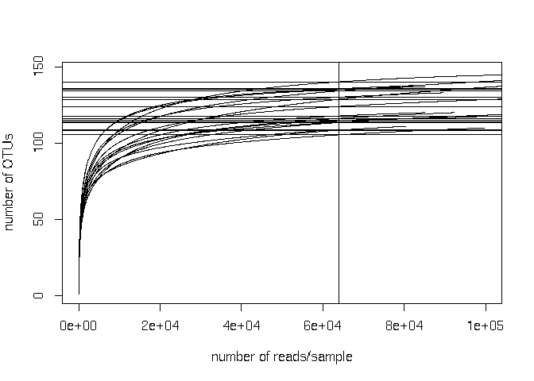

All samples have sufficient sequencing depth for inclusion in downstream
analyses. The vertical line in the above plot indicates the sample with
the lowest number of reads. Now we will scale data to account for
differences in the number of reads/sample and filter rare OTUs that are
not of biological interest for the purpose of this analysis (e.g. occurs
only in one sample). **Standardize abundances to median sequence depth**

    total = median(sample_sums(phy))
    standf = function(x, t=total) round(t * (x / sum(x)))
    M.std = transform_sample_counts(phy, standf)

**Apply mild OTU filter**

Select OTUs where the rowsum for that OTU has at least 20% of samples
with a count of 10 each OR where that OTU &gt; 0.001% of the total
median count (for cases where the minority of samples may have high
counts of a rare OTU)

    M.f = filter_taxa(M.std,function(x) sum(x > 10) > (0.02*length(x)) | sum(x) > 0.001*total, TRUE)
    ntaxa(M.f)

    ## [1] 135

**Basic exploratory plots: alpha- and beta-diversity, barplots, heatmap**
-------------------------------------------------------------------------

**Alpha diversity by dog**

    p <- plot_richness(M.std,x = "Dog",color = "Treatment",measures=c("Shannon"), 
            title = paste0("Standardized to total reads, N=",nsamples(M.std)))+theme(axis.text=element_text(size=16, face="bold"),
                    axis.title=element_text(size=16,face="bold"))+geom_point(size=5)
    p

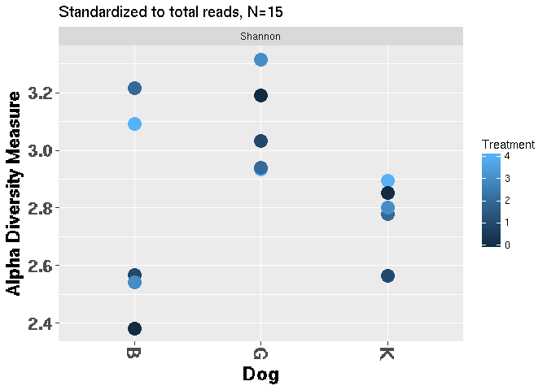

    pdf(paste0(outDir,"/alpha_diversity_by_dog_treatment.pdf"))
    p
    dev.off()

    ## PNG 
    ##   2

Is there a significant difference in alpha diversity between dogs
irrespective of treatment?

    est <- estimate_richness(M.f, split = TRUE, measures = c("Shannon"))
    temp <- cbind(est,sample_data(M.f)[,"Dog"])
    head(temp)

    # head(temp)
    #        Shannon Dog
    # Dog10 2.859687   K
    # Dog15 2.550581   B
    # Dog16 2.819618   G
    # Dog17 2.823232   K
    # Dog1  3.177816   B
    # Dog22 2.525255   B

    t <- kruskal.test(temp[,1]~temp[,2])
    t

    ## 
    ##  Kruskal-Wallis rank sum test
    ## 
    ## data:  temp[, 1] by temp[, 2]
    ## Kruskal-Wallis chi-squared = 2.54, df = 2, p-value = 0.2808

    dunn.test(temp[,1],temp[,2])#post-hoc testing to see which dogs are different

    ##   Kruskal-Wallis rank sum test
    ## 
    ## data: x and group
    ## Kruskal-Wallis chi-squared = 2.54, df = 2, p-value = 28
    ## 
    ## 
    ##                            Comparison of x by group                            
    ##                                 (No adjustment)                                
    ## Col Mean-|
    ## Row Mean |          B          G
    ## ---------+----------------------
    ##        G |  -1.343502
    ##          |     0.0896
    ##          |
    ##        K |   0.070710   1.414213
    ##          |     0.4718     0.0786
    ## 

Dog G has higher alpha diversity than dogs K and B
irrespective of treatment, but this difference is not significant

**Alpha diversity by treatment**

    p <- plot_richness(M.std,x = "Treatment",color = "Dog",measures=c("Shannon"), 
                    title = paste0("Standardized to total reads, N=",nsamples(M.std)))+theme(axis.text=element_text(size=16, face="bold"),
                    axis.title=element_text(size=16,face="bold"))+geom_point(size=5)
    p

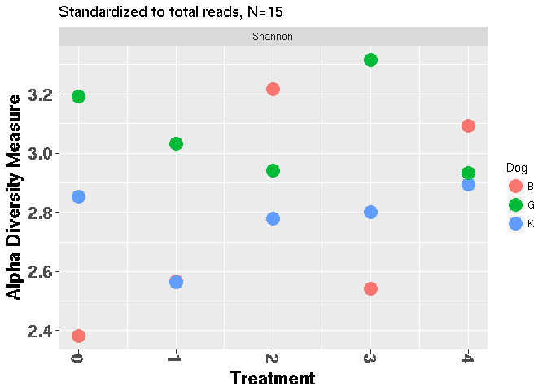

    pdf(paste0(outDir,"/alpha_diversity_by_treatment_dog.pdf"))
    p
    dev.off()

    ## PNG 
    ##   2

Are there significant differences in alpha diversity by treatment?

    temp <- cbind(est,sample_data(M.f)[,"Treatment"])
    head(temp)

    ## head(temp)
    ##        Shannon Treatment
    ## Dog10 2.859687         4
    ## Dog15 2.550581         1
    ## Dog16 2.819618         4
    ## Dog17 2.823232         0
    ## Dog1  3.177816         2
    ## Dog22 2.525255         3

    t <- kruskal.test(temp[,1]~temp[,2])
    t

    ## 
    ##  Kruskal-Wallis rank sum test
    ## 
    ## data:  temp[, 1] by temp[, 2]
    ## Kruskal-Wallis chi-squared = 1.5667, df = 4, p-value = 0.8148

    dunn.test(temp[,1],temp[,2])

    ##   Kruskal-Wallis rank sum test
    ## 
    ## data: x and group
    ## Kruskal-Wallis chi-squared = 1.5667, df = 4, p-value = 0.81
    ## 
    ## 
    ##                            Comparison of x by group                            
    ##                                 (No adjustment)                                
    ## Col Mean-|
    ## Row Mean |          4          1          0          2
    ## ---------+--------------------------------------------
    ##        1 |   0.365148
    ##          |     0.3575
    ##          |
    ##        0 |  -0.365148  -0.730296
    ##          |     0.3575     0.2326
    ##          |
    ##        2 |  -0.091287  -0.456435   0.273861
    ##          |     0.4636     0.3240     0.3921
    ##          |
    ##        3 |  -0.821583  -1.186732  -0.456435  -0.730296
    ##          |     0.2057     0.1177     0.3240     0.2326 

**Beta diversity using NMDS with Bray-Curtis as distance metric**

    set.seed(2)
    GP.ord.BC <- ordinate(M.f, "NMDS", "bray", k=2, trymax=100) # stress=0.07
    GP.ord.BC
    ## Call:
    ## metaMDS(comm = veganifyOTU(physeq), distance = distance, k = 2,      trymax = 100) 
    ##
    ## global Multidimensional Scaling using monoMDS
    ##
    ## Data:     wisconsin(sqrt(veganifyOTU(physeq))) 
    ## Distance: bray 
    ##
    ## Dimensions: 2 
    ## Stress:     0.07152504 
    ## Stress type 1, weak ties
    ## Two convergent solutions found after 20 tries
    ## Scaling: centring, PC rotation, halfchange scaling 
    ## Species: expanded scores based on 'wisconsin(sqrt(veganifyOTU(physeq)))' 
    ##
    color = c("Treatment")
    shape = c("Dog")
    title=c("NMDS of 16S microbiome,Bray-Curtis distance,k=2")
    MDS = plot_ordination(M.f, GP.ord.BC, color = color,shape=shape, 
            title = title)
    MDS.1  = MDS +theme(axis.text=element_text(size=16, face="bold"),
                    axis.title=element_text(size=18,face="bold"), legend.title=element_text(size=14))+
            theme_bw()+labs(color=color, shape=shape)+geom_point(size=5)

    MDS.1

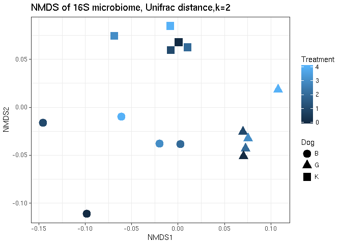

    pdf(paste0(outDir,"/NMDS_Dogs_tretment_Bray_Curtis.pdf"),8,5)
    MDS.1
    dev.off()

    ## PNG 
    ##   2

**Beta diversity using NMDS with Unifrac as distance metric**

    GP.ord.U <- ordinate(M.f, "NMDS", "unifrac")#stress=0.08
    ## GP.ord.U
    ## 
    ## Call:
    ## metaMDS(comm = ps.dist) 
    ## 
    ## global Multidimensional Scaling using monoMDS
    ## 
    ## Data:     ps.dist 
    ## Distance: user supplied 
    ## 
    ## Dimensions: 2 
    ## Stress:     0.09882136 
    ## Stress type 1, weak ties
    ## Two convergent solutions found after 20 tries
    ## Scaling: centring, PC rotation 
    ## Species: scores missing
    ## 
    
    color = c("Treatment")
    shape = c("Dog")

    title=c("NMDS of 16S microbiome, Unifrac distance,k=2")

    MDS = plot_ordination(M.f, GP.ord.U, color = color, shape=shape, 
            title = title)
    MDS.1  = MDS +theme(axis.text=element_text(size=16, face="bold"),
                    axis.title=element_text(size=18,face="bold"), legend.title=element_text(size=14))+
            theme_bw()+labs(color=color)+geom_point(size=5)
    MDS.1

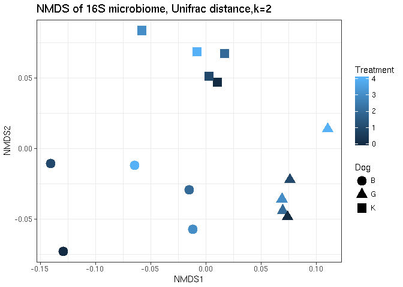

    pdf(paste0(outDir,"/NMDS_Dogs_treatment_Bray_Curtis.pdf"),8,5)
    MDS.1
    dev.off()

    ## PNG 
    ##   2

**Create a heatmap of taxa merged at the lowest available taxonomic
level**

    M.phy <- tax_glom.kv(M.f) # This function is available in the 'microbiome_custom_functions.R' script loaded at the beginning of this script
    ##[1] "Removing phylogenetic tree"
    ##[1] "There are now 58 merged taxa"
    ## Warning messages:
    ## 1: In `[<-`(`*tmp*`, i, value = <S4 object of class "phyloseq">) :
    ##  implicit list embedding of S4 objects is deprecated
    ## 2: In `[<-`(`*tmp*`, i, value = <S4 object of class "phyloseq">) :
    ##  implicit list embedding of S4 objects is deprecated
    ## 3: In `[<-`(`*tmp*`, i, value = <S4 object of class "phyloseq">) :
    ##  implicit list embedding of S4 objects is deprecated
    ## 4: In `[<-`(`*tmp*`, i, value = <S4 object of class "phyloseq">) :
    ##  implicit list embedding of S4 objects is deprecated
    ##    ntaxa(M.phy)

    filename <- c("heatmap_merged_taxa")
    main <- paste("Merged taxa, Bray-Curtis distance")
    f = paste0(outDir,"/",filename,".pdf")
    # Color specification for column annotations above heatmap:
    D.cols = c("B"="#CC79A7","G"="#56B4E9","K"="#F0E442")
    colours = list(Dog=D.cols)

    # Create distance matrix and calculate tree:
    set.seed(2)
    diss <- distance(M.phy,method = "bray", type = "samples")
    clust.res<-hclust(diss)
    sample.order = clust.res$order
    # Heatmap is output to file (the heatmap.k function can be found in the 'microbiome_custom_functions.R' script)
    hm = heatmap.k(physeq= M.phy, annot.cols = c(1,2), main = main,filename = f,colours=colours,Colv = sample.order,labrow = TRUE)  
    print(hm)

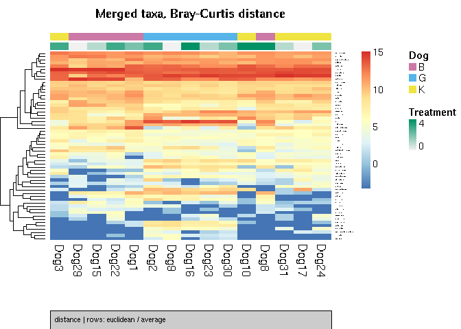

**Barplots by dog**
-------------------

    level = "Genus"
    count = 500
    perc = 0.25
    # Barplot will be written to file (the bar.plots function can be found in the 'microbiome_custom_functions.R' script)
    barplot = bar.plots(physeq = M.std,cat = "Dog",level = level, count = count, perc = perc, outDir=outDir, 
            filen = 'Barplots_by_Dog')
    print(barplot)

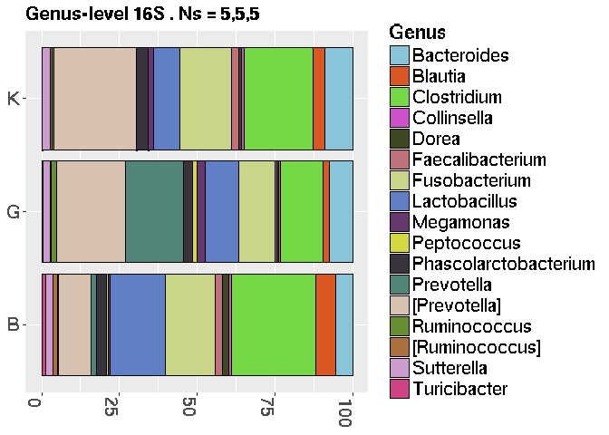

Detect taxa/OTUs that differ significantly by Dog
-------------------------------------------------

convert phyloseq object to metagenomeSeq obj. NB use raw data not
standardized:

    Mraw.f = filter_taxa(phy,function(x) sum(x > 10) > (0.02*length(x)) | sum(x) > 0.001*total, TRUE)
    ntaxa(Mraw.f)

    ## [1] 135

    MGS=make_metagenomeSeq(Mraw.f)

    ## Default value being used.

    MGS

    ##MRexperiment (storageMode: environment)
    ##assayData: 135 features, 15 samples 
    ##  element names: counts 
    ##protocolData: none
    ##phenoData
    ##  sampleNames: Dog10 Dog15 ... Dog9 (15 total)
    ##  varLabels: Dog Treatment
    ##  varMetadata: labelDescription
    ##featureData
    ##  featureNames: OTU_30 OTU_41 ... OTU_66 (135 total)
    ##  fvarLabels: OTUname
    ##  fvarMetadata: labelDescription
    ##experimentData: use 'experimentData(object)'

**Use Random forests analysis to detect taxa that are good predictors of
Dog**

Example used: Dog G vs. Dog B (all treatment points)

    sub.index <- sample_names(M.f)[sample_data(M.f)[,"Dog"] != "K"]
    phy.temp <- prune_samples(sub.index, M.f)
    nsamples(phy.temp)

    ## [1] 10

    RF.k(data = phy.temp, var = "Dog", ntree=10000, cv.fold=10, outDir = outDir, Nfeatures.validation = 3) #for details on RF.k() see microbiome_custom_functions.R file
    
    #Note that Nfeatures.validation: 'x' number of top taxa to test (e.g. how good are the top 3 most important taxa at classifying)
    
    # [1] "0 samples did not have response variable data, removing these..."
    # [1] "Data set size:  10 samples with 5 and 5 samples per class"
    # [1] "Cross-validated error rates associated with stepwise reduction of features:"
    # 135  68  34  17   8   4   2   1 
    # 0.0 0.0 0.0 0.0 0.0 0.0 0.2 0.0 
    # [1] "*****************************"
    # [1] "THE TOP 20 MOST IMPORTANT FEATURES WERE:"
    #         predictors         B         G MeanDecreaseAccuracy MeanDecreaseGini
    # OTU_121    OTU_121  9.671867  9.681629             9.993612       0.08080000
    # OTU_51      OTU_51  8.804326  8.794635             9.104466       0.08008667
    # OTU_8        OTU_8 10.147888 10.256865            10.526653       0.07962000
    # OTU_72      OTU_72  9.560636  9.639463            10.031998       0.07860000
    # OTU_104    OTU_104  9.232706  9.125792             9.443961       0.07852000
    # OTU_58      OTU_58  9.391857  9.411628             9.868075       0.07734000
    # OTU_11      OTU_11  8.359543  8.290286             8.680334       0.07688000
    # OTU_119    OTU_119  9.141466  9.134742             9.416359       0.07652000
    # OTU_115    OTU_115  8.950253  8.937649             9.235798       0.07576000
    # OTU_53      OTU_53  8.925435  8.801074             9.192012       0.07570667
    # OTU_74      OTU_74  9.342631  9.406728             9.785011       0.07478000
    # OTU_59      OTU_59  8.384654  8.370093             8.661476       0.07470000
    # OTU_73      OTU_73  8.405341  8.385556             8.701166       0.07414000
    # OTU_140    OTU_140  8.380246  8.371369             8.789388       0.07386000
    # OTU_96      OTU_96  7.817527  7.903793             8.080081       0.07374000
    # OTU_78      OTU_78  7.751269  7.708754             8.008854       0.07370000
    # OTU_150    OTU_150  8.586375  8.567680             8.865167       0.07352667
    # OTU_24      OTU_24  7.428018  7.468994             7.720773       0.07346000
    # OTU_10      OTU_10  9.535855  9.464636             9.827861       0.07342000
    # OTU_29      OTU_29  8.973883  8.878966             9.301188       0.07286000
    #                         tax
    # OTU_121             P.copri
    # OTU_51        Clostridiales
    # OTU_8             P.copri.1
    # OTU_72        Adlercreutzia
    # OTU_104         Odoribacter
    # OTU_58   Anaerobiospirillum
    # OTU_11   Enterobacteriaceae
    # OTU_119          Sutterella
    # OTU_115        Enterococcus
    # OTU_53       Clostridiaceae
    # OTU_74   [Mogibacteriaceae]
    # OTU_59       [Ruminococcus]
    # OTU_73  Erysipelotrichaceae
    # OTU_140       Fusobacterium
    # OTU_96         Oscillospira
    # OTU_78          Bacteroides
    # OTU_150     Lachnospiraceae
    # OTU_24    Lachnospiraceae.1
    # OTU_10           B.producta
    # OTU_29         Turicibacter
    # [1] "*****************************"
    # [1] "Training AUC=1"
    # [1] "Training PPV=1"
    # [1] "Training NPV=1"
    # [1] "*****************************"
    # [1] "Training set classification summary if using the top 3 features only"
    # [1] "Feature(s) selected: OTU_121" "Feature(s) selected: OTU_51" 
    # [3] "Feature(s) selected: OTU_8"  
    #                 B         G MeanDecreaseAccuracy MeanDecreaseGini
    # OTU_8   0.1447083 0.1438417            0.1290467          1.52652
    # OTU_121 0.1430083 0.1389750            0.1261224          1.50398
    # OTU_51  0.1139500 0.1111500            0.1011867          1.47938
    # 
    # Call:
    #  randomForest(formula = response ~ ., data = rf.data[, c(goodPredictors,      "response")], importance = T, proximity = T, ntree = ntree,      na.action = na.omit) 
    #                Type of random forest: classification
    #                      Number of trees: 10000
    # No. of variables tried at each split: 1
    # 
    #         OOB estimate of  error rate: 0%
    # Confusion matrix:
    #   B G class.error
    # B 5 0           0
    # G 0 5           0
    # > cat("Synch1501582059855921000\n");

The class error rates are 0% (even one/two OTUs enough to discriminate
between Dog G and B?)

What if we used merged OTUs?

    merged.phy <- tax_glom.kv(phy.temp)

    ## [1] "Removing phylogenetic tree"
    ## [1] "There are now 58 merged taxa"

    RF.k(data = merged.phy, var = "Dog", ntree=10000, cv.fold=10, outDir = outDir, Nfeatures.validation = 3, descriptor = "merged_OTUs")
    #[1] "0 samples did not have response variable data, removing these..."
    #[1] "Data set size:  10 samples with 5 and 5 samples per class"
    #[1] "Cross-validated error rates associated with stepwise reduction of features:"
    #58  29  14   7   4   1 
    #0.0 0.0 0.0 0.0 0.0 0.1 
    #[1] "*****************************"
    #[1] "THE TOP 20 MOST IMPORTANT FEATURES WERE:"
    #predictors        B        G MeanDecreaseAccuracy MeanDecreaseGini
    #OTU_59      OTU_59 12.84573 12.75514             13.22767        0.1701578
    #OTU_27      OTU_27 14.14560 14.15688             14.66689        0.1664900
    #OTU_104    OTU_104 13.79309 13.76287             14.34825        0.1652714
    #OTU_68      OTU_68 12.54870 12.48715             13.03041        0.1639057
    #OTU_72      OTU_72 13.67522 13.74857             14.21517        0.1631848
    #OTU_76      OTU_76 13.48093 13.57423             14.07012        0.1623467
    #OTU_29      OTU_29 13.77678 13.69971             14.25054        0.1618883
    #OTU_115    OTU_115 13.78611 13.66527             14.26590        0.1615750
    #OTU_98      OTU_98 13.23068 13.23404             13.60197        0.1611457
    #OTU_57      OTU_57 12.79080 12.78306             13.28220        0.1607600
    #OTU_26      OTU_26 12.70062 12.54606             13.09699        0.1593200
    #OTU_8        OTU_8 13.81179 13.67807             14.29226        0.1565095
    #OTU_11      OTU_11 12.19598 12.23061             12.70349        0.1563300
    #OTU_55      OTU_55 13.95863 13.71404             14.38892        0.1548617
    #OTU_12      OTU_12 11.50679 11.36390             11.94686        0.1536400
    #OTU_35      OTU_35 12.44178 12.45397             13.04827        0.1484333
    #OTU_74      OTU_74 13.36003 13.41300             13.80032        0.1483867
    #OTU_19      OTU_19 13.36975 13.20095             13.78641        0.1470000
    #OTU_10      OTU_10 12.36814 12.38032             12.83683        0.1421733
    #OTU_61      OTU_61 12.03922 12.09042             12.51234        0.1395000
    #tax
    #OTU_59         [Ruminococcus]
    #OTU_27           Ruminococcus
    #OTU_104           Odoribacter
    #OTU_68     Anaerobiospirillum
    #OTU_72          Adlercreutzia
    #OTU_76           Oscillospira
    #OTU_29           Turicibacter
    #OTU_115          Enterococcus
    #OTU_98                  Dorea
    #OTU_57    Succinivibrionaceae
    #OTU_26                  S24-7
    #OTU_8                 P.copri
    #OTU_11     Enterobacteriaceae
    #OTU_55          Bacteroidales
    #OTU_12          F.prausnitzii
    #OTU_35            Allobaculum
    #OTU_74     [Mogibacteriaceae]
    #OTU_19               R.gnavus
    #OTU_10             B.producta
    #OTU_61  Peptostreptococcaceae
    #[1] "*****************************"
    #[1] "Training AUC=1"
    #[1] "Training PPV=1"
    #[1] "Training NPV=1"
    #[1] "*****************************"
    #[1] "Training set classification summary if using the top 3 features only"
    #[1] "Feature(s) selected: OTU_59"  "Feature(s) selected: OTU_27" 
    #[3] "Feature(s) selected: OTU_104"
    #B         G MeanDecreaseAccuracy MeanDecreaseGini
    #OTU_104 0.1392500 0.1415667            0.1262033          1.52932
    #OTU_27  0.1363083 0.1369833            0.1223476          1.49262
    #OTU_59  0.1169167 0.1174750            0.1051862          1.48760
    #
    #Call:
    #		randomForest(formula = response ~ ., data = rf.data[, c(goodPredictors,      "response")], importance = T, proximity = T, ntree = ntree,      na.action = na.omit) 
    #Type of random forest: classification
    #Number of trees: 10000
    #No. of variables tried at each split: 1
    #
    #OOB estimate of  error rate: 0%
    #		Confusion matrix:
    #		B G class.error
    #       B 5 0           0
    #       G 0 5           0
    
**Differential abundance testing using MetagenomeSeq package**

Lets again compare dog G vs. dog B (merged taxa), this time using differential abundance testing

    colours = list(Dog=D.cols)
    a = super.fitZig.kv(physeq = merged.phy,factor = "Dog",outDir = outDir,FileName =c("1_25FC_0.2_Dog_GvsB_taxa_merged"),
    heatmap.descriptor=c("tax_annot"), main=c("Dog G vs. B, taxa merged"), subt=c("subt = FDR < ###0.05,|coeff| >= 1.25, >20%+ in either group"), ordered=TRUE, p=0.05, FC = 1.25, perc=0.2, extra.cols = c("Treatment"))

    ## [1] "0 of 10 samples were removed due to missing data"

    ## Default value being used.

    ## [1] "Dog will be modeled as a binary categorical predictor variable"

    ## Default value being used.

    ## it= 0, nll=18.47, log10(eps+1)=Inf, stillActive=58
    ## it= 1, nll=19.48, log10(eps+1)=0.01, stillActive=4
    ## it= 2, nll=19.52, log10(eps+1)=0.03, stillActive=1
    ## it= 3, nll=19.56, log10(eps+1)=0.00, stillActive=1
    ## it= 4, nll=19.64, log10(eps+1)=0.00, stillActive=0
    ## There were  25 OTUs significantly different between B vs. G that met 
    ##  threshold criteria of p 0.05 absolute FC 1.25 and percentage presence in at least one group of 20 % 
    ## [1] "writing results and model to file"
    ## [1] "/home/gerrit/scratch/amw/downstream/1_25FC_0.2_Dog_GvsB_taxa_merged_tax_annot.pdf"

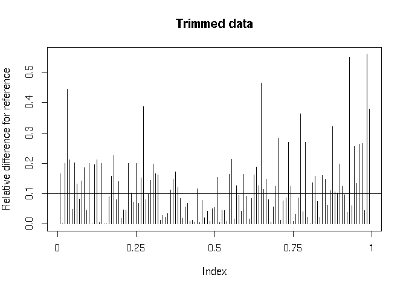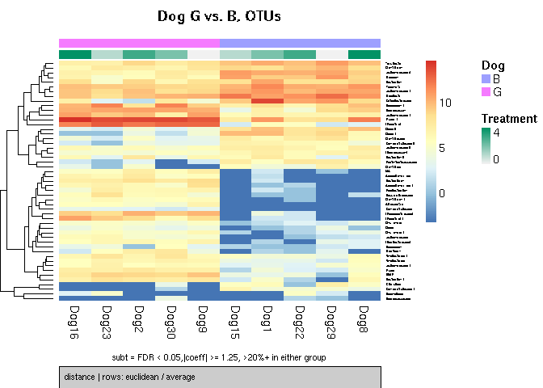

    ## [1] "making heatmap of results"

    print(a)

    #         percent_positive_group0 percent_positive_group1 +samples in group 0
    # OTU_11                      100                     100                   5
    # OTU_111                      80                      20                   4
    # OTU_19                      100                     100                   5
    # OTU_77                      100                      80                   5
    # OTU_29                      100                     100                   5
    # OTU_115                     100                      40                   5
    # OTU_61                      100                     100                   5
    # OTU_98                      100                     100                   5
    # OTU_10                      100                     100                   5
    # OTU_59                      100                     100                   5
    # OTU_12                      100                     100                   5
    # OTU_73                      100                     100                   5
    # OTU_44                       80                     100                   4
    # OTU_76                      100                     100                   5
    # OTU_27                      100                     100                   5
    # OTU_74                       60                     100                   3
    # OTU_69                       60                     100                   3
    # OTU_39                      100                     100                   5
    # OTU_8                       100                     100                   5
    # OTU_26                      100                     100                   5
    # OTU_57                       60                     100                   3
    # OTU_72                        0                     100                   0
    # OTU_68                       40                     100                   2
    # OTU_55                       20                     100                   1
    # OTU_36                       40                     100                   2
    #         +samples in group 1 mean_positive_group0 mean_positive_group1 oddsRatio
    # OTU_11                    5                 3645                   70    0.0000
    # OTU_111                   1                   32                    1   10.9072
    # OTU_19                    5                 1142                   85    0.0000
    # OTU_77                    4                   66                    6       Inf
    # OTU_29                    5                 1147                  241    0.0000
    # OTU_115                   2                   10                    1       Inf
    # OTU_61                    5                  160                   27    0.0000
    # OTU_98                    5                 1570                  409    0.0000
    # OTU_10                    5                 4032                 1277    0.0000
    # OTU_59                    5                  105                   32    0.0000
    # OTU_12                    5                 1821                  588    0.0000
    # OTU_73                    5                  119                   38    0.0000
    # OTU_44                    5                   37                  201    0.0000
    # OTU_76                    5                   16                  121    0.0000
    # OTU_27                    5                  242                 1453    0.0000
    # OTU_74                    5                    7                   73    0.0000
    # OTU_69                    5                    4                   88    0.0000
    # OTU_39                    5                   85                  598    0.0000
    # OTU_8                     5                 1524                15540    0.0000
    # OTU_26                    5                   20                  456    0.0000
    # OTU_57                    5                    2                  104    0.0000
    # OTU_72                    5                  NaN                   52    0.0000
    # OTU_68                    5                    3                  231    0.0000
    # OTU_55                    5                    4                  264    0.0000
    # OTU_36                    5                   10                  782    0.0000
    #              lower       upper     fisherP fisherAdjP     coeff      pvalues
    # OTU_11  0.00000000         Inf 1.000000000  1.0000000 -5.584733 2.632486e-03
    # OTU_111 0.45473998 968.7617574 0.206349206  1.0000000 -3.821533 1.375479e-03
    # OTU_19  0.00000000         Inf 1.000000000  1.0000000 -3.737026 2.629153e-04
    # OTU_77  0.02564066         Inf 1.000000000  1.0000000 -3.579532 4.548917e-03
    # OTU_29  0.00000000         Inf 1.000000000  1.0000000 -2.453196 6.035145e-04
    # OTU_115 0.49337123         Inf 0.166666667  1.0000000 -2.379397 5.497207e-03
    # OTU_61  0.00000000         Inf 1.000000000  1.0000000 -2.225829 6.076356e-04
    # OTU_98  0.00000000         Inf 1.000000000  1.0000000 -2.090437 1.479472e-04
    # OTU_10  0.00000000         Inf 1.000000000  1.0000000 -1.715693 1.274277e-03
    # OTU_59  0.00000000         Inf 1.000000000  1.0000000 -1.692829 9.068161e-04
    # OTU_12  0.00000000         Inf 1.000000000  1.0000000 -1.610710 3.120434e-03
    # OTU_73  0.00000000         Inf 1.000000000  1.0000000 -1.608000 9.476365e-03
    # OTU_44  0.00000000  39.0005500 1.000000000  1.0000000  1.851675 1.996187e-02
    # OTU_76  0.00000000         Inf 1.000000000  1.0000000  3.097858 5.065905e-04
    # OTU_27  0.00000000         Inf 1.000000000  1.0000000  3.166680 3.369510e-03
    # OTU_74  0.00000000   5.1183766 0.444444444  1.0000000  3.576528 2.139827e-04
    # OTU_69  0.00000000   5.1183766 0.444444444  1.0000000  3.815334 1.891429e-02
    # OTU_39  0.00000000         Inf 1.000000000  1.0000000  3.980148 6.443652e-03
    # OTU_8   0.00000000         Inf 1.000000000  1.0000000  4.115082 1.219577e-03
    # OTU_26  0.00000000         Inf 1.000000000  1.0000000  4.973902 2.611733e-04
    # OTU_57  0.00000000   5.1183766 0.444444444  1.0000000  5.136267 1.493929e-04
    # OTU_72  0.00000000   0.4353226 0.007936508  0.4603175  5.546255 2.124125e-04
    # OTU_68  0.00000000   2.0268713 0.166666667  1.0000000  6.085491 1.169281e-04
    # OTU_55  0.00000000   0.9757790 0.047619048  0.5523810  6.572744 9.392677e-05
    # OTU_36  0.00000000   2.0268713 0.166666667  1.0000000  6.638985 1.950259e-04
    #          adjPvalues  Kingdom         Phylum               Class
    # OTU_11  0.008981422 Bacteria Proteobacteria Gammaproteobacteria
    # OTU_111 0.004986112 Bacteria     Firmicutes          Clostridia
    # OTU_19  0.001694343 Bacteria     Firmicutes          Clostridia
    # OTU_77  0.013191859 Bacteria     Firmicutes     Erysipelotrichi
    # OTU_29  0.002936905 Bacteria     Firmicutes             Bacilli
    # OTU_115 0.015182763 Bacteria     Firmicutes             Bacilli
    # OTU_61  0.002936905 Bacteria     Firmicutes          Clostridia
    # OTU_98  0.001694343 Bacteria     Firmicutes          Clostridia
    # OTU_10  0.004927205 Bacteria     Firmicutes          Clostridia
    # OTU_59  0.004045795 Bacteria     Firmicutes          Clostridia
    # OTU_12  0.010054733 Bacteria     Firmicutes          Clostridia
    # OTU_73  0.023896920 Bacteria     Firmicutes     Erysipelotrichi
    # OTU_44  0.044530317 Bacteria  Bacteroidetes         Bacteroidia
    # OTU_76  0.002936905 Bacteria     Firmicutes          Clostridia
    # OTU_27  0.010285872 Bacteria     Firmicutes          Clostridia
    # OTU_74  0.001694343 Bacteria     Firmicutes          Clostridia
    # OTU_69  0.043881157 Bacteria  Bacteroidetes         Bacteroidia
    # OTU_39  0.016987809 Bacteria  Bacteroidetes         Bacteroidia
    # OTU_8   0.004927205 Bacteria  Bacteroidetes         Bacteroidia
    # OTU_26  0.001694343 Bacteria  Bacteroidetes         Bacteroidia
    # OTU_57  0.001694343 Bacteria Proteobacteria Gammaproteobacteria
    # OTU_72  0.001694343 Bacteria Actinobacteria      Coriobacteriia
    # OTU_68  0.001694343 Bacteria Proteobacteria Gammaproteobacteria
    # OTU_55  0.001694343 Bacteria  Bacteroidetes         Bacteroidia
    # OTU_36  0.001694343 Bacteria  Bacteroidetes         Bacteroidia
    #                      Order                Family              Genus     Species
    # OTU_11   Enterobacteriales    Enterobacteriaceae               <NA>        <NA>
    # OTU_111      Clostridiales       Lachnospiraceae       Epulopiscium        <NA>
    # OTU_19       Clostridiales       Lachnospiraceae     [Ruminococcus]      gnavus
    # OTU_77  Erysipelotrichales   Erysipelotrichaceae      [Eubacterium]    dolichum
    # OTU_29    Turicibacterales     Turicibacteraceae       Turicibacter        <NA>
    # OTU_115    Lactobacillales       Enterococcaceae       Enterococcus        <NA>
    # OTU_61       Clostridiales Peptostreptococcaceae               <NA>        <NA>
    # OTU_98       Clostridiales       Lachnospiraceae              Dorea        <NA>
    # OTU_10       Clostridiales       Lachnospiraceae            Blautia    producta
    # OTU_59       Clostridiales       Lachnospiraceae     [Ruminococcus]        <NA>
    # OTU_12       Clostridiales       Ruminococcaceae   Faecalibacterium prausnitzii
    # OTU_73  Erysipelotrichales   Erysipelotrichaceae               <NA>        <NA>
    # OTU_44       Bacteroidales        Bacteroidaceae        Bacteroides coprophilus
    # OTU_76       Clostridiales       Ruminococcaceae       Oscillospira        <NA>
    # OTU_27       Clostridiales       Ruminococcaceae       Ruminococcus        <NA>
    # OTU_74       Clostridiales    [Mogibacteriaceae]               <NA>        <NA>
    # OTU_69       Bacteroidales        Bacteroidaceae        Bacteroides   uniformis
    # OTU_39       Bacteroidales    Porphyromonadaceae    Parabacteroides        <NA>
    # OTU_8        Bacteroidales        Prevotellaceae         Prevotella       copri
    # OTU_26       Bacteroidales                 S24-7               <NA>        <NA>
    # OTU_57       Aeromonadales   Succinivibrionaceae               <NA>        <NA>
    # OTU_72    Coriobacteriales     Coriobacteriaceae      Adlercreutzia        <NA>
    # OTU_68       Aeromonadales   Succinivibrionaceae Anaerobiospirillum        <NA>
    # OTU_55       Bacteroidales                  <NA>               <NA>        <NA>
    # OTU_36       Bacteroidales  [Paraprevotellaceae]               <NA>        <NA>
    
Now again compare dog G vs. dog B with differential abundance testing (individual OTUs as opposed to merged this time)

    b = super.fitZig.kv(physeq = phy.temp,factor = "Dog",outDir = outDir,FileName =c("1_25FC_0.2_Dog_GvsB_OTUs"),
            heatmap.descriptor=c("tax_annot"), main=c("Dog G vs. B, OTUs"), subt=c("subt = FDR < 0.05,|coeff| >= 1.25, >20%+ in either group"), 
            ordered=TRUE, p=0.05, FC = 1.25, perc=0.2, extra.cols = c("Treatment"))

    ## [1] "0 of 10 samples were removed due to missing data"

    ## Default value being used.

    ## [1] "Dog will be modeled as a binary categorical predictor variable"

    ## Default value being used.

    ## There were  50 OTUs significantly different between B vs. G that met 
    ##  threshold criteria of p 0.05 absolute FC 1.25 and percentage presence in at least one group of 20 % 
    ## [1] "writing results and model to file"

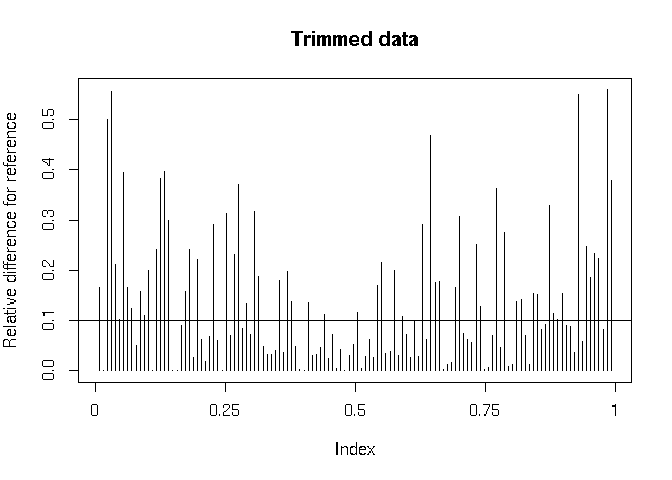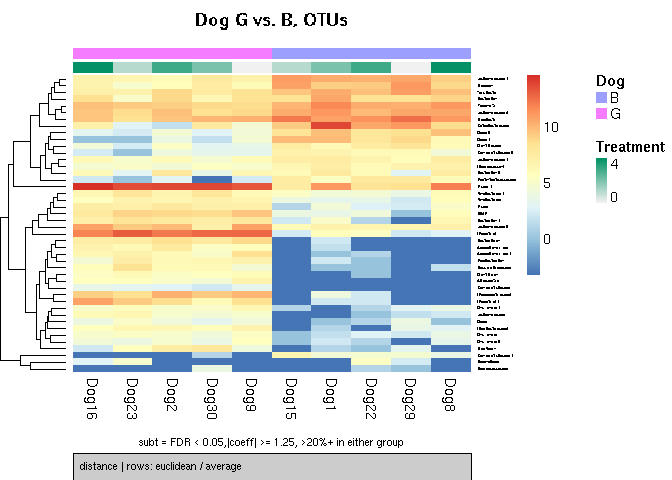

    ## [1] "making heatmap of results"

    b

    #         percent_positive_group0 percent_positive_group1 +samples in group 0
    # OTU_40                      100                     100                   5
    # OTU_43                      100                     100                   5
    # OTU_11                      100                     100                   5
    # OTU_61                      100                      80                   5
    # OTU_87                      100                      20                   5
    # OTU_111                      80                       0                   4
    # OTU_19                      100                     100                   5
    # OTU_77                      100                      80                   5
    # OTU_73                      100                     100                   5
    # OTU_53                      100                     100                   5
    # OTU_18                      100                     100                   5
    # OTU_21                      100                     100                   5
    # OTU_29                      100                     100                   5
    # OTU_33                      100                     100                   5
    # OTU_49                      100                     100                   5
    # OTU_10                      100                     100                   5
    # OTU_46                      100                     100                   5
    # OTU_12                      100                     100                   5
    # OTU_51                      100                     100                   5
    # OTU_59                      100                     100                   5
    # OTU_96                       80                     100                   4
    # OTU_103                      60                     100                   3
    # OTU_150                     100                     100                   5
    # OTU_101                     100                     100                   5
    # OTU_24                      100                     100                   5
    # OTU_140                     100                     100                   5
    # OTU_97                      100                     100                   5
    # OTU_76                       80                     100                   4
    # OTU_54                       80                     100                   4
    # OTU_179                      80                     100                   4
    # OTU_100                       0                     100                   0
    # OTU_144                      40                      20                   2
    # OTU_121                     100                     100                   5
    # OTU_27                      100                     100                   5
    # OTU_8                       100                     100                   5
    # OTU_74                       60                     100                   3
    # OTU_82                       60                     100                   3
    # OTU_99                       40                      40                   2
    # OTU_26                      100                     100                   5
    # OTU_58                       20                     100                   1
    # OTU_69                       60                     100                   3
    # OTU_52                       40                     100                   2
    # OTU_68                       40                     100                   2
    # OTU_72                        0                     100                   0
    # OTU_57                       60                     100                   3
    # OTU_81                       20                     100                   1
    # OTU_36                       40                     100                   2
    # OTU_55                       20                     100                   1
    # OTU_107                     100                     100                   5
    # OTU_42                       40                     100                   2
    #         +samples in group 1 mean_positive_group0 mean_positive_group1 oddsRatio
    # OTU_40                    5                  531                    9  0.000000
    # OTU_43                    5                  520                   13  0.000000
    # OTU_11                    5                 3645                   70  0.000000
    # OTU_61                    4                  136                    4       Inf
    # OTU_87                    1                   36                    2       Inf
    # OTU_111                   0                   27                  NaN       Inf
    # OTU_19                    5                 1142                   85  0.000000
    # OTU_77                    4                   66                    6       Inf
    # OTU_73                    5                   74                    8  0.000000
    # OTU_53                    5                  152                   17  0.000000
    # OTU_18                    5                 1320                  115  0.000000
    # OTU_21                    5                  582                  245  0.000000
    # OTU_29                    5                 1147                  241  0.000000
    # OTU_33                    5                  103                   77  0.000000
    # OTU_49                    5                  130                   50  0.000000
    # OTU_10                    5                 3376                  804  0.000000
    # OTU_46                    5                 1520                  554  0.000000
    # OTU_12                    5                 1821                  588  0.000000
    # OTU_51                    5                  583                  149  0.000000
    # OTU_59                    5                  105                   32  0.000000
    # OTU_96                    5                    4                   26  0.000000
    # OTU_103                   5                    3                   16  0.000000
    # OTU_150                   5                   19                   70  0.000000
    # OTU_101                   5                   19                   86  0.000000
    # OTU_24                    5                   99                 1032  0.000000
    # OTU_140                   5                   32                  147  0.000000
    # OTU_97                    5                    6                   32  0.000000
    # OTU_76                    5                    6                   48  0.000000
    # OTU_54                    5                   32                  194  0.000000
    # OTU_179                   5                    5                   20  0.000000
    # OTU_100                   5                  NaN                    8  0.000000
    # OTU_144                   1                    2                   14  2.414224
    # OTU_121                   5                   14                  151  0.000000
    # OTU_27                    5                  234                 1452  0.000000
    # OTU_8                     5                 1510                15389  0.000000
    # OTU_74                    5                    7                   73  0.000000
    # OTU_82                    5                    3                   45  0.000000
    # OTU_99                    2                   22                   19  1.000000
    # OTU_26                    5                   20                  456  0.000000
    # OTU_58                    5                    3                   93  0.000000
    # OTU_69                    5                    4                   88  0.000000
    # OTU_52                    5                    2                   88  0.000000
    # OTU_68                    5                    2                  138  0.000000
    # OTU_72                    5                  NaN                   52  0.000000
    # OTU_57                    5                    2                  104  0.000000
    # OTU_81                    5                    1                   52  0.000000
    # OTU_36                    5                   10                  782  0.000000
    # OTU_55                    5                    4                  264  0.000000
    # OTU_107                   5                    4                  390  0.000000
    # OTU_42                    5                    4                  617  0.000000
    #              lower       upper     fisherP fisherAdjP     coeff      pvalues
    # OTU_40  0.00000000         Inf 1.000000000  1.0000000 -6.373510 1.161859e-04
    # OTU_43  0.00000000         Inf 1.000000000  1.0000000 -6.116606 3.553180e-08
    # OTU_11  0.00000000         Inf 1.000000000  1.0000000 -4.933445 4.446080e-03
    # OTU_61  0.02564066         Inf 1.000000000  1.0000000 -4.218071 3.696573e-04
    # OTU_87  1.02482226         Inf 0.047619048  0.4945055 -3.748359 5.548120e-04
    # OTU_111 1.02482226         Inf 0.047619048  0.4945055 -3.174336 8.409156e-03
    # OTU_19  0.00000000         Inf 1.000000000  1.0000000 -3.172581 6.922310e-04
    # OTU_77  0.02564066         Inf 1.000000000  1.0000000 -3.142696 1.098060e-02
    # OTU_73  0.00000000         Inf 1.000000000  1.0000000 -3.135823 2.036489e-03
    # OTU_53  0.00000000         Inf 1.000000000  1.0000000 -3.119165 1.374650e-03
    # OTU_18  0.00000000         Inf 1.000000000  1.0000000 -3.088471 4.194520e-05
    # OTU_21  0.00000000         Inf 1.000000000  1.0000000 -2.532059 5.009580e-03
    # OTU_29  0.00000000         Inf 1.000000000  1.0000000 -2.525171 1.153153e-03
    # OTU_33  0.00000000         Inf 1.000000000  1.0000000 -2.470870 8.434795e-03
    # OTU_49  0.00000000         Inf 1.000000000  1.0000000 -1.971867 6.883067e-04
    # OTU_10  0.00000000         Inf 1.000000000  1.0000000 -1.969584 7.249005e-03
    # OTU_46  0.00000000         Inf 1.000000000  1.0000000 -1.849698 1.797311e-03
    # OTU_12  0.00000000         Inf 1.000000000  1.0000000 -1.765926 4.479910e-03
    # OTU_51  0.00000000         Inf 1.000000000  1.0000000 -1.737633 1.286803e-02
    # OTU_59  0.00000000         Inf 1.000000000  1.0000000 -1.694662 3.579636e-03
    # OTU_96  0.00000000  39.0005500 1.000000000  1.0000000  1.782623 3.303245e-03
    # OTU_103 0.00000000   5.1183766 0.444444444  1.0000000  1.875474 1.630828e-02
    # OTU_150 0.00000000         Inf 1.000000000  1.0000000  1.928554 1.360546e-02
    # OTU_101 0.00000000         Inf 1.000000000  1.0000000  2.051487 9.561004e-03
    # OTU_24  0.00000000         Inf 1.000000000  1.0000000  2.141545 5.876923e-03
    # OTU_140 0.00000000         Inf 1.000000000  1.0000000  2.222339 6.006384e-03
    # OTU_97  0.00000000         Inf 1.000000000  1.0000000  2.235028 3.419388e-03
    # OTU_76  0.00000000  39.0005500 1.000000000  1.0000000  2.551360 2.190170e-03
    # OTU_54  0.00000000  39.0005500 1.000000000  1.0000000  2.784766 7.190695e-03
    # OTU_179 0.00000000  39.0005500 1.000000000  1.0000000  2.856890 2.538883e-03
    # OTU_100 0.00000000   0.4353226 0.007936508  0.2678571  2.883321 4.244577e-03
    # OTU_144 0.08474680 195.6529809 1.000000000  1.0000000  3.083691 1.634276e-02
    # OTU_121 0.00000000         Inf 1.000000000  1.0000000  3.152170 5.164026e-04
    # OTU_27  0.00000000         Inf 1.000000000  1.0000000  3.296192 1.351744e-02
    # OTU_8   0.00000000         Inf 1.000000000  1.0000000  3.446926 2.604093e-03
    # OTU_74  0.00000000   5.1183766 0.444444444  1.0000000  3.520824 2.496783e-04
    # OTU_82  0.00000000   5.1183766 0.444444444  1.0000000  3.572533 3.223800e-04
    # OTU_99  0.04224561  23.6710987 1.000000000  1.0000000  3.927970 1.120486e-02
    # OTU_26  0.00000000         Inf 1.000000000  1.0000000  4.105738 3.395129e-04
    # OTU_58  0.00000000   0.9757790 0.047619048  0.4945055  4.674182 2.405784e-04
    # OTU_69  0.00000000   5.1183766 0.444444444  1.0000000  4.879486 3.974350e-03
    # OTU_52  0.00000000   2.0268713 0.166666667  1.0000000  4.955954 2.132559e-04
    # OTU_68  0.00000000   2.0268713 0.166666667  1.0000000  4.970360 2.419041e-04
    # OTU_72  0.00000000   0.4353226 0.007936508  0.2678571  5.046503 2.701118e-04
    # OTU_57  0.00000000   5.1183766 0.444444444  1.0000000  5.220055 4.959533e-05
    # OTU_81  0.00000000   0.9757790 0.047619048  0.4945055  5.423223 3.629421e-05
    # OTU_36  0.00000000   2.0268713 0.166666667  1.0000000  5.803801 6.882302e-05
    # OTU_55  0.00000000   0.9757790 0.047619048  0.4945055  5.880385 3.425031e-05
    # OTU_107 0.00000000         Inf 1.000000000  1.0000000  6.222838 9.419693e-07
    # OTU_42  0.00000000   2.0268713 0.166666667  1.0000000  6.234114 3.490600e-04
    #           adjPvalues  Kingdom         Phylum               Class
    # OTU_40  1.946113e-03 Bacteria     Firmicutes          Clostridia
    # OTU_43  4.761262e-06 Bacteria     Firmicutes          Clostridia
    # OTU_11  1.715166e-02 Bacteria Proteobacteria Gammaproteobacteria
    # OTU_61  2.913770e-03 Bacteria     Firmicutes          Clostridia
    # OTU_87  3.912885e-03 Bacteria     Firmicutes     Erysipelotrichi
    # OTU_111 2.691101e-02 Bacteria     Firmicutes          Clostridia
    # OTU_19  4.417093e-03 Bacteria     Firmicutes          Clostridia
    # OTU_77  3.336559e-02 Bacteria     Firmicutes     Erysipelotrichi
    # OTU_73  1.091558e-02 Bacteria     Firmicutes     Erysipelotrichi
    # OTU_53  8.008833e-03 Bacteria     Firmicutes          Clostridia
    # OTU_18  1.107629e-03 Bacteria     Firmicutes          Clostridia
    # OTU_21  1.864677e-02 Bacteria  Bacteroidetes         Bacteroidia
    # OTU_29  7.023750e-03 Bacteria     Firmicutes             Bacilli
    # OTU_33  2.691101e-02 Bacteria  Bacteroidetes         Bacteroidia
    # OTU_49  4.417093e-03 Bacteria     Firmicutes          Clostridia
    # OTU_10  2.428417e-02 Bacteria     Firmicutes          Clostridia
    # OTU_46  1.003499e-02 Bacteria     Firmicutes          Clostridia
    # OTU_12  1.715166e-02 Bacteria     Firmicutes          Clostridia
    # OTU_51  3.748513e-02 Bacteria     Firmicutes          Clostridia
    # OTU_59  1.547327e-02 Bacteria     Firmicutes          Clostridia
    # OTU_96  1.526327e-02 Bacteria     Firmicutes          Clostridia
    # OTU_103 4.379859e-02 Bacteria     Firmicutes          Clostridia
    # OTU_150 3.798190e-02 Bacteria     Firmicutes          Clostridia
    # OTU_101 2.979476e-02 Bacteria   Fusobacteria       Fusobacteriia
    # OTU_24  2.118041e-02 Bacteria     Firmicutes          Clostridia
    # OTU_140 2.118041e-02 Bacteria   Fusobacteria       Fusobacteriia
    # OTU_97  1.527327e-02 Bacteria     Firmicutes          Clostridia
    # OTU_76  1.128780e-02 Bacteria     Firmicutes          Clostridia
    # OTU_54  2.428417e-02 Bacteria  Bacteroidetes         Bacteroidia
    # OTU_179 1.246244e-02 Bacteria     Firmicutes          Clostridia
    # OTU_100 1.715166e-02 Bacteria     Firmicutes     Erysipelotrichi
    # OTU_144 4.379859e-02 Bacteria     Firmicutes          Clostridia
    # OTU_121 3.844331e-03 Bacteria  Bacteroidetes         Bacteroidia
    # OTU_27  3.798190e-02 Bacteria     Firmicutes          Clostridia
    # OTU_8   1.246244e-02 Bacteria  Bacteroidetes         Bacteroidia
    # OTU_74  2.784229e-03 Bacteria     Firmicutes          Clostridia
    # OTU_82  2.913770e-03 Bacteria     Firmicutes          Clostridia
    # OTU_99  3.336559e-02 Bacteria     Firmicutes          Clostridia
    # OTU_26  2.913770e-03 Bacteria  Bacteroidetes         Bacteroidia
    # OTU_58  2.784229e-03 Bacteria Proteobacteria Gammaproteobacteria
    # OTU_69  1.664259e-02 Bacteria  Bacteroidetes         Bacteroidia
    # OTU_52  2.784229e-03 Bacteria  Bacteroidetes         Bacteroidia
    # OTU_68  2.784229e-03 Bacteria Proteobacteria Gammaproteobacteria
    # OTU_72  2.784229e-03 Bacteria Actinobacteria      Coriobacteriia
    # OTU_57  1.107629e-03 Bacteria Proteobacteria Gammaproteobacteria
    # OTU_81  1.107629e-03 Bacteria     Firmicutes          Clostridia
    # OTU_36  1.317469e-03 Bacteria  Bacteroidetes         Bacteroidia
    # OTU_55  1.107629e-03 Bacteria  Bacteroidetes         Bacteroidia
    # OTU_107 6.311194e-05 Bacteria  Bacteroidetes         Bacteroidia
    # OTU_42  2.913770e-03 Bacteria  Bacteroidetes         Bacteroidia
    #                      Order                Family              Genus     Species
    # OTU_40       Clostridiales       Lachnospiraceae              Dorea            
    # OTU_43       Clostridiales       Lachnospiraceae              Dorea            
    # OTU_11   Enterobacteriales    Enterobacteriaceae                               
    # OTU_61       Clostridiales Peptostreptococcaceae                               
    # OTU_87  Erysipelotrichales   Erysipelotrichaceae                               
    # OTU_111      Clostridiales       Lachnospiraceae       Epulopiscium            
    # OTU_19       Clostridiales       Lachnospiraceae     [Ruminococcus]      gnavus
    # OTU_77  Erysipelotrichales   Erysipelotrichaceae      [Eubacterium]    dolichum
    # OTU_73  Erysipelotrichales   Erysipelotrichaceae                               
    # OTU_53       Clostridiales        Clostridiaceae                               
    # OTU_18       Clostridiales       Lachnospiraceae                               
    # OTU_21       Bacteroidales        Bacteroidaceae        Bacteroides            
    # OTU_29    Turicibacterales     Turicibacteraceae       Turicibacter            
    # OTU_33       Bacteroidales        Bacteroidaceae        Bacteroides            
    # OTU_49       Clostridiales       Lachnospiraceae                               
    # OTU_10       Clostridiales       Lachnospiraceae            Blautia    producta
    # OTU_46       Clostridiales       Lachnospiraceae               <NA>        <NA>
    # OTU_12       Clostridiales       Ruminococcaceae   Faecalibacterium prausnitzii
    # OTU_51       Clostridiales                                                     
    # OTU_59       Clostridiales       Lachnospiraceae     [Ruminococcus]            
    # OTU_96       Clostridiales       Ruminococcaceae       Oscillospira            
    # OTU_103      Clostridiales       Ruminococcaceae       Oscillospira            
    # OTU_150      Clostridiales       Lachnospiraceae                               
    # OTU_101    Fusobacteriales      Fusobacteriaceae      Fusobacterium            
    # OTU_24       Clostridiales       Lachnospiraceae                               
    # OTU_140    Fusobacteriales      Fusobacteriaceae      Fusobacterium            
    # OTU_97       Clostridiales       Ruminococcaceae       Oscillospira            
    # OTU_76       Clostridiales       Ruminococcaceae       Oscillospira            
    # OTU_54       Bacteroidales        Bacteroidaceae        Bacteroides            
    # OTU_179      Clostridiales       Lachnospiraceae              Dorea            
    # OTU_100 Erysipelotrichales   Erysipelotrichaceae                               
    # OTU_144      Clostridiales       Ruminococcaceae                               
    # OTU_121      Bacteroidales        Prevotellaceae         Prevotella       copri
    # OTU_27       Clostridiales       Ruminococcaceae       Ruminococcus            
    # OTU_8        Bacteroidales        Prevotellaceae         Prevotella       copri
    # OTU_74       Clostridiales    [Mogibacteriaceae]                               
    # OTU_82       Clostridiales       Lachnospiraceae                               
    # OTU_99       Clostridiales       Veillonellaceae        Megasphaera            
    # OTU_26       Bacteroidales                 S24-7                               
    # OTU_58       Aeromonadales   Succinivibrionaceae Anaerobiospirillum            
    # OTU_69       Bacteroidales        Bacteroidaceae        Bacteroides   uniformis
    # OTU_52       Bacteroidales    Porphyromonadaceae    Parabacteroides            
    # OTU_68       Aeromonadales   Succinivibrionaceae Anaerobiospirillum            
    # OTU_72    Coriobacteriales     Coriobacteriaceae      Adlercreutzia            
    # OTU_57       Aeromonadales   Succinivibrionaceae                               
    # OTU_81       Clostridiales                                                     
    # OTU_36       Bacteroidales  [Paraprevotellaceae]               <NA>        <NA>
    # OTU_55       Bacteroidales                                                     
    # OTU_107      Bacteroidales  [Paraprevotellaceae]       [Prevotella]            
    # OTU_42       Bacteroidales  [Paraprevotellaceae]       [Prevotella]      

    sessionInfo()
    # R version 3.3.0 (2016-05-03)
    # Platform: x86_64-apple-darwin13.4.0 (64-bit)
    # Running under: OS X 10.10.5 (Yosemite)
    # 
    # locale:
    # [1] C
    # 
    # attached base packages:
    # [1] parallel  stats     graphics  grDevices utils     datasets  methods  
    # [8] base     
    # 
    # other attached packages:
    #  [1] ROCR_1.0-7           gplots_3.0.1         dplyr_0.5.0         
    #  [4] randomForest_4.6-12  metagenomeSeq_1.14.2 RColorBrewer_1.1-2  
    #  [7] glmnet_2.0-5         foreach_1.4.3        Matrix_1.2-6        
    # [10] limma_3.28.5         fifer_1.0            MASS_7.3-45         
    # [13] xtable_1.8-2         matrixStats_0.50.2   psych_1.6.4         
    # [16] corrplot_0.77        NMF_0.23.4           Biobase_2.32.0      
    # [19] BiocGenerics_0.18.0  cluster_2.0.4        rngtools_1.2.4      
    # [22] pkgmaker_0.26.6      registry_0.3         vegan_2.4-0         
    # [25] lattice_0.20-33      permute_0.9-0        dunn.test_1.3.2     
    # [28] gridExtra_2.2.1      ggplot2_2.2.1        phyloseq_1.20.0     
    # 
    # loaded via a namespace (and not attached):
    #  [1] viridis_0.4.0      jsonlite_1.2       viridisLite_0.2.0  splines_3.3.0     
    #  [5] gtools_3.5.0       assertthat_0.1     stats4_3.3.0       robustbase_0.92-6 
    #  [9] chron_2.3-47       digest_0.6.12      XVector_0.12.0     colorspace_1.3-2  
    # [13] plyr_1.8.4         zlibbioc_1.18.0    mvtnorm_1.0-5      scales_0.4.1      
    # [17] gdata_2.17.0       whisker_0.3-2      tibble_1.3.0       mgcv_1.8-12       
    # [21] IRanges_2.6.0      withr_1.0.2        nnet_7.3-12        lazyeval_0.2.0    
    # [25] mnormt_1.5-4       survival_2.39-4    magrittr_1.5       mclust_5.2        
    # [29] doParallel_1.0.10  nlme_3.1-128       class_7.3-14       tools_3.3.0       
    # [33] data.table_1.9.6   gridBase_0.4-7     trimcluster_0.1-2  stringr_1.2.0     
    # [37] S4Vectors_0.10.1   kernlab_0.9-24     munsell_0.4.3      fpc_2.1-10        
    # [41] Biostrings_2.40.2  ade4_1.7-4         compiler_3.3.0     caTools_1.17.1    
    # [45] rhdf5_2.16.0       grid_3.3.0         iterators_1.0.8    biomformat_1.0.2  
    # [49] igraph_1.0.1       bitops_1.0-6       labeling_0.3       gtable_0.2.0      
    # [53] codetools_0.2-14   multtest_2.28.0    DBI_0.4-1          flexmix_2.3-13    
    # [57] R6_2.1.2           reshape2_1.4.2     prabclus_2.2-6     KernSmooth_2.23-15
    # [61] dendextend_1.5.2   ape_3.5            modeltools_0.2-21  stringi_1.1.5     
    # [65] Rcpp_0.12.10       DEoptimR_1.0-6     diptest_0.75-7    

Packages req required run this tutorial
---------------------------------------

-   phyloseq
-   ggplot2
-   gridExtra
-   dunn.test
-   NMF
-   vegan
-   corrplot
-   psych
-   matrixStats
-   fifer
-   metagenomeSeq
-   randomForest
-   dplyr
-   ROCR
